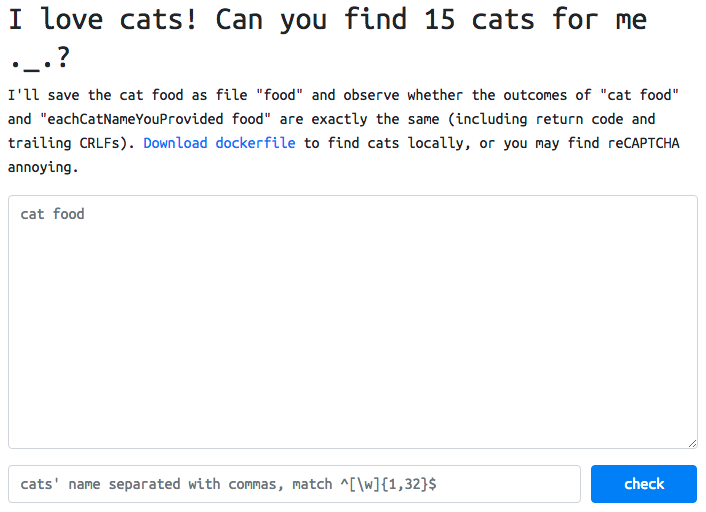
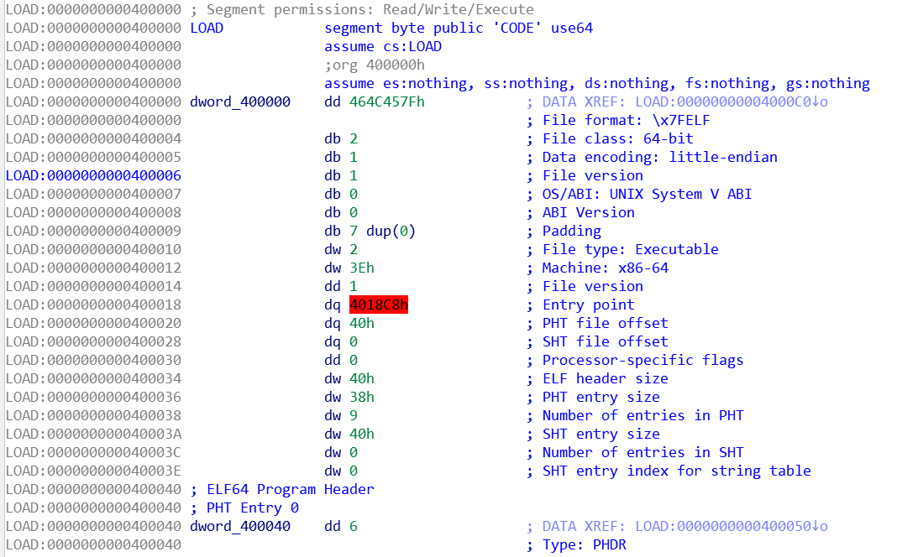
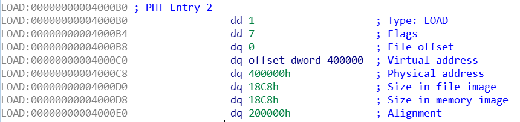

# 2018-05-19-RCTF #

[CTFTime link](https://ctftime.org/event/624) | [Website](https://rctf2018.xctf.org.cn/)

---

## Challenges ##

### Misc ###

 - [x] [206 Number Game](#206-misc--number-game)
 - [x] [52 git](#52-misc--git)
 - [ ] 606 520 gift
 - [x] [256 cats](#256-misc--cats)
 - [x] [377 cats Rev.2](#377-misc--cats-rev2)
 - [x] [73 sign](#73-misc--sign)

### Crypto ###

 - [ ] 416 ECDH
 - [x] [176 cpushop](#176-crypto--cpushop)

### Reverse ###

 - [x] [540 magic](#540-reverse--magic)
 - [x] [161 babyre](#161-reverse--babyre)
 - [ ] 588 compiler
 - [x] [317 simple vm](#317-reverse--simple-vm)
 - [x] [606 simple re](#606-reverse--simple-re)
 - [x] [338 sql](#338-reverse--sql)
 - [x] [444 babyre2](#444-reverse--babyre2)

### Web ###

 - [ ] 769 no-js
 - [ ] 606 backdoor
 - [ ] 487 amp
 - [ ] 869 retter
 - [x] [500 r-cursive](#500-web--r-cursive)
 - [ ] 769 rBlog 2018 Rev.2
 - [ ] 434 rBlog 2018

### Pwn ###

 - [ ] 317 babyheap
 - [ ] 540 stringer
 - [ ] 465 rnote4
 - [ ] 384 rnote3
 - [ ] 454 simulator

---

## 206 Misc / Number Game ##

**Description**

> Guess Guess Guess
> 
> nc 149.28.139.172 10002

**Solution**

Upon connecting, we get a standard PoW prompt:

    sha256(****+UJBS55MXKhMOcSQO) == 4e3cefcf649092ef546aaabfcfa628e63377ce08bf17012f628ac48fbba2307d
    Give me XXXX:

([simple PoW solver](scripts/pow.py))

After solving the PoW:

      o__ __o             o__ __o    ____o__ __o____   o__ __o__/_ 
     <|     v\           /v     v\    /   \   /   \   <|    v      
     / \     <\         />       <\        \o/        < >          
     \o/     o/       o/                    |          |           
      |__  _<|       <|                    < >         o__/_       
      |       \       \                    |          |           
     <o>       \o       \         /         o         <o>          
      |         v\       o       o         <|          |           
     / \         <\      <\__ __/>         / \        / \          
​                                                                   
    In every round of the game, I'll choose some different numbers from the figure interval. You are required to guess those numbers,ofc so does the order of them.
    On each surmise of yours, 2 numbers will be told as a hint for you, but you need to speculate the fuctions of these 2 figures. (XD
    GLHF
                                                                   
    ================== round 1 ================== 
    Give me 4 numbers, in[0, 10), You can only try 6 times

Some string format vulns and overflows were tried, but no luck, we actually have to solve the game properly. Providing 4 numbers returns e.g.:

    Nope. 1, 0

Should be familiar, it's the [Mastermind game](https://en.wikipedia.org/wiki/Mastermind_(board_game)), apparently also known as "cows and bulls". In each round, there is a hidden sequence of four numbers, 0 through 9. We get 6 attempts to guess the correct sequence. With each incorrect attempt, we get two pieces of feedback:

 - "blacks" - how many of our numbers are in the hidden sequence AND in the same position
 - "whites" - how many of our numbers are in the hidden sequence but NOT in the same position

So I ~~stole~~ adapted a Mastermind solver from [here](https://github.com/Michael0x2a/mastermind-solver/blob/master/python/solve_mastermind.py) (thanks @Michael0x2a!). The principle is simple:

 1. generate a pool of all possible guesses, for 10 different numbers and a sequence of 4 numbers, there are 10000 possible sequences
 2. pick a guess and get feedback for it
 3. if incorrect, eliminate all guesses from the pool that are inconsistent with the feedback and go back to step 2

The first guess is always `[0, 0, 1, 1]` for the 10 number 4-sequence (as it turns out all rounds are actually like this). There is an additional heuristic in picking a good guess, namely, a guess which may reduce the pool to the fewest remaining sequences.

I added socket interaction and the PoW solver to make it automated. After letting it run for a bit, I was disappointed to see that it rarely got past 4 rounds, and at this point I found out on the IRC that there are 8 rounds before you get the flag.

Mostly hopeless, I looked at the correct solutions it got to the few rounds it managed. Interestingly enough, among all the correct solutions, there was never a sequence with duplicate numbers! So, I removed these sequences from the initial pool and made the initial guess to always be `[0, 1, 2, 3]`.

With this modification the results were immediately better and in just a couple of attempts the flag was obtained!

`RCTF{0lD_GaM3_nAmed_Bu11s_4nd_C0ws}`

([full script here](scripts/number-game-solver.py))

## 52 Misc / git ##

**Description**

> My file lost! 
> 
> attachment: https://drive.google.com/open?id=1Mo3uN2FV1J-lbqjQZvvXitWagZqjD1Xi 

**Solution**

The attachment is a zip archive with this directory structure:

    git/
        .git/
            ...
        HelloWorld.txt

There is no stash nor commits in the log, and the `develop` branch seems to be the same. But, using `git reflog`:

    22d3349 HEAD@{0}: checkout: moving from develop to master
    22d3349 HEAD@{1}: rebase -i (finish): returning to refs/heads/develop
    22d3349 HEAD@{2}: rebase -i (start): checkout 22d3349
    f671986 HEAD@{3}: checkout: moving from master to develop
    22d3349 HEAD@{4}: checkout: moving from develop to master
    f671986 HEAD@{5}: checkout: moving from master to develop
    22d3349 HEAD@{6}: checkout: moving from rctf to master
    f671986 HEAD@{7}: commit: Revert
    f4d0f6d HEAD@{8}: commit: Flag
    22d3349 HEAD@{9}: checkout: moving from master to rctf
    22d3349 HEAD@{10}: commit (initial): Initial Commit

We see there was a `Flag` commit that was reverted. So we can `git checkout f4d0f6d` which reveals the `flag.txt` file.

`RCTF{gIt_BranCh_aNd_l0g}`

## 256 Misc / cats ##

**Description**

> I love cats! PS: This is NOT a web challenge. Just find the cats.
> 
> http://cats.2018.teamrois.cn:1337

**Solution**

At the address we see:



And the linked dockerfile:

    FROM ubuntu:latest
    ENV TZ=Asia/Shanghai
    RUN ln -snf /usr/share/zoneinfo/$TZ /etc/localtime && echo $TZ > /etc/timezone
    RUN apt-get update && apt-get install -y php python3 nodejs ruby && mkdir /app
    WORKDIR /app
    
    # build: docker build -t rctf_cats .
    # judge: docker run -it --rm --network none -v /tmp/yourCatFood:/app/food:ro rctf_cats bash -c "timeout 5 diff -Z <(cat food) <(eachCatNameYouProvided food)"

So, without bothering to actually set up Docker, we see that it runs the command `timeout 5 diff -Z <(cat food) <(eachCatNameYouProvided food)`. Whatever we put into the textarea will be the contents of the file `food`. Then the command compares the output of `cat food`, i.e. the contents we provided, with 15 commands we provide in the second input invoked with the argument `food`.

Some other details – `cat` doesn't count as a cat (too obvious I guess!), and thanks to the regex we cannot provide any commandline arguments, just the names of commands that we want to run. Finally, the content of the file has to be at least 2 bytes, but no more than 1337 bytes, so an empty file is unfortunately not possible.

The solution was obtained by using a basic Ubuntu VM. In the shell I typed `a`, then presed tab twice to get a listing of commands that start with `a`, then looked for anything that might work. Same for every other letter.

The most important thing to realise for this part of the challenge was probably that we need to have 15 commands that will output the same thing as `cat food` *in this particular* setup. We don't actually need to find 15 commands that do the same thing as `cat` (why would they even exist then?).

So, the commands I provided fall into two categories:

 - ones which treat the argument `food` as a path or filename (e.g. `ls`)
 - ones which treat the argument `food` as a string (e.g. `echo`)

Thinking of `echo food` and `cat food`, I decided the best choice for the contents of the `food` file was the literal string `food`. Then `cat food` simply outputs `food`. Useful.

And so finally, the list of commands I chose:

 - `ls` - normally lists directories, but given a path to a file it simply outputs its name (this is more useful when combined with other arguments)
 - `dir` - basically the same as `ls` as far as I can tell
 - `more` - normally provides an interactive terminal viewer for file contents, but when piped into a command like `diff` it behaves just like `cat`
 - `php` - by default, PHP copies file contents to stdout, unless it finds the tag `<?php` (or `<?`)
 - `uniq` - filters out non-unique consecutive lines of a file; with a single line there is nothing to filter and it just prints it to output
 - `sort` - sorts the lines of a file; nothing to sort with a single line
 - `head` - shows the first N (10 by default) lines of a file
 - `tail` - shows the last N (10 by default) lines of a file
 - `find` - finds files by name, without a pattern just looks for a file called `food` and outputs its name
 - `echo` - prints out its argument to stdout
 - `fold` - prints out contents of a file, wrapping long lines
 - `expr` - evaluate expressions in arguments; `food` is just a string, so it is printed as-is
 - `paste` - print out files side-by-side, with a single file argument it is just `cat`
 - `fmt` - formats file contents according to arguments 
 - `basename` - given a path, print out only its last part

And with that:

> Wew, you've found 15 cats! Here is your flag: RCTF{you_love_cats_dont_you}. If you can find at least 4 out of 5 cats whose names in (python3, bash, php, node, ruby), I will give you another flag ._.

## 377 Misc / cats Rev.2 ##

**Description**

> solve cats first 
> 
> http://cats.2018.teamrois.cn:1337

**Solution**

Using the hint from the solution to `cats`, we need another list of 15 commands, but they must include at least 4 of `python3`, `bash`, `php`, `node`, `ruby`.

Script interpreters like these are generally happy to just do nothing when given an empty input file, but our `food` file must be at least 2 bytes in size! This immediately meant one thing: polyglot quine, or polyquine for short.

A "polyglot" in a programming context is a piece of code that is valid (and preferably does the same thing) in multiple languages. A lot of simple Python scripts are technically polyglots, since they work in both Python 2 and Python 3. The less similar the syntax of two languages is, the more difficult it is to make a polyglot with them, naturally.

And a "quine" in a programming context is a program which produces its own source code when executed. Generally, if this is accomplished by actually opening and reading the source file the program is considered a "cheating quine", since a lot of the difficulty of this problem is in crafting a string which somehow expands into the full program when formatted in a particular way. Fortunately, there is no restriction in this challenge, and a cheating quine is completely fine.

At first I looked online for similar challenges, and [this answer](https://codegolf.stackexchange.com/a/163371) seemed the closest to what I needed. Unfortunately, `perl` was not on the list of possible languages, and the challenge asked for Python 3, not Python 2. I spent some time trying to adapt this to work better, but I could only ever make it work for 3 languages at a time.

Then I decided to write my own polyquine, and solve the challenge the hard way. There was no particular method to my development, just writing some code and seeing which interpreter complains about the changes and why, then fixing it and so on. Of the 5 languages I chose `python3`, `bash`, `php`, and `node`, since I knew their syntax well enough. `ruby` not so much.

The script I came up with during the CTF was:

    a=0;food=1;exit=0;cat=2;echo=3;x=5;int=6
    cat <food
    echo
    exit <food
    int; 1//5 # <?php die(substr(file_get_contents("food"),79)."\n"); ?>
    int; 2//5 or __import__("sys").stdout.write(open("food").read() + "\n") and quit() and """
    x ;console.log(require("fs").readFileSync("food", "utf8"));
    x//"""

I made no effort to clean it up (mostly a waste of time if it works), but for this write-up I will describe a smaller version. The core functionality is the same.

    a=0;cat=0;echo=0;exit=0;food=0;i=0
    cat<food
    echo;exit
    i//1#<?die(substr(file_get_contents("food"),59)."\n");?>
    i//2;print(open("food").read());quit();"""
    x =0;console.log(require("fs").readFileSync("food","utf8"))
    x//"""

Some things could still be removed, but I kept them to make sure `sort` prints the file out as-is, i.e. the lines need to be sorted already. Let's see how each language interprets this code.

### PHP ###

PHP is the simplest to understand. By default, PHP just copies file contents to standard output. Any actual scripting capability is possible only in PHP mode, which is entered when a `<?php` tag is encountered, or the short version `<?`. So PHP first prints out everything from `a=0;cat= ...` all the way until `i//1#`. Then it executes this code:

    die(substr(file_get_contents("food"),59)."\n");

`file_get_contents("food")` returns the entire `food` file contents as a string. `substr(..., 59)` removes the first 59 characters (to account for the first part of the file that has already been printed). A `"\n"` newline is added for consistency with `cat` and the other interpreters. `die(...)` outputs the string to stdout and stops execution.

### Bash ###

`a=0` is a variable assignment in Bash. Multiple statements can be combined into one line by joining them with a `;` semicolon. `cat<food` redirects the file `food` into `cat`, which then outputs it. `echo` puts an extra newline and `exit` stops execution. After `exit`, the lines no longer have to make sense to Bash, since it interprets the file line by line.

### Javascript (NodeJS) ###

JS is unhappy about statements using variables that haven't been declared yet, e.g. `a + b` can throw an error if either `a` or `b` are not variables. Usually, variables are declared as `var a = "value";`, i.e. using the `var` keyword (or `let` or `const` in more modern JS). However, an assignment without the `var` keyboard is still valid, but it creates a global variable (in the global `window` object). So the first line is just creating a bunch of variables. Statements in JS can be terminated with a semicolon, but the semicolon can usually be omitted at the end of the line. This hurts my eyes but here it is convenient for a smaller file.

`cat<food` is a less-than comparison to JS. `echo` and `exit` use the previously declared variables, but the statements don't actually do anything. 

The `i//1...` and `i//2...` lines are also just using the `i` variable. Everything after `//` is ignored as a comment. Same for the last line `x//"""`.

So the most important statement is `console.log(require("fs").readFileSync("food","utf8"));`, which requires / imports the `fs` API from NodeJS standard libary, then calls its `readFileSync` function, which synchronously reads the file `food` and decodes it as a UTF-8 string. Finally, `console.log(...)` outputs this string to stdout (along with a trailing newline).

### Python 3 ###

The first three lines are interpreted similarly to JS. Some variables are declared and values are assigned to them, then some no-op expressions are evaluated.

But, `i//1` in Python means integer division of `i` by `1`. The rest of line 4 is ignored, because `#` starts a line comment.

`print(open("food").read())` does the actual source code output (and a trailing newline). `quit()` then stops execution. Finally `"""` starts a multiline string, which carries on till the end of the file, so the last two lines are not considered code and hence don't have to make sense to Python.

### 11 other cats ###

And with that, I fulfilled the requirement of using 4 out of the 5 specified languages. I considered adding `ruby`, but again, I don't know much about its syntax so I made due with what I had. The 11 other commands I used were:

 - `sh`, `dash`, `rbash` - other Bash-like shells which have some differences but interpret this script the same way
 - `head`, `tail`, `uniq`, `more`, `paste` - same as in `cats`
 - `zmore` - views compressed files directly on terminal, but also shows uncompressed files verbatim
 - `sort` - this is why I made sure the lines of code are sorted already
 - `python3m` - equivalent to `python3 --with-pymalloc` which does not affect Python's functionality.

And with that:

> Wew, you've found 15 cats! Here is your flag: RCTF{you_love_cats_dont_you}. You are so lihai! RCTF{did_you_make_a_polyglot}

I did indeed.

## 73 Misc / sign ##

**Description**

> Run it and get flag (but how?) (segfault is NOT a bug)
> 
> attachment: https://drive.google.com/open?id=1ghFVktqDYM48YiJt-ppx6a-2JHH-wIKm

**Solution**

Apparently the simplest challenge of the CTF, the executable seems to contain the wine runtime and some emulated Windows functions, dialogs, Notepad stuff ...? Perhaps it runs properly on a Linux desktop with a graphical environment / X11?

For my actual solution however, I loaded the executable into radare and after analysing the functions with `aaa`, `afl` produced:

    0x7f7f96534000    8 192  -> 194  obj.imp.__wine_main_argv
    0x7f7f96545cd0    1 6            sym.imp.__wine_dll_register
    0x7f7f96545ce0    1 6            sym.imp.__stack_chk_fail
    0x7f7f96545cf0   21 270  -> 256  entry0
    0x7f7f96545e00    3 33           sub._ITM_deregisterTMCloneTable_e00
    0x7f7f96545e70    4 50           entry2.fini
    0x7f7f96545eb0    5 5    -> 56   entry1.init
    0x7f7f96545ec8    1 6            fcn.7f7f96545ec8
    ...
    0x7f7f96546238    1 6            fcn.7f7f96546238
    0x7f7f96546481    5 256          sym.ShowLastError
    0x7f7f96546581    6 295          sym.UpdateWindowCaption
    0x7f7f965466a8    8 359          sym.DIALOG_StringMsgBox
    0x7f7f96546a32    3 129          sym.FileExists
    0x7f7f96547074   14 208          sym.DoCloseFile
    0x7f7f965471fa   47 1579         sym.DoOpenFile
    0x7f7f96547825    3 121          sym.DIALOG_FileNew
    ...
    0x7f7f96549e44    1 65           sym.DIALOG_FilePageSetup
    0x7f7f9654a192    1 124          sym.SetFileNameAndEncoding
    0x7f7f9654a20e    9 195          sym.get_dpi
    0x7f7f9654bb68   17 684          sym.NOTEPAD_DoFind
    0x7f7f9654ce46   18 1356         sym.WinMain
    0x7f7f9654fff8    1 8            reloc.__cxa_finalize

Of interest was really mainly `sym.WinMain`, so with `pdf @ sym.WinMain`, I found a line that said:

    ...
    |      |    0x7f7f9654d263      488b4018       mov rax, qword [rax + 0x18] ; [0x18:8]=-1 ; 24
    |      |    0x7f7f9654d267      488d159a0800.  lea rdx, str.RCTF_WelCOme_To_RCTF ; 0x7f7f9654db08 ; u"RCTF{WelCOme_To_RCTF}\n\n\u5700\u6168\u3f74\u5920\u756f\u6420\u6365\u6d6f\u6970\u656c\u2064\u656d\u3f3f"
    |      |    0x7f7f9654d26e      4889c1         mov rcx, rax
    ...

And there was the flag:

`RCTF{WelCOme_To_RCTF}`

In fact, the flag was available in plaintext in the binary, but e.g. `strings` could not find it - it was encoded as UTF-16, taking two bytes per character. This is typical for Windows binaries, which is probably why this challenge used this setup.

## 176 Crypto / cpushop ##

**Description**

> attachment: https://drive.google.com/open?id=11lK6aKJZEq6QhrD6L7SSew4KhvXz_cz0
> 
> nc cpushop.2018.teamrois.cn 43000

**Solution**

After playing a bit with the menus, we see that the script lets us see a list of items we can purchase:

    1. List Items
    2. Order
    3. Pay
    4. Exit
    Command: 1
     0 - Intel Core i9-7900X           $999
     1 - Intel Core i7-7820X           $599
     2 - Intel Core i7-7700K           $349
     3 - Intel Core i5-7600K           $249
     4 - Intel Core i3-7350K           $179
     5 - AMD Ryzen Threadripper 1950X  $999
     6 - AMD Ryzen 7 1800X             $499
     7 - AMD Ryzen 5 1600X             $249
     8 - AMD Ryzen 3 1300X             $149
     9 - Flag                          $99999

The flag is right there, but we need 99999 money to buy it, while the script always sets our budget to a random number in \[1000, 10000\]. However, the purchase is split into two parts - ordering and paying. We can order the flag, and get a string like:

    product=Flag&price=99999&timestamp=1526990158350980&sign=efbde9d690dd7ea26876af15fef0450a5ebd037ebfb68954d5a5e700be503138

But if we actually try to use this order when paying, we get told we don't have enough money.

After some brief analysis of how the order token is created, we see it is a textbook case of length extension attack, even down to the same query string format as presented on [Wikipedia](https://en.wikipedia.org/wiki/Length_extension_attack).

So the script creates a SHA-256 hash of `signkey` + `query`, where `signkey` is its private randomised key, and `query` is something like `product=Flag&price=99999&timestamp=1526990158350980`. The problem is that this is not a HMAC, nor is the hash encrypted before given to us. The hash / message digest produced by SHA-256 is actually its entire internal state at that point, i.e. we know that if we knew `signkey`, and created the SHA-256 hash of `signkey` + `query`, we would have no more data in our memory that what the digest provides.

So we need to find a SHA-256 implementation, edit it so we can change its internal state, and attach our extra string at the end, in this case `&price=1`, which will override the previous price of the flag product and make it affordable for us. This sort of attack also requires duplicating the way the padding algorithm works, but luckily, the Python script reads our input via `raw_input()`, which lets us input null bytes and binary data.

For the exploit I chose to use Haxe, since it is a language I am familiar with and it has a simple, native implementation of SHA-256 in its standard library.

We don't know what the length of `signkey` is, only that it is between 8 and 32 characters long. So the exploit will check all 24 possibilities (which differ in padding and length information only).

([full exploit here](scripts/cpushop/Main.hx))

After compiling, we can execute `neko exploit.n remote`, and with that we get:

`RCTF{ha5h_l3ngth_ex7ens10n_a77ack_1s_ez}`

## 540 Reverse / magic ##

**Description**

> right time, right spell, right flag. 
> 
> attachment: https://drive.google.com/open?id=13Di0J0NeDw6CeQ8W4wqKyLpx0vFtKZM0 

**Solution**

Put into IDA, look at `main`:

```c
int __cdecl main(int argc, const char **argv, const char **envp)
{
  signed int v3; // eax
  unsigned __int8 v5[32]; // [rsp+20h] [rbp-30h]
  _DWORD a2[4]; // [rsp+48h] [rbp-8h]

  sub_403310();
  a2[1] = time64(0i64);
  a2[0] = rand();
  if ( exchange_by_xor(&a2[1], a2) && exchange_by_xor(&a2[1], &a2[1]) )
  {
    puts("flag only appears at a specific time, range [2018-05-19 09:00, 2018-05-21 09:00)\nBetter luck next time :)");
  }
    //...
}
unsigned __int32 __fastcall exchange_by_xor(_DWORD *a1, _DWORD *a2)
{
  *a1 ^= *a2;
  *a2 ^= *a1;
  *a1 ^= *a2;
  return *a1;
}//exchange the *a1 and *a2 only when a1 != a2, or else set all of them to 0
```

In `main`, there are some operations: it seems that we want the first check to be false; however, it's already false, since the `xor_exchange` is problematic when a1 and a2 are same address (this has been coverd in CSAPP). And indeed, if we set breakpoint at the entrypoint of `main`, we will get error massage immediately, which suggests that the error message is **not the one from main function**.

Actually, I got stuck here for a while since initially I didn't realize it is a "and" but thought it is a "or" :(

Thus, if we set the breakpoint at `puts` to obtain where the message occurs, we can get a stack trace:

```c
__int64 __fastcall dynamic_str_gen(char *a4, char *a3, signed int size, char *buf)
{
  unsigned int v4; // ST2C_4
  const char *a4a; // [rsp+40h] [rbp+10h]
  signed int a3a; // [rsp+48h] [rbp+18h]
  int a5a; // [rsp+50h] [rbp+20h]

  a4a = a4;
  a3a = (signed int)a3;
  a5a = size;
  xor_with_32key((unsigned int)a4, (unsigned int)a3, size);
  v4 = puts(a4a);
  xor_with_32key((unsigned int)a4a, a3a, a5a);
  return v4;
}

__int64 __fastcall sub_402357(__time64_t *a1, char **a2)
{
  __int64 result; // rax
  int v3; // eax
  char *v4; // r9

  sub_402268(a1, (__int64)a2);
  result = (unsigned int)not_0_key[0];
  if ( !not_0_key[0] )
  {//we don't want this, so need not_0_key[0] to be true
    v3 = strtol("ca11ab1e", 0i64, 16);
    result = dynamic_str_gen(&a4, (char *)0x69, v3 ^ 0xBADD1917, v4);
  }
  return result;
}

/*
0000000000402248
00000000004023AA
00000000004032D2//possibly system callback call(retrieve things from array)
//000007FF756A13D2
00000000004013CA
000000000040152B
//0000000078D359CD
*/
```

Indeed, this is called before `main` function is called. So when will this happen? For example, in C++, the constructor of any global object will be called before `main` is called.

Take a look at `sub_402268`:

```c
__int64 __fastcall sub_402268(__time64_t *a1, __int64 a2)
{
  __int64 result; // rax
  char *v3; // r9
  unsigned __int32 v4[2]; // [rsp+20h] [rbp-10h]
  unsigned int Seed; // [rsp+28h] [rbp-8h]
  int i; // [rsp+2Ch] [rbp-4h]

  Seed = time64(0i64);
  if ( Seed <= 0x5AFFE78F || Seed > 0x5B028A8F )
    return 0i64;
  srand(Seed);
  for ( i = 0; i <= 255; ++i )
    critical_key[i] ^= rand();
  //This function is basically to generate an array of random numbers
  //based on current time64(), which is the input as the hint said.
  sub_4027ED(critical_key, &v4[1], v4, v3, 0i64);
  if ( v4[1] == 0x700 )
  {
    not_0_key[0] = v4[0];                       // purpose
    result = v4[0];
  }
  else
  {
    not_0_key[0] = 0;
    result = 0i64;
  }
  return result;
}

_DWORD *__fastcall sub_4027ED(char *a1, _DWORD *a2, 
                              _DWORD *want_0x700, char *critical_key, _DWORD *want_no0)
{
  _DWORD *result; // rax
  __int64 v6; // [rsp+0h] [rbp-80h]
  struc_1 a4[256]; // [rsp+20h] [rbp-60h]
  int i; // [rsp+C2Ch] [rbp+BACh]
  char vars0[8]; // [rsp+C30h] [rbp+BB0h]
  char *ckeys; // [rsp+C40h] [rbp+BC0h]
  _DWORD *v11; // [rsp+C48h] [rbp+BC8h]
  _DWORD *v12; // [rsp+C50h] [rbp+BD0h]

  ckeys = a1;
  v11 = a2;
  v12 = want_0x700;
  memset(&v6 + 4, 0, 0xC00ui64);
  for ( i = 0; i <= 255; ++i )
  {
    vars0[12 * i - 0xC10] = ckeys[i];           // IDA problematic? a4[i] accessing
    *(_DWORD *)&vars0[12 * i - 0xC0C] = 0x7FFFFFFF;
    *(_DWORD *)&vars0[12 * i - 0xC08] = 0;
    sub_4026D0(a4, i);
  }
  *v11 = a4[255].want_0x700;
  result = v12;
  *v12 = a4[255].want_no0;
  return result;
}

void __fastcall sub_4026D0(struc_1 *a4, unsigned int i)
{
  struc_1 *low_16_struc1; // rax
  struc_1 *v3; // rax
  int v4; // [rsp+24h] [rbp-1Ch]
  struc_1 *low_16_struc1_; // [rsp+30h] [rbp-10h]
  struc_1 *overall_struc1; // [rsp+38h] [rbp-8h]
  struc_1 *rcx_Arg; // [rsp+50h] [rbp+10h]
  unsigned int idx; // [rsp+58h] [rbp+18h]

  rcx_Arg = a4;
  idx = i;
  overall_struc1 = safe_arr_access(a4, i);
  if ( overall_struc1 )
  {
    if ( idx & 0xF )
      low_16_struc1 = safe_arr_access(rcx_Arg, idx - 1);
    else
      low_16_struc1 = 0i64;
    low_16_struc1_ = low_16_struc1;
    if ( idx + 15 <= 30 )                       // if (idx <= 15)
      v3 = 0i64;
    else
      v3 = safe_arr_access(rcx_Arg, idx - 16);  // >15, access -16
                                                // so for first 0-15,this will return 0
    if ( low_16_struc1_ || v3 )
    {
      if ( low_16_struc1_ )
      {
        overall_struc1->want_0x700 = overall_struc1->key + low_16_struc1_->want_0x700;
        overall_struc1->want_no0 = 2 * low_16_struc1_->want_no0;
      }
      if ( v3 )
      {
        v4 = v3->want_0x700 + overall_struc1->key;
        if ( v4 < overall_struc1->want_0x700 )
        {
          overall_struc1->want_0x700 = v4;
          overall_struc1->want_no0 = 2 * v3->want_no0 | 1;
        }
      }
    }
    else
    {
      overall_struc1->want_0x700 = overall_struc1->key;
    }
  }
}

/* where struc_1 is
00000000 struc_1         struc ; (sizeof=0xC, mappedto_17)
00000000                                         ; XREF: sub_4027ED/r
00000000 key             db ?
00000001                 db ? ; undefined
00000002                 db ? ; undefined
00000003                 db ? ; undefined
00000004 want_0x700      dd ?                    ; XREF: sub_4027ED+10C/r
00000008 want_no0        dd ?                    ; XREF: sub_4027ED+11B/r
0000000C struc_1         ends
*/
```

`sub_4026D0` is doing dynamic programming using previous result of array, being called each time in the `for` loop of `sub_4027ED`. Finally, the element at index 255 will be used to check.

Without understanding what this dynamic programming is doing, we can write a bruteforce crack as shown.

```c
uint8_t ckeys1[] = {88, 113, 143, 50, 5, 6, 81, 199, 167, 248, 58, 225, 6, 72, 130, 9, 161, 18, 159, 124, 184, 42, 111, 149, 253, 208, 103, 200, 227, 206, 171, 18, 31, 152, 107, 20, 234, 137, 144, 33, 45, 253, 154, 187, 71, 204, 234, 156, 215, 80, 39, 175, 185, 119, 223, 197, 233, 225, 80, 211, 56, 137, 239, 45, 114, 194, 223, 243, 125, 125, 101, 149, 237, 19, 0, 28, 163, 60, 227, 87, 227, 247, 247, 44, 115, 136, 52, 177, 98, 211, 55, 25, 38, 190, 178, 51, 32, 63, 96, 57, 135, 166, 101, 173, 115, 26, 109, 73, 51, 73, 192, 86, 0, 190, 10, 207, 40, 126, 142, 105, 135, 225, 5, 136, 218, 84, 62, 60, 14, 169, 250, 215, 127, 78, 68, 198, 154, 10, 210, 152, 106, 164, 25, 109, 140, 225, 249, 48, 229, 255, 51, 74, 169, 82, 58, 13, 103, 32, 29, 191, 54, 62, 232, 86, 191, 90, 136, 168, 105, 214, 171, 82, 241, 20, 242, 215, 239, 146, 247, 160, 112, 161, 239, 227, 31, 102, 43, 151, 246, 43, 48, 15, 176, 180, 192, 254, 166, 98, 253, 230, 76, 57, 207, 32, 179, 16, 96, 159, 52, 190, 178, 28, 59, 107, 29, 223, 83, 114, 242, 250, 177, 81, 130, 4, 48, 86, 31, 55, 114, 122, 151, 80, 41, 134, 74, 9, 60, 89, 196, 65, 113, 248, 26, 210, 48, 136, 99, 255, 133, 222, 36, 140, 195, 55, 20, 199};
uint8_t buf[256];
struct struc_1
{
	int8_t key;
    //not uint8_t, which will give multiple solutions
    //obey the IDA, always !!!
	int32_t want_0x700;
	int32_t want_no0;
};

struct struc_1 dp_struc[256];

struc_1* safe_arr_access(struc_1 *structs, signed int i)
{
	struc_1 *result; // rax

	if (i >= 0 && i <= 255)
		result = &structs[i];
	else
		result = 0LL;
	return result;
}

void sub_4026D0(struc_1 *a4, unsigned int i)
{
	struc_1 *low_16_struc1; // rax
	struc_1 *v3; // rax
	int v4; // [rsp+24h] [rbp-1Ch]
	struc_1 *low_16_struc1_; // [rsp+30h] [rbp-10h]
	struc_1 *overall_struc1; // [rsp+38h] [rbp-8h]
	struc_1 *rcx_Arg; // [rsp+50h] [rbp+10h]
	unsigned int idx; // [rsp+58h] [rbp+18h]

	rcx_Arg = a4;
	idx = i;
	overall_struc1 = safe_arr_access(a4, i);
	if (overall_struc1)
	{
		if (idx & 0xF)
			low_16_struc1 = safe_arr_access(rcx_Arg, idx - 1);
		else
			low_16_struc1 = 0i64;
		low_16_struc1_ = low_16_struc1;
		if (idx + 15 <= 30)                       // if (idx <= 15)
			v3 = 0;
		else
			v3 = safe_arr_access(rcx_Arg, idx - 16);  // >15, access -16
													  // so for first 0-15,this will return 0
		if (low_16_struc1_ || v3)
		{
			if (low_16_struc1_)
			{
				overall_struc1->want_0x700 = overall_struc1->key + low_16_struc1_->want_0x700;
				overall_struc1->want_no0 = 2 * low_16_struc1_->want_no0;
			}
			if (v3)
			{
				v4 = v3->want_0x700 + overall_struc1->key;
				if (v4 < overall_struc1->want_0x700)
				{
					overall_struc1->want_0x700 = v4;
					overall_struc1->want_no0 = 2 * v3->want_no0 | 1;
				}
			}
		}
		else
		{
			overall_struc1->want_0x700 = overall_struc1->key;
		}
	}
}

int main()
{
	for (size_t t = 0x5AFFE78F; t <= 0x5B028A8F; t++)
	{
		srand(t);
		for (size_t i = 0; i < 256; i++)
		{
			buf[i] = ckeys1[i] ^ rand();
		}
		for (size_t i = 0; i < 256; i++)
		{
			dp_struc[i].key = buf[i];
			dp_struc[i].want_0x700 = 0x7fffffff;
			dp_struc[i].want_no0 = 0;
			sub_4026D0(dp_struc, i);
		}
		if (dp_struc[255].want_0x700 == 0x700 && dp_struc[255].want_no0 != 0)
			printf("%x\n", t);//0x5b00e398
	}
	system("pause");
	return 0;
}
```

Patching `time64()` to `mov rax,0x5b00e398`, we can proceed to the next phase. Also, by setting breakpoints at `puts`, we can get this stack frame:

```c
//0000000000402248
//0000000000402407
__int64 __fastcall critical_4023B1(char *a1, __int64 a2, __int64 a3, char *a4)
{
  char *v4; // r9
  const char *v5; // rcx
  char *v6; // r9
  char *v7; // r9
  struc_2 *input; // [rsp+20h] [rbp-30h]
  __int64 v10; // [rsp+28h] [rbp-28h]
  __int64 v11; // [rsp+30h] [rbp-20h]
  __int64 v12; // [rsp+38h] [rbp-18h]
  struc_2 a5; // [rsp+43h] [rbp-Dh]

  if ( !not_0_key[0] )
    exit(0);
  LOBYTE(a5.field_0) = 0;
  a5.field_0 = not_0_key[0];
  dynamic_str_gen(&buf, (char *)0x31, not_0_key[0], a4);
  input = 0i64;
  v10 = 0i64;
  v11 = 0i64;
  v12 = 0i64;
  LODWORD(input) = 538976288;
  a5.input = (char *)&input + 4;
  scanf("%26s", (char *)&input + 4);
  sym_encode((__int64)a5.input, 26i64, (unsigned __int64)&a5, (char *)4, input, v10);
  if ( !(unsigned int)need_return_non0(a5.input) )
    return dynamic_str_gen(&byte_4052D1, (char *)6, not_0_key[0], v4);
  sym_encode((__int64)a5.input, 26i64, (unsigned __int64)&a5, (char *)4, input, v10);
  sub_401FFB(v5);
  dynamic_str_gen(&byte_4052E0, (char *)0x23, not_0_key[0], v6);
  puts((const char *)&input);
  return dynamic_str_gen(&byte_4052E0, (char *)0x23, not_0_key[0], v7);
}

__int64 __usercall need_return_non0@<rax>(char *input@<rcx>)
{
  int opcode; // eax
  int v2; // eax
  char Buf; // [rsp+20h] [rbp-110h]
  unsigned int v5; // [rsp+124h] [rbp-Ch]
  int v6; // [rsp+128h] [rbp-8h]
  int nxt_ip; // [rsp+12Ch] [rbp-4h]

  strncpy(::input, input, 0x1Aui64);
  signal(SIGFPE, sub_402930);
  nxt_ip = 0;
  v6 = 1;
  v5 = 0;
  r1 = (unsigned __int64)keys;
  r2 = (unsigned __int64)::input;
  while ( v6 )
  {
    opcode = setjmp(&Buf);                      // pre: nxt ip opcode + 1
                                                // post: next instruction opcode
    if ( opcode == 168 )
    {
      reg[vmcode[nxt_ip] >> 4] -= reg[vmcode[nxt_ip] & 0xF];
      ++nxt_ip;
    }
    else if ( opcode > 168 )
    {
      if ( opcode == 172 )
      {
        reg[vmcode[nxt_ip] >> 4] &= reg[vmcode[nxt_ip] & 0xF];
        ++nxt_ip;
      }
      else if ( opcode > 172 )
      {
        if ( opcode == 174 )
        {
          reg[vmcode[nxt_ip] >> 4] ^= reg[vmcode[nxt_ip] & 0xF];
          ++nxt_ip;
        }
        else if ( opcode < 174 )
        {                                       // 173
          reg[vmcode[nxt_ip]] = (unsigned __int8)~LOBYTE(reg[vmcode[nxt_ip]]);
          ++nxt_ip;
        }
        else
        {
          if ( opcode != 175 )
            goto LABEL_43;
          r8_ = vmcode[nxt_ip] >> 4;            // 175
          r9_ = vmcode[nxt_ip] & 0xF;
          if ( !setjmp(::Buf) )                 // always 0 FIRST TIME
            vmcode[nxt_ip] = r8_ / vmcode[nxt_ip + 1];
          nxt_ip += 2;
        }
      }
      else if ( opcode == 170 )
      {
        reg[vmcode[nxt_ip]] = reg[vmcode[nxt_ip + 1]];
        nxt_ip += 2;
      }
      else if ( opcode > 170 )                  // 171
      {
        reg[vmcode[nxt_ip]] = vmcode[nxt_ip + 1];
        nxt_ip += 2;
      }
      else
      {                                         // 169
        reg[vmcode[nxt_ip] >> 4] += reg[vmcode[nxt_ip] & 0xF];
        ++nxt_ip;
      }
    }
    else if ( opcode == 163 )
    {
      reg[vmcode[nxt_ip] >> 4] |= reg[vmcode[nxt_ip] & 0xF];
      ++nxt_ip;
    }
    else if ( opcode > 163 )                    // < 168
    {
      if ( opcode == 166 )
      {
        if ( !r5 )
          nxt_ip += (char)vmcode[nxt_ip];
        ++nxt_ip;
      }
      else if ( opcode > 166 )                  // 167
      {
        if ( r5 )
          nxt_ip += (char)vmcode[nxt_ip];
        ++nxt_ip;
      }
      else
      {
        if ( opcode != 165 )
          goto LABEL_43;
        nxt_ip += vmcode[nxt_ip];
        ++nxt_ip;
      }
    }
    else if ( opcode == 160 )
    {
      reg[vmcode[nxt_ip]] = *(unsigned __int8 *)reg[vmcode[nxt_ip]];
      ++nxt_ip;
    }
    else if ( opcode == 162 )
    {
      ++nxt_ip;
      reg[vmcode[nxt_ip]] >>= reg[vmcode[nxt_ip]];
      ++nxt_ip;
    }
    else
    {
      if ( !opcode )
      {
        v2 = nxt_ip++;
        longjmp_0(&Buf, vmcode[v2]);
      }
LABEL_43:
      v6 = 0;
      v5 = r5;
    }
  }
  return v5;
}
```

`need_return_non0` is a virtual machine based on `setjmp`, which returns 0 at the first time, and returns non-zero by calling `long_jmp`, which is the opcode as shown. More detail: [http://en.cppreference.com/w/cpp/utility/program/setjmp](http://en.cppreference.com/w/cpp/utility/program/setjmp)

The opcodes are not so long and not so hard, so I did it by hand. One instruction is interesting:

```c
          r8_ = vmcode[nxt_ip] >> 4;            // 175
          r9_ = vmcode[nxt_ip] & 0xF;
          if ( !setjmp(::Buf) )                 // always 0 FIRST TIME
            vmcode[nxt_ip] = r8_ / vmcode[nxt_ip + 1]; 
            // for every 175 instruction, this is 0
            // which throw the exception being handled in sub_402930
          nxt_ip += 2;

void __fastcall __noreturn sub_402930(__int64 a1, void (__cdecl *a2)(int), __int64 a3, int a4)
{
  if ( (_DWORD)a1 == SIGFPE )
  {
    signal(SIGFPE, sub_402930);
    reg[r8_] = reg[r8_] == reg[r9_];
    longjmp_0(Buf, 0);
  }
  exit(1);
}
/*
This actually means
175: 
r8=rah, r9=ral
if (bb == 0)
  r[r8] = reg[r8] == reg[r9]
else
  aa = r8 / bb

where
aa is first agument, bb is second argument
xh is high nibble, xl is low nibble

This can be used to do conditional jmp
*/
```

After translating, the virtual machine is basically doing:

```
; r1 = (unsigned __int64)keys;
; r2 = (unsigned __int64)::input;
movzx r3,0
movzx r4,26
movzx r0,102
loop:
mov r5,r2
add r8,r3
movzx r5, byte [r5]
mov r6,204
add, r8,r6
movzx r6,255
and r8,r6
xor r8,r0
not r0
mov r6,r5
mov r5,r1
add 83
movzx r5,[r5]
r8 = 0, r9 = 6
r5 jmp next:
return r5
next:
add 53
mov r5,r3
r8 = 0, r9 = 4
!r5 jmp ? jmp loop
return r5

175: 
r8=rah, r9=ral
if (bb == 0)
  r[r8] = reg[r8] == reg[r9]
else
  aa = r8 / bb

174: xor rah,ral
173: not raa(LOBYTE)
172: and rah,ral
171: movzx raa, bb
170: mov raa,rbb
169: add rah,ral
167: r5 ? jmp nxtins + (sx)aa
166: !r5 ? jmp nxtins + (sx)aa
160: movzx raa,byte [raa]

aa is first agument, bb is second argument
xh is high nibble, xl is low nibble
```

Which is not hard to understand and write a bruteforce cracker for!

```c
int main2()
{
	uint8_t r0 = 102;
	for (size_t i = 0; i < 26; i++)
	{
		for (int c = 0; c < 256; c++)
		{
			if ((((c + 204) & 0xff) ^ r0) == ckeys2[i])
			{
				printf("%.2x", (uint8_t)c);
			}
		}
		r0 = ~r0;
	}//238cbefd25d765f4b6b3b60fe174a2effc384ed21a4ab11096a5
	system("pause");
	return 0;
}
```

However, this is not the flag, `sym_encode` is used to encode input first, so we need to find an input that, when put into this encode function, produces the result above. However, we don't need reverse this function, this encoding is symetric, bacause it is called twice to the same input, and it gives input (you may see this by debugging and changing the ZF bit even if the input is incorrect), so `encode(encode(x)) = x`, which means `encode` = `decode`. So what we need to do is to debug, set a breakpoint at `sym_encode`, run and give it an arbitrary input, change the buffer of input to `238cbefd25d765f4b6b3b60fe174a2effc384ed21a4ab11096a5`, step over `sym_encode`, and see the flag in the buffer.


And if we put this into the program, we can see:


Initially I didn't realize what this is, but after sending it by IM to ask my teammates for help, I found that it is `rctf{h` clearly since the picture is smaller in messenger :D

So the flag is:

`rctf{h@ck_For_fun_02508iO2_2iOR}`

## 161 Reverse / babyre ##

**Description**

> attachment: https://drive.google.com/open?id=15zha76BScH2HlpLz4lw15poN2kLZIcEX 

**Solution**

There is a lot of useless code in this program, and it is unnecessary to reverse it. The only critical function is:

```c
int __cdecl sub_80488E0(char *s, __int64 c, int seed, int a5, int a6)
{
  unsigned int v5; // ST4C_4
  int i; // [esp+1Ch] [ebp-1Ch]

  memset(s, 0, 0x20u);
  scanf("%s", s);//get input
  for ( i = 0; i <= 29; ++i )
  {
    v5 = critical_hash(s[i], c, seed, a6, a5);
    printf("%lx\n", v5);
  }
  return i;
}
```

The second argument is a given constant; `s` is a buffer; the last 3 arguments are decided by debugging, which depends on seed that we input and the uninitialised local variable access (possibly UB?), and they can be differ based on input or separate program instances. However, what I did is to obtain these 3 arguments by gdb debugging with arbitrary input seed, and it works!

By the way, the first input in the main fuction is useless, it does not affect the result.

I did not reverse the `critical_hash` function, but did by bruteforce attack.

```c
#include <stdio.h>
#include <memory.h>

unsigned int keys[] =
{
0xB80C91FE,0x70573EFE,
0xBEED92AE,0x7F7A8193,
0x7390C17B,0x90347C6C,
0xAA7A15DF,0xAA7A15DF,
0x526BA076,0x153F1A32,
0x545C15AD,0x7D8AA463,
0x526BA076,0xFBCB7AA0,
0x7D8AA463,0x9C513266,
0x526BA076,0x6D7DF3E1,
0xAA7A15DF,0x9C513266,
0x1EDC3864,0x9323BC07,
0x7D8AA463,0xFBCB7AA0,
0x153F1A32,0x526BA076,
0xF5650025,0xAA7A15DF,
0x1EDC3864,0xB13AD888
};

unsigned int critical_hash(unsigned int a1, unsigned long long a2, int a3, int a4, int a5)
{
  unsigned long long v5; // rax
  unsigned int i; // [esp+1Ch] [ebp-ACh]
  unsigned int v8; // [esp+20h] [ebp-A8h]
  unsigned int j; // [esp+24h] [ebp-A4h]
  int ub_hash; // [esp+28h] [ebp-A0h]
  int s[32]; // [esp+2Ch] [ebp-9Ch]
  unsigned int v12; // [esp+ACh] [ebp-1Ch]

  memset(s, 0, 0x20u);
  for ( i = 0; i <= 0x1D; ++i )
    s[i] = (4 * a3 + ub_hash) ^ a5 ^ a4;
  v8 = a1;
  for ( j = 0; j <= 527; ++j )
  {
    v5 = a2 >> (j & 0x1F);
    if ( j & 0x20 )
      v5 = (v5 >> 32) | (v5 & 0xffffffff00000000LL) ;
    v8 = (v8 >> 1) ^ (((unsigned int)v5 ^ v8 ^ (v8 >> 16) ^ (1551120942 >> (((v8 >> 1) & 1)
                                                                          + 2
                                                                          * (2
                                                                           * (((v8 >> 20) & 1)
                                                                            + 2
                                                                            * (2 * ((v8 & 0x80000000) != 0)
                                                                             + ((v8 >> 26) & 1)))
                                                                           + ((v8 >> 9) & 1))))) << 31);
  }
  return v8;
}

int solve()
{
	unsigned int v5; // ST4C_4
	int i; // [esp+1Ch] [ebp-1Ch]
	char flag[0x20];
	memset(flag, 0, 0x20u);

	for (i = 0; i <= 29; ++i )
	{
		for (int c = 0; c < 256; ++c)
		{
			v5 = critical_hash(c, 
       /*value obtained from gdb pwndbg*/0x1D082C23A72BE4C1LL, 0xffff9cc0, 0x6e00, 0x6e);
			if (v5 == keys[i])
			{
				printf("%c", c);
			}
		}
	}

	return i;
}

int main(int argc, char const *argv[])
{
	solve();
	return 0;
}
```

`RCTF{Kee1o9_1s_a1ready_so1ved}`

## 317 Reverse / simple vm ##

**Description**

> Please submit RCTF{\<WhatYouInput\>}. 
> 
> attachment: https://drive.google.com/open?id=1AQykwr6bNklqdtaVkFs0B79QAyrixXnd 

**Solution**

As the name indicates, the core of this challenge was a virtual machine with custom opcodes and emulation:

```c
__int64 sub_400896()
{//code of vm engine
  __int64 instr_pointer; // rax
  _BYTE *vm_code; // rbp
  int nxt_instr_pointer; // ebx
  __int64 v4; // rdx
  __int64 v5; // rax
  __int64 v6; // rax
  __int64 v7; // rax
  __int64 v8; // rax
  __int64 v9; // rax
  int v10; // eax
  __int64 v11; // rax
  char v12; // dl
  int v13; // eax
  int v14; // eax
  _BYTE *v15; // rax
  __int64 v16; // rax
  __int64 v17; // rax
  __int64 v18; // rax

  instr_pointer = 0LL;
  vm_code = ::vm_code;
  while ( 1 )
  {
    nxt_instr_pointer = instr_pointer + 1;
    switch ( vm_code[instr_pointer] )
    {
      case 0:
        return *(unsigned int *)&vm_code[nxt_instr_pointer];
      case 1:
        goto LABEL_35;
      case 2:
        v4 = nxt_instr_pointer;
        nxt_instr_pointer = instr_pointer + 9;
        vm_code[*(signed int *)&vm_code[v4]] = *(_DWORD *)&vm_code[(signed int)instr_pointer + 5];
        break;
      case 3:
        v5 = nxt_instr_pointer;
        nxt_instr_pointer += 4;
        v6 = *(signed int *)&vm_code[v5];
        goto LABEL_27;
      case 4:
        v7 = nxt_instr_pointer;
        nxt_instr_pointer += 4;
        v8 = *(signed int *)&vm_code[v7];
        goto LABEL_31;
      case 5:
        v9 = nxt_instr_pointer;
        nxt_instr_pointer += 4;
        v10 = (char)vm_code[*(signed int *)&vm_code[v9]];
        goto LABEL_21;
      case 6:
        v11 = nxt_instr_pointer;
        v12 = g_var;
        nxt_instr_pointer += 4;
        v8 = *(signed int *)&vm_code[v11];
        goto LABEL_9;
      case 7:
        v13 = g_var;
        goto LABEL_23;
      case 8:
        v14 = ~(g_var & condition);
        goto LABEL_12;
      case 0xA:
        v14 = getchar();
        goto LABEL_12;
      case 0xB:
        putchar(condition);
        break;
      case 0xC:
        v15 = &vm_code[*(signed int *)&vm_code[nxt_instr_pointer]];
        if ( *v15 )
        {
          nxt_instr_pointer = *(_DWORD *)&vm_code[nxt_instr_pointer + 4];
          --*v15;
        }
        else
        {
          nxt_instr_pointer += 8;
        }
        break;
      case 0xD:
        ++condition;
        break;
      case 0xE:
        ++g_var;
        break;
      case 0xF:
        v14 = g_var;
        goto LABEL_12;
      case 0x10:
        v10 = condition;
        goto LABEL_21;
      case 0x11:
        v16 = nxt_instr_pointer;
        nxt_instr_pointer += 4;
        v13 = *(_DWORD *)&vm_code[v16];
LABEL_23:
        condition += v13;
        break;
      case 0x12:
        v6 = g_var;
        goto LABEL_27;
      case 0x13:
        v6 = condition;
LABEL_27:
        v14 = (char)vm_code[v6];
        goto LABEL_12;
      case 0x14:
        v17 = nxt_instr_pointer;
        nxt_instr_pointer += 4;
        v14 = *(_DWORD *)&vm_code[v17];
        goto LABEL_12;
      case 0x15:
        v18 = nxt_instr_pointer;
        nxt_instr_pointer += 4;
        v10 = *(_DWORD *)&vm_code[v18];
LABEL_21:
        g_var = v10;
        break;
      case 0x16:
        v8 = g_var;
LABEL_31:
        v12 = condition;
LABEL_9:
        vm_code[v8] = v12;
        break;
      case 0x17:
        v14 = condition - g_var;
LABEL_12:
        condition = v14;
        break;
      case 0x18:
        if ( condition )
LABEL_35:
          nxt_instr_pointer = *(_DWORD *)&vm_code[nxt_instr_pointer];
        else
          nxt_instr_pointer = instr_pointer + 5;
        break;
      default:
        break;
    }
    if ( nxt_instr_pointer >= file_size )
      return 0LL;
    instr_pointer = nxt_instr_pointer;
  }
}
```

I wrote a Python script to step through the VM bytecode and analyse each step.

([full script](scripts/simple-vm.py))

The output was:

```c
0x30: global = 0x100
0x35: global += 1
0x36: cond = byte [global]
0x37: putchar(cond)
0x38: byte [0x100] ? jmp 0x35 and --
0x41: nop

// Output "Input Flag:"
0x42: global = 0x110
0x47: global += 1
0x48: cond = getchar()
0x49: nop
0x4a: [global] = (byte)cond
0x4b: byte [0x110] ? jmp 0x47 and --
// [0x110] == 0x1f, flag size is 32
// Input stored in [0x111]

0x54: nop

// Do some bit operation to each character 
0x55: cond = byte [0x140] //[0x140] == 0x20 + i
0x5a: global = cond
0x5b: cond += 0xf1 // Cond points to input
0x60: cond = byte [cond]
// Cond = input[i], [0x111]
0x61: [0x143] = (byte)cond
0x66: cond = ~(global & cond)
0x67: [0x141] = (byte)cond
0x6c: global = cond
0x6d: cond = byte [0x140]
0x72: cond = ~(global & cond)
0x73: [0x142] = (byte)cond
0x78: cond = byte [0x141]
0x7d: cond = byte [0x143]
0x82: cond = ~(global & cond)
0x83: global = cond
0x84: cond = byte [0x142]
0x89: cond = ~(global & cond)
0x8a: [0x144] = (byte)cond
0x8f: nop
0x90: cond = byte [0x140]
0x95: cond += 0xf1
0x9a: global = cond
0x9b: cond = byte [0x144]
0xa0: [global] = (byte)cond
0xa1: global = byte [0x140]
0xa6: global += 1
0xa7: [0x140] = global
0xac: byte [0x145] ? jmp 0x55 and --

// Compare with key
0xb5: nop
0xb6: cond = byte [0x146] //[0x146] is i
0xbb: cond += 0x5 //5[i]
0xc0: cond = byte [cond] //take 5[i]
0xc1: global = cond //global = 5[i], which is key
0xc2: cond = byte [0x146]
0xc7: cond += 0x111
0xcc: cond = byte [cond] // 0x111[i] == 5[i], 0x111[i] is the result of bit operation
0xcd: cond -= global
0xce: cond ? jmp 0x160
0xd3: byte [0x146] ? jmp 0xb6 and --
0xdc: jmp 0x176 // Success
0xe1: nop
```

`global` and `cond` are actually registers. Care has to be taken with byte access or dword access, and signed extension or unsigned extension (`movzx` or `movsx`), which are likely to be handled mistakenly. 

Obtaining the vmcode and understanding what it does, we can write a bruteforce crack:

```python
keys = [0x10,0x18,0x43,0x14,0x15,0x47,0x40,0x17,0x10,0x1d,0x4b,
0x12,0x1f,0x49,0x48,0x18,0x53,0x54,0x01,0x57,0x51,0x53,0x05,0x56,0x5a,0x08,0x58,
0x5f,0x0a,0x0c,0x58,0x09]

def some_bit_oper(c, i):
	i += 0x20
	g = i
	t3 = c
	t1 = (~(i & c)) & 0xff
	t2 = (~(t1 & i)) & 0xff
	t4 = (~((~(t1 & t3)) & t2)) & 0xff
	return t4

flag = []
for i in xrange(0, 32):
	for c in xrange(0, 256):
		if some_bit_oper(c, i) == keys[i]:
			flag.append(chr(c))

print "".join(flag)
```

`RCTF{09a71bf084a93df7ce3def3ab1bd61f6}`

## 606 Reverse / simple re ##

**Description**

> Please submit RCTF{\<WhatYouInput\>}.
> 
> attachment: 
> 
> https://drive.google.com/open?id=1p3afjvuSfSYwmqaiEDDpJUcU0VhGJ8AT 

**Solution**

### Unpacking ###

This is actually my first time dealing with linux packed executables, but the mechanism is similar to that on Windows.

After opening the executable in IDA, IDA says `.GOT.PLT` cannot be found, which suggests it may be packed; also, it says the entry  point of program is invalid, this won't happen even if the program is packed, so let's see what is going on.

Firstly, the entry point is `0x4018C8` as specified in the ELF header, but it is red (invalid).



IDA says this address is not in a loadable section, and if we go to that address in IDA, it is not shown either. However, if we load this in gdb and breakpoint at `0x4018c8`, it works.

The problem is the at the PHT entry, the size is only `0x18c8`, which excludes the entry point:



So after patching the `0x18C8` to `0x2000`, IDA analysis will be normal.

```assembly
public start
start           proc near               ; DATA XREF: LOAD:0000000000400018↑o
; start+7↓o
mov     rbp, offset _init_proc
mov     r9, offset start
loc_4018D6:     ; CODE XREF: start+23↓j
mov     r8, 0CCh
xor     qword ptr [rbp], r8
mov     r8, [rbp+0]
inc     rbp
cmp     rbp, r9
jl      short loc_4018D6
mov     rbp, offset _start
jmp     rbp
start           endp
```

This code decodes the `.text` segment by XORing with `0xCC`, so we can write a IDA python script to decode:

```python
def xor_decode(start, end, key):
	for p in xrange(start, end):
		PatchByte(p, Byte(p) ^ key)
#xor_decode(0x400958, 0x4018C8, 0xCC)
```

Then apply the patch to the file and reopen the file, the executable is unpacked.

### First attempt ###

We can see following code in the main function:

```c
puts("input flag:");
read(0, ::flag, 0x21uLL);
flag[0] = ::flag[0];
flag[1] = ::flag[1];
flag[2] = ::flag[2];
flag[3] = ::flag[3];
v7 = word_602100;
v9[0] = 0x67452301;
v9[1] = 0xEFCDAB89;
v9[2] = 0x98BADCFE;
v9[3] = 0x10325476;
length = (unsigned int)strlen((const char *)flag) >> 2;
if ( length && return_true((unsigned int *)flag, length, v9) )
  puts("Right!");
kill(pid, 9);
return 0LL;
```

There is actually more code in the previous part: calls to APIs like `fork`, `wait`, `ptrace`. Initially I thought these are just anti-debugging techniques and are not useful for obtaining the flag.

`return_true` is:

```c
// length == 8
bool __fastcall return_true(unsigned int *input, int length, unsigned int *key)
{
  unsigned int next; // ST2C_4
  unsigned int v4; // ST34_4
  unsigned int hash_gen_2bits; // [rsp+28h] [rbp-18h]
  int i_1; // [rsp+30h] [rbp-10h]
  unsigned int prev; // [rsp+34h] [rbp-Ch]
  int i; // [rsp+38h] [rbp-8h]
  unsigned int hash_gen; // [rsp+3Ch] [rbp-4h]

  hash_gen = 0;
  for ( i = 52 / length + 6; i; --i )
  {
    prev = input[length - 1];
    i_1 = 0;
    hash_gen -= 0x61C88647;
    hash_gen_2bits = (hash_gen >> 2) & 3;
    while ( length - 1 > i_1 )
    {
      next = input[i_1 + 1];
      input[i_1] += ((next ^ hash_gen) + (prev ^ key[hash_gen_2bits ^ i_1 & 3])) ^ ((4 * next ^ (prev >> 5)) + ((next >> 3) ^ 16 * prev));
      prev = input[i_1++];
    }
    input[length - 1] += ((*input ^ hash_gen) + (prev ^ key[hash_gen_2bits ^ i_1 & 3])) ^ ((4 * *input ^ (prev >> 5)) + ((*input >> 3) ^ 16 * prev));
    v4 = input[length - 1];
  }
  __debugbreak();
  return memcmp(input, "quehsj_kcneop_amneuf_ieha_ehdhde", 0x20uLL) == 0;
}
```

First I searched for the magic number `0x61C88647`. It seems that it is a magic number used for a hashing algorithm.

So this seems like a hashing algorithm, input is added according to the previous element and the next element (the first's element previous element is the last element and vice versa, like a cyclic list), and this will be executed `52 / length + 6` times, with `hash_gen` being changed in each iteration. However, `[0]` (the first element) will use `[len - 1]` and `[1]`, which are not encoded; the `[i]` element (where `0 < i < len - 1`) will use `[i - 1]` (encoded) and `[i + 1]` (not encoded); the `[len - 1]` element will use `[len - 2]` and `[0]`, which are **encoded**. Therefore, we can recover the last element given the result of the hashing, and in turn recover all of the previous elements with a reverse loop, as shown:

```c
#include <stdint.h>
#include <stdio.h>
#include <memory.h>
#include <sys/ptrace.h>

#define LEN 8
unsigned char buf[33] = "quehsj_kcneop_amneuf_ieha_ehdhde";
unsigned int* test = (unsigned int*)testbufin;
unsigned int* flag = (unsigned int*)buf;

uint32_t key[4]={
 0x67452301
,0xEFCDAB89
,0x98BADCFE
,0x10325476};

void print_hex(unsigned char* buf, size_t len)
{
  for (int i = 0; i < len; ++i)
  {
    printf("\\x%.2x", buf[i]);
  }
  printf("\n");
}

unsigned int hash_gens[13];

void init_hash_gens()
{
  unsigned int hash_gen = 0;
  for (int i = 0; i < 12; ++i)
  {
    hash_gen -= 0x61C88647;
    hash_gens[i] = hash_gen;
  }
}

void one_iteration(unsigned int* flag, int i)
{
  unsigned int hash_gen_2bits = (hash_gens[i] >> 2) & 3;
  flag[LEN - 1] -= ((*flag ^ hash_gens[i]) +
        (flag[LEN - 2] ^ key[hash_gen_2bits ^ ((LEN - 1) & 3)]))
        ^ ((4 * *flag ^ (flag[LEN - 2] >> 5))
        + ((*flag >> 3) ^ 16 * flag[LEN - 2]));
  //now flag[LEN - 1] has been recovered
  for (int j = LEN - 2; j >= 1; --j)
  {
    flag[j] -= ((flag[j + 1] ^ hash_gens[i]) + (flag[j - 1] ^ key[hash_gen_2bits ^ (j & 3)])) ^ ((4 * flag[j + 1] ^ (flag[j - 1] >> 5)) + ((flag[j + 1] >> 3) ^ 16 * flag[j - 1]));
  }
  flag[0] -= ((flag[1] ^ hash_gens[i]) + (flag[LEN - 1] ^ key[hash_gen_2bits ^ (0 & 3)])) ^ ((4 * flag[1] ^ (flag[LEN - 1] >> 5)) + ((flag[1] >> 3) ^ 16 * flag[LEN - 1]));
}

int main()
{
  init_hash_gens();
  printf("recover:\n");
  for (int i = 52 / LEN + 6; i; i--)
  {
    one_iteration(flag, i - 1/*damn it, stuck for 2 hours!!!!!!!*/);
    print_hex(buf, 33);
    printf("%s\n", buf);
  }
}
```

However, the result is not readable, and indeed, if we `nop` the `fork` and ignore all the previous instructions, and redirect the resulting unreadable bytes into the stdin of the program, it will work, but this is certainly not the flag, so it must have something to do with the previous part of code.

```
$ ./simplere_unpacked_nofork < flag.txt 
input flag:
Right!
$ xxd flag.txt 
00000000: 8ec8 e688 d671 767d 39f1 ae60 8447 b784  .....qv}9..`.G..
00000010: 1ea4 f3ed 963a ed98 fc71 6351 8709 460b  .....:...qcQ..F.
00000020: 00
```

### Second attempt ###

Then I looked at the previous instructions, which did not seem like they were checking the flag, but I found something interesting:

```assembly
;in main function
loc_401221: ; CODE XREF: main+136↑j
lea     rax, cs:1F2498h
mov     rdi, rax
call    plus_0x20edac
mov     [rbp+var_18], rax
push    [rbp+var_18]
retn    ; jmp 0x401244


LOAD:0000000000400EC1 plus_0x20edac   proc near               ; CODE XREF: sub_400FB1+12↓p
LOAD:0000000000400EC1                                         ; main+1AA↓p
LOAD:0000000000400EC1                 push    rbp
LOAD:0000000000400EC2                 mov     rbp, rsp
LOAD:0000000000400EC5                 push    rbx
LOAD:0000000000400EC6                 mov     rbx, rdi        ; rbx = arg
LOAD:0000000000400EC9                 lea     rdi, cs:300E37h
LOAD:0000000000400ED0                 call    add_0x1000AC
LOAD:0000000000400ED5                 push    rax             ; rax = 0x400ee3
LOAD:0000000000400ED6                 retn                    ; jmp 400ee3
LOAD:0000000000400ED6 plus_0x20edac   endp ; sp-analysis failed
LOAD:0000000000400ED6
LOAD:0000000000400ED6 ; ------------------------------------------------------------------
LOAD:0000000000400ED7                 db 0AAh
LOAD:0000000000400ED8                 db 0B7h
LOAD:0000000000400ED9                 db 91h, 5, 6, 17h, 82h, 19h, 0C7h
LOAD:0000000000400EE0                 db 0DDh, 0AAh, 0
LOAD:0000000000400EE3 ; ------------------------------------------------------------------
LOAD:0000000000400EE3                 mov     rdi, rbx
LOAD:0000000000400EE6                 call    add_0x1000AC
LOAD:0000000000400EEB                 add     rax, 10ED00h    ; rax = arg + 0x20edac
LOAD:0000000000400EF1                 pop     rbx
LOAD:0000000000400EF2                 pop     rbp
LOAD:0000000000400EF3                 retn

LOAD:0000000000400EA7 add_0x1000AC    proc near
LOAD:0000000000400EA7                                         ; LOAD:0000000000400EE6↓p
LOAD:0000000000400EA7
LOAD:0000000000400EA7 var_8           = qword ptr -8
LOAD:0000000000400EA7
LOAD:0000000000400EA7                 push    rbp
LOAD:0000000000400EA8                 mov     rbp, rsp
LOAD:0000000000400EAB                 mov     [rbp+var_8], rdi
LOAD:0000000000400EAF                 mov     eax, cs:dword_6020B8 ; eax = 0x1000AC
LOAD:0000000000400EB5                 movsxd  rdx, eax
LOAD:0000000000400EB8                 mov     rax, [rbp+var_8]
LOAD:0000000000400EBC                 add     rax, rdx
LOAD:0000000000400EBF                 pop     rbp
LOAD:0000000000400EC0                 retn
LOAD:0000000000400EC0 add_0x1000AC    endp
```

This is a kind of obsfucation technique, in which the program `push xxx; retn` to implement a `jmp xxx`, so IDA will just fail the stack frame analysis.

Thus, actually, the main function should be like this (after replacing some useless instructions with `nop`)

```assembly
LOAD:0000000000401221                 lea     rax, cs:1F2498h
LOAD:0000000000401228                 mov     rdi, rax
LOAD:000000000040122B                 call    plus_0x20edac
LOAD:0000000000401230                 mov     qword ptr [rbp+stat_loc+4], rax
LOAD:0000000000401234                 nop
LOAD:0000000000401235                 nop
LOAD:0000000000401236                 nop
LOAD:0000000000401237                 nop                     ; jmp 0x401244
LOAD:0000000000401238
LOAD:0000000000401238 loc_401238:
LOAD:0000000000401238                 nop
LOAD:0000000000401239                 nop
LOAD:000000000040123A                 nop
LOAD:000000000040123B                 nop
LOAD:000000000040123C                 nop
LOAD:000000000040123D                 nop
LOAD:000000000040123E                 nop
LOAD:000000000040123F                 nop
LOAD:0000000000401240                 nop
LOAD:0000000000401241                 nop
LOAD:0000000000401242                 nop
LOAD:0000000000401243                 nop
LOAD:0000000000401244                 lea     rdx, [rbp+var_1A0]
```

Originally there was a obsfucated `jmp`, but now I simply `nop` them and the replace the code that should have been `jmp`, which should have same effect. F5 decompile:

 ```c
//...
    plus_0x20edac();
    *(int **)((char *)&stat_loc.__iptr + 4) = v3;
    ptrace(PTRACE_GETSIGINFO, v12, 0LL, &v5);
    if ( v5 == SIGTRAP )
    {
      ptrace(PTRACE_GETREGS, v12, 0LL, flag);
      v8 = sub_400FB1;
      ptrace(PTRACE_SETREGS, v12, 0LL, flag);
    }
    ptrace(PTRACE_CONT, v12, 0LL, 0LL);
  }
}
//...
 ```

The `ptrace` seems to process flag in some way, but I could not understand it. :) Why does the program put the register context into the flag buffer? Also, the function `sub_400FB1` is strange - it is referenced and assigned to a local variable, but never used. If we have a look at it:

```assembly
LOAD:0000000000400FB1 sub_400FB1      proc near               ; DATA XREF: main+214↓o
LOAD:0000000000400FB1                 push    rbp
LOAD:0000000000400FB2                 mov     rbp, rsp
LOAD:0000000000400FB5                 sub     rsp, 20h
LOAD:0000000000400FB9                 lea     rax, cs:1F2230h
LOAD:0000000000400FC0                 mov     rdi, rax
LOAD:0000000000400FC3                 call    plus_0x20edac
LOAD:0000000000400FC8                 mov     [rbp+var_10], rax
LOAD:0000000000400FCC                 push    qword ptr [rbp-10h]
LOAD:0000000000400FCF                 retn
```

Same technique as above. After `nop`, the function `sub_400FB1` decompiles to this code:

```c
void __noreturn sub_400FB1()
{
  __int64 v0; // rax
  char s; // [rsp+1h] [rbp-1Fh]
  char v2; // [rsp+2h] [rbp-1Eh]
  char v3; // [rsp+3h] [rbp-1Dh]
  char v4; // [rsp+4h] [rbp-1Ch]
  char v5; // [rsp+5h] [rbp-1Bh]
  char v6; // [rsp+6h] [rbp-1Ah]
  char v7; // [rsp+7h] [rbp-19h]
  _BOOL8 (__fastcall *v8)(unsigned int *); // [rsp+8h] [rbp-18h]
  __int64 v9; // [rsp+10h] [rbp-10h]
  unsigned __int64 i; // [rsp+18h] [rbp-8h]

  plus_0x20edac();
  v9 = v0;
  v8 = real_check;
  s = 'R';
  v2 = 'i';
  v3 = 'g';
  v4 = 'h';
  v5 = 't';
  v6 = '!';
  v7 = 0;
  for ( i = 0LL; i < 354; ++i )
    *((_BYTE *)v8 + i) ^= 0x28u;//xor SMC, use same xor_decode IDA python code to decode
  if ( (unsigned __int8)real_check((unsigned int *)::flag) )
    puts(&s);
  if ( pid )
    kill(pid, 9);
  exit(0);
}

_BOOL8 __fastcall real_check(unsigned int *flag)
{
  unsigned int result[6]; // [rsp+8h] [rbp-40h]
  unsigned int mult[6]; // [rsp+28h] [rbp-20h]
  int v5; // [rsp+40h] [rbp-8h]
  int i; // [rsp+44h] [rbp-4h]

  mult[0] = 0x556E4969;
  mult[1] = 0x2E775361;
  mult[2] = 0x893DAE7;
  mult[3] = 0x96990423;
  mult[4] = 0x6CF9D3E9;
  mult[5] = 0xA505531F;
  result[0] = 0x54A0B9BD;
  result[1] = 0x4B818640;
  result[2] = 0x8EB63387;
  result[3] = 0xA9EABEFD;
  result[4] = 0xB8CDF96B;
  result[5] = 0x113C3052;
  for ( i = 0; i <= 5; ++i )
  {
    if ( mult[i] * flag[i] != result[i] )
      return 0LL;
  }
  if ( (unsigned int)sub_400EF4(flag[6], *((unsigned __int16 *)flag + 14), 0xF64BB17D) != 0x6F82C8DC
    || (unsigned int)sub_400F5B(*((_WORD *)flag + 14), *((_WORD *)flag + 15)) != 0xA496 )
  {
    return 0LL;
  }
  v5 = 0;
  for ( i = 24; i <= 31; ++i )
    v5 ^= *((char *)flag + i);
  return v5 == 22 && *((_BYTE *)flag + 32) == 's';
}
```

After XOR decoding again, we can see the `real_check` function that examines the flag, although I don't know how this will be called :D The first 24 bytes are easy, considering the overflow that might happen when doing multiplication, we use bruteforce approach.

```c
int main1(int argc, char const *argv[])
{
	unsigned long long mult[6];
	unsigned long long result[6];
	mult[0] = 0x556E4969;
	mult[1] = 0x2E775361;
	mult[2] = 0x893DAE7;
	mult[3] = 0x96990423;
	mult[4] = 0x6CF9D3E9;
	mult[5] = 0xA505531F;
	result[0] = 0x54A0B9BD;
	result[1] = 0x4B818640;
	result[2] = 0x8EB63387;
	result[3] = 0xA9EABEFD;
	result[4] = 0xB8CDF96B;
	result[5] = 0x113C3052;
	for (int i = 0; i < 6; ++i)
	{
		for (unsigned long long x = 0L; x < 0x100000000L; ++x)
		{
			if ((x & 0xfffffffL) == 0)
			{
				printf("%llx\n", x);
			}
			if (((x * mult[i]) & 0xffffffffL)  == result[i])
			{
				printf("%s\n", (char*)&x);
			}
		}
	}
	return 0;
}
```

`5o_M@ny_an7i_Rev3rsing_T`

> Note: these are linear congruences again and could more quickly be solved with the same method as in [babyre2](#444-reverse--babyre2).

However, the next 2 checks are harder:

```c
unsigned __int64 __fastcall sub_400EF4(unsigned int a1, unsigned int a2, unsigned int a3_0xF64BB17D)
{
  unsigned int flag2; // [rsp+4h] [rbp-18h]
  unsigned __int64 v5; // [rsp+Ch] [rbp-10h]
  unsigned __int64 v6; // [rsp+14h] [rbp-8h]

  flag2 = a2;
  v6 = 1LL;
  v5 = a1;
  while ( flag2 )
  {
    if ( flag2 & 1 )
      v6 = v5 * v6 % a3_0xF64BB17D;
    v5 = v5 * v5 % a3_0xF64BB17D;
    flag2 >>= 1;
  }
  return v6; // need 0x6F82C8DC
}

__int64 __fastcall sub_400F5B(unsigned __int16 a1, unsigned __int16 a2)
{
  unsigned __int16 v2; // ST16_2
  unsigned __int16 i; // [rsp+0h] [rbp-18h]
  unsigned __int16 v5; // [rsp+4h] [rbp-14h]

  v5 = a1;
  for ( i = a2; i & v5; i = 2 * (i & v2) )
  {
    v2 = v5;
    v5 ^= i;
  }
  return (unsigned __int16)(i | v5); // need 0xA496
}
```

So the flag looks like `5o_M@ny_an7i_Rev3rsing_T11112233s`, where `1111` and `22` will be the input for the first check; `22` and `33` will be the input for the second check. Additionally, there is a XOR checksum that must be satisfied.

### The last 8 bytes ###

Given the challenge so far and the flag, it was obvious that the flag would say something like `5o_M@ny_an7i_Rev3rsing_Techniques` - the word fit exactly in the 8 bytes we had. However, just like with the other words, some letters would be replaced with numbers or their uppercase variants. The first thing I tried right away was just to check for these few possibilities:

    ['e', 'E', '3']
    ['c', 'C']
    ['h', 'H']
    ['n', 'N']
    ['i', 'I', '1', '|']
    ['q', 'Q']
    ['u', 'U']
    ['e', 'E', '3']

But no luck. In hindsight, it was a simple oversight. Can you tell which character I missed?

Well, without much success here I turned to actually look at the two check functions. The second check (`sub_400F5B`, checking for `2233`) looks like some sort of XOR stream? But clearly with two 16-bit integer inputs there are only 2^32 possible inputs, which is not a huge number. After brute-forcing and constraining answers to ASCII bytes, there were only 7917 possible solutions.

The first check (`sub_400EF4`) seemed more complex to me at the time. For the write-up though, it is very clear. Suppose we take `a2 = 25 = 0b11001`. Then the steps taken in the while loop are:

| v5 | a2 & 1 | v6 |
| --- | --- | --- |
| | | 1 |
| a1^1 | 1 | 1 * a1^1 |
| a1^2 | 0 | 1 * a1^1 |
| a1^4 | 0 | 1 * a1^1 |
| a1^8 | 1 | 1 * a1^1 * a1^8 |
| a1^16 | 1 | 1 * a1^1 * a1^8 * a1^16 |

So the final value of `v6 = 1 * a1^1 * a1^8 * a1^16 = a1^(1 + 8 + 16) = a1^a2`. These operations work across the modulo application. In other words, we know the modulus `m` (`0xF64BB17D`), we know the required result `r` to pass the check (`0x6F82C8DC`), and we need to find out two numbers such that one to the power of the other modulo `m` is `r`:

    a^b = r mod m

This is very common in encryption, [RSA](https://en.wikipedia.org/wiki/RSA_(cryptosystem)#Operation) specifically.

### However! ###

During the CTF I was a bit too dumb to realise, and the clock was ticking. So, a bruteforce method was employed, and executed on a beefy 64-core system.

([here is the shameful bruteforcer](scripts/simplere-brute.c))

And the flag is:

`5o_M@ny_an7i_Rev3rsing_Techn!qu3s`

So I was right about the guess, `echn` matched exactly, but I did not think of `!` as a replacement for the letter `i`. Annoying, but we got the flag so oh well!

## 444 Reverse / babyre2 ###

**Description**

> the format of flag is flag{.+}
> 
> attachment:
> 
> https://drive.google.com/open?id=1JoAvVnUJOO-E-E2C2qGH1QDVAVu6-qiS

**Solution**

Opened the executable in IDA, and many SSE instructions were found :\(

For SSE instructions, it is even more clear to read assembly than to read the F5 decompiler result. After changing some of the data structure of the variable, F5 gives these results:

```c
  s[7] = -1LL;
  s[8] = -1LL;
  input[0] = 'UUUUUUUU';
  input[1] = 'UUUUUUUU';
  input[2] = 'UUUUUUUU';
  input[3] = 'UUUUUUUU';
  input[4] = 'UUUUUUUU';
  input[5] = 'UUUUUUUU';
  input[6] = 'UUUUUUUU';
  input[7] = 'UUUUUUUU';
  input[8] = 'UUUUUUUU';
  input[9] = 'UUUUUUUU';
  input[10] = 'UUUUUUUU';
  input[11] = 'UUUUUUUU';
  input[12] = 'UUUUUUUU';
  input[13] = 'UUUUUUUU';
  input[14] = 'UUUUUUUU';
  input[15] = 'UUUUUUUU';
  s[0] = ' emocleW'; // Welcome
  s[9] = -1LL;
  s[1] = ' FTCR ot'; // to RCTF
  s[10] = -1LL;
  s[2] = 'eH !8102'; // 2018! He
  s[11] = -1LL;
  s[3] = ' a si er'; // re is a
  s[12] = -1LL;
  s[13] = -1LL;
  s[14] = -1LL;
  s[15] = -1LL;
  s[4] = 'c ERybaB'; // BabyRE c
  s[5] = 'egnellah'; // hallenge
  s[6] = 'uoy rof '; //  for you
  LOWORD(s[7]) = '.';
  puts((const char *)s);
  __printf_chk(1LL, "Give me your flag: ");
  __isoc99_scanf("%127s", input);
/*
  unsigned __int64 input[16]; // [rsp+0h] [rbp-198h]
  unsigned __int64 s[16]; // [rsp+80h] [rbp-118h]
  q_xmm_word result[8]; // [rsp+100h] [rbp-98h]
  //result is regarded as uint64_t when assigning the result
  //and regarded as uint128_t when checking the correctness of the result
 
00000000 q_xmm_word      union ; (sizeof=0x10, mappedto_16)
00000000                                         ; XREF: main+1B8/w
00000000                                         ; main+1E1/w ...
00000000 qwords          two_qwords ?
00000000 xmms            xmmword ?
00000000 q_xmm_word      ends
00000000
00000000 ; ---------------------------------------------------------------------------
00000000
00000000 two_qwords      struc ; (sizeof=0x10, mappedto_14)
00000000                                         ; XREF: q_xmm_word/r
00000000 low             dq ?
00000008 high            dq ?
00000010 two_qwords      ends
*/
  result[0].qwords.low = sub_400BA0((q_xmm_word)(input[0] * (unsigned __int128)s[0]), 0xFFFFFFFFFFFFFFC5LL, 0LL);
  result[0].qwords.high = sub_400BA0((q_xmm_word)(input[1] * (unsigned __int128)s[1]), 0xFFFFFFFFFFFFFFC5LL, 0LL);
  result[1].qwords.low = sub_400BA0((q_xmm_word)(input[2] * (unsigned __int128)s[2]), 0xFFFFFFFFFFFFFFC5LL, 0LL);
  result[1].qwords.high = sub_400BA0((q_xmm_word)(input[3] * (unsigned __int128)s[3]), 0xFFFFFFFFFFFFFFC5LL, 0LL);
  result[2].qwords.low = sub_400BA0((q_xmm_word)(input[4] * (unsigned __int128)s[4]), 0xFFFFFFFFFFFFFFC5LL, 0LL);
  result[2].qwords.high = sub_400BA0((q_xmm_word)(input[5] * (unsigned __int128)s[5]), 0xFFFFFFFFFFFFFFC5LL, 0LL);
  result[3].qwords.low = sub_400BA0((q_xmm_word)(input[6] * (unsigned __int128)s[6]), 0xFFFFFFFFFFFFFFC5LL, 0LL);
  result[3].qwords.high = sub_400BA0((q_xmm_word)(input[7] * (unsigned __int128)s[7]), 0xFFFFFFFFFFFFFFC5LL, 0LL);
  result[4].qwords.low = sub_400BA0((q_xmm_word)(input[8] * (unsigned __int128)s[8]), 0xFFFFFFFFFFFFFFC5LL, 0LL);
  result[4].qwords.high = sub_400BA0((q_xmm_word)(input[9] * (unsigned __int128)s[9]), 0xFFFFFFFFFFFFFFC5LL, 0LL);
  result[5].qwords.low = sub_400BA0((q_xmm_word)(input[10] * (unsigned __int128)s[10]), 0xFFFFFFFFFFFFFFC5LL, 0LL);
  result[5].qwords.high = sub_400BA0((q_xmm_word)(input[11] * (unsigned __int128)s[11]), 0xFFFFFFFFFFFFFFC5LL, 0LL);
  result[6].qwords.low = sub_400BA0((q_xmm_word)(input[12] * (unsigned __int128)s[12]), 0xFFFFFFFFFFFFFFC5LL, 0LL);
  result[6].qwords.high = sub_400BA0((q_xmm_word)(input[13] * (unsigned __int128)s[13]), 0xFFFFFFFFFFFFFFC5LL, 0LL);
  result[7].qwords.low = sub_400BA0((q_xmm_word)(input[14] * (unsigned __int128)s[14]), 0xFFFFFFFFFFFFFFC5LL, 0LL);
  v3 = sub_400BA0((q_xmm_word)(input[15] * (unsigned __int128)s[15]), 0xFFFFFFFFFFFFFFC5LL, 0LL);
  v4 = _mm_load_si128((const __m128i *)result);
  result[7].qwords.high = v3;
```

The logic is to regard 2 char arrays as arrays of `uint64_t`, multiply the input by `s` (the welcome message) and `0xFFFFFFFF` after that, then store the result in the result array.

Take a look at XMM instructions that follow:

```assembly
movdqa  xmm1, xmmword ptr [rsp+198h+result] ; regard result as array of uint128_t
mov     qword ptr [rsp+198h+result+78h], rax
movdqa  xmm0, xmmword ptr cs:unk_602070
pxor    xmm1, xmmword ptr cs:keys ; xmm1 = result[0] ^ keys[0]
movdqa  xmm4, xmmword ptr [rsp+198h+result+20h]
pxor    xmm0, xmmword ptr [rsp+198h+result+10h] ; xmm0 = keys[1] ^ result[1]
movdqa  xmm3, xmmword ptr [rsp+198h+result+30h]
pxor    xmm4, xmmword ptr cs:unk_602080 ; xmm4 = xor 2
movdqa  xmm2, xmmword ptr [rsp+198h+result+40h]
pxor    xmm3, xmmword ptr cs:unk_602090 ; xmm5 = xor3
por     xmm1, xmm0      ; xmm1 = [0] | [1]
pxor    xmm2, xmmword ptr cs:unk_6020A0 ; xmm2 = xor 4
movdqa  xmm0, xmmword ptr [rsp+198h+result+60h]
por     xmm4, xmm1      ; xmm4 = [0] | [1] | [2]
movdqa  xmm1, xmmword ptr [rsp+198h+result+50h]
pxor    xmm0, xmmword ptr cs:unk_6020C0 ; xmm0 = xor 6
por     xmm3, xmm4      ; xmm3 = [0] | [1] | [2] | [3]
pxor    xmm1, xmmword ptr cs:unk_6020B0 ; xmm1 = xor [5]
por     xmm2, xmm3      ; xmm2 = [0] | [1] | [2] | [3] | [4]
movdqa  xmm3, xmm2
movdqa  xmm2, xmm1
movdqa  xmm1, xmm0
movdqa  xmm0, xmmword ptr cs:unk_6020D0
por     xmm2, xmm3      ; xmm2 = [0] | [1] | [2] | [3] | [4] | [5]
pxor    xmm0, xmmword ptr [rsp+198h+result+70h] ; xmm0 = xor7
por     xmm1, xmm2
por     xmm0, xmm1
movdqa  xmm1, xmm0
psrldq  xmm1, 8
por     xmm0, xmm1
movq    rax, xmm0
test    rax, rax
jz      short loc_400A86 ; jmp if correct
mov     edi, offset s   ; "Incorrect."
call    _puts
```

The logic is, "xor" the result with the key, and "or" all of them together; if the final value obtained is 0, the answer is correct. This means that, all of the "xor" result must be 0, which means that result array from `sub_400BA0` must be same as key.

Interestingly, we can see the optimisation of the compiler, which generates the code that will be faster on out\-of\-order CPUs.

So take a look at `sub_400BA0`:

```c
unsigned __int64 __fastcall sub_400BA0(q_xmm_word res, unsigned __int64 fc5, unsigned __int64 zero)
{
  unsigned __int64 fc5_; // r10
  unsigned __int64 result; // rax
  unsigned __int64 v5; // rdx
  __int64 v6; // rbp
  int v7; // ebp
  unsigned __int64 v8; // rbx
  unsigned __int64 v9; // r10
  unsigned __int64 v10; // r8
  q_xmm_word v11; // tt
  unsigned __int64 v12; // rsi
  q_xmm_word v13; // ax
  unsigned __int64 v14; // rcx
  __int64 v15; // rdi
  q_xmm_word v16; // ax
  q_xmm_word tmp; // tt

  fc5_ = fc5;
  result = res.qwords.low;
  if ( zero )
  { // can't reach here, zero is always 0, possibly obsfucation
    if ( zero > res.qwords.high )
    {
      result = res.qwords.low;
    }
    else
    {
      _BitScanReverse64((unsigned __int64 *)&v6, zero);
      v7 = v6 ^ 0x3F;
      if ( v7 )
      {
        v8 = fc5 << v7;
        v9 = (zero << v7) | (fc5 >> (64 - (unsigned __int8)v7));
        v10 = res.qwords.low << v7;
        v11.qwords.low = ((unsigned __int64)res.qwords.low >> (64 - (unsigned __int8)v7)) | (res.qwords.high << v7);
        v11.qwords.high = res.qwords.high >> (64 - (unsigned __int8)v7);
        v12 = v11.xmms % v9;
        v13.xmms = (fc5 << v7) * (unsigned __int128)(unsigned __int64)(v11.xmms / v9);
        v14 = v8 * (unsigned __int128)(unsigned __int64)(v11.xmms / v9) >> 64;
        v15 = v8 * (v11.xmms / v9);
        if ( v12 < v13.qwords.high || v12 == v13.qwords.high && v10 < v13.qwords.low )
        {
          v16.xmms = v13.xmms - __PAIR__(v9, v8);
          v14 = v16.qwords.high;
          v15 = v16.qwords.low;
        }
        result = ((v10 - v15) >> v7) | ((__PAIR__(v12, v10) - __PAIR__(v14, v15)) >> 64 << (64 - (unsigned __int8)v7));
      }
      else if ( zero < res.qwords.high || fc5 <= res.qwords.low )
      {
        result = res.qwords.low - fc5;
      }
    }
  }
  else
  {
    if ( fc5 <= res.qwords.high )
    {
      if ( !fc5 )
        fc5_ = 1 / 0uLL;                        // never, fc5 is always a constant
      tmp.qwords.low = res.qwords.low; // never, since for ret.high > fc5, the input is no longer readable
      tmp.qwords.high = res.qwords.high % fc5_;
      v5 = tmp.xmms % fc5_;
    }
    else
    {//only useful part
      v5 = res.xmms % fc5;
    }
    result = v5;
  }
  return result;
}
```

This function contains a lot useless code again: firstly, `zero` is always zero, so all the code in the first branch are useless; secondly, `fc5` is always non-zero, so the divivision by 0 exception can't occur; thirdly, `fc5 <= res.qwords.high` is always false, since for the result of multiplication to be larger than or equal to `0xFFFFFFFFFFFFFFC50000000000000000`, the input characters are not readable anymore, even if we took `0xFFFFFFFFFFFFFFFF` as the factor:

```python
>>> hex(0xFFFFFFFFFFFFFFC50000000000000000 / 0xFFFFFFFFFFFFFFFF)
'0xffffffffffffffc5L'
```

Also, the bytes after the flag are `U` instead of `0xFF` as shown above; a number larger than `0xFFFFFFFFFFFFFFC5L` won't occur in the input array. So this means we need to solve the following equations:

```c
(input[0] * 0x20656d6f636c6557) % 0xFFFFFFFFFFFFFFC5 == 0x2b7192452905e8fb
(input[1] * 0x2046544352206f74) % 0xFFFFFFFFFFFFFFC5 == 0x7ba58f82bd898035
(input[2] * 0x6548202138313032) % 0xFFFFFFFFFFFFFFC5 == 0xa3112746582e1434
(input[3] * 0x2061207369206572) % 0xFFFFFFFFFFFFFFC5 == 0x163f756fcc221ab0
(input[4] * 0x6320455279626142) % 0xFFFFFFFFFFFFFFC5 == 0xecc78e6fb9cba1fe
(input[5] * 0x65676e656c6c6168) % 0xFFFFFFFFFFFFFFC5 == 0xdcdd8b49ea5d7e14
(input[6] * 0x756f7920726f6620) % 0xFFFFFFFFFFFFFFC5 == 0xa2845fe0b3096f8e
(input[7] * 0xffffffffffff002e) % 0xFFFFFFFFFFFFFFC5 == 0xaaaaaaaaaa975d1c
(input[8] * 0xffffffffffffffff) % 0xFFFFFFFFFFFFFFC5 == 0x55555555555559a3
(input[9] * 0xffffffffffffffff) % 0xFFFFFFFFFFFFFFC5 == 0x55555555555559a3
(input[10] * 0xffffffffffffffff) % 0xFFFFFFFFFFFFFFC5 == 0x55555555555559a3
(input[11] * 0xffffffffffffffff) % 0xFFFFFFFFFFFFFFC5 == 0x55555555555559a3
(input[12] * 0xffffffffffffffff) % 0xFFFFFFFFFFFFFFC5 == 0x55555555555559a3
(input[13] * 0xffffffffffffffff) % 0xFFFFFFFFFFFFFFC5 == 0x55555555555559a3
(input[14] * 0xffffffffffffffff) % 0xFFFFFFFFFFFFFFC5 == 0x55555555555559a3
(input[15] * 0xffffffffffffffff) % 0xFFFFFFFFFFFFFFC5 == 0x55555555555559a3
```

These would take too long to brute-force (2^64-ish possibilities for each entry of the `input` array). But, multiply-modulo-compare is clearly just a [linear congruence](https://en.wikipedia.org/wiki/Chinese_remainder_theorem). A very fast algorithm to solve these is Euclid's extended algorithm.

([solver script](scripts/babyre2.py))

    666c61677b737461
    795f7072696d655f
    737461795f696e76
    65727469626c655f
    617761795f66726f
    6d5f627275746566
    6f7263657d005555
    5555555555555555
    5555555555555555
    5555555555555555
    5555555555555555
    5555555555555555
    5555555555555555
    5555555555555555
    5555555555555555
    5555555555555555

And after decoding:

`flag{stay_prime_stay_invertible_away_from_bruteforce}`
