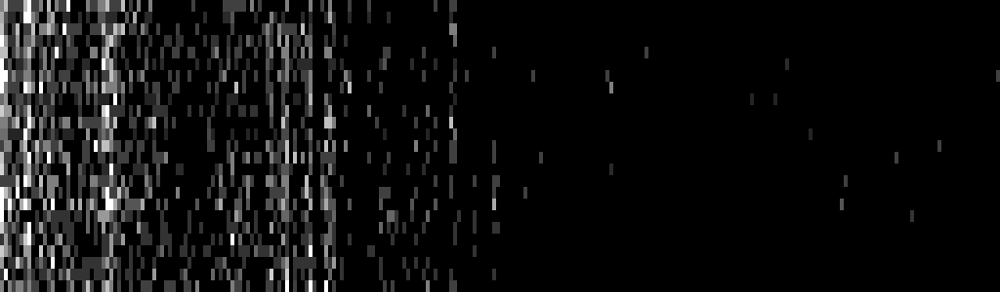

# 2018-05-26-SUCTF #

[Website](https://suctf.xctf.org.cn/)

---

## Challenges ##

### Reverse ###

 - [ ] 800 Python大法好?!
 - [x] 606 Enigma
 - [ ] 952 RubberDucky
 - [ ] 425 RoughLike与期末大作业
 - [x] 312 babyre
 - [x] 434 simpleformat

### Crypto ###

 - [ ] 625 Magic
 - [ ] 909 Pass
 - [ ] 625 Enjoy
 - [x] 512 Rsa
 - [x] 333 Rsa good

### Misc ###

 - [x] 222 SandGame
 - [x] 465 Cycle
 - [x] 740 TNT
 - [ ] 540 Game (partial)
 - [ ] 833 Padding的秘密
 - [x] 89 签到

### Pwn ###

 - [ ] 1000 Heapprint
 - [x] 689 lock2
 - [ ] 952 Noend
 - [x] 689 Heap
 - [ ] 540 Note

### Web ###

 - [ ] 909 MultiSql
 - [ ] 1000 Homework
 - [ ] 909 HateIT
 - [ ] 416 Getshell
 - [ ] 219 Anonymous

---

## 512 Crypto / Rsa ##

**Description**

> nc game.suctf.asuri.org:10004

**Files provided**

 - `dl.py` - the script running on the server (more or less)

**Solution**

Looking through the script, it is an implementation of RSA encryption as well as decryption. We see a line that is just:

    plain = 

So this is what we are looking for, everything else is printed out by the server upon connection, so we have:

 - `e` - public exponent, always `3` (!)
 - `d` - private decryption key
 - `n` - modulus
 - `r` - random number between `2` and `n - 1`
 - `c2` - `(pow(r, e, n) * c) % n`

Note that `c`, basically equivalent to `cipher` is not given, but it is calculated as:

    cipher = n2b(pow(b2n(plain), e, n))
    c = b2n(cipher)
    c2 = (pow(r, e, n) * c) % n

(Where `n2b` and `b2n` convert big integers to bytes and vice versa.)

The `decrypt` function in the code keeps track of which messages have already been decrypted and never decrypts the same message twice. This would hint at an attack like [this](https://security.stackexchange.com/a/166371). As far as I can tell, however, this is just a red herring - every time, we actually get a different plain text encoded in `c2`, because of the random number `r`.

After connecting we obtain some numbers, e.g.:

    e = 3
    d = 44099662569240083770100452501923890981810347032878178494549569926293640377794102787757812392102295343611476808834126649538952636114181616043006492565612847637935953145160211951331986860339486196832569683821120141014991379839508808414941455385036209313700326288366870889877799654511681743709353299322639045424737161223404842883211346043467541833205836604553399746326181139106884008412679110817142624390168364685584282908134947826592906891361640349523847551416712367526240125746834000852838264832774661329773724115660989856782878284849614002221996848649738605272015463464761741155635215695838441165137785286974315511355
    n = 66149493853860125655150678752885836472715520549317267741824354889440460566691154181636718588153443015417215213251189974308428954171272424064509738848419271456903929717740317926997980290509229295248854525731680211522487069759263212622412183077554313970550489432550306334816699481767522615564029948983958568137620658877310430228751724173392407096452402130591891085563316308684064273945573863484366971922314948362237647033045688312629960213147916734376716527936706960022935808934003360529947191458592952573768999508441911956808173380895703456745350452416319736699139180410176783788574649448360069042777614429267146945551
    c2 = 555197326820687822845510331497179235125339466901080486910855226563203620818546850664900334272558154897244807056051523382877025491022062653026950874706989089221441667975141857822467698984691394910413664568917834616477399551120134295817945851631274198716158916189852164710577201354848179364060363067031037364427257976432242368238133900381040554836326341802202448208567506144152953418971177837011508755732404288723827523795854985185948476628039747879323375293128273047932571155207763884307597378004378050070053742756331027480852317861759308073697411546007713846993873843230860015051875293239089946152466157009664950134
    r = 10657569616260118329404340834944716349573302183819435149128694785393343378737463193725664551171398971313585489634185044223763567210283228421322336466640716431124465773124614630377991915537115525004826903143400934299400374433218002815925291846775392164216151281973712468770631608862294981158069476777954388430091851221662753406685943465861825823022246167534811255026679837874465999186093902141814352480104598540063144133827422059918317985113532119825002361414848005564824947140564506090260655465903631363018380958302145031719465637060685617098378870594910675914122403158164788620459231729385876792019987208461650165272

We can calculate `x = pow(r, e, n)`. Then we know `c2 = (x * c) % n`. [Linear congruence](https://en.wikipedia.org/wiki/Chinese_remainder_theorem)! Using the [extended Euclidian algorithm](https://en.wikipedia.org/wiki/Extended_Euclidean_algorithm) we can calculate `c`:

    c = 143129603814823250510404042715251295520311679883019843825444039909477035653981361001492284240752368821689489939453177391156320036567415425905134935614309449291442196170277986126949

And we know `c` is just `pow(b2n(plain), e, n)`, and that `e` is `3`. So we just need to calculate integer the cube root of `c` to obtain `plain`. (This works because the plaintext is much smaller than the modulus.)

    b2n(plain) = 523090086828889678262514935810790175456119161691107232673149

Converting back to bytes (e.g. taking `hex` and `bytes`), we get:

`SUCTF{Ju5t_hav3_fun_emmm}`

([full decryption script](scripts/rsa.py))

## 333 Crypto / Rsa good ##

**Description**

> nc game.suctf.asuri.org:10005

**No files provided**

**Solution**

Interestingly enough this challenge is easier than the other RSA one (at least by the number of solves).

Upon connection we are presented with:

    Welcome to the Digital RSA2:
    e: 
    65537
    n: 
    342455709448748144126356744976385170973517744602059517490422045682543287960167955127769980654250125331171261846920903825693509591867402054748269545989173880386620770767057995165518626234085821335790902075953939551116777613078301529741199260825495593643848062203477826484698214686522001924292713782595019038086926834360866522789951283935502968545347160597915951673480253253216027297476774028106074570088497425654525031294571609018030761716007610673627163536370205798268831577480146622906265953470659107801115278898533958878045433701201601516984582294147038705649395688342773971893457527598221773710752744142729023770679
    Please choose:
    E : RSA Encryption System;
    D : RSA Decryption System;
    F : Encrypt the flag
    Choice:

Connecting again we still get the same public key, so we know these are constant. Choosing `F` for "Encrypt the flag" we get:

    Choice: F
    The flag cipher: 
    243420924328019812271997044731623514889072013216740847720538921813603074579018426992363519438216665458449517736036680099669329047658366669928864161251079327176102746954881753105898140124307640158445282448971434226898555798002446996700559970559548971654834334722774468853381736748850864907623960412915566112188526448623525238791386352470503696397575318422285090452116421782424854542335127142332557429789789260629596615637544991150867865734994690229005665154516290305677302120756735454346978770298508896241592312066522400540590533864364814412327485698942887055344712184230620270852672815875102620140460088293284634875172

But if we try `D` to decrypt it:

    Choice: D
    Pick the cipher: 243420924328019812271997044731623514889072013216740847720538921813603074579018426992363519438216665458449517736036680099669329047658366669928864161251079327176102746954881753105898140124307640158445282448971434226898555798002446996700559970559548971654834334722774468853381736748850864907623960412915566112188526448623525238791386352470503696397575318422285090452116421782424854542335127142332557429789789260629596615637544991150867865734994690229005665154516290305677302120756735454346978770298508896241592312066522400540590533864364814412327485698942887055344712184230620270852672815875102620140460088293284634875172
    No Permission.

We cannot.

On the [Wikipedia page for RSA](https://en.wikipedia.org/wiki/RSA_(cryptosystem)#Attacks_against_plain_RSA) there is a section about "attacks against plain RSA". This refers to RSA where the message is used directly to calculate the cipher text, without first applying appropriate padding (which adds random bits to the message that are removed by the decrypting side). We can verify that we are dealing with a plain RSA system by encrypting a `1` (since to any power it will remain `1`, which would not be the case if additional random bits were added).

    Choice: E
    Pick the Plain: 1
    The cipher: 
    1

And indeed, we get a `1` back, so plain RSA it is. From the Wikipedia page:

> RSA has the property that the product of two ciphertexts is equal to the encryption of the product of the respective plaintexts. That is `a^e * b^e ≡ (a * b)^e (mod n)`. Because of this multiplicative property a chosen-ciphertext attack is possible. E.g., an attacker who wants to know the decryption of a ciphertext `c ≡ m^e (mod n)` may ask the holder of the private key d to decrypt an unsuspicious-looking ciphertext `c' ≡ c * r^e (mod n)` for some value `r` chosen by the attacker. Because of the multiplicative property `c'` is the encryption of `m * r (mod n)`. Hence, if the attacker is successful with the attack, he will learn `m * r (mod n)` from which he can derive the message `m` by multiplying `m * r` with the modular inverse of `r modulo n`.

So let's do this. We take the encrypted flag and multiply the number with `pow(2, e, n) = pow(2, 65537, 3424557...)`:

    pow(2, e, n) = 253533347612163002791886149673871474605477566060494100900649977387523936490011200771487664540573862401127782940822894124517525940671378103381498115003800811143059755235973550463496903221735771385510711869164940252208663751050331845881809927429493349330615640365913183978141205027870223044370664399273744302849537780534440593010007234468088802206265899273888960178178247065835675284232483024487691698313649281243369462937869862410510886840683637590739883104204213947970689447158858802844942883714082082416987121761724704121496327579561253955594882154504900621183316688566233625249743293268141871650808028469815844854937
    (pow(2, e, n) * flag) % n = 327005676879028949445768932328296798578464592482540599865339824879152179277130842985648347238681307423212757689553473202800400659572189867088027502354498170958142760108282922361502863136370878203867642352911957027678835854097120819477969702374483395672012827361963447090350013221738881058248169085023233180780932337153928737226216195886364857280976894584300536964443205879002080240583242633283087772234506175835525942910571484560986599633312566734242903925452248023383920942967289609285076849334111576069897353386434756899938348014955344599788817989686289801571778983708369735446124697310165980202517269943631613975572

We then ask the server to decrypt it for us:

    Choice: D
    Pick the cipher: 327005676879028949445768932328296798578464592482540599865339824879152179277130842985648347238681307423212757689553473202800400659572189867088027502354498170958142760108282922361502863136370878203867642352911957027678835854097120819477969702374483395672012827361963447090350013221738881058248169085023233180780932337153928737226216195886364857280976894584300536964443205879002080240583242633283087772234506175835525942910571484560986599633312566734242903925452248023383920942967289609285076849334111576069897353386434756899938348014955344599788817989686289801571778983708369735446124697310165980202517269943631613975572
    The plain: 
    1264754223903805991037559546437770498994402578495550825086029019564913836209616386580

And now we just divide by `2` (since the message is much smaller than the modulus, so we don't need to worry about the inverse with respect to the modulus):

    bytes.fromhex(hex(1264754223903805991037559546437770498994402578495550825086029019564913836209616386580 // 2)[2:])

`SUCTF{Ju5t_hav3_fun_1n_R34_4Ga1N!}`

## 222 Misc / Sand Game ##

**Description**

> 注:此题flag格式为`flag{*}`

**Translated description**

> Note: This question flag format is `flag{*}`

**Files given**

 - `game.py` - script used to encrypt the flag into `sand.txt`:
 - `sand.txt` - the encrypted flag

**Solution**

The encryption script:

    import flag
    flag = flag.flag
    sands = int(flag[5:-1].encode("hex"), 16)
    holes = [257, 263, 269, 271, 277, 281, 283, 293, 307, 311, 313, 317, 331, 337, 347, 349, 353, 359, 367, 373]
    with open("sand.txt", "w") as f:
        for i in range(len(holes)):
            sand = sands % holes[i]
            f.write(str(sand)+"\n")

And "sand":

    222
    203
    33
    135
    203
    62
    227
    82
    239
    82
    11
    220
    74
    92
    8
    308
    195
    165
    87
    4

Interesting - the flag is given to us characterised by remainders after division by 20 consecutive prime numbers. In other words:

    flag = x1  * 257 + 222
    flag = x2  * 263 + 203
    flag = x3  * 269 + 33
    flag = x4  * 271 + 135
    flag = x5  * 277 + 203
    flag = x6  * 281 + 62
    flag = x7  * 283 + 227
    flag = x8  * 293 + 82
    flag = x9  * 307 + 239
    flag = x10 * 311 + 82
    flag = x11 * 313 + 11
    flag = x12 * 317 + 220
    flag = x13 * 331 + 74
    flag = x14 * 337 + 92
    flag = x15 * 347 + 8
    flag = x16 * 349 + 308
    flag = x17 * 353 + 195
    flag = x18 * 359 + 165
    flag = x19 * 367 + 87
    flag = x20 * 373 + 4

For some unknown integers `x1`, `x2`, ..., `x20`. How do we use this information? Well, even though the `x` numbers are not equal, we know that on the left-hand side of the equations it is the same flag. So if we take any two of the right-hand sides, we can equate them:

    x1 * 257 + 222 = x2 * 263 + 203
    x1 * 257 + 222 = x3 * 269 + 33
    ...

Let's consider each line separately.

    x1 * 257 + 222 = x2 * 263 + 203

This is a single equation with two unknowns, so there are infinitely many solutions. Nonetheless, it does provide us with some information about the relationship between `x1` and `x2`. But in fact, let's forget about `x2` as a variable and let's just find the general form of `x1` that will satisfy the above. It is just a congruence with respect to some modulus after all:

    all x1 such that
    (x1 * 257 + 222) % 263 = 203

By starting with `x1 = 0`, we can easily check each successive value of `x1` until the above equation holds (there is a faster way, the CRT, but it does not matter since the primes are small). Furthermore, the moduli are all primes, so necessarily they are co-prime to one another. The LCM of any two primes is their product, so after finding the first solution iteratively, we already know that the next one will be `x1 + 263` (the first solution + the modulus we are currently checking).

So what is the result of doing all this? We have reduced the original set of equations of the form:

    flag = x1  * 257 + 222
    flag = x2  * 263 + 203
    ...
    flag = x20 * 373 + 4

To another set of equations, of the form:

    x1 = y1  * 263 + 47
    x1 = y2  * 269 + 83
    x1 = y3  * 271 + 103
    x1 = y4  * 277 + 181
    x1 = y5  * 281 + 194
    x1 = y6  * 283 + 76
    x1 = y7  * 293 + 69
    x1 = y8  * 307 + 190
    x1 = y9  * 311 + 256
    x1 = y10 * 313 + 300
    x1 = y11 * 317 + 74
    x1 = y12 * 331 + 2
    x1 = y13 * 337 + 128
    x1 = y14 * 347 + 226
    x1 = y15 * 349 + 37
    x1 = y16 * 353 + 254
    x1 = y17 * 359 + 349
    x1 = y18 * 367 + 118
    x1 = y19 * 373 + 317

We have one less equation to worry about! We can keep doing this again and again, until we hit:

    j1 = k1 * 373 + 2

At this point, we know that whatever value of `k1` we choose, `j1` will be a valid solution to the previous set of equations. So let's choose `k1 = 0` and hence `j1 = 2`. Then we propagate this value back over the previous equations, where we only need to substitute the value in the first equation to get another concrete number that we can then substitute, etc etc.

([full implementation here](scripts/sandgame.py))

After all of this we get the number:

    481883688299168926385644485997804052926336296745

`hex`, `bytes`, and adding the `SUCTF{}`:

`SUCTF{This_is_the_CRT_xwg)}`

(Chinese remainder theorem?!)

## 465 Misc / Cycle ##

**Description**

> flag格式如下: flag{.+}

**Translated description**

> The flag format is as follows: flag{.+}

**Files given**

 - `cycle.py` - script used to create `cipher.txt`
 - `cipher.txt` - Base64 encoded ciphertext

**Solution**

Looking through `cycle.py`, we see that it uses the middle part of the flag (i.e. not `flag{` or `}`) as a key to XOR encrypt some English text. That last part is presumably indicated by:

    assert flag.languageOfPlain == "English"

We also see that the key length is:

    assert len(key) > 1
    assert len(key) < 50

We don't know which, but clearly this is much shorter than the plaintext which has 1853 bytes after Base64 decoding. XOR encryption is effective when used as a [one-time pad](https://en.wikipedia.org/wiki/One-time_pad), i.e. neither the key nor the plaintext are known or predictable. However, the key is used many times to encrypt the full plaintext!

First step is to find out the length of the key. Assuming the length of the key was `n`, we separate the ciphertext bytes into `n` "buckets". The first character of the key is used to encrypt `plain[0]`, `plain[n]`, `plain[2 * n]`, etc. The second character ecnrypts `plain[1]`, `plain[n + 1]`, and so on. So these groups of bytes are independent of each other with respect to the encryption scheme. There is one more assumption we can make - the plaintext bytes of each of the `n` categories have a consistent frequency spectrum. For example, in English text, ` ` (space) is the most common character, followed by the letters `e`, `t`, `a`, etc. Unless the plaintext is very special, if we take an arbitrary sample of every `x`th byte, we expect to still see the same frequency spectrum. If they are all XOR-ed with the same key byte, the spectrum will be different superficially, but in fact its values will only be shuffled around.

With this in mind, we visualise the frequency spectrum of each possible key length between 2 and 49. Most of the frequency spectra look quite blurry, which means that the sampled bytes were XOR-ed with two or more different key bytes.

**Key length: 23**

**Key length: 24**

**Key length: 25**

But hopefully you can see that for key length 24 the spectra look much sharper. Thus we can conclude that the key length is 24 bytes.

The next step is to figure our what the key actually is. As I already mentioned above, we know roughly what an English frequency spectrum is like. We could use an actual sample of English text to generate a reference frequency spectrum, but in practice the frequency spectrum of "Lorem ipsum" is good enough:

> Lorem ipsum dolor sit amet, consectetur adipisicing elit, sed do eiusmod tempor incididunt ut labore et dolore magna aliqua. Ut enim ad minim veniam, quis nostrud exercitation ullamco laboris nisi ut aliquip ex ea commodo consequat. Duis aute irure dolor in reprehenderit in voluptate velit esse cillum dolore eu fugiat nulla pariatur. Excepteur sint occaecat cupidatat non proident, sunt in culpa qui officia deserunt mollit anim id est laborum.

Once again, each of the `n` (24) groups of bytes are independent of one another with respect to the encryption, because they use different parts of the key. So we can simply check all 256 possible values for each of the 24 key bytes and only keep the ones that produce the spectrum closest to our reference. After doing this we get:

    key:
      Somethhnf Jwst Like!This
    decrypted text:
      The Ch`iosmmkers?Boldplay(Chsir Mcrtin)
      Aodrew Taggast?Ahris Mastin
      Andrew!T`ggcrt?Chsistopher M`ruin. Guy Besryman, Jonoy!Buakland ?Will Chamqinn?Alex P?ll
      Andrew Uafgapt?Aley Pall
      ...

At this point we don't have the correct key yet, but we can now easily see what the key (and the plaintext) are meant to be. After changing the key to `Something Just Like This`, we see that the plaintext is the lyrics to the song of the same name. So our flag is:

`flag{Something Just Like This}`

## 740 Misc / TNT ##

**Description**

> Hint1 hint:base64 only contians A-Z a-z +=/ find the missing character and the unnecessary character

**Files given**

 - `tnt.pcap` - a packet capture of somebody using blind SQL injection to gather data from a server (a [Damn Vulnerable Web Application](http://www.dvwa.co.uk/) instance)

**Solution**

The packet capture is quite large to look at in Wireshark but luckily, it only contains TCP packets and their HTTP equivalents. All the HTTP packets are pairs of requests by the client and responses by the server, the ordering is neat, there is no packet loss, etc. Taking a couple of packets at random, we see a lot of them are of the form:

    GET /vulnerabilities/sqli_blind/?id=2%27%20AND%202301%3DIF%28%28ORD%28MID%28%28SELECT%20IFNULL%28CAST%28comment%20AS%20CHAR%29%2C0x20%29%20FROM%20dvwa.guestbook%20ORDER%20BY%20name%20LIMIT%200%2C1%29%2C235%2C1%29%29%21%3D97%29%2CSLEEP%281%29%2C2301%29%20AND%20%27sXCb%27%3D%27sXCb&Submit=Submit HTTP/1.1

We can URL decode (`unescape` in JavaScript) the `id` parameter above to get:

    2' AND 2301=IF((ORD(MID((SELECT IFNULL(CAST(comment AS CHAR),0x20) FROM dvwa.guestbook ORDER BY name LIMIT 0,1),235,1))!=97),SLEEP(1),2301) AND 'sXCb'='sXCb

After injecting, we can imagine that the full SQL query takes the form:

    SELECT * FROM sometable WHERE
      id = '2'
      AND 2301 = IF(
        (ORD(
          MID(
            (SELECT IFNULL(
              CAST(comment AS CHAR), 0x20
            ) FROM dvwa.guestbook ORDER BY name LIMIT 0, 1)
            , 235, 1
          ))
        != 97), SLEEP(1), 2301)
      AND 'sXCb' = 'sXCb'

What does it do? We perform a query that seems to select data from a table. But remember - this is blind SQL injection, we don't actually get any output from the server, no matter what our SQL query produced. But the server will not give us any kind of response until the SQL query is executed to completion, so we use the `SLEEP` command conditionally. So the above query uses a subquery to select the `comment` column from the first row of `dvwa.guestbook`, then it extracts the 235th character using `MID`, and takes its Unicode character value using `ORD`. Finally, it compares it to 97. If it is not 97, `SLEEP(1)` is executed (and the server waits one second), if it is 97, the query succeeds immediately.

The requests in the packet capture are made in rapid succession, clearly performed by some sort of automatic SQL injection tool. In general, the characters are extracted using binary search, so on average, 7 queries are needed for each character, not ~64 that would be needed if only `==` and `!=` comparisons were used.

There are a lot of such requests in the packet capture, extracting data such as the table schema, column names, etc. But the only useful queries to us are those that are like the one above - extracting the `comment` text.

We can export the packet data from Wireshark into a CSV for easier parsing. Then based on the times between requests and responses we can automatically extract the same data that the SQL injection tool gathered.

([full SQL injection extraction script here](scripts/TNT.hx))

That gives us the following result:

    QlpoOTFBWSZTWRCesQgAAKZ///3ry/u5q9q1yYom/PfvRr7v2txL3N2uWv/aqTf7
    ep/usAD7MY6NHpAZAAGhoMjJo0GjIyaGgDTIyGajTI0HqAAGTQZGTBDaTagbUNpp
    kIEGQaZGjIGmgMgMjIyAaAPU9RpoMjAjBMEMho0NMAjQ00eo9QZNGENDI0zUKqfl
    EbU0YhoADQDAgAaaGmmgwgMTE0AGgAyNMgDIGmTQA0aNGg0HtQQQSBQSMMfFihJB
    AKBinB4QdSNniv9nVzZlKSQKwidKifheV8cQzLBQswEuxxW9HpngiatmLK6IRSgv
    QZhuuNgAu/TaDa5khJv09sIVeJ/mhAFZbQW9FDkCFh0U2EI5aodd1J3WTCQrdHar
    Q/Nx51JAx1b/A9rucDTtN7Nnn8zPfiBdniE1UAzIZn0L1L90ATgJjogOUtiR77tV
    C3EVA1LJ0Ng2skZVCAt+Sv17EiHQMFt6u8cKsfMu/JaFFRtwudUYYo9OHGLvLxgN
    /Sr/bhQITPglJ9MvCIqIJS0/BBxpz3gxI2bArd8gnF+IbeQQM3c1.M+FZ+E64l1c
    cYFRa26TC6uGQ0HnstY5/yc+nAP8Rfsim4xoEiNEEZclCsLAILkjnz6BjVshxBdy
    RThQkBCesQg=

It looks very much like Base64, but decoding it as is fails. Now it is time to use the hint given in the challenge description. Looking through the Base64 alphabet, we see that it never uses `.` as a character (on the third-to-last line). On the other hand, we can check which characters are used, and `X` is never used once, unlike every other character of the alphabet. So, we replace the `.` with an `X` and now the decoded data is:

    $ base64 -D < baseFixed.txt | xxd
    0000000: 425a 6839 3141 5926 5359 109e b108 0000  BZh91AY&SY......
    0000010: a67f fffd ebcb fbb9 abda b5c9 8a26 fcf7  .............&..
    0000020: ef46 beef dadc 4bdc ddae 5aff daa9 37fb  .F....K...Z...7.
    0000030: 7a9f eeb0 00fb 318e 8d1e 9019 0001 a1a0  z.....1.........
    0000040: c8c9 a341 a323 2686 8034 c8c8 66a3 4c8d  ...A.#&..4..f.L.
    0000050: 07a8 0006 4d06 464c 10da 4da8 1b50 da69  ....M.FL..M..P.i
    0000060: 9081 0641 a646 8c81 a680 c80c 8c8c 8068  ...A.F.........h
    0000070: 03d4 f51a 6832 3023 04c1 0c86 8d0d 3008  ....h20#......0.
    0000080: d0d3 47a8 f506 4d18 4343 234c d42a a7e5  ..G...M.CC#L.*..
    0000090: 11b5 3462 1a00 0d00 c080 069a 1a69 a0c2  ..4b.........i..
    00000a0: 0313 1340 0680 0c8d 3200 c81a 64d0 0346  ...@....2...d..F
    00000b0: 8d1a 0d07 b504 1048 1412 30c7 c58a 1241  .......H..0....A
    00000c0: 00a0 629c 1e10 7523 678a ff67 5736 6529  ..b...u#g..gW6e)
    00000d0: 240a c227 4a89 f85e 57c7 10cc b050 b301  $..'J..^W....P..
    00000e0: 2ec7 15bd 1e99 e089 ab66 2cae 8845 282f  .........f,..E(/
    00000f0: 4198 6eb8 d800 bbf4 da0d ae64 849b f4f6  A.n........d....
    0000100: c215 789f e684 0159 6d05 bd14 3902 161d  ..x....Ym...9...
    0000110: 14d8 4239 6a87 5dd4 9dd6 4c24 2b74 76ab  ..B9j.]...L$+tv.
    0000120: 43f3 71e7 5240 c756 ff03 daee 7034 ed37  C.q.R@.V....p4.7
    0000130: b367 9fcc cf7e 205d 9e21 3550 0cc8 667d  .g...~ ].!5P..f}
    0000140: 0bd4 bf74 0138 098e 880e 52d8 91ef bb55  ...t.8....R....U
    0000150: 0b71 1503 52c9 d0d8 36b2 4655 080b 7e4a  .q..R...6.FU..~J
    0000160: fd7b 1221 d030 5b7a bbc7 0ab1 f32e fc96  .{.!.0[z........
    0000170: 8515 1b70 b9d5 1862 8f4e 1c62 ef2f 180d  ...p...b.N.b./..
    0000180: fd2a ff6e 1408 4cf8 2527 d32f 088a 8825  .*.n..L.%'./...%
    0000190: 2d3f 041c 69cf 7831 2366 c0ad df20 9c5f  -?..i.x1#f... ._
    00001a0: 886d e410 3377 355c cf85 67e1 3ae2 5d5c  .m..3w5\..g.:.]\
    00001b0: 7181 516b 6e93 0bab 8643 41e7 b2d6 39ff  q.Qkn....CA...9.
    00001c0: 273e 9c03 fc45 fb22 9b8c 6812 2344 1197  '>...E."..h.#D..
    00001d0: 250a c2c0 20b9 239f 3e81 8d5b 21c4 1772  %... .#.>..[!..r
    00001e0: 4538 5090 109e b108                      E8P.....

The `BZ` prefix gives this away as a bzip file.

    $ base64 -D < baseFixed.txt | bunzip2 | xxd
    0000000: fd37 7a58 5a00 0004 e6d6 b446 0200 2101  .7zXZ......F..!.
    0000010: 1600 0000 742f e5a3 0101 131f 8b08 0803  ....t/..........
    0000020: e104 5b00 0333 332e 3333 3300 fb7f e33f  ..[..33.333....?
    0000030: 8b08 0303 0307 c3dc e8ed 3e06 f36c f217  ..........>..l..
    0000040: 0379 6b80 9815 888d 4080 fb43 5ada c4a4  .yk.....@..CZ...
    0000050: 740b fb85 331a 1ba7 3332 cd7b 1562 68a2  t...3...32.{.bh.
    0000060: 617c c2c0 a0c1 70f2 c5a4 e66d cb27 deae  a|....p....m.'..
    0000070: 4de9 9d29 29d1 c874 6e9f 620f d3df 7cab  M..))..tn.b...|.
    0000080: 6b3e 0f22 bf54 3f3a 9239 a7eb 77fc 1e9b  k>.".T?:.9..w...
    0000090: f8a4 f347 aaea efbd 625f 7f27 7daa 86cf  ...G....b_.'}...
    00000a0: 85b4 00f6 5557 1832 fdff 2f9e 5c2b ba66  ....UW.2../.\+.f
    00000b0: 6eaf 23a3 c684 39f3 67cf 9e7f fc83 e287  n.#...9.g.......
    00000c0: 2d92 c719 fbea 6df7 5f7a 57ea 2bb8 57da  -.....m._zW.+.W.
    00000d0: f8e3 7bd9 c6a0 eff7 663e 8f4b 8dda f264  ..{.....f>.K...d
    00000e0: fd8d fcbb 590f de26 09ff dd75 f961 47ae  ....Y..&...u.aG.
    00000f0: 6933 b335 3343 8037 2393 3c03 2e7f a830  i3.53C.7#.<....0
    0000100: 4080 0294 06fb 8a0b ca65 6490 6030 54d9  @........ed.`0T.
    0000110: a0ef f6e9 3223 3a1d e0cd ca06 51c3 c810  ....2#:.....Q...
    0000120: 0ea4 8f81 0d00 0098 1ba4 0e33 0100 0000  ...........3....
    0000130: fb83 8735 550b f5f2 0001 ac02 9402 0000  ...5U...........
    0000140: b5f4 ede6 b1c4 67fb 0200 0000 0004 595a  ......g.......YZ

Hmm. 7zip?

    $ base64 -D < baseFixed.txt | bunzip2 | file -
    /dev/stdin: xz compressed data

Nope.

    $ base64 -D < baseFixed.txt | bunzip2 | unxz | xxd
    0000000: 1f8b 0808 03e1 045b 0003 3333 2e33 3333  .......[..33.333
    0000010: 00fb 7fe3 3f8b 0803 0303 07c3 dce8 ed3e  ....?..........>
    0000020: 06f3 6cf2 1703 796b 8098 1588 8d40 80fb  ..l...yk.....@..
    0000030: 435a dac4 a474 0bfb 8533 1a1b a733 32cd  CZ...t...3...32.
    0000040: 7b15 6268 a261 7cc2 c0a0 c170 f2c5 a4e6  {.bh.a|....p....
    0000050: 6dcb 27de ae4d e99d 2929 d1c8 746e 9f62  m.'..M..))..tn.b
    0000060: 0fd3 df7c ab6b 3e0f 22bf 543f 3a92 39a7  ...|.k>.".T?:.9.
    0000070: eb77 fc1e 9bf8 a4f3 47aa eaef bd62 5f7f  .w......G....b_.
    0000080: 277d aa86 cf85 b400 f655 5718 32fd ff2f  '}.......UW.2../
    0000090: 9e5c 2bba 666e af23 a3c6 8439 f367 cf9e  .\+.fn.#...9.g..
    00000a0: 7ffc 83e2 872d 92c7 19fb ea6d f75f 7a57  .....-.....m._zW
    00000b0: ea2b b857 daf8 e37b d9c6 a0ef f766 3e8f  .+.W...{.....f>.
    00000c0: 4b8d daf2 64fd 8dfc bb59 0fde 2609 ffdd  K...d....Y..&...
    00000d0: 75f9 6147 ae69 33b3 3533 4380 3723 933c  u.aG.i3.53C.7#.<
    00000e0: 032e 7fa8 3040 8002 9406 fb8a 0bca 6564  ....0@........ed
    00000f0: 9060 3054 d9a0 eff6 e932 233a 1de0 cdca  .`0T.....2#:....
    0000100: 0651 c3c8 100e a48f 810d 0000 981b a40e  .Q..............
    0000110: 3301 0000                                3...
    $ base64 -D < baseFixed.txt | bunzip2 | unxz | file -
    /dev/stdin: gzip compressed data, was "33.333", from Unix, last modified: Wed May 23 04:33:23 2018

Gzip next...

    $ base64 -D < baseFixed.txt | bunzip2 | unxz | gunzip | xxd
    0000000: ffd8 ff04 1400 0000 0800 9d5b b74c 309e  ...........[.L0.
    0000010: 3c6f a300 0000 ac00 0000 0500 0000 3232  <o............22
    0000020: 3232 320b f066 6691 6267 383f a198 8181  222..ff.bg8?....
    0000030: 9701 029e ea54 3134 2833 c830 3080 3193  .....T14(3.00.1.
    0000040: d162 83b6 a791 db7d 648d 9919 1881 02ce  .b.....}d.......
    0000050: be21 8c02 fd6f 3ad6 4ce0 59f4 7be2 c469  .!...o:.L.Y.{..i
    0000060: 9c8a fb5f bc3c 5f62 cfc4 7a7f deea 07af  ..._.<_b..z.....
    0000070: dc67 9528 4cd0 6650 07aa d400 694f ffa3  .g.(L.fP....iO..
    0000080: 937d 15ac 9d8d 4101 2890 9c9f 9b9b 9fc7  .}....A.(.......
    0000090: f021 f0b4 19c7 018e 7f3d bfd2 ee75 4d11  .!.......=...uM.
    00000a0: bd1b 33f1 ef1d 8152 f7de 99e7 5e65 5ab4  ..3....R....^eZ.
    00000b0: e4af d86f dd6a e0ed 6213 fdba d3e1 886d  ...o.j..b......m
    00000c0: 3583 033b 0300 504b 0102 1f00 1400 0000  5..;..PK........
    00000d0: 0800 9d5b b74c 309e 3c6f a300 0000 ac00  ...[.L0.<o......
    00000e0: 0000 0500 2400 0000 0000 0000 2000 0000  ....$....... ...
    00000f0: 0000 0000 3232 3232 320a 0020 0000 0000  ....22222.. ....
    0000100: 0001 0018 0031 24b0 2f46 f2d3 0131 24b0  .....1$./F...1$.
    0000110: 2f46 f2d3 0131 24b0 2f46 f2d3 0150 4b05  /F...1$./F...PK.
    0000120: 0600 0000 0001 0001 0057 0000 00c6 0000  .........W......
    0000130: 0000 00                                  ...

At this point `file` will tell us this is a JPEG image, based solely on the first 2 bytes. However, no program will show this "image", and apart from the header, it really does not look like a JPEG image. In fact, we see two `PK` words in the hexdump. These are magic bytes occurring in `zip` files. We can patch the first four bytes to `50 4B 03 04`, which indicate a file record, which is what `zip` files typically start with.

    $ zipinfo zipFixed.zip
    Archive:  zipFixed.zip   307 bytes   1 file
    -rw-a--     3.1 fat      172 bx defN 23-May-18 11:28 22222
    1 file, 172 bytes uncompressed, 163 bytes compressed:  5.2%

There is a file called `22222`.

    $ unzip -p zipFixed.zip 22222 | xxd
    0000000: 504b 0304 1a07 00cf 9073 0000 0d00 0000  PK.......s......
    0000010: 0000 0000 e52c 7a00 8023 001c 0000 001c  .....,z..#......
    0000020: 0000 0002 32a3 3086 e559 b74c 1d33 0300  ....2.0..Y.L.3..
    0000030: 0100 0000 434d 5401 108f ec88 ac90 0ca2  ....CMT.........
    0000040: fb91 9196 0921 bfe8 e9cf 743f 0205 df9e  .....!....t?....
    0000050: abe0 ea47 9a74 2090 2b00 2700 0000 2800  ...G.t .+.'...(.
    0000060: 0000 0267 fc2c 6bd5 59b7 4c1d 3306 0020  ...g.,k.Y.L.3.. 
    0000070: 0000 0063 6f6d 6d6f 6e00 f051 cb36 08c0  ...common..Q.6..
    0000080: 08fe 8cfa 66de 8a94 15dd 5c91 fddc 1075  ....f.....\....u
    0000090: 478d 99ce ea69 3884 6fa8 bf3b 8530 4b44  G....i8.o..;.0KD
    00000a0: 3c5b eb89 40c4 3d7b 0040 0700            <[..@.={.@..

Another `zip` file? Nothing actually extracts this and we can see that the structures are far from what we would expect. Scrolling through the great [File signatures table](https://www.garykessler.net/library/file_sigs.html), we find something interesting. `rar` archives start with `52 61 72 21 1A 07 00`. The first four bytes are clearly wrong, but everything after looks promising. So we patch the first four bytes to `Rar!` and finally we extract a file called `common`:

`suctf{233333th1s1sf1ag23333333333333333}`

Fun challenge.

## 540 Misc / Game (partial) ##

**Description**

> nc game.suctf.asuri.org:10000

**No files provided**

**Solution**

After login, we have a standard PoW:

    ===========================================================================
                                   _..._                          
                                .-'_..._''.                       
                              .' .'      '.\                      
                             / .'                           _.._  
                            . '                   .|      .' .._| 
                            | |                 .' |_     | '     
           _       _    _   | |               .'     |  __| |__   
         .' |     | '  / |  . '              '--.  .-' |__   __|  
        .   | /  .' | .' |   \ '.          .    |  |      | |     
      .'.'| |//  /  | /  |    '. `._____.-'/    |  |      | |     
    .'.'.-'  /  |   `'.  |      `-.______ /     |  '.'    | |     
    .'   \_.'   '   .'|  '/              `      |   /     | |     
                 `-'  `--'                      `'-'      |_|     
    ===========================================================================
    Prove your heart!
    sha256(Lz8EQUrMVsvt + ****) == ea98abdb8cdc498f14e8422c96ca003c69a56408827c8630981c416077350e75

([PoW solver](scripts/pow.py))

After which, we are presented with the rules of the game:

    ===========================================================================
    Let's pick stones!
    There are some stones, you and me will alternatively pick them, the winner is who take the last one.
    If you think you cannot win, input 'GG' to skip this round. You have 3 chances to skip.
    ===========================================================================
    Round 1
    There are 13052 stones, you can pick 1 - 823 once
    13052 stones left
    Your turn:

Seems familiar. It is a variant of Nim; specifically the [Subtraction game](https://en.wikipedia.org/wiki/Nim#The_subtraction_game_S(1,_2,_._._.,_k)).Assuming we can take `n` stones, we aim to end each turn such that the number of remaining stones is `0 mod (n + 1)`. Then whatever the opponent's turn, we can take as many as it takes to get into the same remainder. After 20 rounds of this, we get:

    ===========================================================================
    I think you can try something difficult!
    Now we have two piles of stones, you can take any number of stones in one pile or take the same number in both two piles. Also, who pick the last stone is the winner.
    For example, if you want to pick 2 stones in the pile 0, input 2 0, if you want to pick 1 stone in the pile 1, input 1 1.
    If you want to pick 3 stones in both piles, input 3 2.
    You have 8 chances to input 'GG' to skip this round.
    ===========================================================================

Also looks kinda Nim-y. It is called (Wythoff's game)[https://en.wikipedia.org/wiki/Wythoff%27s_game]. We solve this phase of the game by precalculating the "cold positions" (losing states) for all coordinates 0 - 100000:

    def makeWythoff(end):
        wythoff = [0] * int(end * phi)
        for i in range(end):
            n = int(i * phi)
            m = n + i
            if n < len(wythoff):
                wythoff[n] = m
            if m < len(wythoff):
                wythoff[m] = n
    makeWythoff(100000)

We lose if we are given a cold position at the beginning, otherwise there is always a move that puts the opponent into a cold position. After 20 rounds of this, we get to the third and presumably final phase. Unfortunately, I cannot show you the exact text.

The final phase was actual Nim, played with 5 piles. The strategy involves calculating the "nim-sum", i.e. the XOR of all the pile sizes. At each step we aim to reduce a pile to its size XOR the overall nim-sum (i.e. we try to reduce a pile to the nim-sum of the other piles), if possible.

Here is the full disclosure:

While the solver I wrote worked well and produced instant responses to all three phases of the game, I could not get the flag. The game server was located in China and the best RTT I could get was 150ms with a VPS in Seoul. Thanks to the timeout I never got further than round 11 of the third phase. Very annoying.

## 89 Misc / 签到 ##

**Description**

> Welcome To SUCTF 2018

**Files provided**

 - `somehash.file` - `KNKUGVCGPN3WK3DDN5WWKX3UN5PXG5LDORTDEMBRHB6Q====`

**Solution**

The file looks like Base64, but decoding doesn't work. And there are 4 `=` padding bytes at the end, which never happens in Base64. But, there are other ASCII-encoding methods, such as [Base32](https://en.wikipedia.org/wiki/Base32). We see that there are no characters in the file that are not in the standard RFC 4648 Base32 alphabet. So (Haxe):

    var data = "KNKUGVCGPN3WK3DDN5WWKX3UN5PXG5LDORTDEMBRHB6Q";
    var alphabet = "ABCDEFGHIJKLMNOPQRSTUVWXYZ234567";
    trace(haxe.crypto.BaseCode.decode(data, alphabet));

Which gives us the flag:

`SUCTF{welcome_to_suctf2018}`
