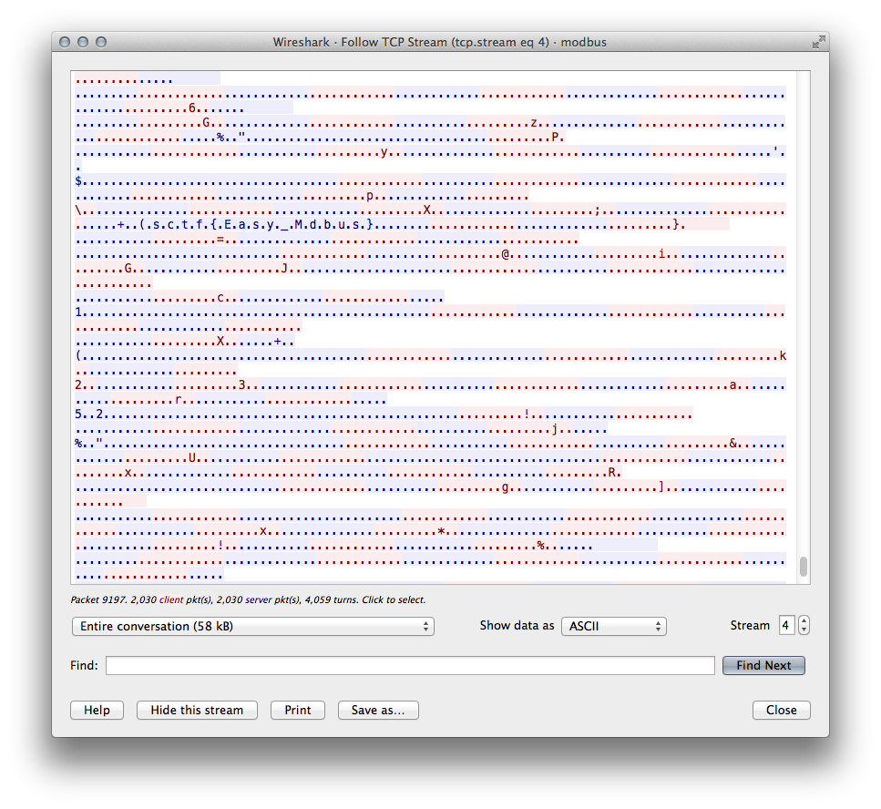
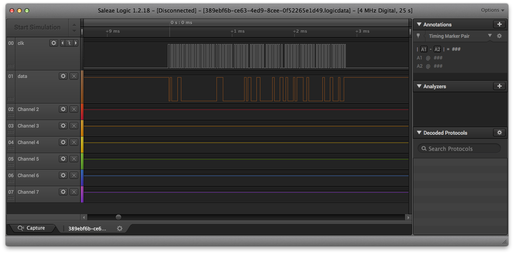
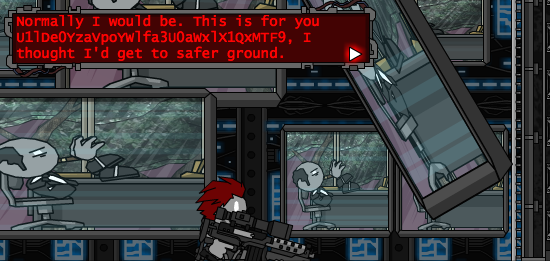
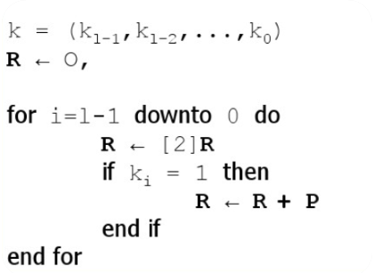
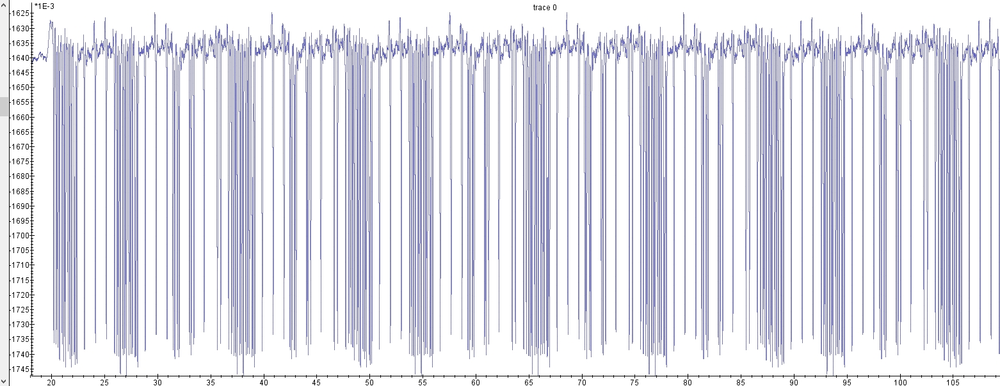
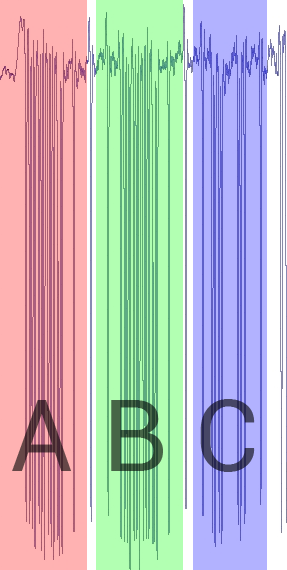

# 2018-06-19-SCTF #

[Website](https://sctf2018.xctf.org.cn/)

---

## Challenges ##

### Reverse ###

 - [x] 540 Babymips
 - [x] 392 Script In Script
 - [x] 425 Where is my 13th count?
 - [ ] 666 crackme2
 - [x] [333 simple](#333-reverse--simple)

### Misc ###

 - [x] [46 Welcome to SCTF 2018](#46 -misc--welcome-to-sctf-2018)
 - [x] [129 神奇的Modbus](#129-misc--神奇的modbus) (Magical Modbus)
 - [x] [434 神秘的交易](#434-misc--神秘的交易) (Mysterious transactions)
 - [x] [285 肥宅快乐题](#285-misc--肥宅快乐题) (Fat house happy questions)
 - [x] [357 侧信道初探](#357-misc--侧信道初探) (On the side channel)
 - [ ] 800 被动了手脚的数据 (Passive data / Data that is being tinkered with)
 - [x] [909 交易识破后的报复](#909-misc--交易识破后的报复) (Revenge after seeing the transaction)

### Crypto ###

 - [ ] 571 ElGamal Hacker
 - [x] [465 a number problem](#465-crypto--a-number-problem)
 - [x] [144 it may contain 'flag'](#144-crypto--it-may-contain-flag)

### Web ###

 - [ ] 625 新的建议板 (New suggestion board)
 - [ ] 800 Zhuanxv
 - [ ] 1000 NGINX的秘密 (The secret of NGINX)
 - [ ] 1000 BabySyc - Simple PHP Web
 - [ ] 1000 BabyIntranet
 - [ ] 1000 BabyIntranet2
 - [ ] 198 easiest web - phpmyadmin

### Pwn ###

 - [ ] 769 bufoverflow_b
 - [ ] 645 bufoverflow_a
 - [ ] 625 sbbs
 - [ ] 800 WTF Game

---

## 333 Reverse / simple ##

**No description provided**

**Files provided**

 - [`an APK file`](files/simple.apk)

**Solution**

We are given an APK file, an Android app which presumably shows a text input and a button to check the answer. I say presumably because I never actually ran the app, static analysis was enough.

Any APK is actually a valid ZIP file:

    $ zipinfo simple.apk
    Archive:  738030e7-35e1-42b2-a067-6a2a55cb4866.apk   658213   29
    -rw----     0.0 fat     1452 b- defN  0-000-80 00:00 AndroidManifest.xml
    -rw----     2.4 fat      773 b- defN  0-000-80 00:00 META-INF/CERT.RSA
    -rw----     2.4 fat     2998 b- defN  0-000-80 00:00 META-INF/CERT.SF
    -rw----     2.4 fat     2936 b- defN  0-000-80 00:00 META-INF/MANIFEST.MF
    -rw----     2.4 fat   453104 b- stor  0-000-80 00:00 assets/test.zip
    -rw----     2.4 fat   447676 b- defN  0-000-80 00:00 classes.dex
    -rw----     0.0 fat     5632 b- defN  0-000-80 00:00 res/drawable-anydpi-v21/ic_launcher_background.xml
       ... a bunch of PNG files ...
    -rw----     0.0 fat     9508 b- stor  0-000-80 00:00 resources.arsc
    29 files, 1004837 bytes uncompressed, 652931 bytes compressed:  35.0%

Most of these files are irrelevant to us, they are simply required for a proper Android app structure. The two files of interest are `assets/test.zip` and `classes.dex`. We can briefly glance at [`assets/test.zip`](scripts/simple/test.zip):

    $ . xxd assets/test.zip | head
    0000000: 504b 0304 6734 58f2 b8bd 7867 ccaf ae27  PK..g4X...xg...'
    0000010: 7946 063e 22f1 5dbb 2272 e973 4e8d 5d4d  yF.>".]."r.sN.]M
    0000020: d153 0405 abcd 872c 54bc 0ce5 fbb0 bac2  .S.....,T.......
    0000030: a6a9 78b3 a9e7 8a33 c46b a613 6d56 8bf3  ..x....3.k..mV..
    0000040: 4720 ff05 0405 b300 2c3c 79fa 6ac6 0075  G ......,<y.j..u
    0000050: 316f b979 a9f5 be81 dc5a 2822 d4b4 d217  1o.y.....Z("....
    0000060: f5f7 ed99 f804 0142 4363 44f9 e5dc 4fc7  .......BCcD...O.
    0000070: 6cd3 327f 2ac7 fa38 8d86 1b38 b04b 89c7  l.2.*..8...8.K..
    0000080: 42c3 8d65 be2c 124e 1e43 9c14 6a45 60a0  B..e.,.N.C..jE`.
    0000090: be16 889f 74e7 8715 b158 434f 6b6d b39d  ....t....XCOkm..

The four leading bytes match those of a ZIP header, but the rest of the file is not at all ZIP-like. In particular, there is no sign of a `PK` sequence at the end of the file. Let's move on for now.

As for `classes.dex` - DEX, or [Dalvik Executable](https://source.android.com/devices/tech/dalvik/dex-format), is a format used to store the compiled Java classes for Android applications in a more space-efficient manner (among other reasons). It can be converted to a standard JAR, e.g. using [`dex2jar`](https://github.com/pxb1988/dex2jar). This would still only contain the compiled Java classes, so they would need to be decompiled into Java source code.

We can make our job easier with an [online decompiler](http://www.javadecompilers.com/), which takes the entire APK and produces reasonable (not perfect) source code from that. So, for our `simple.apk`, we get:

    com.fancy.crackme1.BuildConfig
    com.fancy.crackme1.C0006R
    com.fancy.crackme1.FindAssetfile
    com.fancy.crackme1.ProxyApplication
    com.fancy.crackme1.RefInvoke

Luckily most of this is irrelevant to us once again. The important information is in `ProxyApplication`:

    protected void attachBaseContext(Context base) {
        super.attachBaseContext(base);
        String dexpath1 = getDir("shell", 0) + "/load.dex";
        File dexfile1 = FindAssetfile.getAssetsFile(this, "test.zip", dexpath1, null);
        DexClassLoader dcl1 = new DexClassLoader(dexpath1, getDir("shell_oat", 0).getAbsolutePath(), getApplicationInfo().nativeLibraryDir, getClassLoader());
        Object currentActivityThread = RefInvoke.invokeStaticMethod("android.app.ActivityThread", "currentActivityThread", new Class[0], new Object[0]);
        RefInvoke.setFieldOjbect("android.app.LoadedApk", "mClassLoader", ((WeakReference) ((ArrayMap) RefInvoke.getFieldOjbect("android.app.ActivityThread", currentActivityThread, "mPackages")).get(getPackageName())).get(), dcl1);
    }

So the source code we have doesn't really do anything, it just loads more Java code from the `assets/test.zip` file. It seems to mention a `load.dex` file as well, but this is not included in the application. In fact, when we inspect what `FindAssetfile` does, we can see that it decrypts the fake ZIP file into a DEX file.

    public static File getAssetsFile(Context cont, String assetfile, String releasefile, Method decMethod) {
        String key = "E82038F4B30E810375C8365D7D2C1A3F";
        try {
            byte[] dec;
            InputStream is = cont.getAssets().open(assetfile);
            ByteArrayOutputStream bos = new ByteArrayOutputStream();
            byte[] buf = new byte[1024];
            while (true) {
                int iRead = is.read(buf);
                if (iRead == -1) {
                    break;
                }
                bos.write(buf, 0, iRead);
            }
            if (decMethod != null) {
                dec = (byte[]) decMethod.invoke(null, new Object[]{bos.toByteArray()});
            } else {
                dec = bos.toByteArray();
            }
            is.close();
            bos.close();
            FileOutputStream outfile = new FileOutputStream(new File(releasefile));
            dec[0] = (byte) 113;
            dec[1] = (byte) 114;
            dec[2] = (byte) 10;
            dec[3] = (byte) 8;
            outfile.write(crypt(dec, key));
            outfile.close();
        } catch (IOException e) {
            e.printStackTrace();
        } catch (InvocationTargetException e2) {
            e2.printStackTrace();
        } catch (IllegalAccessException e3) {
            e3.printStackTrace();
        }
        return null;
    }
    
    public static byte[] crypt(byte[] data, String key) {
        int i;
        byte[] keys = key.getBytes();
        int x = 0;
        int[] box = new int[256];
        for (i = 0; i < 256; i++) {
            box[i] = i;
        }
        for (i = 0; i < 256; i++) {
            x = ((box[i] + x) + keys[i % keys.length]) % 256;
            int tmp = box[i];
            box[i] = box[x];
            box[x] = tmp;
        }
        x = 0;
        int y = 0;
        byte[] out = new byte[data.length];
        int index = 0;
        for (byte ch : data) {
            x = (x + 1) % 256;
            y = (box[x] + y) % 256;
            tmp = box[y];
            box[y] = box[x];
            box[x] = tmp;
            out[index] = (byte) (box[(box[x] + box[y]) % 256] ^ ch);
            index++;
        }
        return out;
    }

We can see the decryption key `E82038F4B30E810375C8365D7D2C1A3F`, as well as the fact that the first four bytes of the ZIP file are replaced with the correct ciphertext. So indeed, the first four bytes looking like a ZIP header were just a decoy.

Well, the application runs this code when it is started, and we see all that it works with – we can simply execute the same code to recover the `load.dex` file.

([decryption script in Haxe because I don't like Java](scripts/simple/Decode.hx))

As mentioned above, a DEX file can be decoded back into a JAR file:

    $ ./d2j-dex2jar.sh load.dex

And after decompiling the resulting JAR file, we get these classes:

    com.fancy.crackme1.BuildConfig
    com.fancy.crackme1.FindAssetfile
    com.fancy.crackme1.MainActivity
    com.fancy.crackme1.Point
    com.fancy.crackme1.ProxyApplication
    com.fancy.crackme1.R
    com.fancy.crackme1.RefInvoke
    com.fancy.crackme1.Square

It is interesting that it contains duplicates of the classes we already had in the APK. This time we can focus on `MainActivity`, `Point`, and `Square`. After cleaning up the code in `MainActivity` a little bit (the decompiler is not perfect), we get something like this:

    protected void onCreate(Bundle paramBundle) {
      super.onCreate(paramBundle);
      setContentView(2131034112);
      edt = ((EditText)findViewById(2130968582));
      tv = ((TextView)findViewById(2130968597));
      ((Button)findViewById(2130968578)).setOnClickListener(new View.OnClickListener() {
        public void onClick(View paramAnonymousView) {
          paramAnonymousView = edt.getText().toString().trim().getBytes();
          if (paramAnonymousView.length != 24) {
            return;
          }
          while ((paramAnonymousView[0] <= 48) || (paramAnonymousView[7] >= 112)) {
            return;
          }
          for (int i = 0; i < 24; i += 8) {
            Square[] arrayOfSquare = new Square[8];
            for (int j = 0; j < 7; j++) {
              if (paramAnonymousView[(j + i)] >= paramAnonymousView[(i + j + 1)]) {
                return;
              }
              arrayOfSquare[j] = new Square((paramAnonymousView[(i + j)] << 8) + 0x315F0000 + 0xFF, i / 2 + 4);
            }
            arrayOfSquare[7] = new Square((paramAnonymousView[(i + 7)] << 8) + 0x315F0000 + 0xFF, i / 2 + 4);
            for (int j = 0; j < arrayOfSquare.length; j++) {
              if (!arrayOfSquare[j].check()) {
                return;
              }
            }
          }
          tv.setText("Success!");
        }
      });
    }

Even without running the app we can guess what the interface might look like. `edt` is an [`android.widget.EditText`](https://developer.android.com/reference/android/widget/EditText) view, which is an editable text field. `tv` is an [`android.widget.TextView`](https://developer.android.com/reference/android/widget/TextView), which is used for presenting (non-editable) text to the user. Finally, there is an [`android.widget.Button`](https://developer.android.com/reference/android/widget/Button) which executes a checking routine when it is clicked / tapped.

`paramAnonymousView` is set to the byte values of the text the user entered into `edt`. I am not sure why the type system works here, since `getBytes()` is not a `View` value, but that is not very important to us.

First the code checks that:

 - there are exactly 24 characters
 - the ASCII value of the first is at least 49
 - the ASCII value of the last is at most 111

Then it iterates the 24 characters in 3 blocks of 8. Each block of 8 byte values must be strictly increasing, i.e. they are 8 distinct characters whose ASCII value is higher and higher.

For each block it creates an array of 8 `Square` instances, and passes the (slightly modified) byte data into the constructor. Then it calls the `check` method on each `Square`. If all 24 `Square`s pass their `check`, `tv` indicates a success message, presumably indicating that these 24 characters are the flag.

We can summarise what we know about the flag and how it is passed into the `Square` constructors as follows:

 - 24 characters long, consisting of 3 blocks of 8 characters
 - each block is strictly increasing
 - each block is bounded to the values `[49, 111]`
   - note: only the first block is actually checked for this, but the solution assumes it holds for all three blocks
 - the following `Square`s are constructed and `check`ed:
   - `Square((flag[ 0] << 8) + 0x315F00FF,  4);`
   - `Square((flag[ 1] << 8) + 0x315F00FF,  4);`
   - `Square((flag[ 2] << 8) + 0x315F00FF,  4);`
   - `Square((flag[ 3] << 8) + 0x315F00FF,  4);`
   - `Square((flag[ 4] << 8) + 0x315F00FF,  4);`
   - `Square((flag[ 5] << 8) + 0x315F00FF,  4);`
   - `Square((flag[ 6] << 8) + 0x315F00FF,  4);`
   - `Square((flag[ 7] << 8) + 0x315F00FF,  4);`
   - `Square((flag[ 8] << 8) + 0x315F00FF,  8);`
   - `Square((flag[ 9] << 8) + 0x315F00FF,  8);`
   - `Square((flag[10] << 8) + 0x315F00FF,  8);`
   - `Square((flag[11] << 8) + 0x315F00FF,  8);`
   - `Square((flag[12] << 8) + 0x315F00FF,  8);`
   - `Square((flag[13] << 8) + 0x315F00FF,  8);`
   - `Square((flag[14] << 8) + 0x315F00FF,  8);`
   - `Square((flag[15] << 8) + 0x315F00FF,  8);`
   - `Square((flag[16] << 8) + 0x315F00FF, 12);`
   - `Square((flag[17] << 8) + 0x315F00FF, 12);`
   - `Square((flag[18] << 8) + 0x315F00FF, 12);`
   - `Square((flag[19] << 8) + 0x315F00FF, 12);`
   - `Square((flag[20] << 8) + 0x315F00FF, 12);`
   - `Square((flag[21] << 8) + 0x315F00FF, 12);`
   - `Square((flag[22] << 8) + 0x315F00FF, 12);`
   - `Square((flag[23] << 8) + 0x315F00FF, 12);`

With this summary, we can forget about `MainActivity` and focus on `Square`.

    Square(int paramInt1, int paramInt2) {
      input = paramInt1;
      turncout = paramInt2;
      initpoint();
      if (check()) {
        turnpoint();
      }
    }

`Square` remembers the two parameters we give it as `input` and `turncout` (typo for `turncount` maybe?). It calls `initpoint` to initialise its array of 25 `Point` instances. It internally calls `check` and does `turnpoint` if it passes after already.

    private void initpoint() {
      for (int i = 0; i < 5; i++) {
        for (int j = 0; j < 5; j++) {
          point[i * 5 + j] = new Point(j, i, (input & (1 << (i * 5 + j))) >> i * 5 + j);
        }
      }
    }

The actual array is initialised as a 5 by 5 grid of points, each of which is on or off based on one bit from the input.

    Input: (flagCharacter << 8) + 0x315F00FF
    As bits:
    0011 0001 0101 1111 ABCD EFGH 1111 1111
                        ^ A-H are bits from the flag character

Then the initial layout for the `Point` array is (left-most column is Y coordinate, topmost is X coordinate, the rest are bit values):

| | 0 | 1 | 2 | 3 | 4 |
| --- | --- | --- | --- | --- | --- |
| 0 | 1 | 1 | 1 | 1 | 1 |
| 1 | 1 | 1 | 1 | H | G |
| 2 | F | E | D | C | B |
| 3 | A | 1 | 1 | 1 | 1 |
| 4 | 1 | 0 | 1 | 0 | 1 |

(The square choice of X and Y axes for the coordinates actually doesn't matter; as you will see, the `check` function is symmetric.)

The left-most bits of the `0x315F00FF` value are not actually used, so they are red herrings, perhaps. Now let's look at the `check` function:

    public boolean check() {
      int i = 0;
      for (int k = 0; k < 5; k++) {
        Point localPoint = findPoint(k, k);
        int j = i;
        if (localPoint != null) {
          j = i + localPoint.getValue();
        }
        localPoint = findPoint(4 - k, k);
        i = j;
        if (localPoint != null) {
          i = j + localPoint.getValue();
        }
      }
      return i >= 10;
    }

`findPoint` simply returns a `Point` with the given coordinates, and `getValue` of a `Point` returns 1 when the `Point` is "on". So since we have a 5 by 5 grid, this function is checking whether all (10) `Point`s lying on the two diagonals of the `Square` are "on". With the initial setting of the `Square` this will happen if the `D` and `H` bits of our flag character are 1.

And finally, the `turnpoint` function:

    private void turnpoint() {
      for (int i = 0; i < turncout; i++) {
        Point localPoint = point[0];
        for (int j = 0; j < 24; j++) {
          point[j] = point[(j + 1)];
          point[j].movepos();
        }
        point[24] = localPoint;
        point[24].movepos();
      }
    }

This simply performs a circular rotation of the `Point`s array, `turncout` times. The `movepos` function updates the coordinates accordingly. This is not a 2D rotation, but a rotation of the 1D array, like so:

     1  2  3  4  5       2  3  4  5  6
     6  7  8  9 10       7  8  9 10 11
    11 12 13 14 15  ->  12 13 14 15 16
    16 17 18 19 20      17 18 19 20 21
    21 22 23 24 25      22 23 24 25  1

All of the above is just a very terrible implementation of a relatively simple cipher / hash, with loads of unnecessary Java OOP.

But, we now know one important thing: even though there is a certain connection between consecutive flag characters in the same 8-character block (strictly increasing sequence), they have no other effect on the hash process; the `Square` `check` only takes one byte of data as its input. So with 63 possible values (in the interval `[49, 111]`) we can easily check all of them, do this for all three flag blocks and hope that the sequences are unique.

([full solver script](scripts/simple/SquareSolve.hx))

    $ haxe --run SquareSolve
    57=?UW]_
    QSUWY[]_
    9;=?Y[]_

So luckily the three sequences are indeed unique and each flag block has only 8 solutions. I was a bit worried that this doesn't look very much like a flag, but nope, it was correct.

`SCTF{57=?UW]_QSUWY[]_9;=?Y[]_}`

## 46 Misc / Welcome to SCTF 2018 ##

**Description**

> sctf{syc_always_with_you}

**No files provided**

**Solution**

The only notable thing about this challenge is that it led me to believe that the flag format is `sctf{...}`, with lowercase `sctf`. Most of the flags were `SCTF{...}`!

`sctf{syc_always_with_you}`

## 129 Misc / 神奇的Modbus ##

(Magical Modbus)

**Description**

> 寻找flag

**Translated description**

> Find flag

**Files provided**

 - [`a ZIP containing a packet capture`](files/modbus1.zip)

**Solution**

Opening up the packet capture, we can see a lot of various traffic. Some of it is encrypted. But, the challenge is called modbus, and there are a couple of modbus packets around. In Wireshark we can simply filter `modbus` to show only these packets. With that we get 4064 packets of Modbus going back and forth between two hosts. We can follow the TCP stream and show either's side data only. There are many repeats of the flag in this stream, e.g.:

`sctf{Easy_Mdbus}`

## 434 Misc / 神秘的交易 ##

(Mysterious Transactions)

**Description**

> 惊了！怪不得柠檬师傅最近总往北街跑。看他午休的时候，我悄悄拿走了他的会员卡，是一张4442的接触式卡。你知道吗，通过逻辑分析仪可以嗅探出他的加密密钥。快来跟我念出密钥，把他揪出来！（以16进制表示
> 
> (and a picture showing people agreeing on a date, irrelevant to the challenge)
> 
> (hint) SCTF｛flag｝flag若存在字母，用大写，16进制不带0x

**Translated description**

> Shocked! No wonder that Master Lemon has always been running North Street. Looking at his lunch break, I quietly took away his membership card, which is a 4442 contact card. Did you know that the logic analyzer can sniff out his encryption key? Come and read the key to me and get him out! (in hexadecimal)
> 
> (hint) SCTF{flag} If there is a letter, use upper case, hexadecimal without 0x

**Files provided**

 - [a .logicdata file](files/transactions1.logicdata)

**Solution**

Looking online for what a .logicdata file is, we can find [Saleae Logic](https://www.saleae.com/downloads/), software for using their Logic analyser hardware. The "demo" indeed works for opening the file and looking at its contents.

This works fine, and the program does offer some automated protocol analysers, but not the kind that we need. Fortunately we can export the data into a [CSV file](scripts/transactions1/data.csv), which is more easily parsable with custom scripts. 6 of the 8 channels present in the file are empty. The remaining two are called `clk` (clock) and `data`. Since there is a clock signal present, we don't care about the exact timing of signals (e.g. length of pulses). Both of the two channels are digital, carrying only high or low signals. So when exporting we can just output a file containing the samples at which a channel changes. (Exporting a CSV with all the samples in the file results in a huge file that is annoying to work with.)

    $ head export.csv
    Sample, clk, data
    -10000000, 0, 1
    -100, 1, 1
    -50, 1, 0
    0, 0, 0
    29, 0, 1
    76, 1, 1
    129, 0, 1
    147, 0, 0
    194, 1, 0

We can probably safely ignore the data in the negative sample counts.

Let's try to find out what protocol this is. Even though the English translation of the challenge description is far from perfect, it does clearly say `4442`. After some googling, we can find the [official datasheet for SLE 4442 integrated chips](files/sle4442.pdf), probably a very useful resource.

The chip has 256 bytes of memory, some of which can irreversibly be marked read-only. SLE 4442 (as opposed to the SLE 4432) also has a PSC, programmable security code, which is also what we are looking for in this challenge.

Most of the decoding just consists of reading the current value of the `data` channel whenever `clk` rises. The datasheet makes most parsing quite clear. The only thing that was slightly annoying / surprising was that the bits of a byte are transmitted LSB first.

Note: digital signals rise (going from a 0 to a 1) and fall (going from a 1 to a 0). If the data recorded were analogue, there'd be some logic / thresholds to determine if a line is currently high or low, and to check what it was on the last sample. Fortunately, in this challenge we are provided with the digital values already.

The decoder (and the protocol) has three modes:

 - `command` - triggered by `data` rising and `clk` falling; in this mode the host device (i.e. not the card) sends a 3-byte command to the card; end marked with `data` rising and `clk` rising
 - `outgoing` - some commands request data from the card; in this mode a bit is available on the `data` line every time `clk` rises; the amount of data is known in advance based on the command issued
 - `processing` - other commands tell the card to do some internal processing; this processing takes a number of clock cycles (determined by `clk` pulses); once `data` rises, the processing is done

The `clk` signal is always generated by the host, `data` can be pulled low or high by either device as needed.

There are only seven commands implemented in SLE 4442:

 - `READ MAIN MEMORY`
 - `UPDATE MAIN MEMORY`
 - `READ PROTECTION MEMORY`
 - `WRITE PROTECTION MEMORY`
 - `READ SECURITY MEMORY`
 - `UPDATE SECURITY MEMORY`
 - `COMPARE VERIFICATION DATA`

Once again, in this challenge our goal is to find out the PSC, the "password" used to access and modify data on the card. In the spec we can find a section called "PSC Verification". To input the PSC into the card, the following commands have to be issued, in this order:

 - `READ SECURITY MEMORY`
 - `UPDATE SECURITY MEMORY`
 - `COMPARE VERIFICATION DATA` - byte 1 of PSC
 - `COMPARE VERIFICATION DATA` - byte 2 of PSC
 - `COMPARE VERIFICATION DATA` - byte 3 of PSC
 - `UPDATE SECURITY MEMORY`
 - `READ SECURITY MEMORY`

The other commands also need to provide specific data, but as long as we find this sequence in the data we have, we should be able to find the PSC.

([full decode script](scripts/transactions1/Decode.hx))

`SCTF{403110}`

## 285 Misc / 肥宅快乐题 ##

(Fat house happy questions (???))

**Description**

> 真正的快乐的游戏题，打通就给flag哦，与肥宅快乐水搭配更佳。
> 
> Flash游戏，通关后，注意与NPC的对话哦;)
> 
> 点击Continue开始游戏，New game按钮有些电脑会有bug
> 
> flag的格式为SYC{}

**Translated description**

> Really happy game title, open to give the flag oh, and happy house with happy water better.
> 
> Flash game, after clearance, pay attention to the dialogue with the NPC;)
> 
> Click Continue to start the game. Some new computers have bugs on the computer.
> 
> The format of flag is SYC{}

**Files provided**

 - [a ZIP file with happy.swf](files/happy.zip)

**Solution**

The SWF file we are given is just a (lightly modified) game called Thing Thing 4. A classic from back when Flash was good and Flash games had their golden era. The description said to clear the game, then pay attention to the dialogue.

I got to this challenge close to the end of the CTF and was very tired, almost falling asleep while looking at the screen and playing the game. I did not have the mental capacity to think of clever ways to break the game so that I don't have to play it.

But if you just play the game and win, you get the flag, so that's what I did.

There are some "cheesy" tactics you can do while playing the game, such as standing near the enemy spawn points with a melee weapon and waiting until you have enough kills to enter the next area. The enemies never attack when you are too close to them.

The finall boss has two forms, one extremely weak where he tries to punch you, and then (after taking a couple of hits), the real spider form. During the battle enemies spawn on the left side of the level, enabling the player to collect their guns and ammo. Once again I just stood by their spawn point and gather a lot of ammo for the "Jackhammer" shotgun. When fired from point-blank range this weapon seems to have one of the highest DPS in the game. With ~150 rounds for the shotgun, I focused the boss and in three or four salvos he was gone.

    $ base64 -D <<< U1lDe0YzaVpoYWlfa3U0aWxlX1QxMTF9
    SYC{F3iZhai_ku4ile_T111}

I did actually investigate (a little bit) how the game remembers your progress. If you close the game, you can continue where you stopped. In Flash this is accomplished using `flash.net.SharedObject`. Each shared object has a name, which uniquely identifies it. The SO name for this game was `meatyData` and contained entries like `levelOn`, `ammo`, `kills`, etc.

The first entry in the `ammo` array seems to be a checksum of the rest of the array. The SO has both `levelOn` and `levelOn2`, presumably a protection scheme for the level number as well. It was a pain to collect any data for these keys, since each restart of the game meant having to sit through the producer and developer intros. Additionally, any time the checksums were incorrect, the game would delete the shared object.

Using a Flash decompiler with the game produced a lot of garbage code, presumably an Anti-RE technique added by the CTF organisers.

I know this solution seems a bit lazy and it would have been more interesting to learn about proper Flash decompilation and reversing the checksum scheme. But, with the time running quie low, I was happy to have the flag.

`SYC{F3iZhai_ku4ile_T111}`

## 357 Misc / 侧信道初探 ##

(On the side channel)

**Description**

> 施主，我看你有学侧信道的慧根！来道简单的能量分析攻击（SPA）帮助你理解一下吧~
> 
> 程序在运行的时候，不同复杂度所用的时间和消耗的能量是不同的，附件中的图是运行这个段代码是运行椭圆曲线按位扫描二进制点乘算法时，采集的部分能量数据。请以二进制形式读出来。
> 
> （本题感谢CUIT 6011硬件安全实验室提供数据）

**Translated description**

> The donor, I think you have learned the side channel of Huigen! A simple energy analysis attack (SPA) to help you understand it
> 
> When the program is running, the time and energy consumed by different complexity are different. The figure in the appendix is the part of the energy data collected when running this segment code to run the elliptic curve bitwise scanning binary point multiplication algorithm. Please read it out in binary format.
> 
> (This question is thanks to the CUIT 6011 Hardware Security Lab for data)

**Files given**

 - a ZIP file containing two images:

`algorithm.png`

`misc-challenges-1-1.png`

**Solution**

The description pretty much describes the solution. In a SPA attack, the power usage graph of the target device is inspected and, assuming the device is using an algorithm that was not designed to resist this type of attack, individual bits of the key used can be read directly.

In this case the algorithm is clearly performing different operations based on individual bits of the key. The `R <- [2]R` step is performed for each bit, but `R <- R + P` is performed only for "1" bits.

In the graph we can identify patterns simply by their shape. There are three different wave patterns. Let's call these A, B, and C.

As you can see, A and B seem similar, but their shape differs on the bottom.

With that, we can read the graph as this sequence:

    A, B, C, B, C, A, B, C, B, C, B, C, A, B, C, A

During the CTF I was first thinking of the graph as being separated by "C" patterns, and the presence of "A" or "AB" between them carrying information about individual bits. This was wrong, and in fact, if "A" represented a "0" bit, and "AB" represented a "1" bit, there is nothing in the algorithm that could produce the "C" pattern, since the only other operation in the algorithm is the loop counter increasing and a jump. These are unlikely to be very power intensive operations.

Instead, note that "C" always follows "B", so let's treat them as a single unit.

    A
      BC
      BC
    A
      BC
      BC
      BC
    A
      BC
    A

Then we can read "A" as a "0" bit, and "BC" as a "1" bit, giving us the actual key used: 0110111010.

Also the key does not have consecutive "0" bits, which is why my initial attempt was wrong.

`SCTF{0110111010}`

## 909 Misc / 交易识破后的报复 ##

(Revenge after seeing the transaction)

**Description**

> 上次被抓了现行之后，柠檬师傅恼羞成怒，偷偷拿走我自制的模拟电子钱包——一张4428协议的接触式卡，不仅改了我的密码。还修改了我的金额！！！更嚣张的是，还把他改的过程发给我了！哼！搞笑？就好像谁看不出来你怎么改的似的？我不仅分分钟念出你改的密码，我还能说出的改了哪里，内容改成了什么！
> 
> （注意flag提交形式：包含1.密码2.所修改的内容的地址3.修改后的数据。flag形式全部以16进制提交，例：sctf{密码+目的地址+数据}。地址，数据都是直接连着写，中间不用空格什么的分开，但是密码，地址，数据三部分之间用加号连接。顺序不能变，16进制字母全用大写。emmmmm，格式真的在解释一下，像这样：sctf{0123ABC……+0123ABC……+0123ABC…… }  数据瞎输的，关键是解释一下格式，不是故意在格式上设坑的。）

**Translated description**

> After being caught the last time, the Lemon Master was furious and secretly took away my self-made analog electronic purse, a 4428 agreement contact card, which not only changed my password. Also modified my amount! ! ! What's more arrogant is that he also sent me the process of changing him! Humph! Funny? Just like who can't see how you changed? I not only read the password you changed in minutes, but I can also tell you where the content changed!
> 
> (Note that the form of flag submission includes: 1. the password 2. the address of the modified content 3. the modified data. The flag format is all submitted in hexadecimal, for example: sctf {password + destination address + data}. Is directly connected to the write, the middle without a separate space or something, but the password, address, data between the three parts connected with a plus sign. Order can not be changed, all letters in hexadecimal letters. Emmmmm, the format really explain, like In this way: sctf {0123ABC... +0123ABC... +0123ABC... } The key to data loss is to explain the format, not intentionally pitting the format.)

**Files given**

 - [a .logicdata file](files/transactions2.logicdata)

**Solution**

Another logic analyser capture. This time, the card used was a 4428. Once again, the [official datasheet for SLE 4428 integrated chips](files/sle4428.pdf) was crucial to solving this. The description of the flag is extremely confusing, but more on this later.

We repeat the same steps as last time, extracting [an easily-parsable CSV](scripts/transactions2/data.csv) from the logicdata file.

This time, we have three digital signals - `clk`, `data`, and `reset`. A "1" on the `reset` line indicates the host device is sending data to the card, otherwise data may be coming from the card to the host, or processing is being done.

For this challenge we need to know not only the PSC, but also the data that was written to the card, so our parsing should be more complete. The commands available on the SLE 4428 are:

 - write and erase with protect
 - write and erase without protect
 - write protect with data comparison
 - read data with protect
 - read data without protect
 - write error counter
 - verify PSC byte

Once again, the commands are sent in 3-byte packets. To make space for the 1024 bytes of byte-addressable memory, the command ID is six bits, the address is 10 bits, and data is 8 bits. One thing that was unclear to me based on the spec was the bit ordering. Just like with the SLE 4442, values are generally transmitted LSB first, but this was not written anywhere in the SLE 4428 spec.

The PSC verification consists of:

 > – write one not written error-counter bit, address "1021",
 > – enter first PSC-code byte, address "1022",
 > – enter second PSC-code byte, address "1023",
 > – after correct input the error counter can be erased.

On the SLE 4428 there is a concept of memory protection, where a separate address space specifies which bytes of the memory are writable. Once a byte on the main memory is marked as read-only, this protection cannot be reversed.

I wasted a long time on this particular feature. I actually had the correct solution, but no matter how I wrote it, my flag was not accepted. So naturally I was wondering if perhaps I misunderstood the protection bits. In the process of debugging my script was outputting that in fact all the protection bits are set to "1".

My assumption was that the protection bit being "1" means the corresponding byte in memory is protected. So if all the protection memory is "1"-filled, writing would be impossible. I thought perhaps for some reason the `data` line carries inverted data, so `data` low would represent a "1" and vice versa. But this introduced problems of its own, such as the addresses not really making sense anymore.

As it turns out, my assumption was wrong. I didn't pay enough attention to this part of the spec:

 > Remark: Erase means "0" -> "1", write means "1" -> "0".

I thought this was only relevant to understand the terminology used in that particular section, which was explaining that it may take the card different amounts of time to write particular data to the memory depending on what was there beforehand.

But the remark also applied to the protection bits, so

 > The protect bit is erased at delivery, it can be written only once. 

means the protection bit can only be set to "0" once.

So in fact all of the memory on the card was unprotected and hence all of the protection bits were "1".

Again and again after checking all of my script I got the following data:

 - PSC is `0x0501`
 - data is written at address `0x80`
 - the full 16 bytes written are `0xFFF60572FFFFFFFFFFFFFFFFFFFFFFFF`

But no matter how I put it, I did not get the flag. The data at address `0x80` was filled with `0xFF` bytes, so maybe the flag only consisted of the modified data?

Back to the challenge description - perhaps it is partly that the machine translation is far from accurate, but it seems to me that the authors wrote an entire paragraph about the flag format with "emm" (why not organise your thoughts beforehand...) but forgot to mention that despite the writing being consecutive, the flag has to contain all 16 addresses. A lot of time wasted …

([full decoder script](scripts/transactions2/Decode.hx))

`sctf{0512+808182838485868788898A8B8C8D8E8F+FFF60572FFFFFFFFFFFFFFFFFFFFFFFF}`

## 465 Crypto / a number problem ##

**Description**

> You should learn number theory

**Files given**

 - the challenge:

    x**33=1926041757553905692219721422025224638913707 mod 3436415358139016629092568198745009225773259
    tell me the smallest answer of x

**Solution**

This challenge looks very much like RSA, but even though it is possible to factorise `n == 3881 * 885445853681787330351086884500131209939` (e.g. using WolframAlpha or yafu), we are not done - the exponent `e` has no modular multiplicative inverse mod `n`.

However, `e` is composite (3 * 11), and by exponentiation rules, we know that `x ** 33 == (x ** 3) ** 11`. 11 does have a modular multiplicative inverse:

    $ python3
    >>> from rsa import *
    >>> p = 3881
    >>> q = 885445853681787330351086884500131209939
    >>> n = p * q
    >>> e = 33
    >>> cipher = 1926041757553905692219721422025224638913707
    >>> phi = lcm(p - 1, q - 1)
    >>> multiplicative_inverse(33, phi)
    (none)
    >>> multiplicative_inverse(3, phi)
    (none)
    >>> d = multiplicative_inverse(11, phi)
    >>> d
    2030085857259516042859491929735755374057851
    >>> pow(cipher, d, n)
    297068717261984532037457456841187165228424

So we have simplified our problem to:

    x ** 3 = 297068717261984532037457456841187165228424 mod n

Unfortunately, this number is still not a cube. However, if `y == A mod n`, then solutions for `y` are of the form `A + b * n`, for some integer `b`. We can relatively quickly check for solutions to the above equation by substituting `y = x ** 3` and looking through all `b` until we find one such that `y` is a cube.

([full solver script](scripts/numberproblem.py))

Fortunately the guess was correct and we find a solution, with `b = 243277`, a relatively quick find. There might be a more clever way to do this last step, but for now this challenge it is unnecessary.

`SCTF{9420391510958023}`

## 144 Crypto / it may contain 'flag' ##

**Description**

> try it!

**Files provided**

 - the challenge:

    n=0x1fb18fb44f4449f45ea938306c47b91f64b6c176bd24dbb35aa876f73859c90f0e1677d07430a1188176bc0b901ca7b01f6a99a7df3aec3dd41c3d80f0d17292e43940295b2aa0e8e5823ffcf9f5f448a289f2d3cb27366f907ee62d1aaeba490e892dc69dacbafa941ab7be809e1f882054e26add5892b1fcf4e9f1c443d93bf
    e=0xe42a12145eaa816e2846200608080305c99468042450925789504307cbc54a20ed7071b68b067b703a1679d861795542f8cbd2d1cb4d3847d0940cac018cdb0fa729571afbe10c1b8be2dd8acd99ee48b77d53c435b9c2fed59e12e02ad8cfc2bcc46ad85534c266dcc1f3a1a03d87118eaf3f5b3eeeb3be84ad023a4bf34939
    c=0xd19d63015bdcb0b61824237b5c67cb2ef09af0c6cd30e193ff9683357b1e45ab4df607b8c1e0b96cafc49a84d7e655c3ce0f71b1d217eec9ca6cdfa57dd3dc92533b79431aa8a7d6ca67ac9cdd65b178a5a96ab7ce7bf88440f4a9b9d10151b0c942a42fdab9ea2c2f0c3706e9777c91dcc9bbdee4b0fb7f5d3001719c1dd3d3
    Tell me the msg.

**Solution**

Another one that looks very much like RSA. This time it **is** RSA, the choice of variable names confirms it. But you might notice something strange - the public exponent is almost as large as the modulus. Common values for `e` include 3 and 65537. It is unusual to see very large public exponents.

After some brief searching through the Wikipedia page on RSA, we can find a mention of ["Weiner's attack"](https://en.wikipedia.org/wiki/Wiener%27s_attack) in the [section on faulty key generation](https://en.wikipedia.org/wiki/RSA_(cryptosystem)#Faulty_key_generation).

The attack targets a small `d` (private exponent). A very large public modulus may be a sign that this is the case.

With some more searching, we can find [Sagi Kedmi's description of Wiener's attack](https://sagi.io/2016/04/crypto-classics-wieners-rsa-attack/), which includes a full Python implementation of the process. I cannot hope to explain the attack better than he did, nor provide a more practical implementation of the attack.

In the script we simply replace the weak key generation with the parameters we are given in the challenge and let it run. And very quickly, we get the result: `d = 731297`.

    $ python3
    >>> n = 0x1fb18fb44f4449f45ea938306c47b91f64b6c176bd24dbb35aa876f73859c90f0e1677d07430a1188176bc0b901ca7b01f6a99a7df3aec3dd41c3d80f0d17292e43940295b2aa0e8e5823ffcf9f5f448a289f2d3cb27366f907ee62d1aaeba490e892dc69dacbafa941ab7be809e1f882054e26add5892b1fcf4e9f1c443d93bf
    >>> c = 0xd19d63015bdcb0b61824237b5c67cb2ef09af0c6cd30e193ff9683357b1e45ab4df607b8c1e0b96cafc49a84d7e655c3ce0f71b1d217eec9ca6cdfa57dd3dc92533b79431aa8a7d6ca67ac9cdd65b178a5a96ab7ce7bf88440f4a9b9d10151b0c942a42fdab9ea2c2f0c3706e9777c91dcc9bbdee4b0fb7f5d3001719c1dd3d3
    >>> d = 731297
    >>> pow(c, d, n).to_bytes(22, "big")
    b'flag1sH3r3_d_ist0sma1l'

`SCTF{H3r3_d_ist0sma1l}`
