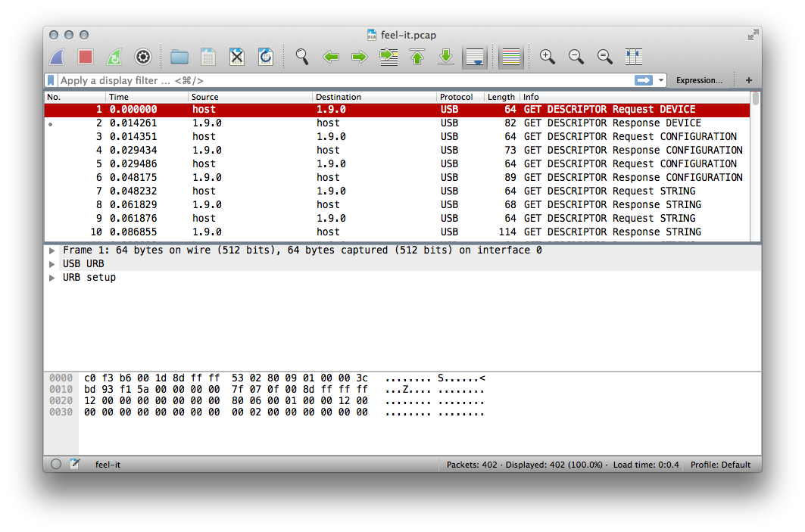
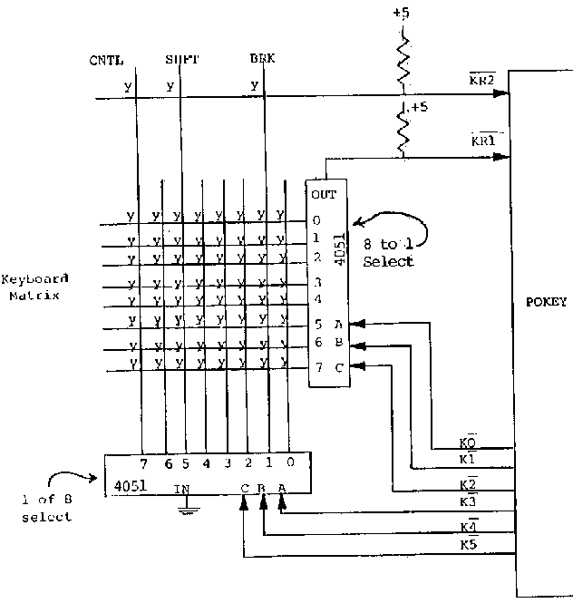
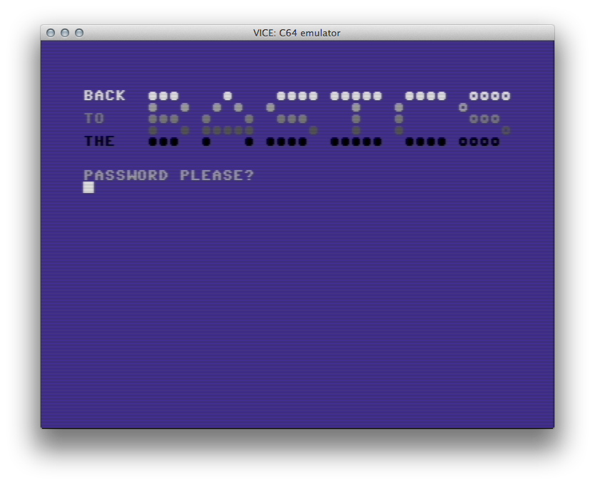
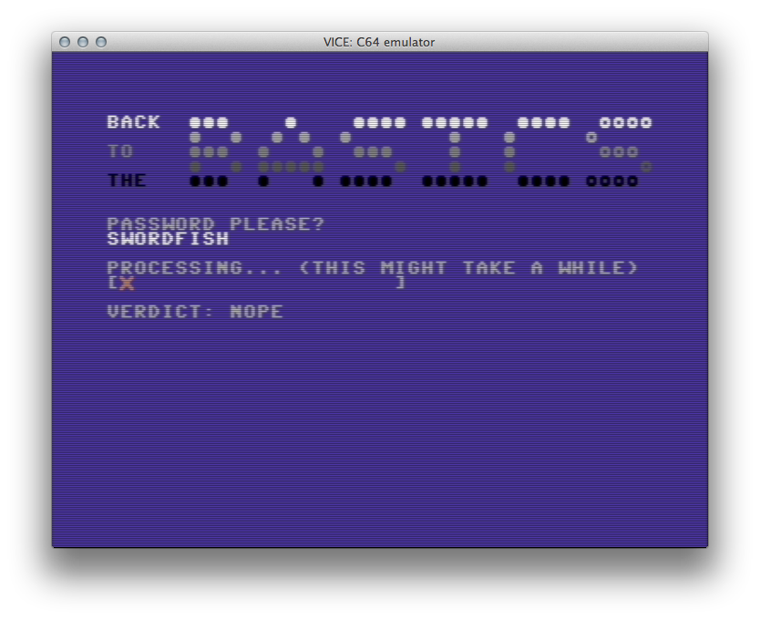
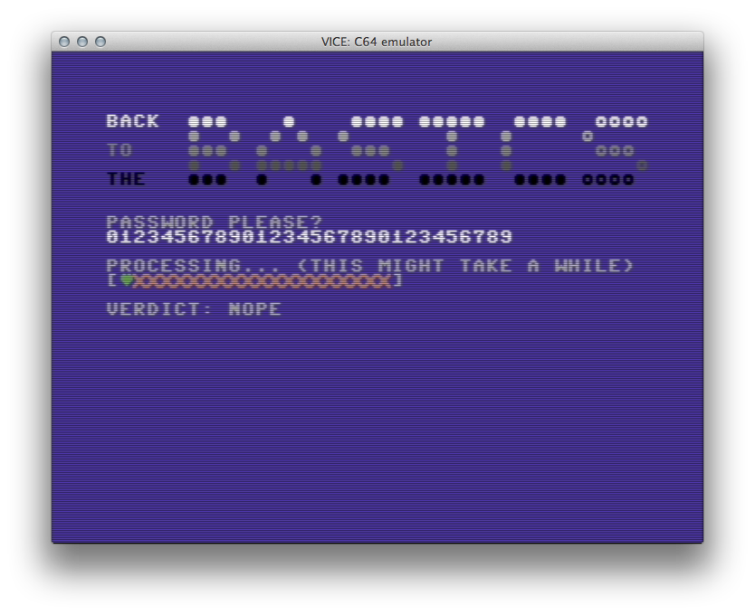
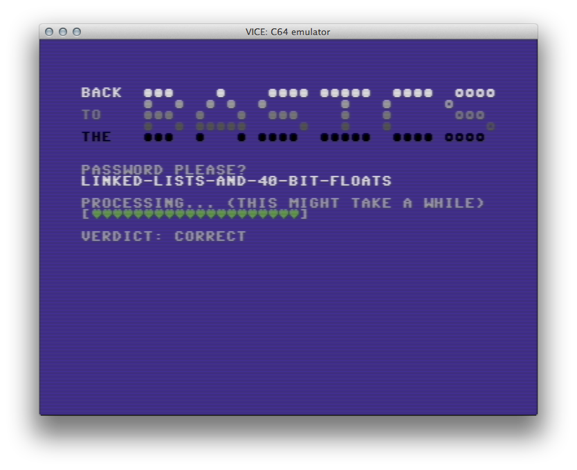
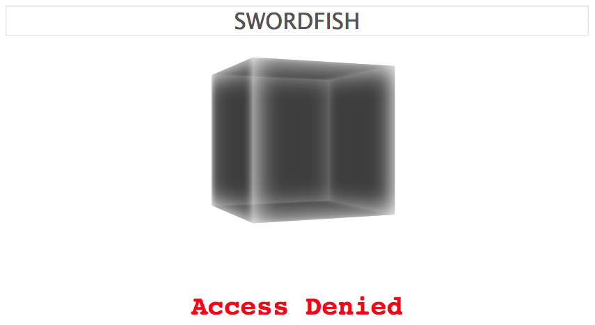
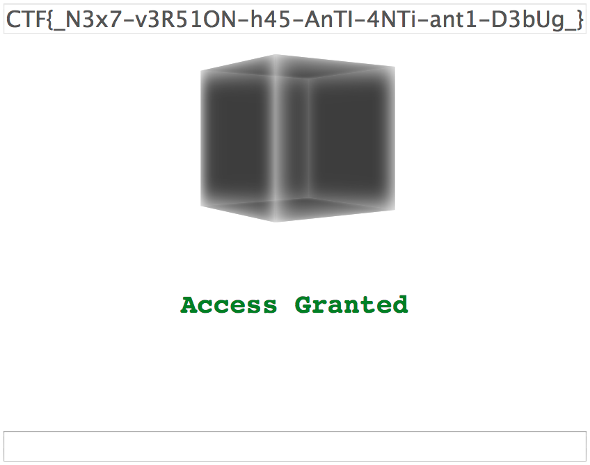

# 2018-06-23-Google-CTF-Quals #

[CTFTime link](https://ctftime.org/event/623) | [Website](https://capturetheflag.withgoogle.com/)

---

## Challenges ##

### Crypto ###

 - [ ] 231 Better ZIP
 - [ ] 176 DM Collision
 - [ ] 267 Dogestore
 - [ ] 243 MITM
 - [x] [158 Perfect Secrecy](#158-crypto--perfect-secrecy)

### Misc ###

 - [ ] 363 Bookshelf
 - [x] [208 Feel It](#208-misc--feel-it)
 - [ ] 420 Phrack
 - [ ] 355 Tape
 - [x] [220 Wired CSV](#220-misc--wired-csv)

### Pwn ###

 - [ ] 500 Drive
 - [ ] 283 Execve Sandbox
 - [ ] 420 APT42 - Part 2
 - [ ] 420 Sandbox Compat
 - [ ] 181 SFTP

### RE ###

 - [x] [113 Shall we play a game?](#113-re--shall-we-play-a-game)
 - [x] [293 Back to the Basics](#293-re--back-to-the-basics)
 - [ ] 249 Keygenme
 - [ ] 288 APT42 - Part 1
 - [ ] 326 Proprietary Format

### Web ###

 - [ ] 453 BBS
 - [ ] 210 Cat Chat
 - [ ] 326 gCalc
 - [x] [121 JS Safe 2.0](#121-web--js-safe-20)
 - [ ] 246 Translate

---

## 158 Crypto / Perfect Secrecy ##

**Description**

> This crypto experiment will help you decrypt an RSA encrypted message.
> 
> `nc perfect-secrecy.ctfcompetition.com 1337`

**Files provided**

 - [a ZIP file](files/perfect-secrecy.zip) containing:
   - `challenge.py` - script running on the server
   - `flag.txt` - 1024-bit encrypted message
   - `key_pub.pem` - 1024-bit RSA public key

**Solution**

First we can extract data from the public key file `key_pub.pem` using OpenSSL command-line tools:

    $ openssl rsa -pubin -in key_pub.pem -text -noout
    Public-Key: (1024 bit)
    Modulus:
        00:da:53:a8:99:d5:57:30:91:af:6c:c9:c9:a9:fc:
        31:5f:76:40:2c:89:70:bb:b1:98:6b:fe:8e:29:ce:
        d1:2d:0a:df:61:b2:1d:6c:28:1c:cb:f2:ef:ed:79:
        aa:7d:d2:3a:27:76:b0:35:03:b1:af:35:4e:35:bf:
        58:c9:1d:b7:d7:c6:2f:6b:92:c9:18:c9:0b:68:85:
        9c:77:ca:e9:fd:b3:14:f8:24:90:a0:d6:b5:0c:5d:
        c8:5f:5c:92:a6:fd:f1:97:16:ac:84:51:ef:e8:bb:
        df:48:8a:e0:98:a7:c7:6a:dd:25:99:f2:ca:64:20:
        73:af:a2:0d:14:3a:f4:03:d1
    Exponent: 65537 (0x10001)

And we can confirm `flag.txt` is indeed encrypted:

    $ xxd flag.txt
    0000000: a9c5 65cb c2cf 1c7d 4267 fd17 69dc e9f0  ..e....}Bg..i...
    0000010: 3481 800b bae8 6bb0 926a e617 a7e6 d09f  4.....k..j......
    0000020: 2c61 a9d7 0a85 6783 973c 4c55 bf43 a24c  ,a....g..<LU.C.L
    0000030: 1d70 f7b0 2ac0 34ff 39c5 37ab 39c7 8d90  .p..*.4.9.7.9...
    0000040: 523a 8107 a098 0195 df35 21d6 54d7 2069  R:.......5!.T. i
    0000050: f942 8208 431c c763 def3 9bcd 8cd3 ea9d  .B..C..c........
    0000060: 45e9 9e23 f781 0fa0 3b6c e906 d6f4 1373  E..#....;l.....s
    0000070: e0e2 a7c0 2230 1828 d7f8 0ed3 c630 ae56  ...."0.(.....0.V

After studying the Python script provided for a little bit, we can decide to ignore most of it - the parts that take care of setting up the service and doing standard RSA operations are not important.

This is the actual core of the challenge, with some comments:

    def Challenge(private_key, reader, writer):
      try:
        # read two bytes from the client
        m0 = reader.read(1)
        m1 = reader.read(1)
        # read a ciphertext from the client
        ciphertext = reader.read(private_key.public_key().key_size // 8)
        # decrypt it
        dice = RsaDecrypt(private_key, ciphertext)
        # repeat a 100 times ...
        for rounds in range(100):
          # select one of the two bytes given based on the
          #  least significant bit of the decrypted ciphertext
          p = [m0, m1][dice & 1]
          # choose a random number (0, 1, or 2!)
          k = random.randint(0, 2)
          # add the random number to the byte selected,
          #  then keep its least significant bit only
          c = (ord(p) + k) % 2
          # zero-expand this single bit to a byte and send it to the client
          writer.write(bytes((c,)))
        writer.flush()
        return 0
      except Exception as e:
        return 1

In a challenge like this, it is very important to understand where we actually gain any useful information. We cannot break a 1024-bit RSA key (practically), so neither the encoded message nor the public key help us. We are given a remote service so naturally we need to interact with it one way or another to solve the challenge.

In the above script, we can provide the server with any ciphertext and it will decrypt it for us. However, `dice`, the variable containing the decrypted data, is not used anywhere except as `dice & 1`, giving us only a single bit of information. We need to consider how this could be useful.

Apart from that, `random.randint(0, 2)` might be a source of trip ups. I was not sure whether or not the upper bound was exclusive. If it were, then this function call would return `0` roughly 50% of the time and `1` otherwise. If this were the case, the attack we will choose in the end would not have been possible, and we might have considered other side channels - timing? Padding oracle? And so on.

But, `random.randint(0, 2)` indeed returns `0`, `1`, or `2`, all with equal probabilities. This is significant because `0` and `2` are both even numbers, whereas `1` is not. This random distribution is biased towards even numbers, returning an odd number only 33% of the time!

Let's summarise the procedure of a single interaction with the server:

 - connect
 - provide byte value `M0` with the LSB (least significant bit) equal to 0
 - provide byte value `M1` with the LSB equal to 1
 - provide a ciphertext `C`
 - (the server decrypts `C` into plaintext `P`)
 - count the number of `1` bits returned by the server
   - majority of `1` bits - the LSB of `P` is probably `1`
   - majority of `0` bits - the LSB of `P` is probably `0`

We can understand this interaction as a simple black box that takes an input, the ciphertext `C`, and returns a single bit of information `P0`, the LSB of the decrypted plaintext `P`.

Do note the word "probably" in the last step of the interaction. The server only runs 100 trials for each bit we test it for. The more bits we test, the more likely it is that the majority of bits returned by the server do not reflect the LSB of the plaintext!

So what can we do with our black box? We have been given the ciphertext for the flag (based on the filename), but if we input it into the black box, we can only obtain the LSB of the flag, which is not terribly useful.

Now may be the time to look more closely at the Python script. In particular, the `RsaDecrypt` function used.

    def RsaDecrypt(private_key, ciphertext):
      assert (len(ciphertext) <=
              (private_key.public_key().key_size // 8)), 'Ciphertext too large'
      return pow(
          int.from_bytes(ciphertext, 'big'),
          private_key.private_numbers().d,
          private_key.public_key().public_numbers().n)

The important thing here is the fact that `RsaDecrypt` is implemented just as a simple exponentiation operation, using the private exponent. It is not checking the input (besides its size in bits), nor is it checking the output. When implemented properly, RSA uses a padding scheme. If the plaintext is not valid with respect to the padding scheme after decryption, it should be rejected (and the client should not know that this happened). Here we can see no such check, so we are dealing with "plain RSA", which can be attacked in [numerous ways](https://en.wikipedia.org/wiki/RSA_(cryptosystem)#Attacks_against_plain_RSA).

What does this mean for us? It means that no matter what ciphertext `C` we give to the server, it will decrypt it and give us (indirectly) the LSB of the resulting plaintext.

**Note**: the rest of this write-up describes how an LSB oracle attack on RSA works, and how it is implemented, as well as some caveats. I am by no means a cryptographer. You might have more luck searching for "RSA LSB oracle" and finding a white paper for a proper explanation and proof. Nevertheless, I tried my best to explain it.

Because RSA is simply exponentiation under some large modulus, there are certain mathematical properties that could be useful to us. In particular, if we multiply two ciphertexts `C1` and `C2`, the resulting plaintext will be the product of the corresponding plaintexts `P1` and `P2`:

    decrypt(C1 * C2) = P1 * P1
    (C1 * C2)^d = P1 * P2 mod n

We know the public exponent, so we can choose any plaintext and calculate the corresponding ciphertext. We want to gather information about the flag of course, so one of our ciphertexts (and its plaintext) is chosen. What should we choose for the other ciphertext / plaintext?

Let's step back a bit (ha, ha) and think about our goal. We want to know the flag. We can only gather one bit of information from the server at a time, and it is the LSB of the flag multiplied by any (natural) number we choose. Since we are considering the flag in its binary form, let's consider bitwise shifting as mathematical operations:

         x = 0001 0110 1101
     2 * x = 0010 1101 1010
    x << 1 = 0010 1101 1010

A left shift of one bit is the same as multiplying by two.

         x = 0001 0110 1101
    x // 2 = 0000 1011 0110
    x >> 1 = 0000 1011 0110

A right shift of one bit is the same as (integer) division by two.

If we were working in regular integer arithmetic, there would be no way to multiply the flag to reproduce the effect of a right shift. This would mean we multiplied the flag by a number less than 1, but again - we only have natural numbers to work with.

But we are working in modular arithmetic. If we multiply the flag by some number, the result can be smaller than the original flag! But then again, it could be larger. Can we tell which happened by the LSB?

Let's choose `2` as the number we multiply the flag by:

    Given
      public modulus    n (n is odd; product of 2 large primes)
      public exponent   e
      flag              p (p < n)
      ciphertext        c  = p^e mod n
      factor            f  = 2
      encrypted factor  cf = 2^e mod n
    Then
      x = decrypt(c * cf)
        = (c * cf)^d
        = (p^e * 2^e)^d
        = 2p
    If x < n, then
      LSB of x mod n is 0! (a left shift)
    If x ≥ n, then
      LSB of x mod n is 1! (because n is odd)

So with this process, we obtained useful information about the flag, in terms of its relative value to `n`, a value which we know!

In fact, we can repeat this process. If we multiply the flag by `4` (or better, multiply it by `2` twice), what can happen? Since `p < n`, we now have four cases to consider:

      x = decrypt(c * cf)
        = 4p
    If      x <  n, then
      LSB of x mod n is 0! (a left shift of two)
    If  n ≤ x < 2n, then
      LSB of x mod n is 1! (because n is odd)
    If 2n ≤ x < 3n, then
      LSB of x mod n is 0! (because n is odd and subtracted from `x` twice)
    If 3n ≤ x     , then
      LSB of x mod n is 1! (because n is odd and subtracted from `x` thrice)

If we combine the last two results, we know in which "quadrant" of the modulus space `p` is in. That is, if we were to separate the range of all of its possible values, we know in which quarter of this range it lies in.

But of course, we don't have to stop here. If we keep multiplying our ciphertext by `2^e mod n` (and hence our plaintext by `2`) and gathering the LSB returned by the server, after 1024 interactions, we will know exactly what the flag is. In fact, since the range keeps getting more and more divided, we can spot that our process is that of a binary search, at each point checking a smaller and smaller interval of possible values and deciding on one half of that interval.

With all the pieces now in place, the implementation is quite easy to understand. We use several parallel connections to gather the LSB / parity bits faster. We consider results where the number of `1` bits is very close to the number of `0` bits to be meaningless and re-try until at least a 60:40 majority is found for any given bit. Once we have gathered all of the needed 1024 bits from the server, we use Python's decimals to have enough precision to calculate the exact value of the flag. (Regular 32 or 64-bit IEEE floats cannot express all possible values when the flag has 1024 bits of information!)

([full Python script](scripts/perfect-secrecy.py))

    $ python3 perfect-secrecy.py
    calculating ciphertext multiples ...
    gathering parity bits from server ...
    calculating flag value ...
    flag:
    0x261b4020c33d22e3ae79e4227f2d51c3760e40dcdacd87f025f4c8471ea8cb41d7d8290671730002e6f4f204354467b68336c6c305f5f31375f355f6d335f315f7734355f77306e643372316e365f31665f34663733725f346c6c5f37683335335f79333472355f7930755f645f6c316b335f37305f6d3333377d204f6f2e
    b"\x00\x02a\xb4\x02\x0c3\xd2.:\xe7\x9eB'\xf2\xd5\x1c7`\xe4\r\xcd\xac\xd8\x7f\x02_L\x84q\xea\x8c\xb4\x1d}\x82\x90g\x170\x00.oO CTF{h3ll0__17_5_m3_1_w45_w0nd3r1n6_1f_4f73r_4ll_7h353_y34r5_y0u_d_l1k3_70_m337} Oo."

And we got the flag!

We can see that the message is actually padded using PKCS#1 v1.5. This is signaled by the `\x00\x02` prefix to the message, followed by a bunch of random data, then a null byte, and finally the actual message.

During the CTF our team was stuck for a little bit despite having the above script implemented and tested locally. The difference was that we did not enforce a 60:40 majority on the bits returned by the server. We got unlucky and one of the bits returned was wrong, giving us this message after deciphering the parity bits:

    $ xxd attempt1.bin
    0000000: 0002 61b4 020c 321d 86e9 ea88 7ded 44cc  ..a...2.....}.D.
    0000010: 0ec8 396b 47dd 586b 0b01 29fb 1831 15e3  ..9kG.Xk..)..1..
    0000020: a367 44e4 9197 7525 880c ec4f 3c91 176a  .gD...u%...O<..j
    0000030: a2c0 3cd3 6bea 55af b865 7f0b a81c 09af  ..<.k.U..e......
    0000040: 31ae 192f 69c5 f9eb 7d82 ff6b dac0 d1d4  1../i...}..k....
    0000050: 5870 49bf f959 c002 ee58 1068 baf1 77ad  XpI..Y...X.h..w.
    0000060: 51b7 bdc5 fd0f b3b0 f19c 8d97 2ab3 fc29  Q...........*..)
    0000070: 9a84 6a00 0a59 afdc d9da 0931 be8b 3a68  ..j..Y.....1..:h
    $ xxd attempt2.bin
    0000000: 0002 61b4 020c 33d2 2e3a e79e 4227 f2d5  ..a...3..:..B'..
    0000010: 1c37 60e4 0dcd acd8 7f02 5f4c 8471 ea8c  .7`......._L.q..
    0000020: b41d 7d82 9067 1730 002e 6f4f 2043 5446  ..}..g.0..oO CTF
    0000030: 7b68 336c 6c30 5f5f 3137 5f35 5f6d 335f  {h3ll0__17_5_m3_
    0000040: 315f 7734 355f 7730 6e64 3372 316e 365f  1_w45_w0nd3r1n6_
    0000050: 3166 5f34 6637 3372 5f34 6c6c 5f37 6833  1f_4f73r_4ll_7h3
    0000060: 3533 5f79 3334 7235 5f79 3075 5f64 5f6c  53_y34r5_y0u_d_l
    0000070: 316b 335f 3730 5f6d 3333 377d 204f 6f2e  1k3_70_m337} Oo.

As you can see, we only got 12 bytes (and a couple of bits) right. I believed the value must have been correct, since the message was valid with respect to the PKSC#1 v1.5 padding scheme. We finally uncovered the problem when I tried to re-encrypt the supposed flag and the result was different from the original ciphertext. Once again, do note the word "probably" in the attack description!

`CTF{h3ll0__17_5_m3_1_w45_w0nd3r1n6_1f_4f73r_4ll_7h353_y34r5_y0u_d_l1k3_70_m337}`

## 208 Misc / Feel It ##

**Description**

> I have a feeling there is a flag there somewhere

**Files given**

 - [a ZIP file](files/feel-it.zip) containing:
   - `feel-it`

**Solution**

First let's identify what our `feel-it` file is:

    $ xxd feel-it.pcap | head
    0000000: 0a0d 0d0a a000 0000 4d3c 2b1a 0100 0000  ........M<+.....
    0000010: ffff ffff ffff ffff 0200 3600 496e 7465  ..........6.Inte
    0000020: 6c28 5229 2043 6f72 6528 544d 2920 6937  l(R) Core(TM) i7
    0000030: 2d37 3630 3055 2043 5055 2040 2032 2e38  -7600U CPU @ 2.8
    0000040: 3047 487a 2028 7769 7468 2053 5345 342e  0GHz (with SSE4.
    0000050: 3229 0000 0300 1f00 4c69 6e75 7820 342e  2)......Linux 4.
    0000060: 3133 2e32 2d31 2d74 702d 7831 2d63 6172  13.2-1-tp-x1-car
    0000070: 626f 6e2d 3574 6800 0400 1900 4475 6d70  bon-5th.....Dump
    0000080: 6361 7020 2857 6972 6573 6861 726b 2920  cap (Wireshark) 
    0000090: 322e 342e 3200 0000 0000 0000 a000 0000  2.4.2...........

We can see the strings "Dumpcap" and "Wireshark". So we have a packet capture file, and we can use (surprisingly) Wireshark to analyse it.

We can see many packets Wireshark identified as "USB" and "USBHID". So we are not dealing with network traffic, but some sort of peripheral device connected to a computer. First we should try to identify what device it is. Among the first packets we can see some that are `GET DESCRIPTOR Response STRING`.

    (packet 12) Manufacturer is confidential
    (packet 10) and so is product string
    (packet 14) not to mention serial number

This is not terribly useful and clearly some information is hidden from us. Hopefully we can still identify what device it is simply by looking at the data that is being transmitted. If we skim through the packets, we can see a couple that are `SET_REPORT Request` and seem to carry 64 bytes of data in a field called "data fragment". The data carried over these packets seems to grow larger and larger (i.e. less null bytes, more non-null bytes) as time goes on. We can use `tshark` to extract all the data fragments from the packet capture:

    $ tshark -F pcap -Tfields -e usb.data_fragment -r feel-it.pcap | grep -v "^$"
02:00:04:53:49:03:55:55:55:55:55:55:55:55:55:55:55:55:55:55:55:55:55:55:55:55:55:55:55:55:55:55:55:55:55:55:55:55:55:55:55:55:55:55:55:55:55:55:55:55:55:55:55:55:55:55:55:55:55:55:55:55:55:55
02:00:54:42:53:1d:15:1e:00:01:1d:00:41:5e:24:4e:4f:4a:06:00:1e:11:2d:1e:00:3a:0a:19:1b:11:1e:00:00:00:00:00:00:00:00:00:00:00:00:00:00:00:00:00:00:00:00:00:00:00:00:00:00:00:00:00:00:00:00:00
    ... etc etc

(`grep -v "^$"` was used to filter out empty lines, representing packets that do not have a USB data fragment.)

Many of the packets seem identical, however. Let's focus on the ones that actually carry data:

    $ tshark -F pcap -Tfields -e usb.data_fragment -r feel-it.pcap | grep "02:00:54:42:53"
    02:00:54:42:53:1d:15:1e:00:01:1d:00:41:5e:24:4e:4f:4a:06:00:1e:11:2d:1e:00:3a:0a:19:1b:11:1e:00:00:00:00:00:00:00:00:00:00:00:00:00:00:00:00:00:00:00:00:00:00:00:00:00:00:00:00:00:00:00:00:00
    02:00:54:42:53:43:57:47:5e:5e:7d:00:22:28:16:00:00:00:00:00:00:00:00:00:00:00:00:00:00:00:00:00:00:00:00:00:00:00:00:00:00:00:00:00:00:00:00:00:00:00:00:00:00:00:00:00:00:00:00:00:00:00:00:00
    02:00:54:42:53:c0:00:00:00:00:00:00:00:00:00:00:00:00:00:00:00:00:00:00:00:00:00:00:00:00:00:00:00:00:00:00:00:00:00:00:00:00:00:00:00:00:00:00:00:00:00:00:00:00:00:00:00:00:00:00:00:00:00:00
    02:00:54:42:53:6a:07:11:1b:0a:1e:48:0e:13:11:07:07:00:18:7b:2b:c0:00:00:00:00:00:00:00:00:00:00:00:00:00:00:00:00:00:00:00:00:00:00:00:00:00:00:00:00:00:00:00:00:00:00:00:00:00:00:00:00:00:00
    02:00:54:42:53:6a:07:11:1b:0a:1e:48:0e:13:11:07:07:00:18:7b:2b:49:c0:00:00:00:00:00:00:00:00:00:00:00:00:00:00:00:00:00:00:00:00:00:00:00:00:00:00:00:00:00:00:00:00:00:00:00:00:00:00:00:00:00
    02:00:54:42:53:6a:07:11:1b:0a:1e:48:0e:13:11:07:07:00:18:7b:2b:49:5e:c0:00:00:00:00:00:00:00:00:00:00:00:00:00:00:00:00:00:00:00:00:00:00:00:00:00:00:00:00:00:00:00:00:00:00:00:00:00:00:00:00
    02:00:54:42:53:6a:07:11:1b:0a:1e:48:0e:13:11:07:07:00:18:7b:2b:49:5e:4b:c0:00:00:00:00:00:00:00:00:00:00:00:00:00:00:00:00:00:00:00:00:00:00:00:00:00:00:00:00:00:00:00:00:00:00:00:00:00:00:00
    02:00:54:42:53:6a:07:11:1b:0a:1e:48:0e:13:11:07:07:00:18:7b:2b:49:5e:4b:2a:c0:00:00:00:00:00:00:00:00:00:00:00:00:00:00:00:00:00:00:00:00:00:00:00:00:00:00:00:00:00:00:00:00:00:00:00:00:00:00
    02:00:54:42:53:6a:07:11:1b:0a:1e:48:0e:13:11:07:07:00:18:7b:2b:49:5e:4b:ea:00:00:00:00:00:00:00:00:00:00:00:00:00:00:00:00:00:00:00:00:00:00:00:00:00:00:00:00:00:00:00:00:00:00:00:00:00:00:00
    02:00:54:42:53:6a:07:11:1b:0a:1e:48:0e:13:11:07:07:00:18:7b:2b:49:5e:cb:2a:00:00:00:00:00:00:00:00:00:00:00:00:00:00:00:00:00:00:00:00:00:00:00:00:00:00:00:00:00:00:00:00:00:00:00:00:00:00:00
    02:00:54:42:53:6a:07:11:1b:0a:1e:48:0e:13:11:07:07:00:18:7b:2b:49:de:4b:2a:00:00:00:00:00:00:00:00:00:00:00:00:00:00:00:00:00:00:00:00:00:00:00:00:00:00:00:00:00:00:00:00:00:00:00:00:00:00:00
    02:00:54:42:53:6a:07:11:1b:0a:1e:48:0e:13:11:07:07:00:18:7b:2b:c9:5e:4b:2a:00:00:00:00:00:00:00:00:00:00:00:00:00:00:00:00:00:00:00:00:00:00:00:00:00:00:00:00:00:00:00:00:00:00:00:00:00:00:00
    02:00:54:42:53:6a:07:11:1b:0a:1e:48:0e:13:11:07:07:00:18:7b:2b:00:c9:5e:4b:2a:00:00:00:00:00:00:00:00:00:00:00:00:00:00:00:00:00:00:00:00:00:00:00:00:00:00:00:00:00:00:00:00:00:00:00:00:00:00
    02:00:54:42:53:6a:07:11:1b:0a:1e:48:0e:13:11:07:07:00:18:7b:2b:00:49:de:4b:2a:00:00:00:00:00:00:00:00:00:00:00:00:00:00:00:00:00:00:00:00:00:00:00:00:00:00:00:00:00:00:00:00:00:00:00:00:00:00
    02:00:54:42:53:6a:07:11:1b:0a:1e:48:0e:13:11:07:07:00:18:7b:2b:00:49:5e:cb:2a:00:00:00:00:00:00:00:00:00:00:00:00:00:00:00:00:00:00:00:00:00:00:00:00:00:00:00:00:00:00:00:00:00:00:00:00:00:00
    02:00:54:42:53:6a:07:11:1b:0a:1e:48:0e:13:11:07:07:00:18:7b:2b:00:49:5e:4b:ea:00:00:00:00:00:00:00:00:00:00:00:00:00:00:00:00:00:00:00:00:00:00:00:00:00:00:00:00:00:00:00:00:00:00:00:00:00:00
    02:00:54:42:53:6a:07:11:1b:0a:1e:48:0e:13:11:07:07:00:18:7b:2b:00:49:5e:4b:2a:c0:00:00:00:00:00:00:00:00:00:00:00:00:00:00:00:00:00:00:00:00:00:00:00:00:00:00:00:00:00:00:00:00:00:00:00:00:00
    02:00:54:42:53:6a:07:11:1b:0a:1e:48:0e:13:11:07:07:00:18:7b:2b:00:49:5e:4b:2a:13:c0:00:00:00:00:00:00:00:00:00:00:00:00:00:00:00:00:00:00:00:00:00:00:00:00:00:00:00:00:00:00:00:00:00:00:00:00
    02:00:54:42:53:6a:07:11:1b:0a:1e:48:0e:13:11:07:07:00:18:7b:2b:00:49:5e:4b:2a:13:2e:c0:00:00:00:00:00:00:00:00:00:00:00:00:00:00:00:00:00:00:00:00:00:00:00:00:00:00:00:00:00:00:00:00:00:00:00
    02:00:54:42:53:6a:07:11:1b:0a:1e:48:0e:13:11:07:07:00:18:7b:2b:00:49:5e:4b:2a:13:2e:19:c0:00:00:00:00:00:00:00:00:00:00:00:00:00:00:00:00:00:00:00:00:00:00:00:00:00:00:00:00:00:00:00:00:00:00
    02:00:54:42:53:6a:07:11:1b:0a:1e:48:0e:13:11:07:07:00:18:7b:2b:00:49:5e:4b:2a:13:2e:19:11:c0:00:00:00:00:00:00:00:00:00:00:00:00:00:00:00:00:00:00:00:00:00:00:00:00:00:00:00:00:00:00:00:00:00
    02:00:54:42:53:6a:07:11:1b:0a:1e:48:0e:13:11:07:07:00:18:7b:2b:00:49:5e:4b:2a:13:2e:19:d1:00:00:00:00:00:00:00:00:00:00:00:00:00:00:00:00:00:00:00:00:00:00:00:00:00:00:00:00:00:00:00:00:00:00
    02:00:54:42:53:6a:07:11:1b:0a:1e:48:0e:13:11:07:07:00:18:7b:2b:00:49:5e:4b:2a:13:2e:d9:11:00:00:00:00:00:00:00:00:00:00:00:00:00:00:00:00:00:00:00:00:00:00:00:00:00:00:00:00:00:00:00:00:00:00
    02:00:54:42:53:6a:07:11:1b:0a:1e:48:0e:13:11:07:07:00:18:7b:2b:00:49:5e:4b:2a:13:d9:11:00:00:00:00:00:00:00:00:00:00:00:00:00:00:00:00:00:00:00:00:00:00:00:00:00:00:00:00:00:00:00:00:00:00:00
    02:00:54:42:53:6a:07:11:1b:0a:1e:48:0e:13:11:07:07:00:18:7b:2b:00:49:5e:4b:2a:13:2e:d9:11:00:00:00:00:00:00:00:00:00:00:00:00:00:00:00:00:00:00:00:00:00:00:00:00:00:00:00:00:00:00:00:00:00:00
    02:00:54:42:53:6a:07:11:1b:0a:1e:48:0e:13:11:07:07:00:18:7b:2b:00:49:5e:4b:2a:13:d9:11:00:00:00:00:00:00:00:00:00:00:00:00:00:00:00:00:00:00:00:00:00:00:00:00:00:00:00:00:00:00:00:00:00:00:00
    02:00:54:42:53:6a:07:11:1b:0a:1e:48:0e:13:11:07:07:00:18:7b:2b:00:49:5e:4b:2a:13:02:d9:11:00:00:00:00:00:00:00:00:00:00:00:00:00:00:00:00:00:00:00:00:00:00:00:00:00:00:00:00:00:00:00:00:00:00
    02:00:54:42:53:6a:07:11:1b:0a:1e:48:0e:13:11:07:07:00:18:7b:2b:00:49:5e:4b:2a:13:02:19:d1:00:00:00:00:00:00:00:00:00:00:00:00:00:00:00:00:00:00:00:00:00:00:00:00:00:00:00:00:00:00:00:00:00:00
    02:00:54:42:53:6a:07:11:1b:0a:1e:48:0e:13:11:07:07:00:18:7b:2b:00:49:5e:4b:2a:13:02:19:11:c0:00:00:00:00:00:00:00:00:00:00:00:00:00:00:00:00:00:00:00:00:00:00:00:00:00:00:00:00:00:00:00:00:00
    02:00:54:42:53:6a:07:11:1b:0a:1e:48:0e:13:11:07:07:00:18:7b:2b:00:49:5e:4b:2a:13:02:19:11:38:c0:00:00:00:00:00:00:00:00:00:00:00:00:00:00:00:00:00:00:00:00:00:00:00:00:00:00:00:00:00:00:00:00
    02:00:54:42:53:6a:07:11:1b:0a:1e:48:0e:13:11:07:07:00:18:7b:2b:00:49:5e:4b:2a:13:02:19:11:38:01:c0:00:00:00:00:00:00:00:00:00:00:00:00:00:00:00:00:00:00:00:00:00:00:00:00:00:00:00:00:00:00:00
    02:00:54:42:53:6a:07:11:1b:0a:1e:48:0e:13:11:07:07:00:18:7b:2b:00:49:5e:4b:2a:13:02:19:11:38:01:1d:c0:00:00:00:00:00:00:00:00:00:00:00:00:00:00:00:00:00:00:00:00:00:00:00:00:00:00:00:00:00:00
    02:00:54:42:53:6a:07:11:1b:0a:1e:48:0e:13:11:07:07:00:18:7b:2b:00:49:5e:4b:2a:13:02:19:11:38:01:1d:19:c0:00:00:00:00:00:00:00:00:00:00:00:00:00:00:00:00:00:00:00:00:00:00:00:00:00:00:00:00:00
    02:00:54:42:53:6a:07:11:1b:0a:1e:48:0e:13:11:07:07:00:18:7b:2b:00:49:5e:4b:2a:13:02:19:11:38:01:1d:19:38:c0:00:00:00:00:00:00:00:00:00:00:00:00:00:00:00:00:00:00:00:00:00:00:00:00:00:00:00:00
    02:00:54:42:53:6a:07:11:1b:0a:1e:48:0e:13:11:07:07:00:18:7b:2b:00:49:5e:4b:2a:13:02:19:11:38:01:1d:19:38:0e:c0:00:00:00:00:00:00:00:00:00:00:00:00:00:00:00:00:00:00:00:00:00:00:00:00:00:00:00
    02:00:54:42:53:6a:07:11:1b:0a:1e:48:0e:13:11:07:07:00:18:7b:2b:00:49:5e:4b:2a:13:02:19:11:38:01:1d:19:38:0e:3c:c0:00:00:00:00:00:00:00:00:00:00:00:00:00:00:00:00:00:00:00:00:00:00:00:00:00:00
    02:00:54:42:53:6a:07:11:1b:0a:1e:48:0e:13:11:07:07:00:18:7b:2b:00:49:5e:4b:2a:13:02:19:11:38:01:1d:19:38:0e:3c:3c:c0:00:00:00:00:00:00:00:00:00:00:00:00:00:00:00:00:00:00:00:00:00:00:00:00:00
    02:00:54:42:53:6a:07:11:1b:0a:1e:48:0e:13:11:07:07:00:18:7b:2b:00:49:5e:4b:2a:13:02:19:11:38:01:1d:19:38:0e:3c:c0:00:00:00:00:00:00:00:00:00:00:00:00:00:00:00:00:00:00:00:00:00:00:00:00:00:00
    02:00:54:42:53:6a:07:11:1b:0a:1e:48:0e:13:11:07:07:00:18:7b:2b:00:49:5e:4b:2a:13:02:19:11:38:01:1d:19:38:0e:c0:00:00:00:00:00:00:00:00:00:00:00:00:00:00:00:00:00:00:00:00:00:00:00:00:00:00:00
    02:00:54:42:53:6a:07:11:1b:0a:1e:48:0e:13:11:07:07:00:18:7b:2b:00:49:5e:4b:2a:13:02:19:11:38:01:1d:19:38:0e:12:c0:00:00:00:00:00:00:00:00:00:00:00:00:00:00:00:00:00:00:00:00:00:00:00:00:00:00
    02:00:54:42:53:6a:07:11:1b:0a:1e:48:0e:13:11:07:07:00:18:7b:2b:00:49:5e:4b:2a:13:02:19:11:38:01:1d:19:38:0e:12:12:c0:00:00:00:00:00:00:00:00:00:00:00:00:00:00:00:00:00:00:00:00:00:00:00:00:00
    02:00:54:42:53:6a:07:11:1b:0a:1e:48:0e:13:11:07:07:00:18:7b:2b:00:49:5e:4b:2a:13:02:19:11:38:01:1d:19:38:0e:12:12:05:c0:00:00:00:00:00:00:00:00:00:00:00:00:00:00:00:00:00:00:00:00:00:00:00:00
    02:00:54:42:53:6a:07:11:1b:0a:1e:48:0e:13:11:07:07:00:18:7b:2b:00:49:5e:4b:2a:13:02:19:11:38:01:1d:19:38:0e:12:12:05:3b:c0:00:00:00:00:00:00:00:00:00:00:00:00:00:00:00:00:00:00:00:00:00:00:00
    02:00:54:42:53:1d:15:1e:00:01:1d:00:41:5e:24:4e:4f:4a:06:00:1e:11:2d:1e:00:3a:0a:19:1b:11:1e:00:00:00:00:00:00:00:00:00:00:00:00:00:00:00:00:00:00:00:00:00:00:00:00:00:00:00:00:00:00:00:00:00

([file with the extracted data](scripts/feel-it/data.txt))

This may not be obvious, but the data looks very much like somebody is typing characters into a terminal. The `00` bytes represent the empty space after the command. `c0` is present at the end of most lines, it is probably a cursor character. In general, the line is growing one character at a time. And another strong clue - whenever `c0` is NOT present at the end of the line, we can tell that the cursor is moving back across the already typed text. It is setting the the 2 highest bits of whichever value it is currently hovering over, then when more characters appear, the cursor moves with the rest of the line towards the right.

So great, this is somebody typing into a terminal. But what? The data is not in ASCII. We can make some additional observations. Here is a fragment of the data, highlighting the end of the command line, and omitting `00` bytes for clarity.

    38:01:1d:19:38:0e:c0
    38:01:1d:19:38:0e:3c:c0
    38:01:1d:19:38:0e:3c:3c:c0
    38:01:1d:19:38:0e:3c:c0
    38:01:1d:19:38:0e:c0
    38:01:1d:19:38:0e:12:c0
    38:01:1d:19:38:0e:12:12:c0
    38:01:1d:19:38:0e:12:12:05:c0
    38:01:1d:19:38:0e:12:12:05:3b:c0

What happened here?

The character `3c` was entered twice. Then it was deleted, and replaced with two `12` bytes. The user was typing a word with a doubled letter, then replaced it with a different doubled letter. Perhaps fat fingers, something like:

    some text some text some text sw_
    some text some text some text swr_
    some text some text some text swrr_
    some text some text some text swr_
    some text some text some text sw_
    some text some text some text swe_
    some text some text some text swee_
    some text some text some text sweet_

Whatever it was, we now have pretty solid evidence that we are dealing with an encoding / encryption that encodes single characters only, independent of their position on the line, or the packet they occur in, or the current time, etc. Something like a monoalphabetic substitution cipher. (Caesar's? Single-byte XOR? Affine?)

However, try as we might, our team could not decrypt these characters. We had the data being entered input for more than 24 hours without making much sense of it. On the morning of the second day I had some time to think:

 - a peripheral device showing a command line
 - all of the data is contained within the low 7 bits, except the cursor that uses the highest bit
 - when the cursor moves over a character, it sets the 7th bit no matter what its value was originally

This made me think of [7-segment LCD displays](https://en.wikipedia.org/wiki/Seven-segment_display). In particular, the seventh bit would represent the lowest segment of the character. Then the cursor would simply be an underscore-like character. Moving over a character would underline it if possible. I thought the eighth bit could be the decimal point that's not really a part of the character - then the user could always tell which character was selected.

Returning to the data example above, it would look something like:

     -    -    -    -    -
    |    | |    |  |    | |
     -              -    -
    |    | |    |  |    | |
     -              -         -
    ----------------------------------
     -    -    -    -    -    -
    |    | |    |  |    | |  |
     -              -    -    -
    |    | |    |  |    | |  |
     -              -         -    -
    ----------------------------------
     -    -    -    -    -    -    -
    |    | |    |  |    | |  |    |
     -              -    -    -    -
    |    | |    |  |    | |  |    |
     -              -         -    -    -
    etc

But applying the standard orderings of the segments as shown on Wikipedia didn't produce anything meaningful. Perhaps we simply need to find the correct bit-to-segment mapping? The challenge description did not mention that the flag would be in non-standard format. Hence we have to be able to find `CTF{...}` in the data somehow. We could represent `ctf` like this:

               -
         |    |
     -    -    -
    |    |    |
     -    -

While we do not know the exact mapping of bits, we know how many bits should be `1`. In the above, we are looking for a sequence like `3, 4, 4` in the data. Additionally, the `t` has all the bits of `c` plus one more. The `f` has three bits of `t`, but not the one from `c`, and then one additional bit.

There are other ways to display `CTF`, e.g. with a capital C. No matter how we searched the bits of the data, however, we could not find a suitable pattern.

We spent quite a bit more thinking 7-segment display is still the answer, somehow.

But at some point it hit me: the challenge is called "Feel it". Sometimes there are red herrings in challenge descriptions, but this would be a huge one. The description of the challenge needs to be considered a part of the challenge in a good CTF, subtly but clearly (once understood) guiding the players towards the correct solution.

So far we have not used the description. What can you feel? What kind of display relies not on the sense of sight, but the sense of touch? It is a Braille display! Almost immediately this seemed like an excellent fit for the data. Another characteristic of the data (also true for the 7-segment display idea) was that the lack of characters, i.e. spaces and the empty space after the line, was represented with `00` bytes. To represent a space in Braille you simply put no dots, i.e. empty space. So a `00` byte make sense as a space character in Braille.

But we still had the same problem: how to map the bits to the dots of Braille characters? Why do some characters use 7 bits, despite Braille technically being a 6-bit encoding? Trying to find `CTF` in the beginning of the "command line" did not really help, since the number of bits did not really agree with what `CTF` is in Braille. We can, however, apply the same method as before - look for a pattern in the number of dots. In fact, since 7 bits were being used, we performed a lenient search - look for patterns that have *at least* as many bits set as it would take to represent `CTF`.

Here is what `CTF` is like in Braille:

    oo   o  oo
        oo  o
        o   
    C   T   F

2 bits, 4 bits, 3 bits. Converting the data fragment bytes to binary (only keeping the lowest 7 bits), there are multiple places where this pattern could fit:

([full pattern finder script](scripts/feel-it/PatternFind.hx))

    $ haxe --run PatternFind
    02: [0,0,0,0,0,1,0]: 1
    00: [0,0,0,0,0,0,0]: 0
    54: [1,0,1,0,1,0,0]: 3
    42: [1,0,0,0,0,1,0]: 2 MATCH
    53: [1,0,1,0,0,1,1]: 4 MATCH
    6A: [1,1,0,1,0,1,0]: 4
    07: [0,0,0,0,1,1,1]: 3
    11: [0,0,1,0,0,0,1]: 2
    1B: [0,0,1,1,0,1,1]: 4
    0A: [0,0,0,1,0,1,0]: 2
    1E: [0,0,1,1,1,1,0]: 4
    48: [1,0,0,1,0,0,0]: 2
    0E: [0,0,0,1,1,1,0]: 3
    13: [0,0,1,0,0,1,1]: 3
    11: [0,0,1,0,0,0,1]: 2
    07: [0,0,0,0,1,1,1]: 3
    07: [0,0,0,0,1,1,1]: 3
    00: [0,0,0,0,0,0,0]: 0
    18: [0,0,1,1,0,0,0]: 2 MATCH
    7B: [1,1,1,1,0,1,1]: 6
    2B: [0,1,0,1,0,1,1]: 4
    00: [0,0,0,0,0,0,0]: 0
    49: [1,0,0,1,0,0,1]: 3 MATCH
    5E: [1,0,1,1,1,1,0]: 5 MATCH
    4B: [1,0,0,1,0,1,1]: 4
    2A: [0,1,0,1,0,1,0]: 3
    13: [0,0,1,0,0,1,1]: 3
    02: [0,0,0,0,0,1,0]: 1
    19: [0,0,1,1,0,0,1]: 3
    11: [0,0,1,0,0,0,1]: 2
    38: [0,1,1,1,0,0,0]: 3
    01: [0,0,0,0,0,0,1]: 1
    1D: [0,0,1,1,1,0,1]: 4
    19: [0,0,1,1,0,0,1]: 3
    38: [0,1,1,1,0,0,0]: 3
    0E: [0,0,0,1,1,1,0]: 3
    12: [0,0,1,0,0,1,0]: 2
    12: [0,0,1,0,0,1,0]: 2
    05: [0,0,0,0,1,0,1]: 2
    3B: [0,1,1,1,0,1,1]: 5
    C0: [1,0,0,0,0,0,0]: 1

The initial three don't seem to work out. But `00:49:5E:4B` actually works as `<space>CTF`! All three characters have one extra bit set - this could indicate that they are uppercase. In regular English Braille capital characters are indicated with a special character preceding the letter that is meant to be capital. This might be impractical for a computer terminal.

    00: [0,0,0,0,0,0,0]: 0
    49: [1,0,0,1,0,0,1]: 3 C
    5E: [1,0,1,1,1,1,0]: 5 T
    4B: [1,0,0,1,0,1,1]: 4 F
         ^
         uppercase

The three following bits represent the right column of the Braille grid, and the three last bits represent the left column. Let's see what the full line looks like:

                    o    o  o   o   oo   o   o   o   o  o   o   o   o 
    o        o  o   oo  o   o    o  oo  o   oo      o   oo   o  o   o 
            o            o  o               o       o           o   o 
    
     o  oo  oo      oo   o  oo   o  o       oo  o    o  o   oo  oo   o
     o  oo  o           oo  o   o   oo  o    o   o   o       o   o   o
         o   o          o        o                   o      o        o
    
     o          o   oo
    o   oo  oo      oo
    o           o    o

If we try to decode these character using the [standard English Braille alphabet](https://en.wikipedia.org/wiki/English_Braille), we get more useful data, but a lot of the characters have special meaning rather than representing a single character:

                    o    o  o   o   oo   o   o   o   o  o   o   o   o 
    o        o  o   oo  o   o    o  oo  o   oo      o   oo   o  o   o 
            o            o  o               o       o           o   o 
    ,       in? ,   h   ow? l   e   g   i   t   ??  s   h   e   l   l
    
     o  oo  oo      oo   o  oo   o  o       oo  o    o  o   oo  oo   o
     o  oo  o           oo  o   o   oo  o    o   o   o       o   o   o
         o   o          o        o                   o      o        o
    ??  ??  ??      c   t   f   ow? h   ,?  d   e   ??  a   n   d   ??
    
     o          o   oo
    o   oo  oo      oo
    o           o    o
    s   ??  ??  k   ??

The `??` are meant to be used as parts of special "abbreviations" in Braille, consisting of multiple characters that represent a commonly-used English word. After searching through a couple abbreviation appendices, we could not find any suitable abbreviation for the three-character code on the start of the second line above. But we could clearly see that the flag would be something like `CTF{hide_and_seek}`, we were very close.

Finally, we found [Computer Braile Code](https://en.wikipedia.org/wiki/Computer_Braille_Code), specifically meant to be used for Braille representations of computer data. When using this encoding, we get:

                    o    o  o   o   oo   o   o   o   o  o   o   o   o 
    o        o  o   oo  o   o    o  oo  o   oo      o   oo   o  o   o 
            o            o  o               o       o           o   o 
    1       9   1   h   {   l   e   g   i   t   @   s   h   e   l   l
    
     o  oo  oo      oo   o  oo   o  o       oo  o    o  o   oo  oo   o
     o  oo  o           oo  o   o   oo  o    o   o   o       o   o   o
         o   o          o        o                   o      o        o
    ^   }   $       c   t   f   {   h   1   d   e   _   a   n   d   _
    
     o          o   oo
    o   oo  oo      oo
    o           o    o
    s   3   3   k   }

It is possible that the first five bytes are not Braille characters, but control data for the device. 

([full decoder script](scripts/feel-it/Decode.hx))

We have the flag, but let's decrypt the full user interaction:

    1 91Hnot an AT-SPI2 text widget                                 
    1 91HBRLTTY 5.6                                                 
    1 91H                                                           
    1 91H{legit@shell ^}$                                           
    1 91H{legit@shell ^}$C                                          
    1 91H{legit@shell ^}$CT                                         
    1 91H{legit@shell ^}$CTF                                        
    1 91H{legit@shell ^}$CTF{                                       
    1 91H{legit@shell ^}$CTF{                                       
    1 91H{legit@shell ^}$CTF{                                       
    1 91H{legit@shell ^}$CTF{                                       
    1 91H{legit@shell ^}$CTF{                                       
    1 91H{legit@shell ^}$ CTF{                                      
    1 91H{legit@shell ^}$ CTF{                                      
    1 91H{legit@shell ^}$ CTF{                                      
    1 91H{legit@shell ^}$ CTF{                                      
    1 91H{legit@shell ^}$ CTF{                                      
    1 91H{legit@shell ^}$ CTF{h                                     
    1 91H{legit@shell ^}$ CTF{h?                                    
    1 91H{legit@shell ^}$ CTF{h?d                                   
    1 91H{legit@shell ^}$ CTF{h?de                                  
    1 91H{legit@shell ^}$ CTF{h?dE                                  
    1 91H{legit@shell ^}$ CTF{h?De                                  
    1 91H{legit@shell ^}$ CTF{hDe                                   
    1 91H{legit@shell ^}$ CTF{h?De                                  
    1 91H{legit@shell ^}$ CTF{hDe                                   
    1 91H{legit@shell ^}$ CTF{h1De                                  
    1 91H{legit@shell ^}$ CTF{h1dE                                  
    1 91H{legit@shell ^}$ CTF{h1de                                  
    1 91H{legit@shell ^}$ CTF{h1de_                                 
    1 91H{legit@shell ^}$ CTF{h1de_a                                
    1 91H{legit@shell ^}$ CTF{h1de_an                               
    1 91H{legit@shell ^}$ CTF{h1de_and                              
    1 91H{legit@shell ^}$ CTF{h1de_and_                             
    1 91H{legit@shell ^}$ CTF{h1de_and_s                            
    1 91H{legit@shell ^}$ CTF{h1de_and_s#                           
    1 91H{legit@shell ^}$ CTF{h1de_and_s##                          
    1 91H{legit@shell ^}$ CTF{h1de_and_s#                           
    1 91H{legit@shell ^}$ CTF{h1de_and_s                            
    1 91H{legit@shell ^}$ CTF{h1de_and_s3                           
    1 91H{legit@shell ^}$ CTF{h1de_and_s33                          
    1 91H{legit@shell ^}$ CTF{h1de_and_s33k                         
    1 91H{legit@shell ^}$ CTF{h1de_and_s33k}                        
    1 91Hnot an AT-SPI2 text widget

`CTF{h1de_and_s33k}`

## 220 Misc / Wired CSV ##

**Description**

> We have a photo and a CSV file. NOTE: The flag does not follow the CTF{...} format, but is clearly marked as the flag. Please add the CTF{...} around the flag manually when submitting.

**Files provided**

 - [a ZIP file](files/wired-csv.zip) containing:
   - `data.7z` - archive containing `data.csv`
   - `wires.jpg`

**Solution**

Looking at the photo given:

We can see a Saleae logic analyser connected via some jumper cables and probes to a chip. The text on the chip reads:

    AMI 8327VT
    CO12294B-01
      CO3051
    ©   KOREA

With a quick search for the above strings, we can identify the chip as [Atari POKEY](https://en.wikipedia.org/wiki/Atari_POKEY). This chip has many functions on the Atari 8-bit computers. It is probably most notable for being a great sound synthesiser chip (for its price and time).

Here is a pin-out diagram for the chip:

Based on the notch in the top-left corner of the chip, we can figure out which pins of the chip are being probed with the logic analyser. In the top-left corner, two probes are connected to the VCC, which should just be a constant +5V (within tolerance).

More importantly, 8 probes are connected to the pins `K0`, `K1`, ..., `K5`, `KR1` and `KR2`. According to [this datasheet](http://krap.pl/mirrorz/atari/homepage.ntlworld.com/kryten_droid/Atari/800XL/atari_hw/pokey.htm#keyboard%20scan), these pins are related to the keyboard scan functionality of the POKEY.

The keyboard can be thought of as an 8x8 grid. Wires connect the rows and the columns of this grid. At each intersection of horizontal and vertical wire, there is a switch (i.e. the keyboard key). To figure out whether or not a particular key is currently being held, its column is pulled high. If the key is held, this connects the column to the row. Then we just check whether the key's row is high.

The above process is automated in the Atari computers with the assistance of the POKEY chip. Three lines (`K0`, `K1`, and `K2`) lead to a 3-to-8 multiplexer, which interprets the three inputs as a binary number and outputs a digital high on one of its eight outputs (connected to the columns of keyboard grid).

Three other lines (`K3`, `K4`, and `K5`) are connected to a 8-way selector. Once again, the three lines are interpreted as a binary number. One of the selector's 8 inputs (connected to the rows of the keyboard grid) are selected based on the binary number and its value is then available as `KR1`.

Naturally, the computer does not know which keys to check beforehand; all keys need to be checked all the time. So the POKEY emits a repeating binary sequence on its `K0` ... `K5` pins, decoding a different key everytime the number changes. The numbers change at 15.7 KHz, so with 64 keys in total, this means all the keys of the keyboard are checked roughly every 4ms.

So we know what is going on with the pins that are being probed. Given that we are looking for a flag, we can expect that somebody typed the flag on the Atari keyboard and the logic analyser recorded this interaction happening. Let's finally have a look at the CSV file.

    $ head data.csv
     Time [s],Wire6-Analog,Wire7-Analog, Time [s],Wire0-Digital, Time [s],Wire1-Digital, Time [s],Wire2-Digital, Time [s],Wire3-Digital, Time [s],Wire4-Digital, Time [s],Wire5-Digital, Time [s],Wire6-Digital, Time [s],Wire7-Digital
    0.000000000000000, 4.768121242523193, 4.773899555206299, 0.000000000000000, 0, 0.000000000000000, 0, 0.000000000000000, 0, 0.000000000000000, 1, 0.000000000000000, 0, 0.000000000000000, 0, 0.000000000000000, 1, 0.000000000000000, 1
    0.000008000000000, 4.768121242523193, 4.773899555206299, 0.000000990000000, 1, 0.000065560000000, 1, 0.000194380000000, 1, 0.000451750000000, 0, 0.000452070000000, 1, 0.001480790000000, 1, 1.468471380000000, 0, 2.503182740000000, 0
    0.000016000000000, 4.773141384124756, 4.778934478759766, 0.000065230000000, 0, 0.000194070000000, 0, 0.000451450000000, 0, 0.000965990000000, 1, 0.001480440000000, 0, 0.003537600000000, 0, 1.468535670000000, 1, 2.503689840000000, 1
    0.000024000000000, 4.773141384124756, 4.773899555206299, 0.000129540000000, 1, 0.000322660000000, 1, 0.000708600000000, 1, 0.001480170000000, 0, 0.002508920000000, 1, 0.005594510000000, 1, 1.472585100000000, 0, 2.507288860000000, 0
    0.000032000000000, 4.773141384124756, 4.773899555206299, 0.000193780000000, 0, 0.000451180000000, 0, 0.000965660000000, 0, 0.001994420000000, 1, 0.003537300000000, 0, 0.007651320000000, 0, 1.472649390000000, 1, 2.507799430000000, 1
    0.000040000000000, 4.773141384124756, 4.773899555206299, 0.000258100000000, 1, 0.000579770000000, 1, 0.001222810000000, 1, 0.002508600000000, 0, 0.004565780000000, 1, 0.009708230000000, 1, 1.476698830000000, 0, 2.511395640000000, 0
    0.000048000000000, 4.778161048889160, 4.778934478759766, 0.000322340000000, 0, 0.000708280000000, 0, 0.001479880000000, 0, 0.003022850000000, 1, 0.005594170000000, 0, 0.011765040000000, 0, 1.476763110000000, 1, 2.511904320000000, 1
    0.000056000000000, 4.778161048889160, 4.778934478759766, 0.000386650000000, 1, 0.000836870000000, 1, 0.001737030000000, 1, 0.003537030000000, 0, 0.006622640000000, 1, 0.013821950000000, 1, 1.480812550000000, 0, 2.515507680000000, 0
    0.000064000000000, 4.773141384124756, 4.778934478759766, 0.000450890000000, 0, 0.000965390000000, 0, 0.001994100000000, 0, 0.004051280000000, 1, 0.007651030000000, 0, 0.015878770000000, 0, 1.480876830000000, 1, 2.516015620000000, 1

The format is easy enough to parse, but there is a problem - the digital wires are not labelled. Which wire is `K0`? Which is the `KR1` output?

Well, `K0` through `K5` emit a repeating binary sequence, generated by the POKEY that is completely independent of any user input. We should be able to find this sequence easily:

In the CSV file, each of the digital wires has its own set of timestamps, and only changes in the detected values are shown. Our first step is to take samples at 15.7 KHz with the correct current values of each of the digital wires. The simplest way I could think of implementing this is to have a separate file reader per wire, reading lines whenever needed, otherwise reporting the last value.

One tiny detail you might notice from the pinout diagram above is that pin names are prefixed with `!` - we simply need to invert them to get the "actual" value. We still need to pay careful attention to the notation, since sometimes `K` values are used directly, sometimes `!K` values are specified.

With this we can visualise a sample of the data captured on the digital wires:

([visualisation script](scripts/wired-csv/VisualiseWires.hx))

    $ haxe --run VisualiseWires
    ▌▌▌ ▌▌  
     ▌▌ ▌▌  
    ▌ ▌ ▌▌  
      ▌ ▌▌  
    ▌▌  ▌▌  
     ▌  ▌▌  
    ▌   ▌▌  
        ▌▌  
    ▌▌▌▌ ▌  
     ▌▌▌ ▌  
    ▌ ▌▌ ▌  
      ▌▌ ▌  
    ▌▌ ▌ ▌  
     ▌ ▌ ▌  
    ▌  ▌ ▌  
       ▌ ▌  
    ▌▌▌  ▌  
     ▌▌  ▌  
    ▌ ▌  ▌  
      ▌  ▌

It is quite clear that the first six digital wires are, in order, `K0` through `K5`, since `K0` changes the most rapidly, `K1` half as fast, and so forth.

Now we simply need to see what number is indicated by `K0` ... `K5` whenever `KR1` (or rather its inverse) goes high. We need to use a table like [this](https://www.atariarchives.org/c3ba/page004.php).

But there is another problem: printing out the keys whenever `KR1` is high produces almost unreadable data:

([raw decoder script](scripts/wired-csv/RawCodes.hx))

    $ haxe -main RawCodes -neko rc.n
    $ neko rc.n
    F F F F F L L L L L A G > S CAPS D > A G > S CAPS D > A G > G G G G G ; ; ; ; ;
    (etc)

There is a lot of garbage data there, but we can see `FLAG` in the beginning, which should be a good sign. The problem is that each letter is repeated multiple times. But this actually makes sense - what if a letter is held for longer than a single full keyboard scan? It will be decoded multiple times. Considering the keyboard is fully scanned each 4ms, it is not very surprising that a key press would be registered on multiple scans.

Additionally, we see some data that is not just letters being repeated. Circuits are not perfect, and we can see some glitches as a result of this. Looking through the actual data, it seems many "ghost" keys are registered immediately after "real" keys are pressed. Another useful observation is that the keys that actually spell out the flag are typed relatively slowly.

So let's only print out key presses which happen at least 100ms after any other, and remove duplicates:

([fixed decoder script](scripts/wired-csv/Codes.hx))

    $ haxe -main Codes -neko c.n
    $ neko c.n
    F L S G ;   8 - B I T - H A R D W S R E - K E Y L O G E R

It is not perfect, but it is close. `A` got misread as `S` in the word `FLAG`, and it seems the same happened in the word `HARDWARE` as well. The `G` got de-duplicated in `KEYLOGGER` with our script. And indeed, probing the pins of the POKEY chip is a form of a hardware keylogger!

`CTF{8-BIT-HARDWARE-KEYLOGGER}`

## 113 RE / Shall we play a game? ##

**Description**

> Win the game 1,000,000 times to get the flag.

**Files provided**

 - [a ZIP file](files/shall-we-play-a-game.zip) containing:
   - `app.apk` - an Android application

**Solution (TODO)**

## 293 RE / Back to the Basics ##

**Description**

> You won't find any assembly in this challenge, only C64 BASIC. Once you get the password, the flag is CTF{password}. P.S. The challenge has been tested on the VICE emulator.

**Files provided**

 - [a ZIP file](files/back-to-the-basics.zip) containing:
   - `crackme.prg` - a Commodore 64 ROM / program

**Solution**

We are given a PRG file for Commodore 64. As chance would have it, I had the VICE emulator installed already, so I had a look at what the program actually looks like when executed.

We can try a password:

It says it might take a while but the verdict is instantaneous. Well, let's have a look at the program itself.

    $ xxd crackme.prg | head
    0000000: 0108 1e08 0100 8f20 b2b2 b2b2 b2b2 b2b2  ....... ........
    0000010: b2b2 b2b2 b2b2 b2b2 b2b2 b2b2 b2b2 003a  ...............:
    0000020: 0802 008f 20b2 b2b2 2042 4143 4b20 a420  .... ... BACK . 
    0000030: 4241 5349 4353 20b2 b2b2 0057 0803 008f  BASICS ....W....
    0000040: 20b2 b2b2 b2b2 b2b2 b2b2 b2b2 b2b2 b2b2   ...............
    0000050: b2b2 b2b2 b2b2 b200 6b08 0a00 99c7 2831  ........k.....(1
    0000060: 3535 293a 99c7 2831 3437 2900 8608 1400  55):..(147).....
    0000070: 9720 3533 3238 302c 2036 3a97 2035 3332  . 53280, 6:. 532
    0000080: 3831 2c20 363a 0098 0819 0099 224c 4f41  81, 6:......"LOA
    0000090: 4449 4e47 2e2e 2e22 0013 091e 0083 2032  DING..."...... 2

Most of it is not really readable, but there are some things that stand out, even in this very short sample. There are numbers, represented in readable ASCII. And the string `LOADING...` is surrounded with double quotes. Neither of these would occur in a compiled program, so indeed, the challenge description is true - we are looking at C64 BASIC, but where are the actual commands? The string `LOADING...` is the first thing printed to the screen, so we should expect a `PRINT` command just before it.

We can search for specifications of the PRG format. Apparently it represents a [Commodore BASIC tokenised file](http://fileformats.archiveteam.org/wiki/Commodore_BASIC_tokenized_file). To save space, BASIC commands could be represented with tokens, single-byte versions of the full strings. Normal text uses bytes with values in the range `20 ... 127`, but these tokens have the high bit set, so their values are in the range `128 ... 255`. These are not ASCII values, but [PETSCII](https://en.wikipedia.org/wiki/PETSCII), which does have significant overlaps with ASCII, e.g. in letters and numbers, which is why these are readable in the ASCII print-out next to the hexdump above.

To confirm our expectations, we can see that the token for `PRINT` is `0x99`. And indeed, this exact byte is right next to the string `LOADING...`.

So what we need is some way to convert all of the tokens in the PRG file into their text versions so we can try to understand the code and eventually the password. This is not really a decompiler, since the PRG file is really just as good as source code. What we need is called a "detokeniser", or a "BASIC lister", such as [this one](https://www.luigidifraia.com/c64/index.htm#BL).

Running the lister on the PRG file we have produces some results:

    REM C64 BASIC LISTER V1.1F
    REM (C) 2004-05 LUIGI DI FRAIA
    REM LISTING OF FILE: Z:/DEVPROJECTS/STUFF/HACKCENTER/2018 06 4 GOOGLE CTF 2018 QUALS/BASIC/CRACKME.PRG
    REM START ADDRESS: $0801
    REM END ADDRESS+1: $87BF
    REM SIZE (BYTES):   32702
    1 REM ======================
    2 REM === BACK TO BASICS ===
    3 REM ======================
    10 PRINTCHR$(155):PRINTCHR$(147)
    20 POKE 53280, 6:POKE 53281, 6:
    25 PRINT"LOADING..."
    30 DATA 2,1,3,11,32,32,81,81,81,32,32,32,32,81,32,32,32,32,81,81,81,81,32,81,81,81,81,81,32,32,81,81,81,81,32,32,87,87,87,87
    31 DATA 32,32,32,32,32,32,81,32,32,81,32,32,81,32,81,32,32,81,32,32,32,32,32,32,32,81,32,32,32,81,32,32,32,32,32,87,32,32,32,32
    32 DATA 20,15,32,32,32,32,81,81,81,32,32,81,32,32,32,81,32,32,81,81,81,32,32,32,32,81,32,32,32,81,32,32,32,32,32,32,87,87,87,32
    33 DATA 32,32,32,32,32,32,81,32,32,81,32,81,81,81,81,81,32,32,32,32,32,81,32,32,32,81,32,32,32,81,32,32,32,32,32,32,32,32,32,87
    34 DATA 20,8,5,32,32,32,81,81,81,32,32,81,32,32,32,81,32,81,81,81,81,32,32,81,81,81,81,81,32,32,81,81,81,81,32,87,87,87,87,32
    40 FOR I = 0 TO 39: POKE 55296 + I, 1: NEXT I
    41 FOR I = 40 TO 79: POKE 55296 + I, 15: NEXT I
    42 FOR I = 80 TO 119: POKE 55296 + I, 12: NEXT I
    43 FOR I = 120 TO 159: POKE 55296 + I, 11: NEXT I
    44 FOR I = 160 TO 199: POKE 55296 + I, 0: NEXT I
    50 FOR I = 0 TO 199
    51 READ C : POKE 1024 + I, C
    52 NEXT I
    60 PRINT:PRINT:PRINT:PRINT:PRINT
    70 POKE 19,1: PRINT"PASSWORD PLEASE?" CHR$(5): INPUT ""; P$: POKE 19,0
    80 PRINT:PRINT:PRINTCHR$(155) "PROCESSING... (THIS MIGHT TAKE A WHILE)":PRINT"[                    ]"
    90 CHKOFF = 11 * 40 + 1
    200 IF LEN(P$) = 30 THEN GOTO 250
    210 POKE 1024 + CHKOFF + 0, 86:POKE 55296 + CHKOFF + 0, 10
    220 GOTO 31337
    250 POKE 1024 + CHKOFF + 0, 83:POKE 55296 + CHKOFF + 0, 5
    2000 REM NEVER GONNA GIVE YOU UP
    2001 REM
    2010 POKE 03397, 00199 : POKE 03398, 00013 : GOTO 2001
    31337 PRINT:PRINT"VERDICT: NOPE":GOTO 31345
    31345 GOTO 31345

We see a lot of what we would expect. `REM` is a comment "command" in BASIC. The fancy header is printed to the screen, then the program asks for the password. It checks whether our password is 30 characters in length. Let's try inputting a 30-character long password:

This passes the first check, represented as a green heart in the progress bar. The program then takes quite a long time indeed to produce all the other red crosses. We can disable the speed limit on the emulator to make it produce the above in a matter of seconds.

But this is quite curious - where is all this checking done? Where does it print the 19 red crosses? There is clearly some direct memory access going on (`POKE ADDRESS, VALUE` writes `VALUE` to `ADDRESS`), but it is not nearly enough to override the program to do any meaningful password checking. Where is the password actually read? In the code we can see the only time the password is read is in `LEN(P$)`.

So clearly the detokenised code is not all there is. And indeed, if we open the program in a hex editor, it spans 32 KiB, with many binary data sections and many parts that are still clearly code (e.g. mentioning `CHKOFF`, a variable initialised in the code we have already seen). How come the detokeniser didn't read these?

Looking at the PRG format page again, parsing a tokenised BASIC file should not be all that complicated:

| Size (bytes) | Info |
| --- | --- |
| 2 | Destination address for program |
| | **For each line:** |
| 2 | Next line address |
| 2 | Line number |
| * | Code |
| 1 | Null terminator |

(all 2-byte values are little-endian)

The last line of the program is empty and has zeroes in both the "next line address" and the "line number" fields.

The "next line address" field might seem a little unnecessary, since clearly the lines are null-terminated. There are two important reasons to store the address anyway:

 1. Performance - a `GOTO` command in BASIC (which finds a line with a given number and resumes execution flow from there) needs to only read 2 words (4 bytes) per line before it can look further; otherwise it would have to read entire lines
 2. Binary data - while the null terminator terminates valid BASIC lines, programs can embed binary data (including null bytes) as well; referencing lines by their address allows BASIC to skip blocks of binary data without trying to parse them

Apart from this we need the token table for BASIC and we should be able to parse the program:

([simple parser script](scripts/back-to-the-basics/Simple.hx))

    $ haxe --run Simple
    0801:     1: REM ======================
    081E:     2: REM === BACK TO BASICS ===
    083A:     3: REM ======================
    0857:    10: PRINTCHR$(155):PRINTCHR$(147)
    ...
    0D63:  2001: REM
    0D69:  2010: POKE 03397, 00199 : POKE 03398, 00013 : GOTO 2001
    0D96: 31337: PRINT:PRINT"VERDICT: NOPE":GOTO 31345
    0DB5: 31345: GOTO 31345

Well, if we follow the proper parsing rules, respecting the last line marker and only looking for lines based on the "next line address" field, we get exact the same result as before with the BASIC Lister. Not surprising, really.

At this point, there are two approaches we can take. We can try a more lenient parsing procedure - for example, the fact that any valid line is terminated with a null byte can help us; we can simply split the data on null bytes and try to detokenise all the "lines" in between. Alternatively, we can try to understand how the C64 (emulator) even knows to find the additional lines of code.

During the CTF, we chose the former path, since it is very quick to implement. We parse as much as we can, but ignore lines longer than 100 characters - these are actually binary data, and BASIC does impose a limit on line length. In the following listing the first address printed for each line is its "next line address" field.

([lenient parser script](scripts/back-to-the-basics/Lenient.hx))

    $ haxe --run Lenient
    081E <- 0801:     1: REM ======================
    083A <- 081E:     2: REM === BACK TO BASICS ===
    0857 <- 083A:     3: REM ======================
    086B <- 0857:    10: PRINTCHR$(155):PRINTCHR$(147)
    ...
    0D63 <- 0D45:  2000: REM NEVER GONNA GIVE YOU UP
    0D69 <- 0D63:  2001: REM
    0D96 <- 0D69:  2010: POKE 03397, 00199 : POKE 03398, 00013 : GOTO 2001
    0DB5 <- 0D96: 31337: PRINT:PRINT"VERDICT: NOPE":GOTO 31345
    0DC1 <- 0DB5: 31345: GOTO 31345
    0000 <- 0DC1:     0: REM
    0DEB <- 0DC7:  2001: POKE 03397, 00069 : POKE 03398, 00013
    0E1F <- 0DEB:  2002: POKE 1024 + CHKOFF + 1, 81:POKE 55296 + CHKOFF + 1, 7
    0E46 <- 0E1F:  2004: ES = 03741 : EE = 04981 : EK = 148
    0E81 <- 0E46:  2005: FOR I = ES TO EE : K = ( PEEK(I) + EK ) AND 255 : POKE I, K : NEXT I
    0E9D <- 0E81:  2009: POKE 1024 + CHKOFF + 1, 87
    ---- <- 0E9D: -----: <BINARY>
    13B7 <- 137C:  2900: FOR I = ES TO EE : K = ( PEEK(I) + EK ) AND 255 : POKE I, K : NEXT I
    ...

([full listing here](scripts/back-to-the-basics/listing1.txt))

We successfully parsed many more lines than before. Binary blobs in the file cannot be detected fully accurately without properly parsing BASIC commands, so some garbage data leaks through, but mostly the detection is successful.

Before we move on with the analysis of this additional code, let's also consider how the C64 knows where to look for this code. In the listing, you can see many of the lines show the same line number, e.g. 2001 is repeated twice in the sample above. If the program was input purely via the C64 BASIC interface, this could not happen - specifying the same line number would simply override that line with new code.

It would be impractical (or even impossible) to check that there are no duplicate line numbers in the program when it is loaded. So the BASIC interpreter can simply operate under the assumption that there are no duplicate lines present. The fact that lines store the address of the next line is an important hint to understand how the lines are checked. Storing the address of a following element is a familiar concept in data structures - it is a singly-linked list. Whenever BASIC is looking for a line, it iterates the linked list until it finds the correct number (or perhaps until it reaches its starting point). Whenever the end of the list marker is encountered, it can start looking from the program's loading address again; this way it is possible to `GOTO` a preceding line.

It is important to note that in C64 land, there is no concept of an NX bit, of data vs. code. There is only 64K of address space (and less actual memory still), and all of it is directly addressable with 2-byte addresses. There is nothing preventing the program from manipulating its own memory while it is running, using `POKE` statements. With this in mind, this line in particular starts to make sense:

    0D96 <- 0D69:  2010: POKE 03397, 00199 : POKE 03398, 00013 : GOTO 2001

`00397` (in decimal) is `0x0D45` (in hexadecimal), `00398` is `0x0D46`, `00199` is `0xC7`, `00013` is `0x0D`. `POKE` writes a single byte, so the two `POKE` statements together write the value `0x0DC7` (in little-endian) to address `0x0D45`. What is at this address?

    0D63 <- 0D45:  2000: REM NEVER GONNA GIVE YOU UP

It is this seemingly innocent comment line. Keep in mind that its first two bytes store the "next line address". So now, after executing the two `POKE`s, instead of `0x0D63`, the line points to `0x0DC7`. After the `POKE`s, we `GOTO 2001`, which will now be found at address `0x0DC7`!

    0DEB <- 0DC7:  2001: POKE 03397, 00069 : POKE 03398, 00013

This line now overrides the pointer back to `0x0D45`. This way the modification in the program is undone after its effect was used (i.e. the current line is one that was previously unreachable). I believe this is done so that dumping the memory after running the program would not be any more helpful than just looking at the original program. The same `POKE` process is repeated multiple times in the remainder of the code.

Once again, this was just an attempt to explain how the program hid its code from the lister (a simple anti-RE technique), but in this challenge just parsing all the code we could find was enough. Perhaps a more complex challenge could interleave lines in interesting ways, executing different code when a line is executed from its middle instead of its beginning?

But back to analysing what we have. In the listing (as well as a hexdump of the program), we can see 19 large blocks of binary data, each surrounded with some code. Remember that when checking our password, one heart (for correct length) and 19 crosses were printed. We can guess each code + binary block corresponds to a single check and depending on its result, a heart or a cross is printed.

Here is the first check block (the blocks are conveniently separated by empty `REM` comments in the listing):

    0DEB <- 0DC7:  2001: POKE 03397, 00069 : POKE 03398, 00013
    0E1F <- 0DEB:  2002: POKE 1024 + CHKOFF + 1, 81:POKE 55296 + CHKOFF + 1, 7
    0E46 <- 0E1F:  2004: ES = 03741 : EE = 04981 : EK = 148
    0E81 <- 0E46:  2005: FOR I = ES TO EE : K = ( PEEK(I) + EK ) AND 255 : POKE I, K : NEXT I
    0E9D <- 0E81:  2009: POKE 1024 + CHKOFF + 1, 87
    ---- <- 0E9D: -----: <BINARY>
    13B7 <- 137C:  2900: FOR I = ES TO EE : K = ( PEEK(I) + EK ) AND 255 : POKE I, K : NEXT I
    13EA <- 13B7:  2905: POKE 1024 + CHKOFF + 1, A:POKE 55296 + CHKOFF + 1, B
    1417 <- 13EA:  2910: POKE 03397, 00029 : POKE 03398, 00020 : GOTO 2001

We have already seen line `2001`, used to restore the line pointer.

Line `2002` uses `CHKOFF`, and this variable is actually only used to keep track of the position of the "progress bar" displayed when checking our password. Symbol 81 in shifted PETSCII is a circle, and it is displayed [in yellow colour](https://www.c64-wiki.com/wiki/Color) - this is indeed what is shown in the progress bar while our password is being checked. But anyway, this line is not really important to us.

Line `2004` defines some variables. If we look at what `03741` (`ES`) is in hexadecimal, we see it is `0x0E9D` - exactly matching the address of the binary data block! `04981` (`EE`) is `0x1375`, just two bytes shy of the line immediately after.

Line `2005` then finally modifies some memory using `POKE`. Basically, `EK` is added to all the bytes of the memory range `ES ... EE` (modulo 256). We will see what the memory there decodes to soon.

Line `2009` just changes the symbol in the progress bar. What is more interesting is its "next line address" field - it points into the binary data block, as if it were regular code. So what we expect at this point is that line `2005` decoded the binary block into valid BASIC code, which will be executed after line `2009`. Given that we haven't seen any mention of the `P$` variable so far (storing our password), we can expect the decoded BASIC code to actually do some meaningful checking.

Line `2900` re-encodes the data block with the same procedure as before. This means that after the program executes, the memory of the program will be different, but still unreadable, so a memory dump won't be helpful (again).

Line `2905` sets the progress bar symbol for the last time. However, the symbol type and its colour are stored in variables `A` and `B`, respectively. We haven't seen these in the code so far, so we expect them to be set in the decoded binary block, depending on the result of the password check.

Finally, line `2910` repeats the `POKE` procedure to make sure BASIC can find the next line of code, along with the next password check.

In the listing we can see that all the binary blocks are surrounded with the same general code, but the `ES`, `EE`, and `EK` variables are given different values. We can look for all the lines of the form:

    ES = ..... : EE = ..... : EK = ...

And indeed, there are 19 of these. After reading their values, we can modify the program memory as needed and do another listing:

    $ haxe --run Solve
    081E <- 0801:     1: REM ======================
    083A <- 081E:     2: REM === BACK TO BASICS ===
    0857 <- 083A:     3: REM ======================
    ...
    0E46:  2005: FOR I = ES TO EE : K = ( PEEK(I) + EK ) AND 255 : POKE I, K : NEXT I
    0E81:  2009: POKE 1024 + CHKOFF + 1, 87
    0E9D:  2010: V = 0.6666666666612316235641 - 0.00000000023283064365386962890625 : G = 0
    0EEB:  2020: BA = ASC( MID$(P$, 1, 1) )
    0F05:  2021: BB = ASC( MID$(P$, 2, 1) )
    0F1F:  2025: P0 = 0:P1 = 0:P2 = 0:P3 = 0:P4 = 0:P5 = 0:P6 = 0:P7 = 0:P8 = 0:P9 = 0:PA = 0:PB = 0:PC = 0
    0F7E:  2030: IF BA AND 1 THEN P0 = 0.062500000001818989403545856475830078125
    0FBC:  2031: IF BA AND 2 THEN P1 = 0.0156250000004547473508864641189575195312
    0FFB:  2032: IF BA AND 4 THEN P2 = 0.0039062500001136868377216160297393798828
    103A:  2033: IF BA AND 8 THEN P3 = 0.0009765625000284217094304040074348449707
    1079:  2034: IF BA AND 16 THEN P4 = 0.0002441406250071054273576010018587112427
    10B9:  2035: IF BA AND 32 THEN P5 = 0.0000610351562517763568394002504646778107
    10F9:  2036: IF BA AND 64 THEN P6 = 0.0000152587890629440892098500626161694527
    1139:  2037: IF BA AND 128 THEN P7 = 0.0000038146972657360223024625156540423632
    117A:  2040: IF BB AND 1 THEN P8 = 0.0000009536743164340055756156289135105908
    11B9:  2031: IF BB AND 2 THEN P9 = 0.0000002384185791085013939039072283776477
    11F8:  2032: IF BB AND 4 THEN PA = 0.0000000596046447771253484759768070944119
    1237:  2033: IF BB AND 8 THEN PB = 0.000000014901161194281337118994201773603
    1275:  2034: IF BB AND 16 THEN PC = 0.0000000037252902985703342797485504434007
    12B5:  2050: K = V + P0 + P1 + P2 + P3 + P4 + P5 + P6 + P7 + P8 + P9 + PA + PB + PC
    1300:  2060: G = 0.671565706376017
    131A:  2100: T0 = K = G : A = 86 : B = 10
    133B:  2200: IF T0 = -1 THEN A = 83 : B = 5
    135A:  2210: POKE 1024 + CHKOFF + 1, 90
    1376:  2500: REM
    137C:  2900: FOR I = ES TO EE : K = ( PEEK(I) + EK ) AND 255 : POKE I, K : NEXT I
    ...

([full listing here](scripts/back-to-the-basics/listing2.txt))

Indeed, the binary blocks decoded to some password-checking code.

Lines `2020` and `2021` store individual characters of the password in `BA` and `BB`.

Lines `2030` through `2040`, then again `2031` through `2034` all check individual bits of the password characters and set the values of `P0 ... P9, PA, PB, PC` based on them.

Finally, all of the `P` values (and `V`) are summed and the result is compared to `G`. If the value matches exactly, `A` is set to the heart symbol (line `2200`), otherwise it remains a cross (line `2100`).

The fact that the condition is exact match and that the lines show decimal values with so many digits made me worry at first - do we need to have an exact C64-like implementation of decimal arithmetics for this to work? Do we need to write our password cracker in BASIC?

But perhaps trying to find the closest solution using regular 64-bit IEEE floats will work just as well. Each of the 19 blocks checks 13 bits, giving a total of 247 bits checked. This is 7 more bits than there are in our 30-byte password. If we check the last block, it checks a dummy `BX` variable, and its value will always be `0` - so the 19th check really only checks 6 bits.

So we need to crack 19 checks with 13 bits of data each - this gives 8K possible combinations, very easily brute-forceable. We write our cracker and print out the characters (we would normally have to convert PETSCII into ASCII, but fortunately the password comprises of ASCII-equivalent characters):

([full solver script](scripts/back-to-the-basics/Solve.hx))

    $ haxe --run Solve
    ...
    PASSWORD: LINKED-LISTS-AND-40-BIT-FLOATS

And it works! BASIC lines form linked lists as described above, and luckily we didn't need to get into the specifics of 40-bit C64 floats.

`CTF{LINKED-LISTS-AND-40-BIT-FLOATS}`

## 121 Web / JS Safe 2.0 ##

**Description**

> You stumbled upon someone's "JS Safe" on the web. It's a simple HTML file that can store secrets in the browser's localStorage. This means that you won't be able to extract any secret from it (the secrets are on the computer of the owner), but it looks like it was hand-crafted to work only with the password of the owner...

**Files provided**

 - [a ZIP file](files/js-safe.zip) containing:
   - `js_safe_2.html` - an HTML file with obfuscated JavaScript

**Solution**

We are presented with a website showing a password input. After entering a password, it seems to check whether or not it is correct and says `ACCESS DENIED`.

Let's see the source code. There is a comment:

    <!--
    Advertisement:
    Looking for a hand-crafted, browser based virtual safe to store your most
    interesting secrets? Look no further, you have found it. You can order your own
    by sending a mail to js_safe@example.com. When ordering, please specify the
    password you'd like to use to open and close the safe. We'll hand craft a
    unique safe just for you, that only works with your password of choice.
    -->

There is some CSS to make the website look pretty, some HTML to create the form, but most importantly the JavaScript:

    
    

`open_safe` is called when we enter a password. `save` seems to be a function used once the "safe" is unlocked. Apparently it just uses the `localStorage` (present in the browser and saved on the disk) and XOR encryption to "securely" store data.

Important to us is the `password` regular expression - we need to enter `CTF{...}` as the password, using only numbers, letters, and the symbols `_`, `@`, `!`, `?`, and `-` between the curly braces. The actual password check is done by calling the function `x` with the inner part of the password (excluding `CTF{` and `}`).

Let's prettify the function `x` and look a it bit by bit:

    function x(х){
      ord=Function.prototype.call.bind(''.charCodeAt);
      chr=String.fromCharCode;
      str=String;

First, three shortcut functions are defined. `ord`, `chr`, and `str`.

 - `ord` - converts a (Unicode) character to its Unicode codepoint, a number
 - `chr` - converts a Unicode codepoint to its string representation (opposite of `ord`)
 - `str` - stringifies a value

      function h(s){
        for(i=0;i!=s.length;i++){
          a=((typeof a=='undefined'?1:a)+ord(str(s[i])))%65521;
          b=((typeof b=='undefined'?0:b)+a)%65521
        }
        return chr(b>>8)+chr(b&0xFF)+chr(a>>8)+chr(a&0xFF)
      }

The next, inner, function is `h`, which seems to be a simple hashing algorithm. It iterates all the characters of its argument, adding their Unicode values to an accumulator, and adding the accumulator to another indirect accumulator. Finally, the two variables `a` and `b` are converted to a 4-byte string (which may or may not be 4 characters!).

      function c(a,b,c){
        for(i=0;i!=a.length;i++)
          c=(c||'')+chr(ord(str(a[i]))^ord(str(b[i%b.length])));
        return c
      }

Finally, `c` is an encryption function. It simply XOR encrypts `a` using a repeating key `b`.

      for(a=0;a!=1000;a++)
        debugger;

Then we see the first *obvious* anti-RE technique. It is a loop that runs 1000 times and tries to run `debugger` each time. This only has effect if the browser's developer tools are open. We can remove this loop to prevent this. This lets us debug the function, but it is also a big mistake - we'll see why in a bit!

      x=h(str(x));

Then `x` is assigned to the hash of the stringified value `x`. This should be the password, right?

Wrong - if we put a `debugger` statement just before this line, we can check what the value of `x` is. We can simply type `x` into the console, assuming we are currently paused inside the function. `x` always evaluates to the function itself, not the argument provided! It's not unusual that you can refer to the function within itself, this is what makes recursion possible. But what is weird is that the argument given to this function is also `x`, so thanks to aliasing inside the function `x` should refer to the argument, not the function.

Well, after some more analysis, we can find out that this script uses a fairly common technique in JavaScript obfuscation. The argument of the function is not `x`. It is `х`. Most fonts will render these characters the same, but the latter is actually [cyrillic small letter ha](https://unicodelookup.com/#%D1%85/1). We can confirm this if we look at the hexdump of the file. What is also curious is that the argument is never mentioned inside the function except in the function signature.

Anyway, after executing the last line, `x` is now the hash of the stringified version of the function itself. This is important - we have modified the function already by prettifying it. Any whitespace is kept by JavaScript when it stringifies the function. But we can circument this - we open the original file, find out the string representation of the original `x` function, and in our working copy we put:

      x = h("function x(х){ord=Function.prototype.call.bind(''.charCodeAt);chr=String.fromCharCode;str=String;function h(s){for(i=0;i!=s.length;i++){a=((typeof a=='undefined'?1:a)+ord(str(s[i])))%65521;b=((typeof b=='undefined'?0:b)+a)%65521}return chr(b>>8)+chr(b&0xFF)+chr(a>>8)+chr(a&0xFF)}function c(a,b,c){for(i=0;i!=a.length;i++)c=(c||'')+chr(ord(str(a[i]))^ord(str(b[i%b.length])));return c}for(a=0;a!=1000;a++)debugger;x=h(str(x));source=/Ӈ#7ùª9¨M¤ŸÀ.áÔ¥6¦¨¹.ÿÓÂ.։£JºÓ¹WþʖmãÖÚG¤…¢dÈ9&òªћ#³­1᧨/;source.toString=function(){return c(source,x)};try{console.log('debug',source);with(source)return eval('eval(c(source,x))')}catch(e){}}");

Moving on:

      source=/Ӈ#7ùª9¨M¤ŸÀ.áÔ¥6¦¨¹.ÿÓÂ.։£JºÓ¹WþʖmãÖÚG¤…¢dÈ9&òªћ#³­1᧨/;
      source.toString=function(){return c(source,x)};

`source` is given as a regular expression, containing a bunch of Unicode data. It is important to parse it as Unicode, since this is how JavaScript understands string values (and regular expressions as well). Additionally, `toString` is set on `source` to run the encryption function. This last bit is somewhat weird. JavaScript does use the `toString` method of an object (if it exists) when it tries to stringify it. However, inside `c`, the first argument needs to be stringified. I believe this is another, slightly more subtle, anti-RE technique - every time we try to see what the value of `source` is in the console, it results in an infinite loop.

      try{
        console.log('debug',source);
        with(source)return eval('eval(c(source,x))')
      }catch(e){}

Finally, in a `try ... catch` block, we first have a `console.log` statement, which will enter the aforementioned infinite loop if the developer tools are open. Then a rarely used feature of JavaScript, [`with`](https://developer.mozilla.org/en-US/docs/Web/JavaScript/Reference/Statements/with) is used to make the properties of `source` available globally. In particular, this might mean that the global `toString` function is the one defined on `source`, which will always return `c(source, x)`. Inside the `with` block, we perform a nested `eval` - `c(source, x)` is executed as JavaScript code and the result of this is once again executed as JavaScript code.

Any errors that might occur in this process are caught and silently ignored because of the `try ... catch` block. For this entire password check to be successful, the `x` function needs to return a [truthy value](https://developer.mozilla.org/en-US/docs/Glossary/Truthy), and the only `return` is the value obtained from the double-`eval` construct.

There is one final anti-RE technique that is more subtle than the others. Normally, JavaScript variables are declared with `var`. In more modern syntax, `let` or `const` is used. Not a single `var` can be found in the script. This is not an error (a mantra in JavaScript) - the code still runs just fine. Whenever a variable is used without declaring it with `var`, the global scope will be used. This generally means the variables are created on the `window` object. However, function argument names are implicitly declared as local variables and these will not be created as `window` properties! With this in mind, let's list all the global variables used in the script:

 - `x` - initially the password-checking function, later overridden with the function's hash
 - `ord`, `chr`, `str`
 - inside the function `h`:
   - the loop variable `i` is global, although it is zeroed out before use
   - `a`, `b` are both global and a default value is only used if they were `undefined` (i.e. undeclared) beforehand
 - in the anti-RE `debugger` loop, `a` is global
 - `source`

We can notice something very important in the list above - the global variable `a` is used both inside `h` and inside the anti-RE loop. Before `h` is even called for the first time, `a` is already set to `1000`. If we simply remove the loop, `a` will be `undefined` before `h` is called, giving an incorrect result.

Now we can start peeling off the layers of protection. As mentioned above the actual password value (stored in the cyrillic `х`) has not been used in any of the code we can see so far. This means that the first steps of decrypting the `source` variable are not done based on user input, so we should be able to reproduce them ourselves.

Keeping in mind that `a` is initialised to `1000` before `h` is called, we can calculate the hash of the function:

    let ord = Function.prototype.call.bind(''.charCodeAt);
    let chr = String.fromCharCode;
    let s = "function x(х){ord=Function.prototype.call.bind(''.charCodeAt);chr=String.fromCharCode;str=String;function h(s){for(i=0;i!=s.length;i++){a=((typeof a=='undefined'?1:a)+ord(str(s[i])))%65521;b=((typeof b=='undefined'?0:b)+a)%65521}return chr(b>>8)+chr(b&0xFF)+chr(a>>8)+chr(a&0xFF)}function c(a,b,c){for(i=0;i!=a.length;i++)c=(c||'')+chr(ord(str(a[i]))^ord(str(b[i%b.length])));return c}for(a=0;a!=1000;a++)debugger;x=h(str(x));source=/Ӈ#7ùª9¨M¤ŸÀ.áÔ¥6¦¨¹.ÿÓÂ.։£JºÓ¹WþʖmãÖÚG¤…¢dÈ9&òªћ#³­1᧨/;source.toString=function(){return c(source,x)};try{console.log('debug',source);with(source)return eval('eval(c(source,x))')}catch(e){}}";
    let a = 1000;
    let b = 0;
    for (let i=0; i != s.length; i++) {
      a = (a + ord(s[i])) % 65521;
      b = (b + a) % 65521;
    }
    let ret = chr(b >> 8) + chr(b & 0xFF) + chr(a >> 8) + chr(a & 0xFF);
    console.log([b >> 8, b & 0xFF, a >> 8, a & 0xFF]);
    console.log(ret);
    console.log(ret.length);

The first `console.log` prints `[130, 30, 10, 154]`. None of these are printable characters, but JavaScript still considers the string to be 4 characters long.

So let's try to XOR-decrypt `source` with the above key. Even though it is given as a regular expression with a weird `toString` function, let's just see what happens if we put it in a string and decrypt that:

    let ord = Function.prototype.call.bind(''.charCodeAt);
    let chr = String.fromCharCode;
    let a = "Ӈ#7ùª9¨M¤ŸÀ.áÔ¥6¦¨¹.ÿÓÂ.։£JºÓ¹WþʖmãÖÚG¤…¢dÈ9&òªћ#³­1᧨";
    let c = "";
    let points = [];
    for(i = 0; i != a.length; i++) {
      let point = ord(a[i]) ^ [130, 30, 10, 154][i % 4];
      points.push(point);
      c = c + chr(point);
    }
    console.log(points);
    console.log(c);

Indeed, we get some valid JavaScript code!

    х==c('¢×&Ê´cʯ¬$¶³´}ÍÈ´T—©Ð8ͳÍ|Ԝ÷aÈÐÝ&›¨þJ',h(х))//᧢

And in this fragment the `х` is actually the cyrillic `х` which contains our password. We are looking for a password which equals *something* when XOR decrypted with its own hash. We have two unknowns, both the password and its hash, so the solution is not direct.

However, we know enough about the hashes and the password to break the cipher. The hashes returned by `h` are only 4 bytes long. This can decode into less than 4 characters if these bytes represent valid Unicode codepoints, but let's just treat them as 4 separate 8-bit integers. A key that is only 4 bytes long repeated over a 39+ character-long password is very vulnerable, since a quarter of these characters are decrypted with the same key character.

And finally, we know that the password only consists of the characters  `0-9a-zA-Z_@!?-`, which combined with the repeating XOR key should be more than enough.

([full solver script](scripts/JS.hx))

    $ haxe --run JS.hx
    _N3x7-v3R51ON-h45-AnTI-4NTi-ant1-D3bUg_

Three of the hash numbers have a unique solution, one has two. One of these two gives the correct solution.

`CTF{_N3x7-v3R51ON-h45-AnTI-4NTi-ant1-D3bUg_}`
