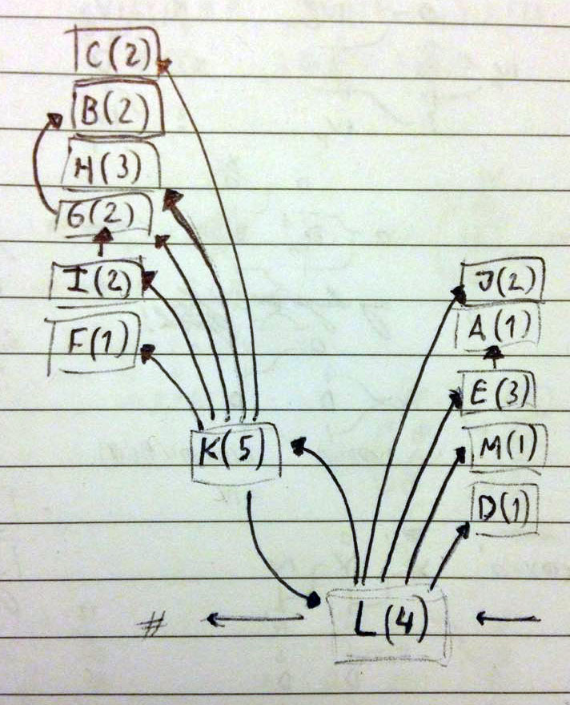
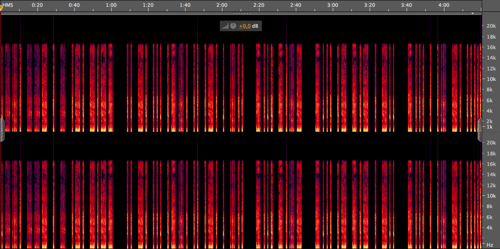

# 2018-10-05-Hackover-CTF #

[CTFTime link](https://ctftime.org/event/689) | [Website](https://ctf.hackover.de/)

---

## Challenges ##

### Crypto ###

 - [x] [269 secure-hash](#269-crypto--secure-hash)
 - [ ] 488 secure_hash v2
 - [ ] 500 oblivious transfer

### Reverse ###

 - [ ] 499 bwv2342
 - [ ] 500 Onepass - Single Secret Credential Store
 - [ ] [500 flagmaker](#500-reverse--flagmaker)

### Pwn ###

 - [ ] 430 military-crypto
 - [ ] 477 holy graal
 - [ ] 484 stbm
 - [ ] 488 slip2slash
 - [ ] 498 cloud-note

### Web ###

 - [x] [100 ez web](#100-web--ez-web)
 - [x] [100 i-love-heddha](#100-web--i-love-heddha)
 - [x] [416 who knows john dows?](#416-web--who-knows-john-dows)
 - [ ] 416 cyberware

### Forensics ###

 - [x] [100 I AM MANY](#100-forensics--i-am-many)
 - [x] [337 UnbreakMyStart](#337-forensics--unbreakmystart)

### Misc ###

 - [x] [100 Hummel Hummel - Fart Fart](#100-misc--hummel-hummel--fart-fart)
 
---

## 269 Crypto / secure-hash ##

**Description**

> We advise you to replace uses of `unordered_hash` with our new `SecureHashtable` class, since we added advanced crypto to make it 14.3 times more secure.
> 
> Update: the binary was compiled with g++ and libstdc++, 64bit
> 
> We're running a demo version, try it now:
> 
> `nc secure-hash.ctf.hackover.de 1337`

**Files provided**

 - [`secure_hash.cpp`](files/secure_hash.cpp)

**Solution**

The service provided lets us register and login using a supposedly secure [hash table](https://en.wikipedia.org/wiki/Hash_table) implementation, built atop a [`std::unordered_set`](http://www.cplusplus.com/reference/unordered_set/unordered_set/).

```cpp
if (choice == 1) {
  if (name == "root") {
    printf("You are not root!\n");
    continue;
  }
  table.insert_keyvalue(name, password);
} else if (choice == 2) {
  if (table.lookup_keyvalue(name, password)) {
    printf("Success! Logged in as %s\n", name.c_str());
    if (name == "root") {
      printf("You win, the flag is %s\n", flag.c_str());
      return 0;
    }
  } else {
    printf("Invalid credentials!\n");
  }
} else {
  printf("Invalid choice!\n");
}
```

Registration is achieved by inserting values with `table.insert_keyvalue`, and logging in by checking with `table.lookup_keyvalue`. We are not allowed to register a(nother) user with `name == "root"`, so if the program had no other vulnerabilities, we would only be able to log in as `root` if we already knew the flag, which is the password to the `root` account.

An important thing to note is that `lookup_keyvalue` does not return a boolean!

```cpp
enum auth_result {
  AUTH_FAILURE,
  AUTH_SUCCESS,
  AUTH_TIMEOUT,
};

auth_result lookup_keyvalue(const std::string& name, const std::string& password);
```

And since by default, `0` is assigned to the first value of an enum, `1` to the second, and so on, `AUTH_SUCCESS` and `AUTH_TIMEOUT` are both truthy results, and both will sucessfully let us log in. The timeout is not difficult to trigger either:

```cpp
size_t iterations = 0;
size_t MAX_ITERATIONS = 1000;

while (it != end) {
  if (*it++ == digest)
    return AUTH_SUCCESS;

  // Avoid DoS attacks by fixing upper time limit.
  if (iterations++ >= MAX_ITERATIONS)
    return AUTH_TIMEOUT;
}
```

Whenever the program has to look through more than `1000` values that all fall into the same bucket of the `std::unordered_set`, it will give up and let us log in. The bucket used is determined based on some SHA-512 digest:

```cpp
std::string digest = sha512sum(name, password);
size_t bucket = values.bucket(digest);
```

The `sha512sum` function itself uses OpenSSL to do the hashing, and [documentation for the `EVP_` functions can easily be found](https://linux.die.net/man/3/evp_digestupdate):

```cpp
std::string sha512sum(const std::string& name, const std::string& password) {
  EVP_MD_CTX *mdctx;
  const EVP_MD *md;
  unsigned char md_value[EVP_MAX_MD_SIZE];
  unsigned int md_len;

  mdctx = EVP_CREATE_FN();
  md = EVP_get_digestbyname("sha512");
  EVP_MD_CTX_init(mdctx);
  EVP_DigestInit_ex(mdctx, md, NULL);
  EVP_DigestUpdate(mdctx, name.c_str(), name.size());
  EVP_DigestUpdate(mdctx, password.c_str(), password.size());
  EVP_DigestFinal_ex(mdctx, md_value, &md_len);
  EVP_DESTROY_FN(mdctx);

  return std::string(reinterpret_cast<char*>(md_value), md_len);
}
```

In particular, notice that `name` and `password` are added to the digest one after another, and that the number of bytes added is determined using [`std::string::size`](http://www.cplusplus.com/reference/string/string/size/), which returns the number of actual bytes of the string, not including the null byte (assuming it is even used internally).

This means that with `name == "foo"` and `password == "bar"`, the digest gets updated with the three bytes `foo`, then the three bytes `bar`. Do you see the problem?

The same result can be achieved with e.g `name == "fo"` and `password = "obar"`, and so these two sets of credentials will result in the same digest and therefore the same bucket in the `std::unordered_set`.

Now we have everything needed to exploit the program. We start by adding 1000 users with `name == "ro"` and `password == "ot1"`, then simply attempt a login with `name == "root"` and `password == "1"` (the `1` was used because neither field could be empty). All of these credentials (duplicates are not checked, but simply inserted again and again) have the same digest and so they end up in the same bucket.

([Full exploit script here](scripts/secure_hash.sh))

`hackover18{00ps_y0u_mu5t_h4ve_h1t_a_v3ry_unlikely_5peci4l_c4s3}`

## 500 Reverse / flagmaker ##

**Description**

> Solving CTF challenges often involves a lot of work, which is very unfair to lazy competitors. To even things out, we designed a self-solving challenge: Just type `make flag` and make yourself a coffee while the solution is computed.

**Files provided**

 - [`Makefile`](files/flagmaker)

**Solution**

> Note: this is a post-CTF analysis, I did not quite manage to get to the flag during the competition.

When I first downloaded this, I started `make flag` in the background while looking at other challenges… As it turns out, even if `make` supported arbitrarily big integers (which it doesn't), it would take an insane amount of time to finish. I know my computer isn't the fastest and there were no solves for this challenge for hours, so clearly it wasn't going to be that easy!

My first analysis was just a cursory glance through the functions in the makefile.

```Makefile
r = [-48, 2, -48, -8, -59, -18, 1, -59, 3, -5, -26, -57, 53, 3, -43, -3, -41, -20, 1, -64, -65, -45, -71, -47, -16, -47, -38, -3, 46, -63, -54, 1, -49, 4, -51, -45, -61, -46, -13, -4, -65, -48, -55, -51, -38, -64, -50, -5, -65, 2, -54, -56, -1, -50, -28]

flag:
	@echo $(call l, $(o), $(n), $(p), $(q)) | sha256sum | python -c "import sys; print ''.join([chr(ord(c) - d) for c,d in zip(sys.stdin.read(),$(r))])" | tee $@
```

The result of a very complex macro call to `l` was hashed using SHA-256, then the hexadecimal digest was piped into a `python` one-liner, which used the first 55 digits and shifted them using the `r` array.

Here I discovered the first method of solving this challenge. The output of `python` was the flag, which had to be in the `hackover18{...}` format. The input to `python` were lowercase hexadecimal digits, and there are only so many of them. Based on this, some characters of the flag could be exactly pinpointed. I did not actually try this dictionary attack. Maybe I should have since apparently the first team to solve this used this method.

I was quite interested in how the script actually worked. The first step was to create a dependency graph of the functions:



This revealed that the complicated-looking mess of functions actually completely separated into two almost tree-like dependency graphs, and only `l` and `k` had a recursive dependency. With a graph like this it is easier to reason about what each function does and what its inputs might represent.

Before analysing functions properly, I noticed one thing – the `q` variable:

```Makefile
q = ++--+++++ ++-+-+--+ +++---++- ++++-+-++ --+-++-++ --+++++-- -++-+--+- -+++---++ -+--+++-+ -+-++-+++ +-+-++++- +-++++-+- +---++--- +--++-+--
```

`q` is passed to the `l` function as its last, 4th argument in the initial call. When `l` calls `k` to recurse, it gives `q` unmodified to `k` as its last, 5th argument. Likewise, when `k` calls `l` to recurse, it gives back `q` unmodified to `l` as its 4th argument. `q` is indeed a constant, and even though it is used within the functions in other places, the original value is passed back and forth. I renamed `q` to `program`, since at this point I was thinking the script is interpreting `program` as some sort of source code.

Let's first look at the functions referenced in `l`, which is also the initial function called by `make`. Throughout the analysis, we can refer to the GNU Makefile documentation on [text functions](https://www.gnu.org/software/make/manual/html_node/Text-Functions.html#Text-Functions) and [conditional functions](https://www.gnu.org/software/make/manual/html_node/Conditional-Functions.html#Conditional-Functions).

```Makefile
a=$(subst -,- ,$(subst +,+ ,$(1)))
d=$(if $(filter-out -,$(1)),,+)
e=$(call a,$(filter $(subst $(call a) ,,$(strip $(1))$(strip $(2)))%,$(3)))
j=$(word $(words $(1)), $(2))
m=$(word 1,$(1)) $(or $(word 2,$(1)),+) $(or $(word 3,$(1)),-)

# l($1 ?, $2 ?, $3 ?, $4 program)
l=$(if $(call d,$(call m,$(1))),$(words $(filter +,$(3))),$(call k,$(call e, $(call m,$(1)), $(call j,$(2),$(3)),$(4)),$(call m,$(1)),$(2),$(3),$(4)))
```

```Makefile
# a($1 str)
a=$(subst -,- ,$(subst +,+ ,$(1)))
```

`a` takes a string, and separates all `-` and `+` with spaces. E.g. `$(call a, --+-++) == - - + - + +`. Note that in `make`, spaces between the function name and the first argument are ignored, and so are spaces after an argument comma and the argument itself. Spaces at the end of arguments are preserved, however, which is why `a` is not actually a no-op.

Also, at this point it is pretty safe to say that there seems to be no way for `make` to produce strings containing anything other than `+`, `-`, or whitespace.

```Makefile
# e($1 prefix1, $2 prefix2, $3 program)
e=$(call a,$(filter $(subst $(call a) ,,$(strip $(1))$(strip $(2)))%,$(3)))
```

We know that the third argument for `e` is the `program`, since it is only invoked in `l` and it gives `e` its last argument, the `program` constant.

Here it is important to check how the `filter` function of `make` works in specific cases. `$(filter AB%, ABC AABC AB CAB) == ABC AB`. So `e` looks for an exact prefix (created from its first two arguments) in the `program` words, then takes that word and separates its `+` and `-` using `a`.

Note also the `subst` call, where `a` is called without any arguments (resulting in an empty string). But `$(call a) ,` (with a space afterwards) actually results in the string `" "` (space), so the `subst` call here removes all spaces in the prefix, so it can be properly found in `program`.

```Makefile
# d($1 str)
d=$(if $(filter-out -,$(1)),,+)
```

`d` checks if there are any characters other than `-` in its input. If yes, it returns the empty string, otherwise it returns `+`.

We can now extend our assumption about the `+` and `-` characters. Given that there are two kinds of symbols, it is natural to assume some sort of binary encoding. The `l` function itself (as we'll see further down) uses `d` to check if it should recurse or terminate. It will only terminate if `d` returns a non-empty string, i.e. `+`. This will only happen if the input to `d` is all `-`. Let's therefore understand `+` as a binary 1 and `-` as a binary 0.

`d` is then the stop condition checking if its input is equal to 0.

```Makefile
# j($1 pos, $2 data)
j=$(word $(words $(1)), $(2))
```

`j` returns a part of its second argument based on its first argument. `words` in `make` returns the number of words of its argument, `word` returns the n-th (one-indexed) word of its argument.

There are very few situations I can think of where referencing data based on the length of other data makes sense. With our `+` / `-` encoding, the only thing that makes sense is a unary encoding – the first argument is a "number" where `+ + +` represents `3`, `+ + + + + +` represents `6`, etc.

Then the second argument is some sort of array of bits ...?

```Makefile
# m($1 state)
m=$(word 1,$(1)) $(or $(word 2,$(1)),+) $(or $(word 3,$(1)),-)
```

`m` seems to take three bits from its input. If the second bit is not present, `+` is used. And if the third bit is not present `-` is used. The argument for `m` is the first argument given to `l`, which comes from the `o` variable:

```Makefile
o = +
```

Clearly `o` always has at least one bit. When given to `m`, it is changed to `++-`. So it seems that `m` ensures that the default value for its output is `++-`, unless the input has enough data.

```Makefile
# l($1 state, $2 pos, $3 data, $4 program)
l=$(if $(call d,$(call m,$(1))),
  $(words $(filter +,$(3))),
  $(call k,
    $(call e,
      $(call m,$(1)),
      $(call j,$(2),$(3)),
      $(4)
    ),
    $(call m,$(1)),
    $(2),
    $(3),
    $(4)
  )
)
```

Finally let's look at `l`. As explained in `d`, it stops recursing when its first argument becomes 0. When it stops, it returns the number of `+` symbols in `data`. Otherwise, it calls `k`.

Note that here we can see that the only possible way for this program to stop is when `d` evaluates to `+` and causes `l` to count `+` symbols in `data`. For a long time I was spending a lot of CPU resources to check a lot of integers, SHA-256 hashing them, and checking if their prefix is `8c3c4df743a` – which would then decode into `hackover18{`. Given how large the actual target number is, this was a very futile effort. But, hindsight's 20/20!

`$(call m,$(1))` appears multiple times, and we already know that it simply produces a default value if needed.

And finally, the `e` subcall resulting in the first argument of `k`. It takes the potentially defaulted `state`, appends a single symbol from `data` based on `pos`, and finds that prefix in the `program`.

Even without knowing `k` it might start to be more and more clear what this program is. It is a [Turing Machine](https://en.wikipedia.org/wiki/Turing_machine) simulator, with 3-bit (up to 8) states, 2 symbols, and `data` is its tape. Given how long it executes, we can also guess that it is a [Busy beaver](https://en.wikipedia.org/wiki/Busy_beaver), i.e. a Turing machine designed to run for as long as possible.

For the sake of completion, however, let's have a look at the functions referenced by `k`.

```Makefile
b=$(or $(if $(filter +,$(strip $(1))),$(2) +),$(if $(filter -,$(strip $(1))),$(wordlist 2,$(words $(2)),$(2))),$(if $(filter N,$(strip $(1))),$(2)))
c=$(if $(word 1,$(1)),$(if $(word $(words $(1)),$(2)),$(2),$(2) -),- $(2))
f=$(wordlist 7,$(words $(1)),$(1))
g=$(call b,$(word 6,$(1)), $(2))
h=$(wordlist 1,$(words $(wordlist 2,$(words $(2)),$(2))),$(3)) $(word 5,$(1)) $(wordlist $(words $(2) -),$(words $(3)),$(3))
i=$(or $(call g,$(1),$(2)),+)

# k($1 state spec, $2 state, $3 pos, $4 data, $5 program)
k=$(call l,$(call f, $(1)),$(call i, $(1), $(3)),$(call c,$(call g, $(1), $(3)),$(call h, $(1), $(3), $(4))),$(5))
```

```Makefile
# b($1 movement, $2 pos)
b=$(or
  $(if $(filter +,$(strip $(1))),$(2) +),
  $(if $(filter -,$(strip $(1))),$(wordlist 2,$(words $(2)),$(2))),
  $(if $(filter N,$(strip $(1))),$(2))
)
```

`b` takes an argument `movement` that will always be either `+` or `-` and the tape position (unary number). If `movement` is `+`, a `+` is appended to the position - increment by 1. If `movement` is `-`, the first word of the position is removed - decrement by 1. There is a check for `movement` `N`, but it seems to be a red herring, since this can never happen.

```Makefile
# c($1 pos, $2 data)
c=$(if $(word 1,$(1)),$(if $(word $(words $(1)),$(2)),$(2),$(2) -),- $(2))
```

`c` is a function to "normalise" the tape. Whenever `pos` becomes 0, it prepends a `-` to `data`, thereby extending it to the left (`pos` itself is then normalised in `i`). And whenever `pos` is larger than the length of `data`, a `+` is appended to `data`. Note that the latter comparison is done with `$(word $(words $(1)),$(2))`, which checks if the `pos`-th word exists in `data`. If neither happens, `data` is left intact and returned as-is.

```Makefile
# f($1 state spec)
f=$(wordlist 7,$(words $(1)),$(1))
```

`f` takes one of the (space-separated) words from `program` and returns its 7th through last words. We'll see soon the significance of this.

```Makefile
# g($1 state spec, $2 pos)
g=$(call b,$(word 6,$(1)), $(2))
```

`g` takes one of the (space-separated) words from `program` and updates the tape position `pos` based on its 6th word.

```Makefile
# h($1 state spec, $2 pos, $3 data)
h=$(wordlist 1,$(words $(wordlist 2,$(words $(2)),$(2))),$(3)) \
  $(word 5,$(1)) \
  $(wordlist $(words $(2) -),$(words $(3)),$(3))
```

`h` is the function that actually takes care of writing symbols to the tape. It takes `data` and returns it in three chunks - all the `data` words (symbols) from beginning to `pos - 1`, then the 5th word of one of the (space-separated) words from `program`, then all the `data` words (symbols) from `pos + 1` to the end. A Python equivalent would be `data[:pos] ++ [symbol] ++ data[pos + 1:]`.

```Makefile
# i($1 state spec, $2 pos)
i=$(or $(call g,$(1),$(2)),+)
```

`i` just wraps `g`, but if the output of `g` is empty (i.e. `pos == 0`), it returns `+` (i.e. `pos == 1`) instead. This is the other part of the position normalisation. If `pos` becomes zero, the tape is extended to the left (see `c` above), and `pos` is incremented to be one instead.

```Makefile
# k($1 state spec, $2 state, $3 pos, $4 data, $5 program)
k=$(call l,
	$(call f, $(1)),
	$(call i, $(1), $(3)),
	$(call c,
		$(call g, $(1), $(3)),
		$(call h, $(1), $(3), $(4))
	),
	$(5)
)
```

And finally `k`. This function always calls `l`, but it updates all of its arguments, except for the `program`, which never changes. Let's finally crack the `program` encoding, based on the functions we have just analysed. `program` contains 14 words, each of which is composed of 9 `+` / `-` symbols.

```
++--+++++
++-+-+--+
+++---++-
++++-+-++
--+-++-++
--+++++--
-++-+--+-
-+++---++
-+--+++-+
-+-++-+++
+-+-++++-
+-++++-+-
+---++---
+--++-+--
```

According to the various ways these symbols are used, we can split these words into columns:

```
++- - + + +++
++- + - + --+
+++ - - - ++-
+++ + - + -++
--+ - + + -++
--+ + + + +--
-++ - + - -+-
-++ + - - -++
-+- - + + +-+
-+- + + - +++
+-+ - + + ++-
+-+ + + + -+-
+-- - + + ---
+-- + + - +--
```

Note that the first column is always repated twice, with `-` then `+` in the second column. The last column contains only strings that can be found in the first column, with the exception of `---` (0, the halting state). The first column is 3 bits, hence it can express 8 different numbers, but only 7 states are present. Again, 0 is the halting state that is not described here.

Based on the analysis, we can describe these columns and use decimal representations for the 3-bit ones:

```
(bits) 123        4         5      6           789
  dec  cur state  cur tape  write  pos change  next state  dec
    6  ++-        -         +      +           +++         7
    6  ++-        +         -      +           --+         1
    7  +++        -         -      -           ++-         6
    7  +++        +         -      +           -++         3
    1  --+        -         +      +           -++         3
    1  --+        +         +      +           +--         4
    3  -++        -         +      -           -+-         2
    3  -++        +         -      -           -++         3
    2  -+-        -         +      +           +-+         5
    2  -+-        +         +      -           +++         7
    5  +-+        -         +      +           ++-         6
    5  +-+        +         +      +           -+-         2
    4  +--        -         +      +           ---         0
    4  +--        +         +      -           +--         4
```

Or in a more conventional notation, where the tuples represent (what to write, which way to move, which state to go to):

| State | Current symbol: 0 | Current symbol: 1 |
| --- | --- | --- |
| 6 | (1, →, 7) | (0, →, 1) |
| 7 | (0, ←, 6) | (0, →, 3) |
| 1 | (1, →, 3) | (1, →, 4) |
| 3 | (1, ←, 2) | (0, ←, 3) |
| 2 | (1, →, 5) | (1, ←, 7) |
| 5 | (1, →, 6) | (1, →, 2) |
| 4 | (1, →, 0) | (1, ←, 4) |

The Turing machine works in steps on the tape. At each step, it looks at the symbol at the current position on the tape. Based on the current symbol and its current state, it writes a symbol to the tape, then moves either left or right, and finally switches to another state (may be the same state).

The starting state is `++-` (6), thanks to the `m` function.

We can also see that the only way to get to state `0`, the halting state, is from state `4`. State `4` itself does not modify the tape except for changing a single symbol just before halting, so it is basically superfluous. So in fact, this seems to be a 6-state busy beaver.

Now that we know all about this Turing machine simulator, we have another problem: how to figure out its result. Busy beavers are *designed* to take as long as possible, and the record holder for a 6-state BB produces more than "3.514 x⋅10^{18267}" 1's on the tape. This obviously surpasses the memory capabilities of any computer.

The good news is that we do not need to simulate the machine directly, nor do we need to represent one symbol on the tape as one bit of real memory. Even though the busy beaver machines take unfathomable number of steps before halting, their behaviour is still modeled completely with a simple table, as seen above. So the patterns they produce on the tape are expansive, but not terribly complex. Instead of a billion ones, we can simply use a single symbol that say "repeat 1 a billion times", since the number itself, even if arbitrarily big, can still be represented in far less memory than the data.

This is where I was ~1 hour before the end of the CTF, in the process of writing a simulator for the BB machine. From what I have seen of its behaviour, my more efficient simulator would only need to compress long runs of ones and zeros, and long runs of the alternating `0 1 0 1 ...` pattern. Had I started earlier I might have finished the program, or perhaps had the much more practical realisation that "somebody must have done this".

As it turns out, there was a page on the Internet with an efficient BB simulator, though by chance it went offline shortly before the CTF. After the CTF ended, an admin pointed me to [an archived version of the site](http://web.archive.org/web/20160314012051/http://www.drb.insel.de/~heiner/BB/). This site contains [an awk script to run BB simulations](http://web.archive.org/web/20160305221928/http://www.drb.insel.de/~heiner/BB/bbsimtab.html#How), as well as [some record-holding BB machines](http://web.archive.org/web/20140717002127/http://www.drb.insel.de/~heiner/BB/bb-6list).

As mentioned above, the machine in this challenge has a superfluous state which simply adds 1 to the number of 1's on the tape. Taking the number of ones produced by one of the BB machines in the list (`Name = k`), adding 1 to it, and taking the SHA-256 sum of it:

    $ echo "2537699363594175843063 + 1" \
      | bc \
      | shasum -a 256 \
      | python -c "import sys; print ''.join([chr(ord(c) - d) for c,d in zip(sys.stdin.read(),[-48, 2, -48, -8, -59, -18, 1, -59, 3, -5, -26, -57, 53, 3, -43, -3, -41, -20, 1, -64, -65, -45, -71, -47, -16, -47, -38, -3, 46, -63, -54, 1, -49, 4, -51, -45, -61, -46, -13, -4, -65, -48, -55, -51, -38, -64, -50, -5, -65, 2, -54, -56, -1, -50, -28])])"

Very creative challenge, I wish I did not waste some of my hours!

`hackover18{n0_beavers_were_h4rmed_gener4ting_this_fl4g}`

## 100 Web / ez web ##

**Description**

> Easy web challenge in the slimmest possible design.... namely none.
> 
> http://ez-web.ctf.hackover.de:8080

**No files provided**

**Solution**

We are presented with a simple "under construction" text, accompanied by a GIF that doesn't exist.

```html
<!DOCTYPE html>
  <head>
    <title>Under Construction</title>
  </head>
  <body>
    <p></p>
  </body>
</html>
```

`/flag.txt` doesn't exist, but we can check [`robots.txt`](https://en.wikipedia.org/wiki/Robots_exclusion_standard):

```
User-agent: *
Disallow: /flag/
```

The `/flag/` directory contains `flag.txt`, but we are not allowed to see it:

```html
<!DOCTYPE html>
	<head>
		<title>Restricted Access</title>
	</head>
	<body>
		<p>You do not have permission to enter this Area. A mail has been sent to our Admins.<br/>You shall be arrested shortly.</p>
	</body>
</html>
```

But the server simply sent us a cookie `isAllowed=false`, so changing that to `true`, we can see the flag.

`hackover18{W3llD0n3,K1d.Th4tSh0tw4s1InAM1ll10n}`

## 100 Web / i-love-heddha ##

**Description**

> A continuation of the Ez-Web challenge. enjoy
> 
> 207.154.226.40:8080

**No files provided**

**Solution**

The initial webpage is identical to that of [`ez web`](#100-web--ez-web). `robots.txt` still disallows `/flag/` and the directory listing in `/flag/` only contains `flag.txt`. If we click the link from the directory listing, however, we get a 404 - the link actually points to `/flag/flga.txt`.

We can fix the link to `/flag/flag.txt`, and we get "Bad luck buddy". Once again we set our `isAllowed` cookie to `true`.

```html
You are using the wrong browser, 'Builder browser 1.0.1' is required
```

After this [`User-Agent`](https://developer.mozilla.org/en-US/docs/Web/HTTP/Headers/User-Agent) check, we get a [`Referer`](https://developer.mozilla.org/en-US/docs/Web/HTTP/Headers/Referer) check and finally we get a [Base64](https://en.wikipedia.org/wiki/Base64) string.

    $ curl --silent \
      -b "isAllowed=true" \
      -A "Builder browser 1.0.1" \
      -H "Referer: hackover.18" \
      "http://207.154.226.40:8080/flag/flag.txt" | base64 -D

`hackover18{4ngryW3bS3rv3rS4ysN0}`

## 416 Web / who knows john dows? ##

**Description**

> Howdy mate! Just login and hand out the flag, aye! You can find on [h18johndoe](https://github.com/h18johndoe/user_repository/blob/master/user_repo.rb) has all you need!
> 
> `http://yo-know-john-dow.ctf.hackover.de:4567/login`
> 
> alternative: `46.101.157.142:4567/login`

**No files provided**

**Solution**

We get a simple login screen, but no way to register:


First we need a username. `h18johndoe` from the description doesn't work. Well, we can have a look at the link from the description, which seems to show the source code for back end of this website:

```ruby
class UserRepo

  def initialize(database)
    @database = database
    @users = database[:users]
  end

  def login(identification, password)
    hashed_input_password = hash(password)
    query = "select id, phone, email from users where email = '#{identification}' and password_digest = '#{hashed_input_password}' limit 1"
    puts "SQL executing: '#{query}'"
    @database[query].first if user_exists?(identification)
  end

  def user_exists?(identification)
    !get_user_by_identification(identification).nil?
  end

  private

  def get_user_by_identification(identification)
    @users.where(phone: identification).or(email: identification).first
  end

  def hash(password)
    password.reverse
  end

end
```

The `login` method has a clear SQL injection, since the password "hashing" just reverses the input we give it, without any sanitising. Before `login` is called however, we need to pass the `user_exists?` check, which seems to use prepared statements. So we still need an existing e-mail.

The file above has commits from two users, `h18johndoe` and `john1234`. GitHub doesn't seem to show e-mail addresses of users, but if we clone the repo and check the commit log, we can see the e-mails:

```
$ git log
commit b26aed283d56c65845b02957a11d90bc091ac35a
Author: John Doe <angelo_muh@yahoo.org>
Date:   Tue Oct 2 23:55:57 2018 +0200

    Add login method

commit 5383fb4179f1aec972c5f2cc956a0fee07af353a
Author: John Doe <jamez@hemail.com>
Date:   Tue Oct 2 23:04:13 2018 +0200

    Add methods

commit 2d3e1dc0c5712efd9a0c7a13d2f0a8faaf51153c
Author: John Doe <john_doe@gmail.com>
Date:   Tue Oct 2 23:02:26 2018 +0200

    Add dependency injection for database

commit 3ec70acbf846037458c93e8d0cb79a6daac98515
Author: John Doe <john_doe@notes.h18>
Date:   Tue Oct 2 23:01:30 2018 +0200

    Add user repo class and file
```

And the last one (earliest commit chronologically) is actually the correct e-mail address: `john_doe@notes.h18`. After entering this e-mail we get asked for the password, and this is where we can do the SQL injection, since we don't know the user's password.

We only need to login, so we can do an extremely simple injection:

    input:   'or''=='
    reverse: '==''ro'
    full query after injection and re-reverse:
      select id, phone, email from users where email = 'john_doe@notes.h18'
      and password_digest = ''or '' == '' limit 1

`hackover18{I_KN0W_H4W_70_STALK_2018}`

## 100 Forensics / I AM MANY ##

**No description**

**Files provided**

 - [`hackover.png`](files/i-am-many.png)

**Solution**

We can open the PNG and check for LSB-hidden text, partial transparency, etc, but it seems innocent enough.


Looking through the file in a Hex Editor, we can see the individual chunks making up the file. There is a `sBIT` chunk, but it seems to have no effect, since it specifies 8 significant bits for each channel anyway, i.e. no different from what the data holds.

Thinking about the title, we can notice *many* `IDAT` chunks, although this is quite normal, since it allows PNGs to be loaded and decoded progressively. The first unusual thing I noticed was that the sizes of the `IDAT` chunks were weird - the first one was 4590 bytes, the next couple 8192 bytes. Usually if a file is encoded with a regular PNG encoder, the chunks all have the same size except for the last one. Then I realised why - all the chunks except for the first actually belonged to a different PNG file.

    $ xxd hackover.png | tail -n +289 | head -n 5
    0001200: 9cc4 60a6 a929 171a af7c 7f3c 073c 073c  ..`..)...|.<.<.<
    0001210: 073c 073c 073c 073c 073c 073c 074a 0507  .<.<.<.<.<.<.J..
    0001220: fe07 f64e 9dc0 9c82 68bd 0000 0000 4945  ...N....h.....IE
    0001230: 4e44 ae42 6082 8950 4e47 0d0a 1a0a 0000  ND.B`..PNG......
    0001240: 000d 4948 4452 0000 0320 0000 004c 0806  ..IHDR... ...L..

So extracting everything from offset `4662` onwards into a separate file:

    $ dd if=hackover.png of=flag.png bs=1 skip=4662

We get the flag:


`hackover18{different_Fl4g_for_3arly_ch33tahz}`

## 337 Forensics / UnbreakMyStart ##

**Description**

> https://www.youtube.com/watch?v=p2Rch6WvPJE

**Files provided**

 - [`unbreak_my_start.tar.xz`](files/unbreak_my_start.tar.xz)

**Solution**

    $ xxd unbreak_my_start.tar.xz
    0000000: 504b 0304 1400 0800 0800 04e6 d6b4 4602  PK............F.
    0000010: 0021 0116 0000 0074 2fe5 a3e0 07ff 007d  .!.....t/......}
    0000020: 5d00 331b 0847 5472 2320 a8d7 45d4 9ae8  ].3..GTr# ..E...
    0000030: 3a57 139f 493f c634 8905 8c4f 0bc6 3b67  :W..I?.4...O..;g
    0000040: 7028 1a35 f195 abb0 2e26 666d 8c92 da43  p(.5.....&fm...C
    0000050: 11e1 10ac 4496 e2ed 36cf 9c99 afe6 5a8e  ....D...6.....Z.
    0000060: 311e cb99 f4be 6dca 943c 4410 8873 428a  1.....m..<D..sB.
    0000070: 7c17 f47a d17d 7808 b7e4 22b8 ec19 9275  |..z.}x..."....u
    0000080: 5073 0c34 5f9e 14ac 1986 d378 7b79 9f87  Ps.4_......x{y..
    0000090: 0623 7369 4372 19da 6e33 0217 7f8d 0000  .#siCr..n3......
    00000a0: 0000 001c 0f1d febd b436 8c00 0199 0180  .........6......
    00000b0: 1000 00ad af23 35b1 c467 fb02 0000 0000  .....#5..g......
    00000c0: 0459 5a                                  .YZ

We can see in the hexdump that the file ends in `YZ`, the normal footer for `xz` archives, but the header is `PK`, as seen in `zip` archives. Since the challenge says to unbreak its start, we can only assume that this should be a valid `xz` file, so the beginning is wrong.

First of all, we should find a specification for the format. Luckily, `xz` is [well documented](https://tukaani.org/xz/xz-file-format-1.0.4.txt). The relevant sections are the `2.1.1. Stream Header` and `2.1.2. Stream Footer`.

The header should be:

 - Magic bytes - `0xFD, "7xXZ", 0x00`
 - Stream flags - should be identical to the flags in the footer, i.e. `0x00 0x04`
 - [CRC32](https://en.wikipedia.org/wiki/Cyclic_redundancy_check) - calculated from the Stream flags only, `0xE6 0xD6 0xB4 0x46`

To calculate the CRC32 in the terminal (then change endianness of result):

    $ (printf "obase=16;ibase=10;"; printf "\x00\x04" | cksum -o 3 | cut -d " " -f 1) | bc
    46B4D6E6

As it turns out, the correct CRC32 is already in the file, at offset `0x0B`. Let's try to replace the first 11 bytes of the file with our constructed header:

    $ dd if=unbreak_my_start.tar.xz of=trimmed.bin bs=1 skip=11
    184+0 records in
    184+0 records out
    184 bytes transferred in 0.000920 secs (199988 bytes/sec)
    $ (printf "\xFD7zXZ\x00\x00\x04"; cat trimmed.bin) > fixed.tar.xz
    $ xz -d fixed.tar.xz
    $ tar zxvf fixed.tar
    x flag.txt

`hackover18{U_f0und_th3_B3st_V3rs10n}`

## 100 Misc / Hummel Hummel - Fart Fart ##

**Description**

> There is no "hackover18{*}" in the word. the solution has to be inserted as hackover18{mysolution}.
> 
> Format: all lowercase, words split by space, no numbers

**Files provided**

 - [`challenge.mp4`](files/hummel.mp4)

**Solution**

We get an ... interesting video with a farting unicorn. First of all we can convert it to sound only, since the video is actually irrelevant:

    $ ffmpeg -i hummel.mp4 hummel.mp3

Then we can open it e.g. in Soundbooth:



The noises seem too well timed and systematic. In fact, it is easy to see that there are clearly short ones and long ones, and there are longer pauses every now and then. So it is [Morse code](https://en.wikipedia.org/wiki/Morse_code)!

Transcribing the noises, we get:

    .--. --- . - .-. -.-- / .. -. ... .--. .. .-. . -.. / -... -.-- / -... .- -.- . -.. / -... . .- -. .....

Which translates to:

    poetry inspired by baked bean5

This didn't get accepted, but after messaging the admin the last `5` should have been an `s`, so we got our flag.

`hackover18{poetry inspired by baked beans}`
