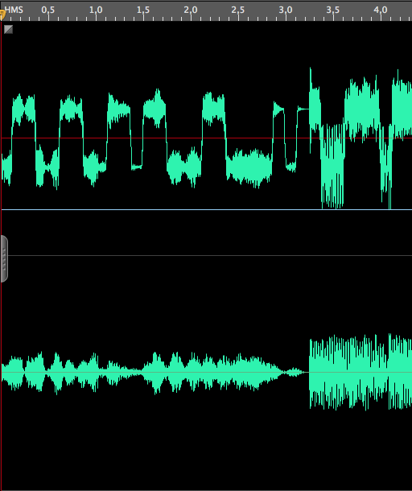
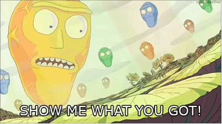
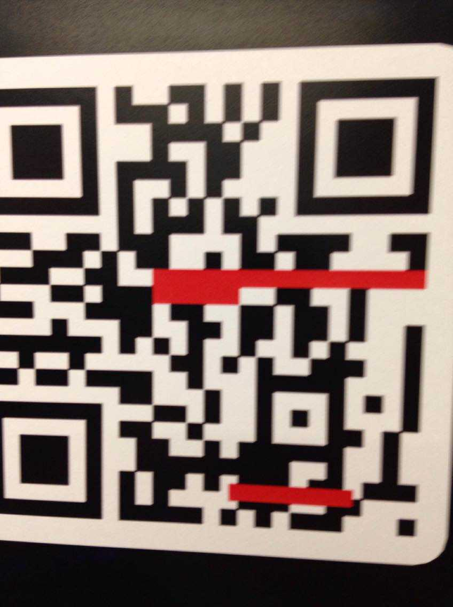
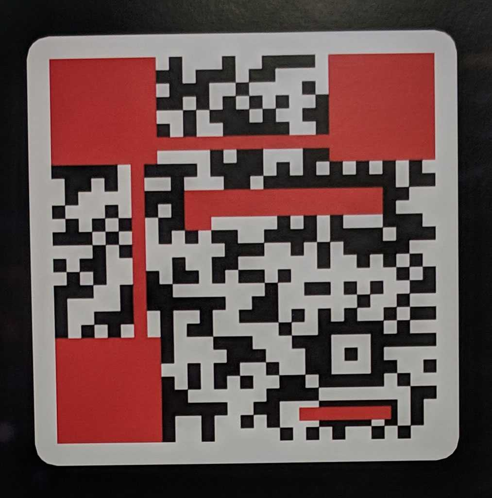
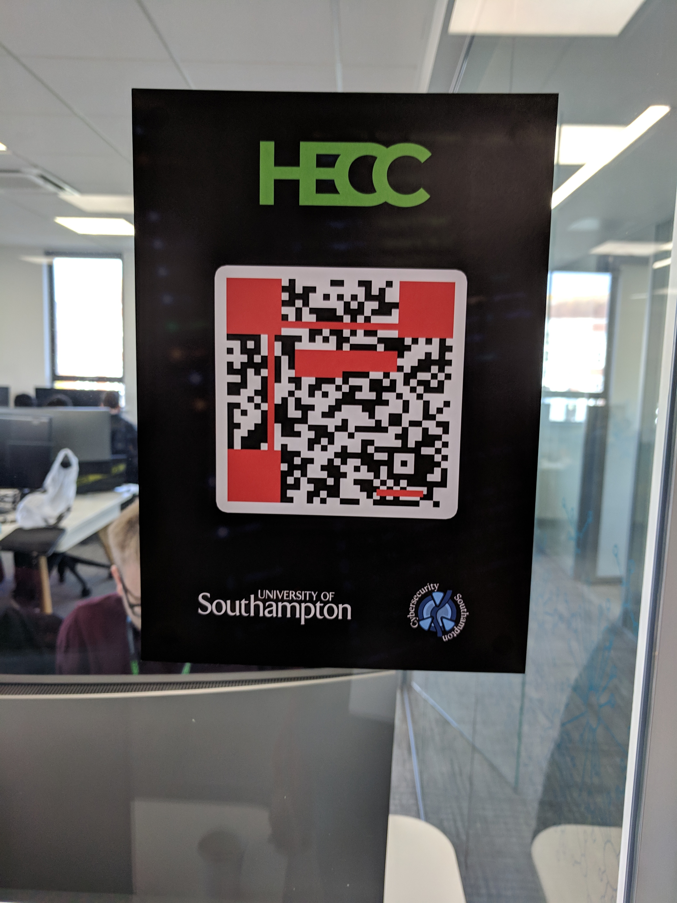

# 2019-03-09-HECCTF #

[Website](https://hecc.io)

## Challenges  ##

### Crypto ###

 - [x] [500 s3cr3t c0d3z](500-crypto--s3cr3t-c0d3z)
 - [ ] [800 Flag Generator 5000](800-crypto--flag-generator-5000)
 - [x] [2500 I LOVE BASS!!!](2500-crypto--i-love-bass)
 - [x] [2000 Send^Receive](2000-crypto--sendreceive)
 - [x] [3000 Seeded Sequence](3000-crypto--seeded-sequence)

### Exploit ###

 - [ ] [2700 Vulnerable](2700-exploit--vulnerable)
 - [x] [4300 Imjur](4300-exploit--imjur) (partially solved)

### Forensics ###

 - [ ] [4800 SD Card](4800-forensics--sd-card) (partially solved)
 - [ ] [1200 Can you hear me?](1200-forensics--can-you-hear-me)
 - [ ] [6000 Data Leak](6000-forensics--data-leak)

### Miscellaneous ###

 - [x] [1000 Hacking the air](1000-miscellaneous--hacking-the-air)
 - [x] [1500 Language Matters (Palo Alto)](1500-miscellaneous--language-matters-palo-alto)
 - [x] [2200 PreCTF](2200-miscellaneous--prectf)
 - [ ] [4800 Kiosk](4800-miscellaneous--kiosk)

### Networking ###

 - [x] [400 Digging for Gold](400-networking--digging-for-gold)
 - [x] [800 Free Token](800-networking--free-token)
 - [x] [800 Say please](800-networking--say-please)
 - [x] [800 TAG! You're it!](800-networking--tag-youre-it)
 - [x] [800 All of the lights!](800-networking--all-of-the-lights)
 - [ ] [2500 Pick up the phone!](2500-networking---pick-up-the-phone)
 - [ ] [1500 Miner](1500-networking--miner)
 - [ ] [3000 Flappy Boot](3000-networking--flappy-boot)
 - [ ] [5400 SecurEmessage 9000](5400-networking--securemessage-9000)

### Physical ###

 - [x] [3000 NFC](3000-physical--nfc)
 - [x] [5300 Broken Codes](5300-physical--broken-codes)

### Programming ###

 - [x] [1000 Hulk Smash!!](1000-programming--hulk-smash)
 - [x] [2500 Recursive (Palo Alto)](2500-programming--recursive-palo-alto)

### Reverse-Engineering ###

 - [x] [1800 Defuse the Bomb!](1800-reverse-engineering--defuse-the-bomb)
 - [ ] [3000 SharpCrypt](3000-reverse-engineering--sharpcrypt)
 - [x] [2500 Something's Missing](2500-reverse-engineering--somethings-missing)
 - [x] [2000 Treasure Island](2000-reverse-engineering--treasure-island)
 - [ ] [3500 Overflowing](3500-reverse-engineering--overflowing)
 - [ ] [6000 WinDoge](6000-reverse-engineering--windoge)

### Web ###

 - [ ] [500 Subdomain](500-web--subdomain)
 - [x] [2500 Internet.zip](2500-web--internetzip)
 - [ ] [12000 The Donald](12000-web--the-donald) (partially solved)

---

## 500 Crypto / s3cr3t c0d3z ##

**Description**
 
> Here's sum cOd3z, can u crak them?
> 
> `ZmxhZ3t3b3dfc3VjaF9jaGFsbGVuZ2VfbWFueV9oYXJken0K`
> 
> `fhpuNEbggraPunyyratr`
> 
> Difficulty: Super Easy

**Solution**

The first cipher is [Base-64](https://en.wikipedia.org/wiki/Base64):

```bash
$ base64 -D <<<"ZmxhZ3t3b3dfc3VjaF9jaGFsbGVuZ2VfbWFueV9oYXJken0K"
flag{wow_such_challenge_many_hardz}
```

The second cipher is [Rot13](http://rot13.org/):

```bash
$ tr a-zA-Z n-za-mN-ZA-M <<<"fhpuNEbggraPunyyratr"
suchARottenChallenge
```

## 800 Crypto / Flag Generator 5000 ##

**Description**

> Flag Generator 5000
> 
> https://content.hecc.io/FlagGen5000/Flag%20Generator%205000
> 
> Difficulty: Easy

**Files provided**

- [Flag Generator 5000](files/FlagGenerator5000)

**Solution**

N/A

## 2500 Crypto / I LOVE BASS!!! ##

**Description**

> I LOVE BASS!!!
> 
> Wubwubwubwubwubwub
> 
> https://content.hecc.io/ILOVEBASS/bassline.wav
> 
> Difficulty: Medium

**Files provided**
- [bassline.wav](files/bassline.wav)

**Solution**

We can open the file in any sound editor and see that the left channel seems to oscillate up and down strangely:



In fact, ignoring the oscillations representing the actual song, there are only two positions for the left channel. Up and down, or 1 and 0. It is a binary encoding and we can easily tell roughly what the length of one bit is.

The technique for both encryption and decryption is described [here](https://blog.benjojo.co.uk/post/encoding-data-into-dubstep-drops).

In fact, the default parameters used in the blog post suffice to decode the flag:

`flag{fd3dc9-e4e7-375bda7}`

## 2000 Crypto / Send^Receive ##

**Description**

> Send^Receive
> 
> There's something on this box that's replying with some weird data...
> 
> `send-receive.hecc.io`
> 
> Difficulty: Medium

**Solution**

The server sends back as many bytes as we give it. Given the challenge description (`Send^Receive`, i.e. `Send XOR Receive`), we can see that it XOR's its output stream with our input stream. This means we can simply send it a lot of zero bytes to get the original output (since `x XOR 0 = x` for any `x`).

## 3000 Crypto / Seeded Sequence ##

**Description**

> Seeded Sequence
> 
> This program will give you a flag if it sees 'fig' in binary in its output. Can you figure out what you need to give it?
> 
> `seeded-sequence.hecc.io:8124`
> 
> Difficulty: Hard

**Solution**

(TODO)

## 2700 Exploit / Vulnerable ##

**Description**

> `vulnerable.hecc.io`
> 
> Difficulty: Medium

**Solution**

N/A

## 4300 Exploit / Imjur ##

**Description**

> Imjur
> 
> There's a cool new website under construction at http://imjur.hecc.io and I don't think it's very secure.
> 
> Difficulty: Hard

**Solution**

(TODO)

## 4800 Forensics / SD Card ##

**Description**

> Ah shit, I deleted some of the files off my SD card. Can you recover them? Just don't look too closely at them...
> 
> https://content.heccio/Forensics/PHOTOS.img
> 
> Alternate: https://content.heccio/Forensics/PHOTOS.001
> 
> Difficulty: Medium

**Files provided**

- [PHOTOS.img](files/PHOTOS.img.zip)

**Solution**

(TODO)

## 1200 Forensics / Can you hear me? ##

**Description**

> Hello? Can you hear me?
> 
> https://content.hecc.io/Can-you-hear-me/canyouhear_me.wav
> 
> https://content.hecc.io/Can-you-hear-me/flags.zip
> 
> Difficulty: Hard

**Files provided**

 - [flags.zip](files/flags.zip)
 - [canyouhear_me.wav](files/)

**Solution**

(TODO)

## 6000 Forensics / Data Leak ##

**Description**

> One of our boxes is leaking out extremely sensitive flag data from multiple places, can you find out the contents of the leaks?
> 
> `dataleak.hecc.io`
> 
> Username: user Password: password
> 
> Difficulty: Super Hard

**Solution**

N/A

## 1000 Miscellaneous / Hacking the air ##

**Description**

> The wifi HECC ME looks like it could be cracked quite easily.
> 
> Flag is the password!
> 
> Difficulty: Easy

**Solution**

(TODO)

## 1500 Miscellaneous / Language Matters (Palo Alto) ##

**Description**

> `https://content.hecc.io/Language-Matters/challenge.doc`
> 
> Difficulty: Easy

**Files provided**

- [challenge.doc](files/challenge.doc)

**Solution**

Opening the file in Word doesn't reveal much except for:



If we scroll further down, there is some 1pt white text hidden in the document as well:

```
-----BEGIN CERTIFICATE-----
elVNCn5Ya15eb11EbllHb3BCWVFWeHFxdVRbXhARFQ==
-----END CERTIFICATE-----
```

Word also immediately asks whether macros should be enabled. Well of course, what could go wrong!

And that triggers an error, but also conveniently reveals the macro source code. A couple of the functions in the code are just to trigger another function called `a` upon opening the file:

```vba
Sub Workbook_Open()
    a
End Sub

Sub AutoOpen()
    a
End Sub
```

There is also a `Base64Decode` function which is interesting but it really does what its name would suggest, so there is not much need to look into it.

Then there is a `Blah` function:

```vba
Function Blah(ByVal sData As String, ByVal sKey As String) As String
    Dim l As Long, i As Long, byIn() As Byte, byOut() As Byte, byKey() As Byte
    byIn = sData
    byOut = sData
    byKey = sKey
    l = LBound(byKey)
    For i = LBound(byIn) To UBound(byIn) - 1 Step 2
        byOut(i) = (byIn(i) Xor byKey(l))
        l = l + 2
        If l > UBound(byKey) Then l = LBound(byKey)
    Next i
    XorC = byOut
End Function
```

It takes some `data` and a `key`, both strings. The `key` is repeated over the length of the input `data`, and the output is just `data` XOR'd with the `key`. This is a simple XOR decryption function. The `l = l + 2` line suggests that the key characters are not used in the same order as they are given to the function, but this is misleading – Windows systems store strings using a wide character encoding, i.e. each character is 2 bytes. Assuming the `key` and `data` are not high Unicode characters, only XOR'ing the first byte of each wide character suffices for decryption. Additionally, the last line would suggest the function was originally called `XorC`, then renamed to `Blah`.

Finally, the actual `a` function, which is called upon opening the document:

```vba
Sub a()
    Dim s As String
    x2 = Application.LanguageSettings.LanguageID(msoLanguageIDUI)
    Set fso = CreateObject("Scripting.FileSystemObject")
    s = ActiveDocument.Content.Text
    x = "-----BEGIN CERTIFICATE-----"
    y = "-----END CERTIFICATE-----"
    Z = InStr(s, x)
    If Z > 0 Then
        s = Mid(s, Z + Len(x))
        s = Mid(s, 1, InStr(s, y) - 1)
        s = Replace(s, "-", vbNullString)
        s = Replace(s, vbCr, vbNullString)
        s = Replace(s, vbLf, vbNullString)
        
        b1 = Base64Decode(s)
        b2 = Blah(b1, x2)
        
        If InStr(1, b2, "Key:") = 1 Then
            MsgBox b2
        End If
    End If
End Sub
```

The `LanguageID` call ([`LanguageSettings.LanguageID`](https://docs.microsoft.com/en-us/office/vba/api/office.languagesettings.languageid)) returns the language code identifier (LCID) of the user interface. The title of the challenge is "language matters", so we can assume this is an unknown..

Most of the lines in the function then deal with getting the text content of the document, finding the hidden "certificate" bit, then extracting only the line between the two guards. This data (`elVNCn5Ya15eb11EbllHb3BCWVFWeHFxdVRbXhARFQ==`) is then Base-64 decoded, XOR decoded using the LCID obtained earlier. If the beginning of the result is `"Key:"`, a message box is displayed.

At this point we can simply assume the LCID is 4 characters long (since the function checks only 4 bytes for successful decryption). Due to the symmetry of the XOR cipher, we simply XOR the first 4 bytes of the ciphertext with the known plaintext to obtain the key:

```bash
$ echo "elVNCn5Ya15eb11EbllHb3BCWVFWeHFxdVRbXhARFQ==" | base64 -D | xxd
0000000: 7a55 4d0a 7e58 6b5e 5e6f 5d44 6e59 476f  zUM.~Xk^^o]DnYGo
0000010: 7042 5951 5678 7171 7554 5b5e 1011 15    pBYQVxqquT[^...
```

```python
>>> "".join([ chr(ord(x) ^ y) for x, y in zip("Key:", [0x7a, 0x55, 0x4d, 0x0a]) ])
'1040'
```

So the required LCID was `1040` ([corresponding to `0x410`, Italian](https://docs.microsoft.com/en-us/openspecs/windows_protocols/ms-lcid/70feba9f-294e-491e-b6eb-56532684c37f) probably).

With this we can also decrypt the whole flag:

```python
>>> "".join([ chr(ord(x) ^ y) for x, y in zip("10401040104010401040104010401040", base64.b64decode("elVNCn5Ya15eb11EbllHb3BCWVFWeHFxdVRbXhARFQ==")) ])
'Key:Oh_no_it_is_ArmagHEADdon!!!'
```

`Oh_no_it_is_ArmagHEADdon!!!`

## 2200 Miscellaneous / PreCTF ##

**Description**

> (This file was sent to the participants two weeks before the actual CTF, allowing us to solve it in our free time, then submit the flags during the CTF for points.)

**Files provided**

 - [prectf.pcap](files/prectf.pcap)

**Solution**

(TODO)

## 4800 Miscellaneous / Kiosk ##

**Description**

> You've encountered a wild kiosk in the real world! Perhaps there's something else on it's local network...
> 
> To do this challenge you will need VMWare Remote Console installed.
> 
> Please then proceed to `https://kiosk.hecc.io/` for further instructions.
>  
> Difficulty: Super Hard

**Solution**

N/A

## 400 Networking / Digging for Gold ##

**Description**

> Can you find anything interesting in the DNS of `hecc.io`
> 
> Difficulty : Super Easy

**Solution**

(TODO)

## 800 Networking / Free Token ##

**Description**

> You were given a flag when you joined the network.
> 
> Difficulty: Easy

**Solution**

(TODO)

## 800 Networking / Say please ##

**Description**

> Sometimes our DNS server breaks. Good thing we have `ns69.hecc.io` as a backup!
> 
> Difficulty : Easy

**Solution**

(TODO)

## 800 Networking / TAG! You're it! ##

**Description**

> Difficulty: Easy

**Solution**

(TODO)

## 800 Networking / All of the lights! ##

**Description**

> If you listen carefully, you can hear the sounds of lights turning on and off.
> 
> Difficulty: Medium

**Solution**

(TODO)

## 2500 Networking /  Pick up the phone! ##

**Description**

> Ring ring, Is that you on the phone? Why is nobody answering my calls :'(
> 
> Difficulty: Medium

**Solution**

N/A

## 1500 Networking / Miner ##

**Description**

> Our mining box is seeing even higher CPU usage than normal, and it's taken over all the ports... Can you find out what's going on?
> 
> `miner.hecc.io`
> 
> Difficulty: Medium

**Solution**

N/A

## 3000 Networking / Flappy Boot ##

**Description**

> We used to use this box a lot for booting our machines, but something seems to have gone rather wrong with it.
> 
> `flappy-boot.hecc.io`
> 
> Difficulty: Hard

**Solution**

N/A

## 5400 Networking / SecurEmessage 9000 ##

**Description**

> Hi Derek,
> 
> I recently finished writing a super secure new voicemail system. This system uses secure claim codes which let you hear messages just once before they are deleted.
> 
> Just dial `901` from any office phone, and enter your claim code to hear your secret message. I left one for you to test it out - claim it with `99*97*116*32*109*49`.
>  
> It's really been designed with security at heart, there's no way anyone can read any messages that aren't for them, let alone other files on the system! I hope we can push this to production ASAP.
>  
> Dave
> 
> Hint: You'll need to connect to the SIP Server at:
> 
> host:`asterisk.hecc.io`
> user: `1234`
> password: `supersecret`
> Difficulty: Super Hard

**Solution**

N/A

## 3000 Physical / NFC ##

**Description**

> What are those small tags on everyone's name badges? Could they hold a secret code?
> 
> Difficulty: Hard

**No files provided**

**Solution**

Each participant at the event was given a lanyard with a nametag. The back side of the tag had a small NFC chip. The contents of the NFC tags varied across nametags, but each university seemed to have the same variants. The context were printable text (although not really readable). Each variant started with a number.

In total, there were 6 versions, obtained by tag trading:

```
1 [!+[]+!+[]+!+[]]+[+[]]+[!+[]+!+[]+!+[]+!+[]+!+[]+!+[]]+[!+[]+!+[]+!+[]+!+[]+!+[]+!+[]+!+[]+!+[]]+[!+
2 []+!+[]]+(!![]+[])[!+[]+!+[]+!+[]]+[!+[]+!+[]+!+[]+!+[]+!+[]+!+[]]+[!+[]+!+[]+!+[]+!+[]+!+[]+!+[]+!+
3 []+!+[]]+[!+[]+!+[]+!+[]+!+[]+!+[]+!+[]]+[!+[]+!+[]+!+[]+!+[]+!+[]]+[!+[]+!+[]+!+[]+!+[]+!+[]+!+[]]+
4 [!+[]+!+[]+!+[]]+[!+[]+!+[]+!+[]+!+[]+!+[]+!+[]]+[!+[]+!+[]+!+[]]+[!+[]+!+[]]+(!![]+[])[!+[]+!+[]+!+
5 []]+[!+[]+!+[]+!+[]+!+[]+!+[]+!+[]]+[!+[]+!+[]+!+[]+!+[]+!+[]+!+[]+!+[]+!+[]+!+[]]+[!+[]+!+[]+!+[]+!
6 +[]+!+[]+!+[]]+(![]+[])[+[]]
```

Removing the numbers and concatenating the code:

```javascript
[!+[]+!+[]+!+[]]+[+[]]+[!+[]+!+[]+!+[]+!+[]+!+[]+!+[]]+[!+[]+!+[]+!+[]+!+[]+!+[]+!+[]+!+[]+!+[]]+[!+[]+!+[]]+(!![]+[])[!+[]+!+[]+!+[]]+[!+[]+!+[]+!+[]+!+[]+!+[]+!+[]]+[!+[]+!+[]+!+[]+!+[]+!+[]+!+[]+!+[]+!+[]]+[!+[]+!+[]+!+[]+!+[]+!+[]+!+[]]+[!+[]+!+[]+!+[]+!+[]+!+[]]+[!+[]+!+[]+!+[]+!+[]+!+[]+!+[]]+[!+[]+!+[]+!+[]]+[!+[]+!+[]+!+[]+!+[]+!+[]+!+[]]+[!+[]+!+[]+!+[]]+[!+[]+!+[]]+(!![]+[])[!+[]+!+[]+!+[]]+[!+[]+!+[]+!+[]+!+[]+!+[]+!+[]]+[!+[]+!+[]+!+[]+!+[]+!+[]+!+[]+!+[]+!+[]+!+[]]+[!+[]+!+[]+!+[]+!+[]+!+[]+!+[]]+(![]+[])[+[]]
```

This is actually obfuscated Javascript, obfuscated by a technique similar to [JSFuck](http://www.jsfuck.com/). The code can be executed as-is to produce the next part, but to understand it better, here it is reformatted a little bit:

```javascript
  [!+[]+!+[]+!+[]]
+ [+[]]
+ [!+[]+!+[]+!+[]+!+[]+!+[]+!+[]]
+ [!+[]+!+[]+!+[]+!+[]+!+[]+!+[]+!+[]+!+[]]
+ [!+[]+!+[]]
+ (!![]+[])[!+[]+!+[]+!+[]]
+ [!+[]+!+[]+!+[]+!+[]+!+[]+!+[]]
+ [!+[]+!+[]+!+[]+!+[]+!+[]+!+[]+!+[]+!+[]]
+ [!+[]+!+[]+!+[]+!+[]+!+[]+!+[]]
+ [!+[]+!+[]+!+[]+!+[]+!+[]]
+ [!+[]+!+[]+!+[]+!+[]+!+[]+!+[]]
+ [!+[]+!+[]+!+[]]
+ [!+[]+!+[]+!+[]+!+[]+!+[]+!+[]]
+ [!+[]+!+[]+!+[]]
+ [!+[]+!+[]]
+ (!![]+[])[!+[]+!+[]+!+[]]
+ [!+[]+!+[]+!+[]+!+[]+!+[]+!+[]]
+ [!+[]+!+[]+!+[]+!+[]+!+[]+!+[]+!+[]+!+[]+!+[]]
+ [!+[]+!+[]+!+[]+!+[]+!+[]+!+[]]
+ (![]+[])[+[]]
```

The code is a sequence of string concatenations (`+` operators in the first column above). The majority of the component strings are simply numbers. These are formed using the `[!+[]+!+[]...]` sequences (or just `[+[]]` for `0`):

```javascript
[+[]] => [ 0 ]
[!+[]+!+[]+!+[]] => [ 3 ]
```

(Stringification of one-element arrays simply stringifies the contained element.)

There are also a couple of letters, taken from the strings `'true'` and `'false'`, obtained with:

```javascript
(!![]+[]) => 'true'
(![]+[]) => 'false'
```

So the entire code evaluates to:

`30682e686563632e696f`

This is in hexadecimal, decoded it reads:

`0h.hecc.io`

After navigating to the website, we were presented with a dancing crab video and a set of GPS coordinates, which turned out to be very close to the venue. After arriving at the location, another NFC tag was found with the content:

```
Well done! Hope you've enjoyed meeting new people!

flag{but-wait-this-is-in-the-real-world!}
```

## 5300 Physical / Broken Codes ##

**Description**

> You may have seen some broken QR codes around the place, can you fix them?
> 
> Difficulty: Hard

**No files provided**

**Solution**

Three partially-censored QR codes could be seen around the venue.



The first scanned successfully without modifications.





The other two had to be clean in Photoshop:


## 1000 Programming / Hulk Smash!! ##

**Description**

> Hulk SMASH? ANGRY, PASSWORD WRONG
> 
> `hulk-smash.hecc.io`
> 
> Difficulty: Easy

**Solution**

Connecting to the server, we can see that sending it almost anything results in it replying with `INCORRECT` and disconnecting:

```bash
$ nc Hulk-Smash.hecc.io 8124
foobar
INCORRECT
```

We can quickly do a manual check to see what happens when we send the server each character of the alphabet. For `a` through `e`, it replies with `INCORRECT` as expected, but when we send it `f` (and a newline), it doesn't reply at all. It only says `INCORRECT` once we send another character.

So from this it seems quite clear the server-side script accepts characters one-by-one, then closes the connection only when the last accepted character does not fit. This means we can "brute force" out the correct password, one character at a time, i.e. roughly 31 guesses per character on average (`26` lowercase letters, `26` uppercase letters, `10` digits, `1` underscore, average guess takes half the total number of characters if uniformly distributed).

```bash
#!/bin/bash

flag="flag{"
while [[ true ]]; do
    found=0
    for char in _ {0..9} {a..z} {A..Z}; do
        check="$flag$char"
        echo "$check?"
        (printf "$check"; sleep 0.5) | nc Hulk-Smash.hecc.io 8124 | grep "INCORRECT" >/dev/null
        if [[ "$?" -eq 1 ]]; then
            found=1
            flag="$check"
            echo "$flag"
            break
        fi
    done
    if [[ "$found" -eq 0 ]]; then
        echo "over?"
        break
    fi
done
```

## 2500 Programming / Recursive (Palo Alto) ##

**Description**

> Recursive [PALO ALTO]
> 
> Wow, that's a lot of encryption
> 
> https://content.hecc.io/Recursive/challenge.py
> 
> Difficulty: Easy

**Files provided**

- [challenge.py] - (TODO- add file)

**Solution**

**Files provided**

 - [recursive.py](files/recursive.py)

**Note:** the file is unfortunately incomplete. It is missing a basic XOR encryption function, called `gasfewfesafds`.

**Solution**

The script is fairly simple, except for a very long string in the middle:

```python
c0sns5mkcgvoebss = lambda c, e, f: c.decrypt(gasfewfesafds(bqetl6jxsj.b64decode(e), f))
uylbditv = s6khpxxhxp.new("w6jxaeu7vnqozxnilyebatlimsaaiwq2")
c8p6a1=c0sns5mkcgvoebss(uylbditv, "[REALLY LONG STRING HERE]", "mgvpqxkz")
exec(c8p6a1)
```

The sequence of commands creates a new AES-256 decryption object, then gives it a Base-64-encoded + XOR-encrypted ciphertext. The result of the decryption is then executed using `exec`. As it turns out, simply replacing `exec` with `print` reveals that the encrypted script is basically the same as the original one, though it has different (garbage) variable names, and naturally the hidden string is slightly shorter.

With the title of the challenge and the general layout of the challenge it is easy to guess that the script we are actually looking for is nested in many layers of identical encryption.

We can write a script to match on the structure of the script as a string using regular expressions and perform the same decryption as long as possible:

```python
import re
from Crypto.Cipher import AES
import base64

def xor(message, key):
    return bytes([ message[i] ^ ord(key[i % len(key)]) for i in range(len(message)) ])

ereg = re.compile(r"""[^ ]+ = lambda c, e, f: c\.decrypt\(gasfewfesafds\(bqetl6jxsj\.b64decode\(e\), f\)\)
[^ ]+ = s6khpxxhxp\.new\("([^"]+)"\)
[^=]+=[^\(]+\([^,]+, "([^"]+)", "([^"]+)"\)
exec\([^\)]+\)
		""")

result = ereg.match(open("recursive.py", "r").read())
while result:
    print(result)

    aesKey = result.group(1)
    b64Data = result.group(2)
    xorKey = result.group(3)

    aesInput = xor(base64.b64decode(b64Data), xorKey)
    aesDec = AES.new(bytes(aesKey, "utf-8"), AES.MODE_ECB).decrypt(aesInput)
    result = ereg.match(aesDec.decode("utf-8"))
```

And the final script is:

```python
exec("""if 1==2: print "Key: wubba_lubba_dub_dub "\nelse: print "You fell into a pit and died... of dysentery."
""")
```

Another, simpler solution (not used during the CTF) would be to replace `exec` with a function which prints its input and then executes it.

`wubba_lubba_dub_dub`

## 1800 Reverse-Engineering / Defuse the Bomb! ##

**Description**

> Defuse the Bomb!
> 
> IT"S GOING TO GO OFF!!
> 
> https://content/hecc.io/Defuse
> 
> Difficulty: Medium

**Files provided**


**Solution**

(TODO)

## 3000 Reverse-Engineering / SharpCrypt ##

**Description**

> SharpCrypt
> 
> Jon gave me a copy of his new software for encrypting files, it's missing some functionality though.
> 
> https://content.hecc.io/SharpCrypt/
> 
> Difficulty: Medium

**Files provided**

 - [SharpCrypt.exe](files/SharpCrypt.exe)

**Solution**

N/A

## 2500 Reverse-Engineering / Something's Missing ##

**Description**

> I can't quite place my finger on it, but something seems to be missing in the bash session on
> `somethings-missing.hecc.io`
> 
> Username: `user`
> 
> Password: `password`
> 
> Difficulty: Medium

**Solution**

Upon connecting to the server, we can `ls` our file, but see a strange gap in the listing:

```bash
> ls
cat.jpg

someotherfile
> 
```

Looking around the server more, we can see what shell is given to us on login in `/etc/passwd`. The "shell" turns out to be a simple wrapper for a regular shell, but it seems to be missing a line if we simply `cat` it.

We can easily read parts of the shell script with `head` and `tail`. It turns out the shell script filters out any lines containing the string `flag`.

With this knowledge we can tell that the misssing file in `ls` contains the word `flag`. We can use `cat *fla*` to read the file, but since it contains a flag in the format `flag{...}`, it will be filtered out. So, we use the `tail` trick again: `tail -c +4 *fla*`

`flag{a9cd2896-4820-403b-b882-6c1d56698336}`

## 2000 Reverse-Engineering / Treasure Island ##

**Description**

> YARRRRR!
> 
> https://content.hecc.io/Treasure-Island/
> 
> _NOTE: Binaries have the same function. Windows version is not fully tested._
> 
> Difficulty: Medium

**Solution**

(TODO)

## 3500 Reverse-Engineering / Overflowing ##

**Description**

> This box is practically _overflowing_
> 
> `user@sh3llcod3.hecc.io`
> 
> Ypu might find [this](https://content.hecc.io/Overflowing/) (https://content.hecc.io/Overflowing/) useful.
> 
> The executable running was compiled... insecurely... It's also 32 Bit
> 
> Difficulty: Hard

**Files provided**

 - `Overflowing`

**Solution**

N/A

## 6000 Reverse-Engineering / WinDoge ##

**Description**

> Our mad professor Denis has put together a spooky windows challenge. Can you figure out how to do it? We can't.
> 
> A copy of the executable can be found here (without the flag):
> 
> https://content.hecc.io/WinDoge/victim2/exe
> 
> Try running your code against: `user@windoge.hecc.io`
> 
> `password: password`
> 
> Difficulty: Super Hard

**Files provided**

 - WinDoge.exe

**Solution**

N/A

## 500 Web / Subdomain ##

**Description**

> We have a server in the `hecc.io` domain for storing memes. It has it's very own SSL certificate. Can you find it's FQDN? [FQDN is the flag]
> 
> Difficulty: Super Easy

**Files provided**


**Solution**

(TODO)

## 2500 Web / Internet.zip ##

**Description**

> Wait, you saved the _ENTIRE_ internet?!
> 
> https://interent-zip.hecc.io/download.php
> 
> Difficulty: Medium

**Solution**

If we connect to the server, it starts sending us an actual file with `200000000000000` bytes (around `181 TiB`). The download speed is fast over Ethernet, but not fast enough, not to mention we don't carry around `200 TiB` drives in our laptops!

The data itself appears random and the actual HTTP response does contain `Content-Type: application/random`.

But since it is a modern Apache 2 server, we can nicely ask it for only a small part of the data using a [range request](https://developer.mozilla.org/en-US/docs/Web/HTTP/Range_requests). Since there is only garbage at the beginning of the file, we can try to find out what is at the end.

```
$ printf "GET / HTTP/1.1\r\nHost: Internet-zip.hecc.io\r\nConnection: close\r\nRange: bytes=199999999999000-200000000000000\r\n\r\n" | nc Internet-zip.hecc.io 80 > out.bin
```

And indeed, we see:

```
HTTP/1.1 206 Partial Content
Date: Sat, 09 Mar 2019 15:18:09 GMT
Server: Apache/2.4.29 (Ubuntu)
Content-disposition: attachment; filename=image.bin
Accept-Ranges: bytes
GAME: kek
Content-Range: bytes 199999999999000-200000000000000/200000000000000
Content-Length: 1000
Connection: close
Content-Type: application/random
(some garbage data)
flag{I_think_I_need_a_bigger_hdd}
```

`flag{I_think_I_need_a_bigger_hdd}`

## 12000 Web / The Donald ##

**Description**

> "Make America great again!"
> 
> I'm sure there's lots of ways to achieve that but I think starting here might be a good idea...
> 
> http://the-donald.hecc.io
> 
> Difficulty: Super Hard.

**Solution**

(TODO)
