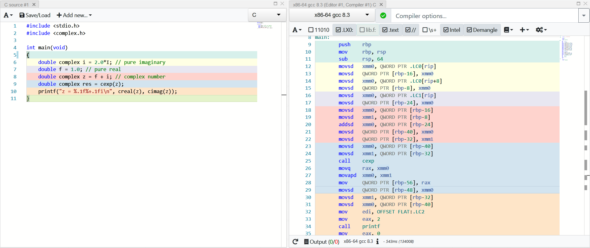

# 2019-03-39-VolgaCTF-Quals #

[CTFTime link](https://ctftime.org/event/713) | [Website](https://q.2019.volgactf.ru)

---

## Challenges ##

### Crypto ###

 - [x] [100 Shadow Cat](#100-crypto--shadow-cat)
 - [ ] 100 LG
 - [ ] 150 Shifter
 - [x] [200 Blind](#200-crypto--blind)
 - [ ] 500 Beard Party

### Anti-Fake ###

 - [x] [75 Fakegram star](#75-anti-fake--fakegram-star)
 - [ ] 50 Horrible retelling

### Stego ###

 - [x] [100 Higher](#100-stego--Higher)
 - [x] [150 JOI](#150-stego--joi)

### Reverse ###

 - [x] [100 PyTFM](#100-reverse--pytfm)
 - [x] [250 TrustVM](#250-reverse--trustvm)
 - [x] [250 JAC II](#250-reverse--jac-ii)
 - [ ] 300 Online games

### PWN ###

 - [x] [100 warm](#100-pwn--warm)

### Web ###

 - [ ] 100 Shop
 - [ ] 200 Blog
 - [ ] 300 Gallery
 - [ ] 100 Shop V.2
 - [ ] 150 HeadHunter

### Anti-Joy ###

 - [ ] 1 Schrödinger's task

---

## 100 Crypto / Shadow Cat

**Description**

> Shadow Cat
> 
> We only know that one used /etc/shadow file to encrypt important message for us.


**Files provided**

 - [shadow.txt](files/shadow.txt) 
 - [encrypted.txt](files/encrypted.txt)

**Solution**

(TODO)


## 200 Crypto / Blind ##

**Description**

> Blind
> Pull the flag...if you can.
>
> `nc blind.q.2019.volgactf.ru 7070`


**Files provided**

 - [server.py](files/server.py)

**Solution**

Looking through the source code, there is a RSA class, with a sign and verify functions. They provide us with the n and e. The first idea was to factor n but we can see that n is quite large (617 digits) so this was a no go.


When connecting to the server, it asks for a signature and the command to execute. It does some sanitization, splits the message into signature and command and check which command to use and execute the relevant piece of the main function based on the code. 

Looking through the main function, the valid commands it takes are `ls`, `dir`, `cat`, `cd`, `leave` and `exit`. `ls` and `dir` did not have a signature check. We could use this find out where the flag is.

Running 
```bash
$ nc blind.q.2019.volgactf.ru 7070

Enter your command:
xx ls -al

drwxrwxr-x 2 root root 4096 Mar 29 18:34 .
drwxrwxr-x 3 root root 4096 Mar 29 18:35 ..
-r--r--r-- 1 root root   36 Mar 29 18:34 flag
-r--r--r-- 1 root root  620 Mar 29 18:34 private_key.py
-r-xr-xr-x 1 root root 4613 Mar 29 18:31 server.py
```

Inputting the command `xx ls -al` prints out the files in the current directory. We see that the flag file is present in the current directory. So all we need to do is cat the flag.

Initially, I tried to run `xx ls; cat flag` as we didn't need a signature check for ls. The command is sanitized using `shelex.split()` which catches semi colons and other characters and treats them as one command. So there wasn't an easy way to run two commands. So we need to sign the cat command and use it to print the flag.

Luckily we can use the `sign` command given to us. 

```bash
$ nc blind.q.2019.volgactf.ru 7070

Enter your command:
xx sign
Enter your command to sign:

```
We pass in the command we want to sign (base64 encoded) and the main function, takes decodes and splits the command using the space deliminator using the `shlex.split()`. It checks that the first word of the command passed is not `cat` or `cd`. If it is then it prints out "Invalid command". Otherwise it returns the signature of the command passed. 

In order to get around this, if we escape the space character, the `shlex.split()` function does not split on the space.

Base64 encoding `cat\ flag` gives us `Y2F0XCBmbGFn`.
Inputting this in, by passes the check as it now ignores the space between the `cat` and `flag` and returns the signature.

We can now, pass in the valid signature and the `cat flag` command and that gives us the flag.

```bash
$ nc blind.q.2019.volgactf.ru 7070

Enter your command:
xx sign
Enter your command to sign:
Y2F0XCBmbGFn
24276592954466402792157532919706447334355948690098023035375614012157378412616233865544533025515869836447793226406373271083160180523082800598281266834619631704245143244545577613294590334637358684061108293899492468337030535564036215463887905645938530571058038030943037016298964167966109577883005551522062164917343818964991120441652232394288629520079832539360872798332983684006902802429243645009242747601354050053448137191986860769673762567997572657102990869994555786984110522299362261357652756180804304984027320764350120137457095771345729635881422070403269427999652221843885023772233721400195669139542781850847904777323
Enter your command:
24276592954466402792157532919706447334355948690098023035375614012157378412616233865544533025515869836447793226406373271083160180523082800598281266834619631704245143244545577613294590334637358684061108293899492468337030535564036215463887905645938530571058038030943037016298964167966109577883005551522062164917343818964991120441652232394288629520079832539360872798332983684006902802429243645009242747601354050053448137191986860769673762567997572657102990869994555786984110522299362261357652756180804304984027320764350120137457095771345729635881422070403269427999652221843885023772233721400195669139542781850847904777323 cat flag
VolgaCTF{B1ind_y0ur_tru3_int3nti0n5}
```

`VolgaCTF{B1ind_y0ur_tru3_int3nti0n5}`


## 75 Anti-fake / Fakegram star ##

**Description**

> Fakegram star
> 
> Fake news has become a real problem for countries all over the world. To be successful in this task you have to find original sources and to be attentive to detail. When media steal news part of information might be lost.
>
> [Link](https://www.instagram.com/volgactftask/?utm_source=ig_profile_share&igshid=1wcnc8ve1nwzf)
>
> UPD Fixed bug with the flag

**Solution**
(TODO)


## 100 Stego / Higher ##

**Description**

> Higher
> 
> Take higher

**Files provided**

 - [recorded.mp3](files/recorded.mp3)

**Solution**

(TODO)


## 150 Stego / JOI ##

**Description**

> JOI
> 
> All we have is just one image


**Files provided**

 - [result.png](files/result.png)

**Solution**

(TODO)


## 100 Reverse / PyTFM


**Description**

> PyTFM
> 
> Can the PyTFM transformation be inverted?


**Files provided**

 - [pytfm.so](files/pytfm.so)
 - [transformer.py](files/transformer.py)
 - [flag.enc](files/flag.enc)

**Solution**

The library has implemented a Python module, and function `transform` is implemented there. By inspecting the global data structure with some reasonable guess, we find that function `0x1290` is the `transform` function. More information can be found [here](https://docs.python.org/3/c-api/module.html). By looking at documentation, we can know `_PyArg_ParseTuple_SizeT(a2, "y#:transform", &input_1, &size)` parses the input to `const char* input_1` and length of input to `__int64 size`.

> `:`
>
> The list of format units ends here; the string after the colon is used as the function name in error messages (the “associated value” of the exception that [`PyArg_ParseTuple()`](https://docs.python.org/3/c-api/arg.html#c.PyArg_ParseTuple) raises).
>
> `y#` (read-only [bytes-like object](https://docs.python.org/3/glossary.html#term-bytes-like-object)) [const char *, int]
>
> This variant on `s#` doesn’t accept Unicode objects, only bytes-like objects.
>
> https://docs.python.org/3/c-api/arg.html

Then there is a weird operation against the size of input, I cannot understand it, but by dynamic execution, we know it is rounding the size up to the power of 2, then multiply by `0x10`.

```python
#testing script
import pytfm
for i in range(0, 0x40):
	reslen = len(pytfm.transform(b'A' * i))
	print (hex(i),hex(reslen))
```

Then the input is converted into complex number, with imaginary part being `0`

```c
if ( size_ > 0 )
{
  do
  {
    i_2 = i_;
    c = input[i_];
    v16 = &buf[i_2];
    v16->img = 0.0;
    v17 = (double)c;
    i_ = ++i;
    v16->real = v17 + 0.0;
  }
  while ( size_ > i );
}
```

Then the complex number array is copied to stack

```c
v18 = alloca(16LL * size_up + 16);
if ( size_up > 0 )
{
  v19 = 0LL;
  do
  {
    v25[v19].real = buf[v19].real;
    v25[v19].img = buf[v19].img;
    ++v19;
  }
  while ( v6 + 1LL != v19 );                // copy it to stack
}
```

Then `critical` function at `0x1150` is called, which is actually FFT as my teammate said

```c
void __fastcall critical(struc_1 *heap, struc_1 *stack, int size_up, signed int a4)
{
  signed int step; // er14
  signed int v5; // er13
  signed int size_up_0x1f; // ebx
  signed int i; // er15
  double real; // xmm0_8
  double img; // xmm1_8
  struc_1 *v10; // rdx
  double v11; // xmm3_8
  struc_1 *v12; // rax
  struc_1 *v13; // rax
  double v14; // xmm2_8
  double lf_size_up; // [rsp+0h] [rbp-40h]

  if ( a4 < size_up )
  {
    step = 2 * a4;
    v5 = a4;
    size_up_0x1f = size_up;
    critical(stack, heap, size_up, 2 * a4);
    critical(&stack[v5], &heap[v5], size_up_0x1f, step);// recursion by interleaving
    if ( size_up_0x1f > 0 )
    {
      i = 0;
      lf_size_up = (double)size_up_0x1f;
      do
      {
        real = -0.0 * (double)i / lf_size_up;
        img = (double)i * -3.141592653589793 / lf_size_up;
        cexp(real, img);                        // result in real and img
        mul(real, img, stack[v5 + i].real, stack[v5 + i].img);// result in real and img
        v10 = &stack[i];
        v11 = v10->real + real;
        v12 = &heap[i / 2];
        v12->img = v10->img + img;
        v12->real = v11;
        LODWORD(v12) = size_up_0x1f + i;
        i += step;
        v13 = &heap[(signed int)v12 / 2];
        v14 = v10->real - real;
        v13->img = v10->img - img;
        v13->real = v14;
      }
      while ( size_up_0x1f > i );
    }
  }
}
```

One thing to note is the structure and calling convention of complex number, as shown below:

```assembly
00000000 complex         struc
00000000 real            dq ?
00000008 img             dq ?
00000010 complex         ends
```



When calling a function with a complex number argument, it is essentially same as 2 `double` arguments with real part to be the first one and imaginary part to be second. In this example, real part is passed by `xmm0` and imaginary part is passed by `xmm1`. As for the complex number as return value, `xmm0` is real part and `xmm1` is imaginary part. However, it seems that IDA does not support complex number type, but this does not affect so much if we just comment it `:)`.

Finally we obtain the encoded flag in `flag.enc` and use this [website](http://scistatcalc.blogspot.com/2013/12/fft-calculator.html) to decode it, then converting `double` to `char` we get flag.

```python
from struct import *
res = [0x40a79a0000000000, 0x0000000000000000,
0x40225454778eaa78, 0x4060e41af7dfa91f,
0x40528c7c3687fe77, 0xc055ab3079234238,
0x4029ab5ae64c78dc, 0xc0358bea56cf49fc,
0x4053088b7cd8a280, 0xc03ef641c0327176,
0xc05652748400125a, 0xc049e15c7ebfc13d,
0xc053a0bb88ab3d1c, 0xc05d6dbde71fef04,
0x4054f7a9ff2df488, 0xc011cbe2c8c8e844,
0x4051000000000000, 0x4058400000000000,
0x40608a465c4bdc57, 0xc046e12f55eca3f4,
0xc059cd87fdd9d0b4, 0x4063f18329563fb2,
0xc03f770e300281b2, 0x4055d87bcc34a406,
0xc024445be6c513fc, 0xc04e7b20e01938bc,
0xc053602accefa9c8, 0x40496cfd5240a014,
0xc0403c716005e14e, 0x401a593c0a92c2e0,
0xc05ffbc9c690b51a, 0x406f6255d24a9654,
0xc054400000000000, 0x0000000000000000,
0xc05ffbc9c690b513, 0xc06f6255d24a9657,
0xc0403c716005e14c, 0xc01a593c0a92c2e0,
0xc053602accefa9c4, 0xc0496cfd5240a014,
0xc024445be6c51400, 0x404e7b20e01938bb,
0xc03f770e300281a7, 0xc055d87bcc34a404,
0xc059cd87fdd9d0b2, 0xc063f18329563fb2,
0x40608a465c4bdc56, 0x4046e12f55eca3fc,
0x4051000000000000, 0xc058400000000000,
0x4054f7a9ff2df486, 0x4011cbe2c8c8e854,
0xc053a0bb88ab3d1c, 0x405d6dbde71fef04,
0xc05652748400125c, 0x4049e15c7ebfc13c,
0x4053088b7cd8a280, 0x403ef641c0327178,
0x4029ab5ae64c78dc, 0x40358bea56cf49f9,
0x40528c7c3687fe75, 0x4055ab307923423a,
0x40225454778eaab0, 0xc060e41af7dfa91e]

print "real: "
for i in xrange(0,len(res),2):
	print repr(unpack('d', pack('Q', res[i]))[0])

print "imaginary: "
for i in xrange(1,len(res),2):
	print repr(unpack('d', pack('Q', res[i]))[0])

flag = [86,111,108,103,97,67,84,70,123,70,70,84,95,49,115,95,97,99,116,117,64,108,108,121,95,115,49,109,112,108,51,125]

print "".join(map(chr, flag))
```


## 250 Reverse / TrustVM

**Description**

> TrustVM
> 
> Files:

**Files provided**

 - [data.enc](files/data.enc)
 - [encrypt](files/encrypt)
 - [reverse](files/reverse)

**Solution**

A virtual machine with 512-bit register is implemented (I initially regarded it as memory but it's basically same), where register `14` is the pointer to our input flag and `15` is size of our input, rounded up to `0x40`. Here is the [disassembler](files/disasm.py) and here is the [result](files/trustvm.txt).

This challenge is not so hard but time-consuming, so I will not detail it here. A thing to note is that IDA cannot analyze this switch statement very well, so you may want to manually patch the switch table to direct address instead of offset to `rip`, patch some other instructions, patch the `jmp` instruction to `jmp ds:switch_tab[rax*8]`, and use `Edit->Others->Specify switch idiom` to set correct number of entries.

## 250 Reverse / JAC II

**Description**

> JAC II
> 
> Whenever this binary is executed it transforms the input somehow - fancy that! We've tried this with our flag and now the only file with the flag is gone 😃
>
> Can this transformation be reversed?..


**Files provided**

 - [jac2](files/jac2)
 - [data.jac2](files/data.jac2)

**Solution**

There are some anti-debug techniques applied in `0x401794`, which is called in initialization function before main. There are also other initialization stuff but they are not important, the only important function is `0x401246`. There are some `jz/jnz` alignment obfuscation, we can just manually patch them.

The function is actually super easy:

```c
for ( i = 0; i < v20; ++i )
  critical(input[2 * i], input[2 * i + 1], &input[2 * i], &input[2 * i + 1], (uint32_t *)buf);
//---------------------------------
void __fastcall critical(unsigned int a1, unsigned int a2, unsigned int *a3, unsigned int *a4, uint32_t *dkey)
{
  uint32_t *dkey_; // [rsp+0h] [rbp-30h]
  unsigned int *o2; // [rsp+8h] [rbp-28h]
  unsigned int *o1; // [rsp+10h] [rbp-20h]
  uint32_t tmp2; // [rsp+18h] [rbp-18h]
  uint32_t tmp1; // [rsp+1Ch] [rbp-14h]
  signed int i; // [rsp+28h] [rbp-8h]

  o1 = a3;
  o2 = a4;
  dkey_ = dkey;
  tmp1 = *dkey + a1;
  tmp2 = dkey[1] + a2;
  for ( i = 1; i <= 12; ++i )
  {
    tmp1 = rol(tmp2 ^ tmp1, tmp2 & 0x1F) + dkey_[2 * i];
    tmp2 = rol(tmp1 ^ tmp2, tmp1 & 0x1F) + dkey_[2 * i + 1LL];
  }
  *o1 = tmp1;
  *o2 = tmp2;
}
```

What we need to do is simply dump value of `dkey` without reversing or knowing how it is generated (which should be in `0x4013EF`), and use that for decryption.

```c
#include <stdint.h>
#include <stdio.h>
uint32_t dkeys[] = {0x6291bda5, 0xd40cbbbb, 0xcdb9f3e5, 0xedbd5140,
0x2a716584, 0x42a476de, 0x79c7cea9, 0x48852b0e,
0x2a53b9c8, 0x2984790b, 0xdaaed337, 0x0245815e,
0x014020ae, 0x3a84aaa9, 0x84b1fd24, 0x2766105f,
0x1b765e10, 0xb691adc9, 0xeb50c850, 0x264c358b,
0x32213a84, 0x387a7378, 0x1d7a8a61, 0x883de7f1,
0x2c3bae3b, 0x6de14ba2, 0x00000000, 0x00000000};

uint32_t res[] = {0x35dd19e3,0xb9fc9270,0x82dde506,0x8ea4d5d5
,0x7fd893e2,0xa5610f08,0xaa97bd08,0x3416bcb2
,0x569495ff,0x0feb15a3,0xb36d8705,0x64388fc4};

uint32_t __attribute__ ((noinline)) ror(uint32_t a1, char a2)
{
	asm("mov ecx,esi\n"
		"mov eax,edi\n"
		"ror eax,cl\n");
}

void decrypt_2dwords(uint32_t a1, uint32_t a2, uint32_t *a3, uint32_t *a4, uint32_t *dkey)
{
	uint32_t tmp1 = a1;
	uint32_t tmp2 = a2;
	for (int i = 12; i >= 1; --i)
	{
		tmp2 -= dkey[2 * i + 1];
		tmp2 = ror(tmp2, tmp1 & 0x1f) ^ tmp1;
		tmp1 -= dkey[2 * i];
		tmp1 = ror(tmp1, tmp2 & 0x1f) ^ tmp2;
	}
	tmp1 -= dkey[0];
	tmp2 -= dkey[1];
	*a3 = tmp1;
	*a4 = tmp2;
}

int main(int argc, char const *argv[])
{
	for (int i = 0; i < sizeof(res) / (sizeof(uint32_t) * 2); ++i)
	{
		decrypt_2dwords(res[2 * i], res[2 * i + 1], &res[2 * i], &res[2 * i + 1], dkeys);
	}
	printf("%s\n", (char*)res);
	return 0;
}
```


## 100 pwn / warm ##

> warm
> 
> How fast can you sove it? `nc warm.q.2019.volgactf.ru 443`

**Files provided**

 - [warm](files/warm)

**Solution**

(TODO)
