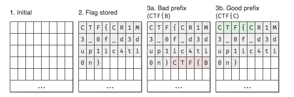
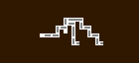
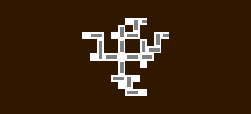
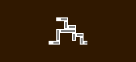
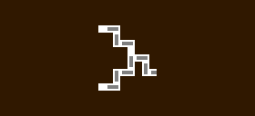
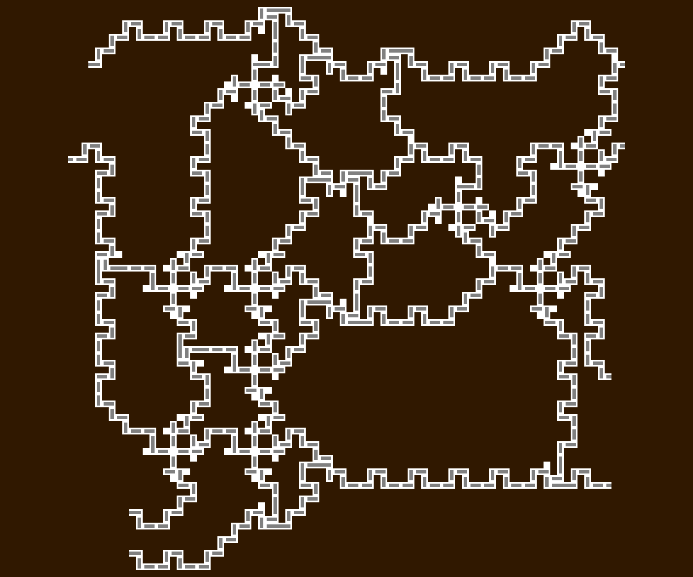
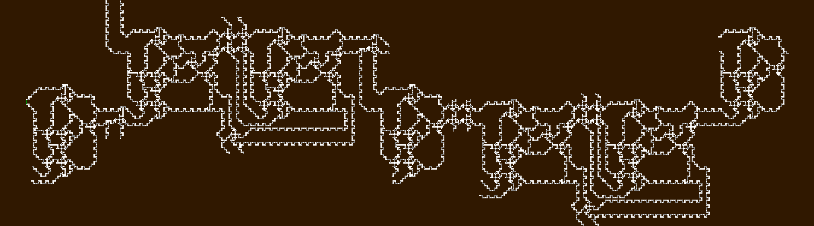
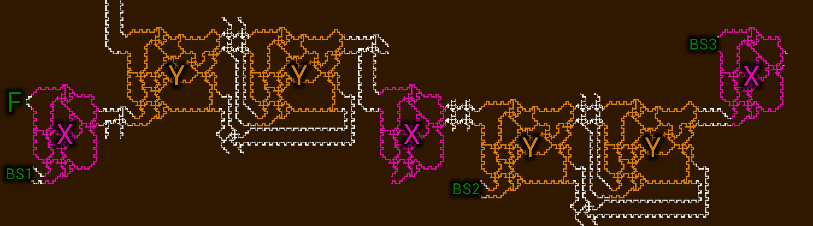
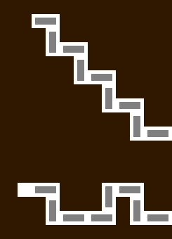

# 2021-07-17-Google-CTF #

[CTFTime link](https://ctftime.org/event/1318) | [Website](https://capturetheflag.withgoogle.com/)

---

## Challenges ##

Note: incomplete listing.

 - [x] [50 filestore](#50-misc--filestore)
 - [x] [234 parking](#234-hardware--parking)
 - [x] [203 memsafety](#203-pwn--memsafety)

---

## 50 misc / filestore ##

This challenge is a kind of "file system" where data is stored in chunks in a central byte array. The chunk storage uses Python dictionaries and is not really part of the data stored, because there is no limit on how many files can exist. The only limiting factor is the byte array itself, which is 64 KiB (65536 bytes) long.

The flag is stored in the filesystem to begin with, but we cannot retrieve it, because we do not know its ID and it is too difficult to guess (16 alphanumeric characters).

The interesting feature of the system is that it can store more than 64 KiB of data by using deduplication. This happens inside the `store` function:

```python
prefix = data[:MINIMUM_BLOCK] # data[:16]
ind = -1
bestlen, bestind = 0, -1
while True:
    ind = blob.find(prefix, ind+1)
    if ind == -1: break
    length = len(os.path.commonprefix([data, bytes(blob[ind:ind+MAXIMUM_BLOCK])]))
    if length > bestlen:
        bestlen, bestind = length, ind
```

We start by considering the first 16 bytes of the data to be stored. If there is less than 16 bytes left, the prefix is shorter (this will become important soon). The code looks for occurrences of this prefix and, using [`os.path.commonprefix`](https://docs.python.org/3/library/os.path.html#os.path.commonprefix), finds a place in the byte array where the longest prefix of the data to be stored can be found.

This deduplication method saves space but also leaks knowledge about the flag, because we can also check how many bytes are occupied after storing data of our choosing.

As an example, consider a situation where the flag has already been stored in the byte array (2). We can try to guess a prefix of the flag. If it is incorrect (3a), the prefix will not match the byte array and will be stored in a new section. If it is correct (3b), the prefix is already in the byte array and no new data needs to be stored.



At this point, we can figure out the flag character by character:

1. Initialise `known_prefix` to `CTF{` (same across all challenges).
2. Connect to the server.
3. For every character (`a-zA-Z0-9_`), check if `known_prefix` + `character` is a correct prefix of the flag by storing it on the server and checking if the used space changed.
4. Append the correct character to `known_prefix`, go back to 2 until no new characters are found (because the last character is `}`).

`CTF{CR1M3_0f_d3dup1ic4ti0n}`

The flag is a reference to the [CRIME](https://en.wikipedia.org/wiki/CRIME) exploit, which relied on similar deduplication properties of data compression.

## 234 hardware / parking ##

In this challenge we are presented with a game of [Rush Hour](https://en.wikipedia.org/wiki/Rush_Hour_%28puzzle%29). The goal is to slide the "cars" (gray and green blocks) around to make space for the red car to enter the parking lot. There are two levels. The first one is trivial:


The second one is *much* larger, with an image of it spanning 2620 × 28636 pixels. Fortunately, most of the puzzle is empty space. The arrangement resembles an electronic circuit, with lines of cars serving as wires. Different kinds of [logic gates](https://en.wikipedia.org/wiki/Logic_gate) can also be found.

**Splitter**



**Crossing**



**And gate**



**Or gate**



Apart from these local features, we can also find larger groupings of gates:



Assuming the inputs are `A`, `B`, `C`, and `D`, "Unit Y" has 4 outputs:

| Output | Logical formula                      |
| ------ | ------------------------------------ |
| `I`    | `(A && C) || (B && D)`               |
| `J`    | `(A && D) || (B && C)`               |
| `K`    | `((A && C) || (A && D)) || (B && C)` |
| `L`    | `B && D`                             |

"Unit X" is actually the same as unit Y, but it does not have outputs `K` and `L`.

Zooming out a bit further, we can see these units arranged in 64 rows. Here is one:



Here is the same row with the units highlighted:



Each of these rows has one green car on the left (F). The green cars can be moved or left unmoved, which affects the "signal" in the remainder of the row. Whether the car was moved or not encodes a single bit of the flag, for a total of 64 bits, or 8 bytes.

There are also "wires" which seem to lead nowhere (BS1, BS2, BS3 above), always in pairs:



There are three such pairs in every row. In each pair, one wire allows the cars to move, one does not. In other words, these wires form three bitstreams (and their complement).

Finally, we can encode the circuit into SMT and find a solution using Z3.

[Encoder script](script/Parking.hx), [Generated Z3 script](script/parking.z3)

In the output model we can find:

```
(define-fun flag () (_ BitVec 64) #x6d31724265685432)
```

Reversing the bytes above, we get the flag.

`CTF{2TheBr1m}`

## 203 pwn / memsafety ##

In this challenge, we can provide Rust code to be compiled on the server alongside other code which stores the flag. The code we provide is wrapped with:

```rust
#![no_std]
use proc_sandbox::sandbox;

#[sandbox]
pub mod user {
    // ...
}
```

The wrapping above in addition to the Python script for the challenge ensure that:

- we do not have access to `std` types (but the [`core`](https://doc.rust-lang.org/core/index.html) is always there);
- we do not escape the module with a `}` character, ensured by checking the JSON dump of the AST; and
- our code is validated using the [procedural macro attribute](https://doc.rust-lang.org/reference/procedural-macros.html#attribute-macros) `#[sandbox]`.

The `#[sandbox]` attribute itself performs *syntax-based* validation by visiting the untyped AST (using [`syn::visit::Visit`](https://docs.rs/syn/1.0.74/syn/visit/trait.Visit.html)). This further ensures that:

- we do not use [`unsafe`](https://doc.rust-lang.org/book/ch19-01-unsafe-rust.html) expressions, as we could violate memory safety with these;
- we do not declare foreign items (`extern { ... }`), as these could let us use unsafe C functions (although we could not call them without using `unsafe` anyway);
- we do not import external crates (`extern crate ...`), as these could let us use `std` or even the crate containing the actual flag; and
- we cannot use certain blacklisted identifiers: `env`, `file`, `include`, `include_bytes`, `include_str`, `option_env`, `std`.

[`include_str!`](https://doc.rust-lang.org/std/macro.include_str.html) in particular could be very useful, as it would allow us to simply include the source code of the file containing the flag.

However, the check performed by `#[sandbox]` has a flaw. In particular, the check is purely syntactic, and implemented using the Rust parser [`syn`](https://docs.rs/syn/) (which has its own AST representation). In Rust, [function-like macros](https://doc.rust-lang.org/reference/procedural-macros.html#function-like-procedural-macros) can be used to extend the language with otherwise-illegal syntax. Consider the following piece of code:

```rust
some_macro_call!(anything goes here! 1 2 3);
```

When `syn` is visiting the AST of this call, it cannot do anything about the code between the parentheses, as this code must be parsed by `some_macro_call` and may be otherwise illegal Rust syntax (as is the case here). In other words, the `syn` AST representation for the above with only show that this is a macro call to `some_macro_call` and will contain unprocessed tokens for the "arguments". We can see that the [`tokens` field](https://docs.rs/syn/1.0.74/syn/struct.Macro.html#structfield.tokens) of `syn::Macro` is indeed only a `TokenStream`. Compare this with [`args`](https://docs.rs/syn/1.0.74/syn/struct.ExprMethodCall.html#structfield.args) of `syn::ExprMethodCall`, where arguments to a regular method call are encoded as (list of) `syn::Expr`, i.e. deeply parsed ASTs.

Furthermore, Rust provides a simple way to declare function-like macros anywhere: [`macro_rules!`](https://doc.rust-lang.org/rust-by-example/macros.html). Here is an example declaration:

```rust
macro_rules! foo {
  () => { println!("foo"); };
}
```

A call to `foo!()` would then expand to `println!("foo");` (which would further expand to calls to actually print something to `stdout`). But notice that the `macro_rules!` declaration itself is a macro call. This means that `syn` cannot deeply parse a `macro_rules!` declaration.

At this point we can write our "exploit". We can use blacklisted functions inside a `macro_rules!` declaration, then call that macro. One possible way to read the flag without the blacklist restrictions, but also without being able to use `std` (which is where `println!` can be found) is to crash the program with the flag provided as the panic message:

```rust
macro_rules! foo {
  () => { panic!(include_str!("/home/user/sources/user-1/src/lib.rs")); };
}
foo!();
```

`CTF{s4ndb0x1n9_s0urc3_1s_h4rd_ev3n_1n_rus7}`
